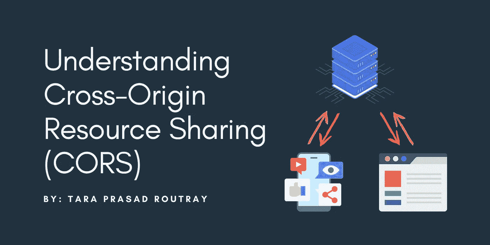
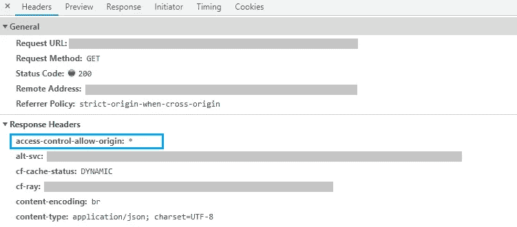

# 了解跨来源资源共享(CORS)

> 原文：<https://levelup.gitconnected.com/understanding-cross-origin-resource-sharing-cors-e54e403623eb>

## 了解关于跨源资源共享(CORS)的一切，以及如何在您的应用程序中启用它。



跨源资源共享(CORS)是一种协议，它允许客户端应用程序与属于不同源的服务器端应用程序进行交互。当应用程序想要对外部服务器进行 API 调用以接收一些响应并向其用户显示数据时，这很有帮助。大多数情况下，如果没有在服务器端正确配置，您可能会得到一个 CORS 错误。

在本文中，我将向您详细介绍跨源资源共享(CORS ),并指导您正确配置它，以便您的客户端应用程序不会收到任何错误消息。初学者和专业开发人员可以从这篇文章中受益。

# 涵盖的主题

1.  使用 CORS 的必要性
2.  确定 CORS 的回应
3.  CORS 请求的类型
4.  在快速应用程序中启用 CORS
5.  在 PHP 应用程序中启用 CORS

# 1.使用 CORS 的必要性

web 浏览器的同源策略(SOP)会阻止指向不同来源的请求。该功能随 web 浏览器一起提供，以防止恶意站点读取数据，但该功能阻止了一些真正的用例。例如，您可能希望对不同来源的后端服务器进行 API 调用，但是 web 浏览器的同源策略会拒绝该请求(即使该服务器是您的)。

用 Angular、React、Vue 等等构建的 web 应用程序可能在不同的地方有后端服务器。在这些类型的应用程序中，前端与后端是分离的，以使应用程序加载更快、更安全，并使内部团队更容易维护模块。在这种用例中，前端应用程序调用 API 来发送和接收来自服务器的数据。

为了克服同源策略(SOP)带来的问题，开发人员使用了 JSON-P 等变通方法，但是跨源资源共享(CORS)很容易解决这个问题。

# 2.确定 CORS 的回应

您可以通过查看服务器发送的响应标头来识别 CORS 响应。如果服务器被正确配置为发送支持 CORS 的响应头，那么 web 浏览器可以使用这些头来决定 XMLHttpRequest 应该继续还是失败。允许支持 CORS 的主要标题是`Access-Control-Allow-Origin`。通过这一点，服务器可以指定哪些源可以访问它的资源。

如果服务器希望允许任何来源访问它的资源，那么它可以发送下面的响应头。

```
Access-Control-Allow-Origin: *
```

如果一个服务器希望允许一个特定的源访问它的资源，那么它可以发送一个类似的响应头。

```
Access-Control-Allow-Origin: [https://tararoutray.com](https://tararoutray.com)
```

下面是一个服务器发送的 CORS 报头的快照。



# 3.CORS 请求的类型

有两种类型的 CORS 请求:“简单”请求和“飞行前”请求。在进行 CORS 请求时，您不需要指定应该向服务器发送哪种类型的请求。您只需向外部服务器发出一个 CORS 请求，web 浏览器就会决定使用哪种类型。让我们看一下这两种请求类型。

## a)简单请求

只有当请求满足以下条件时，web 浏览器才会将其视为“简单”请求:

*   已使用 GET、POST 或 HEAD 请求方法。
*   没有使用`ReadableStream`对象。
*   没有在任何`XMLHttpRequestUpload` 对象上注册事件监听器。
*   使用了 CORS 安全列表头。
*   使用了一个内容类型的头，如:`application/x-www-form-urlencoded`、`multipart/form-data`或`text/plain`。

## b)飞行前请求

如果请求不符合上述“简单”请求的标准，则 web 浏览器将使用 OPTIONS 请求方法发出自动请求。该请求被称为“飞行前”请求。它将由 web 浏览器启动，以确定目标服务器的 CORS 能力。如果 OPTIONS 请求的响应告诉请求应该被拒绝，那么对服务器的实际请求将被拒绝。

当向服务器发出“预检”请求时，会发送以下请求标头，以便目标服务器可以识别用户正在尝试发送的请求类型:

*   Access-Control-Request-Method(这表示将使用哪种 HTTP 请求方法，如 GET、POST 等。)
*   Access-Control-Request-Headers(这表示将发送什么样的自定义标头，如 X-PINGOTHER、Content-Type)
*   来源(这表示将发出请求的客户端的 URL，例如—https://tararoutray.com)

# 4.在快速应用程序中启用 CORS

您可以在 Express 应用程序中轻松添加对 CORS 的支持。请参考下面的代码片段，了解如何通过几个简单的步骤启用 CORS。

# 5.在 PHP 应用程序中启用 CORS

您可以轻松地在 PHP 应用程序中添加对 CORS 的支持。请参考下面的代码片段，了解如何通过几个简单的步骤启用 CORS。

太棒了。您已经学习了跨源资源共享(CORS ),以及如何在 Express 和 PHP 应用程序中正确配置它。

> 如果你喜欢读这篇文章，并且学到了一些新的东西，那么请鼓掌，与你的朋友分享，并关注我以获得我即将发布的文章的更新。你可以在 [LinkedIn](https://www.linkedin.com/in/tara-prasad-routray-b83027145/) 上和我联系。