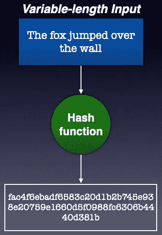
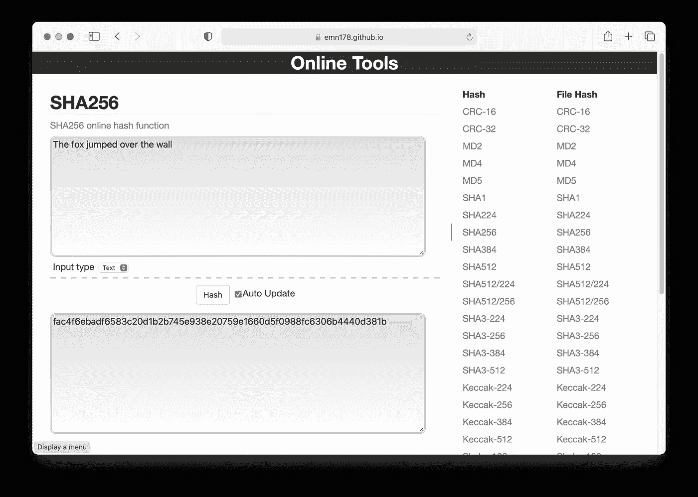
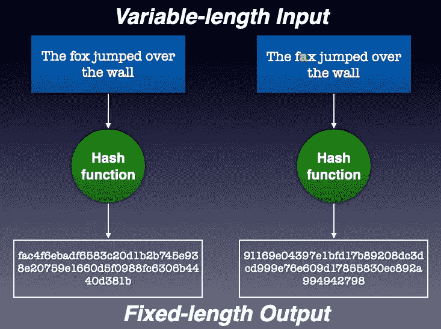
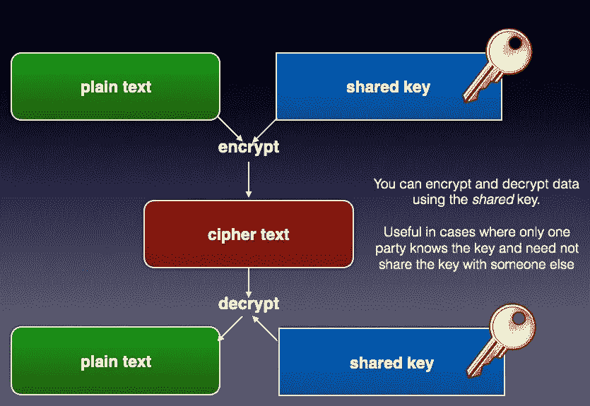
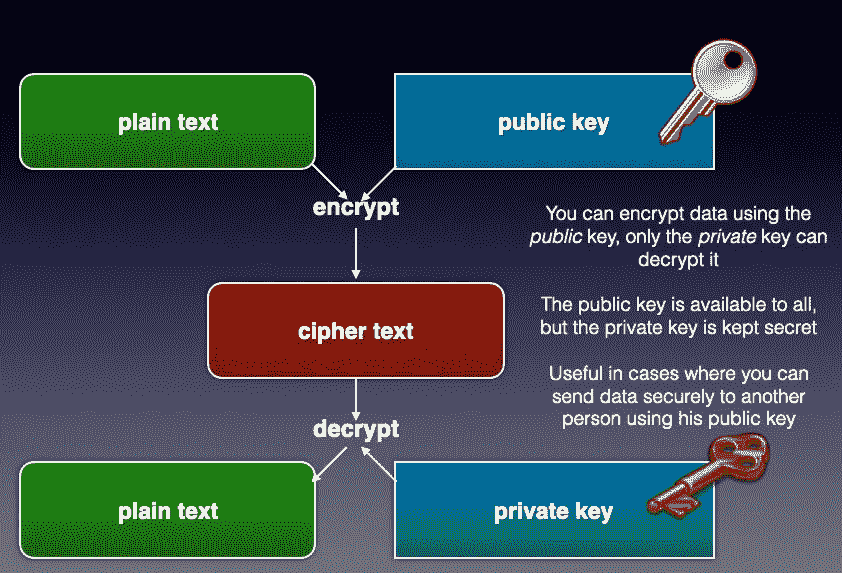
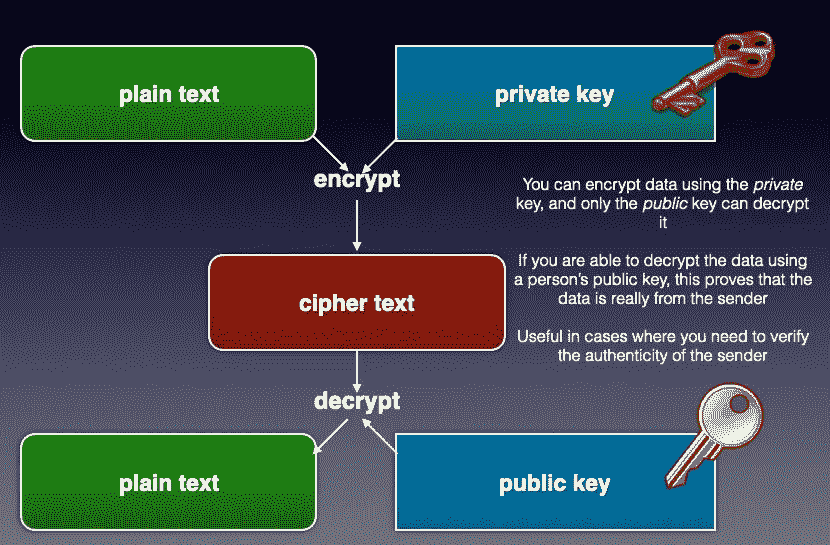
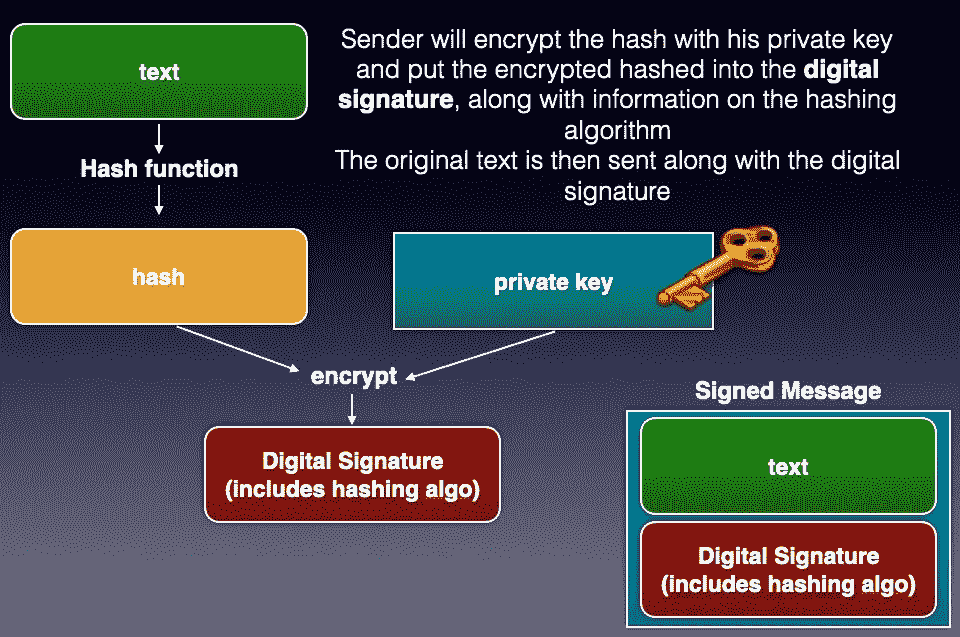
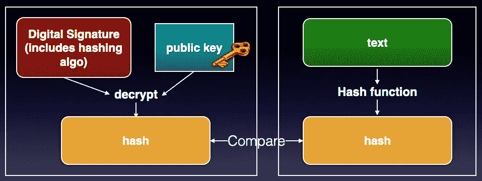

# 了解密码学

> 原文：<https://levelup.gitconnected.com/understanding-cryptography-f91fabd749ef>

## 理解加密、解密、散列和数字签名的工作原理，以及 Python 中的实现


公共领域，[https://commons.wikimedia.org/w/index.php?curid=226312](https://commons.wikimedia.org/w/index.php?curid=226312)

无论您是试图构建一个存储用户凭证的 web 应用程序，还是编写一个安全传输加密消息的网络应用程序，甚至是试图创建自己的区块链，您都需要了解一个特别重要的主题— *密码术*。

简单来说，密码学(或密码学)就是隐藏信息的实践和研究。这是一门试图保持信息秘密和安全的科学。

在本文中，我将向您解释加密函数的主要类型，以及如何在日常工作中使用它们。为了演示，我将使用 Python。

# 密码术的类型

有三种主要类型的加密技术:

*   散列法
*   对称密码术
*   不对称密码术

在接下来的几节中，我将更详细地介绍上述每一种类型。

# 散列法

哈希是将任意大小的数据块转换为固定大小值的过程。执行散列的函数被称为*散列函数*。



作者图片

常见的哈希函数是 **SHA256。**

> **SHA** 代表安全哈希算法

例如， **SHA256** 散列函数将一个文本块转换成一个 256 位散列。结果散列通常以十六进制编写，由于每个十六进制占用 4 位，所以 256 位散列将有 64 个字符。要体验哈希是如何工作的，请进入[https://emn178.github.io/online-tools/sha256.html](https://emn178.github.io/online-tools/sha256.html)，键入一个句子并观察结果:



作者图片

哈希具有以下重要属性:

*   *抗原像* —基于哈希，您无法获得原始文本块
*   *确定性* —相同的文本块将总是产生相同的散列
*   *防冲突* —很难找到两个不同的文本块会产生相同的散列

哈希的另一个重要特性是，原始文本中的一个变化将导致生成一个完全不同的哈希。例如，以下输入中的单个字符的变化将产生完全不同的输出:



作者图片

## 哈希的使用

哈希在计算中扮演着一些非常重要的角色。首先，网站使用散列法来存储你的密码，而不是以明文形式存储。存储您的密码哈希值可以防止黑客逆转哈希值并获取您的原始密码(其他网站也很可能使用该密码)。此外，网站会采用一些技术，比如在散列之前在你的输入中加盐，来进一步保护你存储的密码。

哈希在区块链中也起着非常关键的作用，每个区块都使用前一个区块的哈希链接到前一个区块。对一个块的任何修改将使存储在下一个块中的散列无效，并且剩余的块将因此无效。

## 在 Python 中实现散列

在 Python 中，可以使用 **hashlib** 模块来执行散列。以下代码片段使用`sha256()`函数对字符串执行哈希运算:

```
import hashlibresult = **hashlib.sha256**(
    bytes("The quick brown fox jumps over the lazy dog",'utf-8'))print(result.hexdigest())
```

注意，要散列的字符串必须作为字节数组传递给`sha256()`函数。所以你可以使用`bytes()`函数将字符串转换成一个字节数组。或者，在 Python 中，可以在字符串前面加上一个'`b`'来表示一个*字节的字符串文字*:

```
result = hashlib.sha256(
    **b'The quick brown fox jumps over the lazy dog'**)
```

`sha256()`函数返回一个`sha256`散列对象。要获得十六进制的结果散列，可以调用`sha256`散列对象的`hexdigest()`函数。上述字符串的哈希如下:

```
d7a8fbb307d7809469ca9abcb0082e4f8d5651e46d3cdb762d02d0bf37c9e592
```

如果您要对原始字符串做一点小小的更改，输出将与之前的散列截然不同:

```
result = hashlib.sha256(
    b'The quick brown fox jumps over the lazy **dag**')
print(result.hexdigest())
**# 559cc2cb0e1998182b4b6343e38611b3757e8a6279d43e9914d74dfb7e7089e6**
```

# 对称密码术

在对称加密中，明文加密和密文解密使用同一个密钥。下图显示了共享密钥在加密和解密中的使用:



作者图片

对称加密快速简单，但主要问题是如何保证密钥保密。例如，如果 Tom 想要发送一个秘密消息给 Susan，Tom 可以使用共享密钥加密该消息，Susan 可以使用相同的共享密钥解密该加密的消息。这里的问题是汤姆如何将共享密钥发送给苏珊？汤姆能给苏珊发电子邮件吗？通过短信发送，还是用 WhatsApp？通过传统邮局给她邮寄怎么样？所有这些方法都不是绝对安全的，并且容易被窃听。而且，有这样一句流行的话:

> "如果三个人中有两个已经死了，他们还可以保守秘密."

意思是，只要不止一个人知道这个秘密，它就不再是秘密了。

## 生成共享密钥

在 Python 中，可以使用**密码术**模块进行对称和非对称密码术。要使用**加密**模块，请使用`pip`进行安装:

```
$ **pip install cryptography**
```

让我们用 Python 生成一个共享密钥。为此，使用`Fernet`类:

```
from cryptography.fernet import Fernet# generate the shared key
shared_key = Fernet.generate_key()
print(shared_key)    # base64 encoded, binary format# A new key is generated each time you run this block of code
# e.g. b'ixXEfrz2NTJlxy1OhxXlsCiFf0Ycg_GL0Cy0MlgTv4U='
```

> **Fernet** 类是对称(也称为“秘密密钥”)认证加密的实现。Fernet 在 CBC 模式下使用 **AES** 算法，使用 128 位密钥进行加密。更多详情，请参考[https://github.com/fernet/spec/blob/master/Spec.md](https://github.com/fernet/spec/blob/master/Spec.md)。

`generate_key()`函数返回二进制格式的共享密钥，它是 base64 编码的。

## 执行对称加密

为了使用共享密钥加密您的数据，您首先使用共享密钥创建一个`Fernet`类的实例:

```
# create an instance of the Fernet class
fernet = Fernet(shared_key)
```

然后，您可以使用`encrypt()`功能来加密您的数据:

```
# encrypt the message with the shared key
ciphertext = **fernet.encrypt**(
    bytes("Secret message!",'utf-8'))  # remember to pass in a bytes 
                                       # array
```

您可以将加密数据保存到文件中:

```
# write the encrypted message to file
with open('message.encrypted', 'wb') as f:
    f.write(ciphertext)
```

以及将共享密钥保存到文件:

```
# write the shared key to file
with open('symmetric_key.crypt', 'wb') as f:
    f.write(shared_key)
```

## 执行对称解密

解密类似于加密。首先，从文件(我们之前保存的)中加载共享密钥:

```
with open('symmetric_key.crypt', 'rb') as f:
    shared_key = f.read()
print(shared_key)
```

然后，使用共享密钥创建一个`Fernet`类的实例，并调用`decrypt()`函数来解码密文:

```
# create an instance of the Fernet class
fernet = Fernet(shared_key)# decrypt the encrypted message read from file
with open('message.encrypted', 'rb') as f:
    print(**fernet.decrypt**(f.read()).decode("utf-8"))
```

# 不对称密码术

与使用单个共享密钥的对称加密不同，非对称加密使用一个密钥对—一个公钥和一个私钥。

> 非对称加密也称为公钥加密

公钥算法生成两个数学上相关联的密钥

*   一个公钥和一个私钥——公钥，顾名思义，应该是公开的。另一方面，私钥必须绝对保密。
*   您可以用公钥加密数据，用私钥解密。例如，如果汤姆想给苏珊发送一条秘密消息，汤姆可以用苏珊的公钥加密这条消息，而只有苏珊可以用她的私钥解密这条秘密消息。
*   您可以用私钥加密数据，用公钥解密。起初，这听起来违背直觉。如果一个人可以使用公钥(应该是公开的)解密，这有什么意义呢？其实这个是有用的。假设汤姆用他自己的私钥加密一条消息并发送给苏珊。当 Susan 收到消息时，她可以尝试使用 Tom 的公钥对其进行解密。如果该消息可以被解密，这意味着该消息没有被篡改，并且确实来自 Tom。另一方面，如果消息已经被篡改，Susan 将无法使用 Tom 的公钥解密该消息。该技术用于创建数字签名。

> 公钥算法的一个例子是 RSA(Rivest–sha mir–ad leman)

下图显示了第一种方法—使用公钥加密数据，然后使用私钥解密。



作者图片

下图显示了第二种方法—使用私钥加密数据，然后使用公钥解密数据:



作者图片

## 生成并保存公钥/私钥对

现在让我们使用**密码术**模块和一些常用参数来生成公钥/私钥对:

```
from cryptography.hazmat.backends import default_backend
from cryptography.hazmat.primitives.asymmetric import rsa# generate the private key
private_key = **rsa.generate_private_key**(
    public_exponent=65537,
    key_size=2048,
    backend=default_backend()
)# derive the public key from the private key 
public_key = **private_key.public_key()**
```

在上面的代码片段中，我使用 RSA 算法首先生成一个私钥。使用私钥，我可以导出相应的公钥。生成密钥后，将它们序列化到文件中会很有用:

```
from cryptography.hazmat.primitives import serialization#---serialize the private key as bytes---
pem = private_key.private_bytes(
    encoding = serialization.Encoding.PEM,
    format = serialization.PrivateFormat.PKCS8,
    encryption_algorithm = serialization.NoEncryption()
)
with open('private_key.pem', 'wb') as f:
    f.write(pem)

#---serialize the public key as bytes---
pem = public_key.public_bytes(
    encoding = serialization.Encoding.PEM,
    format = serialization.PublicFormat.SubjectPublicKeyInfo
)
with open('public_key.pem', 'wb') as f:
    f.write(pem)
```

您还需要能够从文件中加载它们:

```
with open('private_key.pem', 'rb') as f:
    private_key = serialization.load_pem_private_key(
        f.read(),
        password = None,
        backend = default_backend()
    )with open('public_key.pem', 'rb') as f:
    public_key = serialization.load_pem_public_key(
        f.read(),
        backend = default_backend()
    )
```

## 使用公钥加密

我们现在准备使用*公共*密钥执行加密:

```
from cryptography.hazmat.primitives import hashes
from cryptography.hazmat.primitives.asymmetric import paddingplaintext = bytes("This message is secret.",'utf-8')# encrypt the message using the public key
ciphertext = **public_key.encrypt**(
    plaintext,
    padding.OAEP(
        mgf = padding.MGF1(algorithm = hashes.SHA256()),
        algorithm = hashes.SHA256(),
        label = None
    )
)
```

> 加密的密文是一个字节数组

## 使用私钥解密

有了密文，您可以使用*私有*密钥进行解密:

```
# decrypt using the private key
plaintext = **private_key.decrypt**(
    ciphertext,
    padding.OAEP(
        mgf = padding.MGF1(algorithm = hashes.SHA256()),
        algorithm = hashes.SHA256(),
        label = None
    )
)
print(plaintext.decode('utf-8'))
# This message is secret.
```

> 解密后的明文是一个字节数组

## 数字签名—使用私钥签名

前面我提到过，在*数字签名*中，您使用私钥执行加密，然后使用公钥解密。那么这到底是如何工作的，它又是如何有用的呢？让我们来看看下面的事件流程:



作者图片

*   首先，使用哈希函数对要发送的文本进行哈希处理
*   然后使用*私有*密钥对散列进行加密，并将其转换为*数字签名*(这也包括所使用的散列算法的信息)
*   然后，将原始文本与数字签名一起发送给收件人。这被称为*签名消息*。

下图显示了收件人收到签名邮件时的情况:



作者图片

*   当收到签名的邮件时，接收方将使用发送方的公钥从数字签名中解密哈希
*   接收者还将对接收到的文本进行哈希处理，然后将其与上一步中解密的哈希进行比较
*   如果两个哈希匹配，这意味着文本没有被篡改

**如您所见，数字签名是一种数学技术，用于验证消息、软件或数字文档的真实性和完整性。**

现在让我们看看如何使用私钥创建数字签名。从技术上讲，您不能执行以下操作:

```
**private_key.encrypt**(...)    # ERROR
# AttributeError: '_RSAPrivateKey' object has no attribute 'encrypt'
```

相反，您调用`sign()`函数:

```
import base64plaintext = bytes("This message is public.",'utf-8')# sign the message using the private key
signed = **private_key.sign**(
    plaintext,
    padding.PSS(
        mgf = padding.MGF1(algorithm=hashes.SHA256()),
        salt_length = padding.PSS.MAX_LENGTH
    ),
    hashes.SHA256()
)# print out the digital signature using base64 encoding
signed_base64 = base64.b64encode(signed).decode('utf-8')
print(signed_base64)
```

在上面，我使用了*私有*密钥来*签署*消息。`sign()`函数返回字符串的数字签名。它以字节数组的形式返回数字签名，在上面的代码片段中，我使用 base64 编码对其进行了编码，然后将其转换为 string。输出如下所示:

```
aNUZixxLUiRRpDjm+nqkcaZo5URklvIA/hiSECR+DoLmS+oVb650Ic5/vg6ADmCvi91CSwiXRYkknDBEr2qTWaK+Fe9UPqukDFx8WwyW7K2NacjS8TiKqAfPPSH4t2l9ohexwTqfih9oZXli57zfZ4LKaY63iQxXlWKE9S5OZ0hWyGUfygEInY8OZerGKWFnmxuXHjWNCpDmzSngP04MYBBnfoPVpsDg7vgKL0gpaz1dn2Qg+Ra2GFLmznqjYKq2qP43zLrdYSmzH3MmPAkO0AIh8XaRnHc+q0XYyUGhTBm9iIa7rS8eYaB7MD9G18j0HA7lWWVQjqujnFCQNm8Npg==
```

当你传输信息(`plaintext`)时，你也要发送数字签名。

## 使用公钥验证数字签名

当接收者收到带有数字签名的消息时，他可以通过调用 *public* 键上的`verify()` 函数来简单地验证消息没有被篡改:

```
from cryptography.exceptions import InvalidSignature# decode the digital signature from base64
signed = base64.b64decode(signed_base64)try:
    **public_key.verify**(
        signed,
        plaintext,    # from the previous section
        padding.PSS(
            mgf = padding.MGF1(hashes.SHA256()),
            salt_length = padding.PSS.MAX_LENGTH
        ),
        hashes.SHA256()
    )
    print('Signature is valid!')
except InvalidSignature:
    print('Signature is invalid!')
```

注意，您必须捕获由`verify()`函数引发的异常。如果没有异常，签名被认为是正确的，否则是无效的。

# 摘要

这是关于开发应用程序时通常会遇到的三种加密函数的旋风式讨论。我希望这个解释是清楚的，并且你现在有一个坚实的基础来处理更有趣的开发项目！

[](https://weimenglee.medium.com/membership) [## 加入媒介与我的介绍链接-李伟孟

### 作为一个媒体会员，你的会员费的一部分会给你阅读的作家，你可以完全接触到每一个故事…

weimenglee.medium.com](https://weimenglee.medium.com/membership)