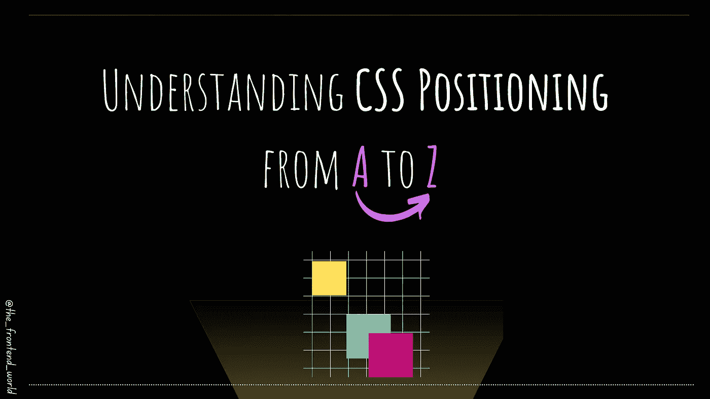
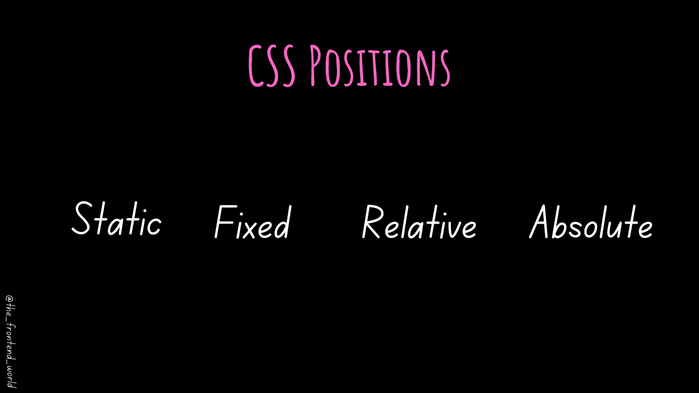
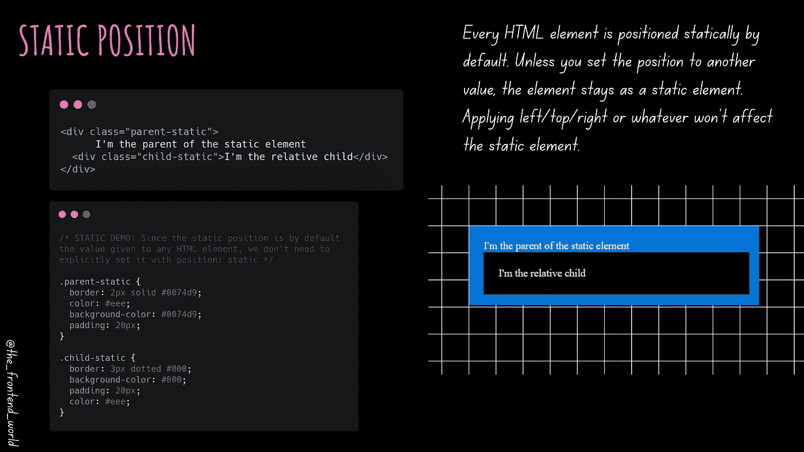
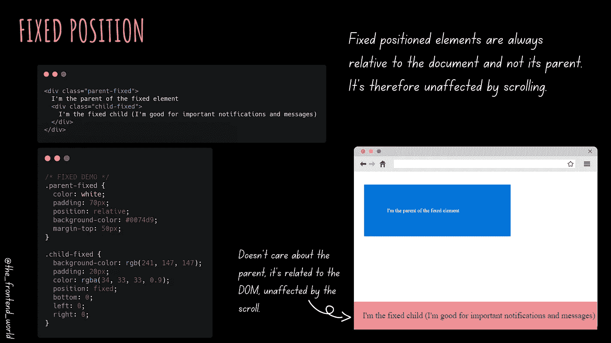
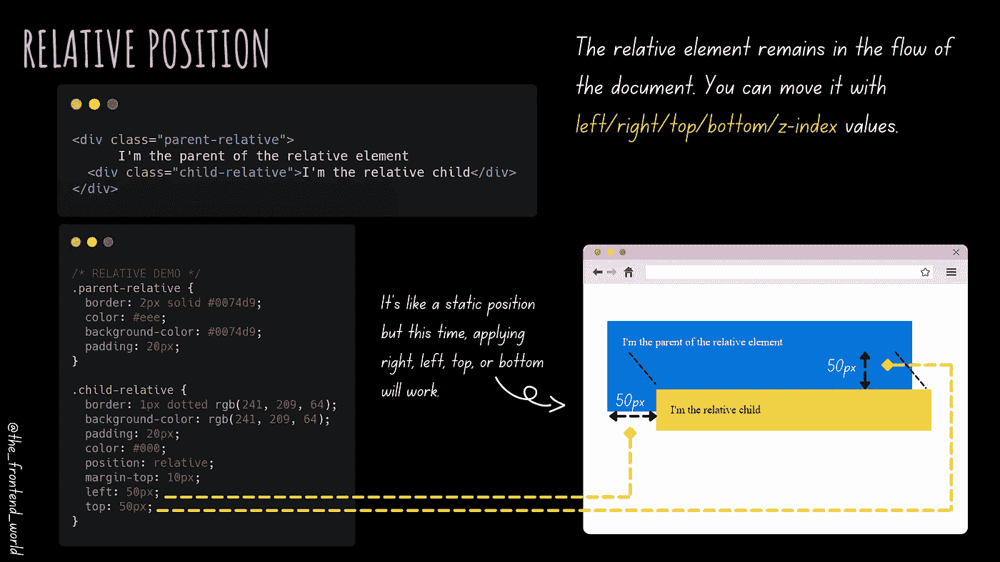
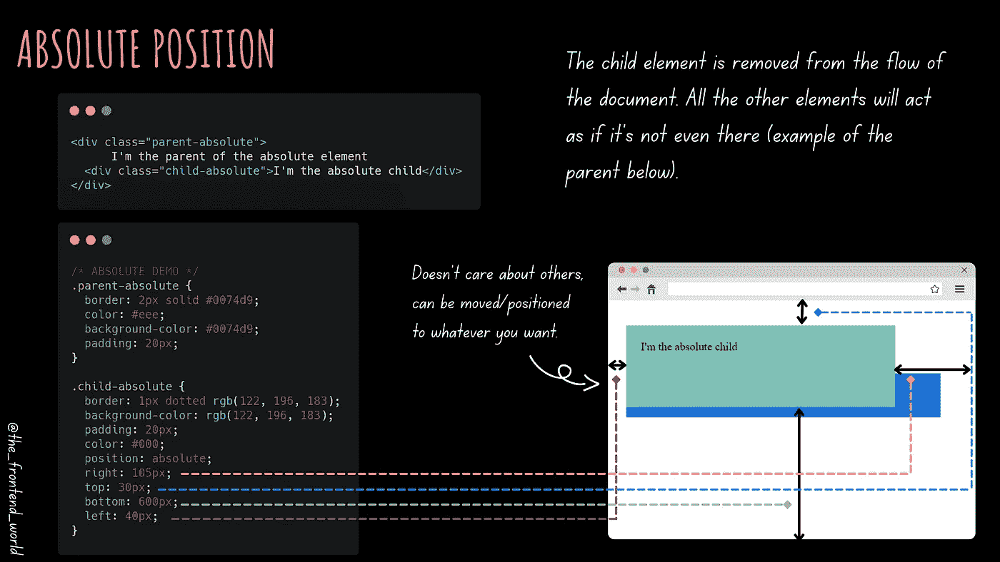

# 从头到尾理解 CSS 定位

> 原文：<https://levelup.gitconnected.com/understanding-css-positioning-from-a-to-z-407927b766ba>

## 终身学习 CSS 职位！

作者:FAM

一个网站前端是所有关于定位。没有 web 应用程序前端元素的正确定位，我们看不到任何有意义的东西。

这篇文章将会给你关于 CSS 定位的基本知识，以及你未来前端应用程序的构想。

让故事开始！

# CSS 职位

CSS 中的位置是一个属性，它赋予你在应用程序前面定位元素的权力。它有不同的选择:

*   一个`static`位置(默认位置)
*   一个`fixed`位置
*   一个`relative`的位置
*   一个`absolute`位置

作者:FAM

让我们更深入👀

# `static`的位置

此选项将静态地将元素定位在顶部、底部、左侧或右侧。顺便说一下，这个位置选项或值是每个 HTML 元素的默认值。

由于静态位置是默认给任何 HTML 元素的值，我们不需要用`position: static`显式地设置它

作者:FAM

# 固定位置

固定位置是使元素相对于视口的位置。

因此，元素的固定位置是相对于文档的，所以它的值不受滚动的影响。即使在滚动时，它也固定在文档上。

作者:FAM

# `relative`位置

相对位置顾名思义就是相对于其当前位置。这就像一个静态的位置，我们可以用左/右/上/下值来移动。

作者:FAM

# 绝对位置

绝对位置是指元素相对于没有静态位置的最近的父元素的位置。

作者:FAM

# 民众

我建议分叉项目，并尝试使用 CSS 值和位置属性。

作者:FAM

# 视频版本

作者:FAM

> 我今天的故事到此结束，我希望你喜欢它，并从中吸取教训，❤

如果我的作品 ***打动了你*** 如果你 ***喜欢它*** 如果你觉得它 ***值得*** ，请你 [**成为付费会员来支持我，你的一部分费用会寄给我。**](https://famzil.medium.com/membership)

> 对我来说这意味着整个世界，我的触摸创造了这个世界上有价值的小东西…谢谢你，❤

对我来说这意味着整个世界，我的触摸创造了这个世界上有价值的小东西…谢谢你，❤

[如果你喜欢看我的文章…并且想收到我的文章(我不是每天都发布，所以不会垃圾你。你可以随时退订，没有问题)♥️](https://famzil.medium.com/subscribe)

 [## 如果你喜欢看我的文章… ♥️

### 如果你喜欢读我的文章… ♥️，当我的文章发表时，欢迎你第一个得到通知…

famzil.medium.com](https://famzil.medium.com/subscribe) 

亲爱的读者，感谢你在我生命中的存在。让我们在 [**上**取得联系****](https://medium.com/@famzil/)**[**Linkedin**](https://www.linkedin.com/in/fatima-amzil-9031ba95/)**[**脸书**](https://www.facebook.com/The-Front-End-World)**[**insta gram**](https://www.instagram.com/the_frontend_world/)**[**YouTube**](https://www.youtube.com/channel/UCaxr-f9r6P1u7Y7SKFHi12g)**或**********

******参见我的关于网络要素和一般文化的电子书。******