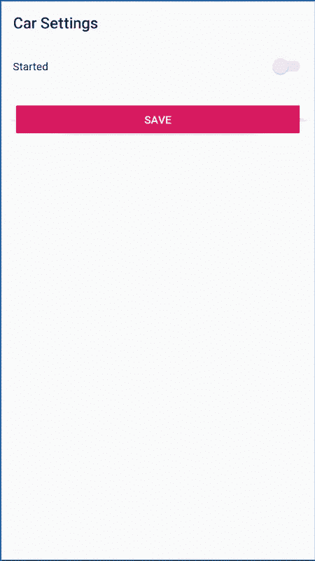

# 理解 Android 中的依赖注入

> 原文：<https://levelup.gitconnected.com/understanding-dependency-injection-in-android-af1bb2b7984e>


如果不提到 Dagger，就很难谈论依赖注入。Dagger 在 Android 开发者中越来越受欢迎，但是让我们退一步，讨论一下依赖注入的定义:

> **依赖注入**是一种一个对象提供另一个对象的依赖的技术。

最简单的方法是通过构造函数注入对象的所有依赖项:

```
class Car(private val engine: Engine) {

    fun start() {
        engine.turnOn()
    }

    fun stop() {
        engine.turnOff()
    }

    fun isStarted() = engine.isTurnedOn()
}
```

通过这样做，我们将`Engine`对象的实例化委托给了另一个对象，而不是`Car`。如果我们改变了`Engine`类中的`turnOn`或`turnOff`方法的实现，我们将改变`Car`的行为而不改变它的实现。

如果`Engine`是一个接口，我们甚至可以有完全不同的实现，比如利用多态性的`GasEngine`或`ElectricEngine`。它还增强了可测试性，因为可以创建一个`FakeEngine`实现来测试`Car`。

# 安卓怎么样？

在 Android 世界中，依赖注入有其局限性。由于 Android 操作系统控制着`Activity`、`BroadcastReceiver`、`Service`、`ContentProvider`和`Application`类的实例化，开发人员无法访问 Android 组件的构造函数。

> 背后的想法是允许第三方应用程序和系统与您的应用程序**选择导出的 Android 组件进行交互。**

这个想法伴随着一个开销:进程间通信(IPC)。`Binder`和`Parcel`类是为了减轻 IPC 的负担而创建的，在调用系统服务(如`WifiManager`或`PackageManager`)时使用，甚至在您自己的应用程序中与`Intents`通信时使用。

当用户点击设备主屏幕上的图标时，一个`Intent`会被发送到相应应用程序的启动器`Activity`。如果没有正在运行的进程，则创建一个新进程，实例化`Application`类，调用`onCreate` 方法**。之后，启动程序`Activity`被实例化，它的`onCreate`方法被调用。对于`onReceive` 方法中的`BroadcastReceiver`、`onCreate`方法中的`Service`以及`onCreate`方法中的`ContentProvider`，流程相同。**

*有一个与 content provider*onCreate*方法相关的[问题在应用程序 *onCreate* 方法之前被调用。](https://issuetracker.google.com/issues/36917845)[这里的](https://stackoverflow.com/questions/9873669/how-do-i-catch-content-provider-initialize)是它的一个变通方法。

> *`Application onCreate`*方法是 Android 应用程序的入口点，同理* `static main` *方法是 Java 应用程序的入口点。**

# *视图状态 x 模型状态*

*假设我们想要使用一个`Activity`来呈现我们的`Car`:*

```
*class CarActivity: AppCompatActivity() {

    private lateinit var car: Car

    override fun onCreate(savedInstanceState: Bundle?) {
        super.onCreate(savedInstanceState)
        setContentView(R.layout.*activity_car*)
        car = Car(ElectricEngine())
    }
}*
```

*现在`CarActivity` 依赖于`Car`，但是不能被它的构造函数注入。而是在`CarActivity` `onCreate`方法中实例化。*

*如果我们不能访问`CarActivity`的构造函数，我们如何注入`Car`？*

```
*class CarApplication: Application() {

    val car: Car by *lazy* **{** Car(ElectricEngine())
    **}** }*
```

```
*class CarActivity: AppCompatActivity() {

    private val car: Car by *lazy* **{** (*applicationContext* as CarApplication).car
    **}** }*
```

*通过将`Car`实例与`Application`相关联，它变得独立于`CarActivity`的生命周期。汽车的状态:发动机是开着还是关着，汽油的水平等等，将在设备配置改变时保持。由于`Activity`实例被销毁和重新创建，设备配置可能会在运行时发生变化(比如屏幕方向、键盘可用性和语言)。*

*区分*视图*层的状态和*模型*层的状态是很重要的。**车**属于*型*车**活动度**属于*视图*。*

*假设`CarActivity`显示`Car`开始状态(无论是开启还是关闭),允许用户改变它。另外，还有一个确认操作的按钮。这是 Android 应用程序设置屏幕的常见场景。*

**

*卡拉活动*

*如果用户将引擎状态更改为“开”并旋转屏幕，保持视图状态是`CarActivity`的责任。`Car`只有在按下确认按钮时才会被告知更改。一旦发生，即使`CarActivity`被破坏，状态也会保存在内存中。*

*在前面的例子中，在 XML 中，id 被提供给开关，以便在第一次创建`CarActivity` 时基于`Car`状态来改变所选择的值。Android 会自动保存包中带有`id`的视图的状态。因此，当`CarActivity` 被重新创建时，开关状态被适当地恢复。有些情况下不会自动发生，应该使用**包**手动保存和恢复视图状态。*

# *活动到服务通信*

*现在假设一个`CarService`不时更新`Car`状态。同样，由于 Android 的架构，我们无法访问`CarService`构造函数，因此我们应该从`CarApplication`获取`Car`实例。*

```
*class CarService : Service() {

    override fun onBind(intent: Intent?): IBinder? = null

    private val car: Car by *lazy* **{** (*applicationContext* as CarApplication).car
    **}** private val timer by *lazy* **{** Timer()
    **}** private val startStopTask by *lazy* **{** object : TimerTask() {
            override fun run() {
                if (car.isStarted()) {
                    car.stop()
                } else {
                    car.start()
                }
            }
        }
    **}** override fun onCreate() {
        super.onCreate()
        timer.schedule(startStopTask, 0, 15000)
    }

    override fun onStartCommand(intent: Intent?, flags: Int, startId: Int): Int {
        return *START_STICKY* }

    override fun onDestroy() {
        timer.cancel()
        super.onDestroy()
    }
}*
```

*同样在上面的例子中，一个`Timer`用于创建一个`TimerTask`来每 15 秒启动或停止一次汽车。最后，`CarService`开始于`onCreate`方法中的`CarApplication`。*

```
*class CarApplication: Application() {

    val car: Car by *lazy* **{** Car(ElectricEngine())
    **}** override fun onCreate() {
        super.onCreate()
        startService(Intent(*applicationContext*, CarService::class.*java*))
    }
}*
```

*现在`Car`的状态定期改变，我们可以使用**可观察的**模式来更新通知任何想要对改变做出反应的人。我是 RxJava 的忠实粉丝，但是为了简单起见，下面的例子使用 Java **Observable** 类。*

```
*class Car(private val engine: Engine): Observable() {

    fun start() {
        engine.turnOn()
        setChanged()
        notifyObservers()
    }

    fun stop() {
        engine.turnOff()
        setChanged()
        notifyObservers()
    }

    fun isStarted() = engine.isTurnedOn()
}*
```

*最后，`CarActivity`可以观察到`Car`并相应地更新视图。*

```
*class CarActivity : AppCompatActivity() {

    private val car: Car by *lazy* **{** (*applicationContext* as CarApplication).car
    **}** private val carObserver by *lazy* **{** *Observer* **{** _, _ **->** runOnUiThread **{** updateView()
            **}
        }
    }** override fun onCreate(savedInstanceState: Bundle?) {
        super.onCreate(savedInstanceState)
        setContentView(R.layout.*activity_car*)
        car.addObserver(carObserver)
        saveButton.setOnClickListener **{** if (car.isStarted()) {
                car.stop()
            } else {
                car.start()
            }
        **}** }

    override fun onDestroy() {
        saveButton.setOnClickListener(null)
        car.deleteObserver(carObserver)
        super.onDestroy()
    }

    private fun updateView() {
        startedSwitch.*isChecked* = car.isStarted()
    }
}*
```

***Activity**to**Service**一直被视为 Android 开发中的一个复杂问题，但是通过理解依赖注入和 Android 架构如何工作，它可以变得相当简单。*

*同样的模式也适用于`BroadcastReceiver`。`Car` 可能因系统或其他应用程序广播的外部事件而改变。*

# *它是如何扩展的？*

*随着时间的推移，应用程序变得越来越大，类的数量和复杂性也在增加。为了使应用程序易于维护和扩展，采用像 MVP、MVC 或 MVVM 这样的架构来标准化类之间的关联方式是一个很好的实践。*

*我们示例中的*模型*层非常简单，只有一个类，没有*持久性*或*网络*类。通过添加这些类，用另一个类(可能是`CarManager` 或`[CarStateMachine](https://medium.com/@marcelorbenites/managing-state-in-android-f4d042646521)`)抽象它们与`Car`的关系是一个很好的实践。Android 组件将与`CarStateMachine` 交互，而不是直接与`Car`交互。`CarStateMachine` 会与`Application` 实例相关联，就像`Car` 那样保持其状态独立于 Android 组件的生命周期。*

*依赖注入最终将需要使用创建模式来帮助配置和控制保存在内存中的对象的生命周期。一些著名的创建模式有**工厂**、**生成器**和**对象池**。*

*我们的`Car` 对象作为**单例对象**工作，因为我们在应用程序的整个生命周期中保留了它的单个实例。`Car` 实例是**惰性加载的**，因此它是按需实例化的。也可以根据一些业务逻辑创建一个新的`**Car**` 实例。*

*其中一些模式可以被依赖注入框架(如 Dagger)所取代，这将使我们免于一些与之相关的样板代码，特别是关于对象的生命周期*

# *警告*

*大多数情况下，Android 应用程序将在单个进程中运行，但在某些情况下，一个组件可能需要在单独的进程中运行。多个流程意味着多个`Application`实例，并且不可能在不同流程的组件之间共享对象。在这种情况下，我倾向于使用 Binder 和 IPC 在进程之间进行通信。此外，可以使用数据库作为流程之间的桥梁，但是我强烈建议不要采用这种方法，因为它会隐式地耦合实现细节和业务逻辑。*

# *结论*

*Android Jetpack 提供了新的选项来帮助查看状态 x 模型状态管理。另外，Dagger 是依赖注入的一种常见解决方案。尽管有现成的库可用，但了解如何在没有任何外部依赖的情况下解决这些问题是很重要的，因此作为工程师，我们可以选择最佳的实现。*

# *参考*

*   *[查看国家 x 模型国家 GitHub 示例由 Marcelo Benites](https://github.com/marcelorbenites/mode-vs-view-state)*
*   *[Marcelo Benites 的状态机 GitHub 示例](https://github.com/marcelorbenites/android-testing-strategy/tree/master/app/src/main/java/com/droidcon)*
*   *[Marcelo Benites 的 Android 测试策略](https://engineering.talkdesk.com/android-testing-strategy-73269539c13d)*