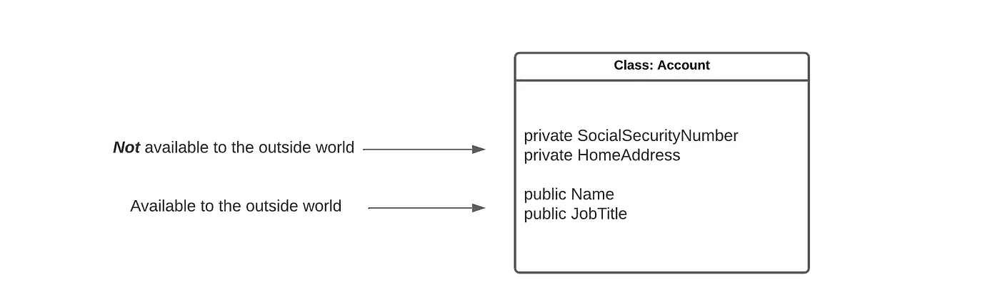
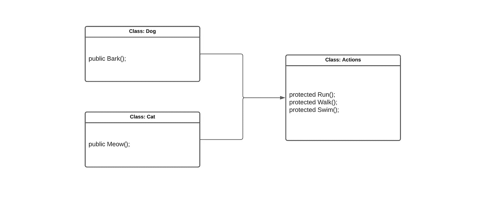
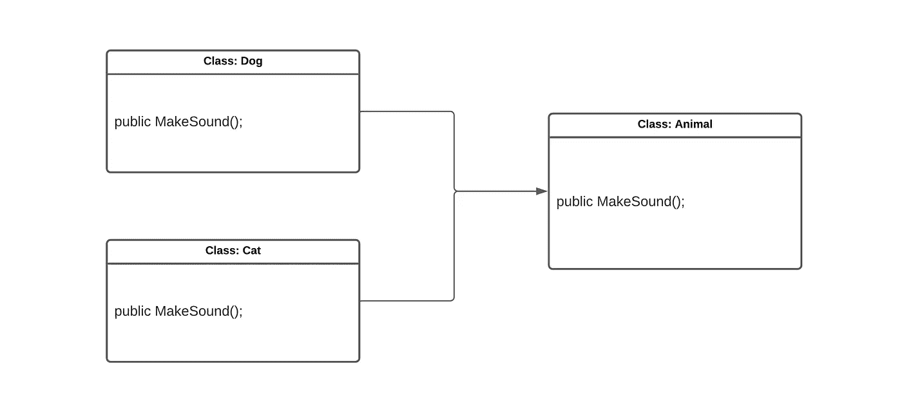
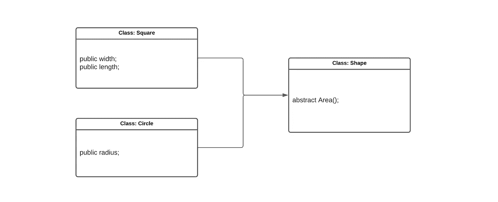
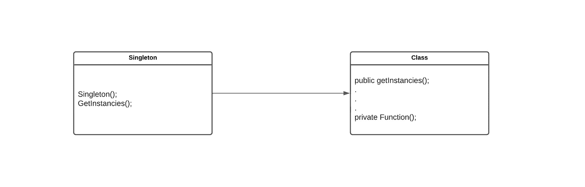

# 理解设计模式

> 原文：<https://levelup.gitconnected.com/understanding-design-patterns-1b88341245fe>

## 以及为什么它们如此重要


哈尔·盖特伍德在 [Unsplash](https://unsplash.com?utm_source=medium&utm_medium=referral) 上拍摄的照片

软件通常是由多个开发人员作为一个团队一起开发的。一方面，这可能是非常有益的，因为许多人的共同努力总是大于一个人的努力。另一方面，这也会带来一些挑战。

其中一个挑战是协调不同团队成员的不同编码风格。此外，以某种方式将这些不同的编码风格结合起来，使得最终的代码库对于未来可能想要使用它的开发人员来说是可理解的，这是一个额外的挑战。

为了应对这些挑战，开发人员可以使用“软件设计模式”，这是软件开发中常见问题的解决方案。这些软件设计模式旨在为开发人员提供一个模板，可以帮助构建代码，尤其是当代码由多个开发人员编写时。

## 如何使用软件设计模式

在学习*如何*使用软件设计模式之前，你必须先了解*如果*你可以使用软件设计模式。这是因为只有面向对象编程(OOP)语言允许它们，面向对象编程是一种基于对象的语言(如类、结构等)。).面向对象语言的例子有 Python、C++和 JAVA。

接下来，在弄清楚是否可以在编程语言中使用软件设计模式之后，熟悉一些必要的理论是很重要的。

## 软件设计模式的历史

首先，一些软件设计模式的历史。软件设计模式第一次被提及是在 90 年代，在《设计模式:可重用面向对象软件的元素》一书中。本书中总共有 23 种设计模式，分为三类:创造型、行为型和结构型。

通常，这些设计模式被称为“GoF 模式”(GoF 的意思是“四人帮”，指的是四个作者)。而且，尽管从那时起已经创造了许多新的(非官方的)模式，它们在今天仍然非常适用。因此，如果你想更多地了解这个主题，阅读那本书是个好主意。

## 软件设计模式理论

接下来，理解软件设计模式需要一些技术理论。如前所述，软件设计模式只能在 OOP 语言中使用。这是因为它们要求代码在对象中结构化。因此，掌握软件设计模式的先决条件是掌握 OOP。

总之，[面向对象编程(OOP)](https://www.techtarget.com/searchapparchitecture/definition/object-oriented-programming-OOP#:~:text=Object%2Doriented%20programming%20(OOP)%20is%20a%20computer%20programming%20model,rather%20than%20functions%20and%20logic.&text=Once%20an%20object%20is%20known,sequences%20that%20can%20manipulate%20it.) 围绕对象(通常以类的形式)组织软件设计，而不是功能和逻辑。对于这些对象，开发者需要知道四个基本概念，即:继承、封装、多态和数据抽象。

首先，*封装*。这个术语指的是对象能够屏蔽某些数据，这意味着它们只能从对象内部被调用。例如，如果我们创建一个名为“account”的类，那么像社会安全号和家庭地址这样的东西就被设置为“private”(意思是，不能从类外调用)。但是，像姓名和职务之类的东西被设置为“public”(意味着它们可以在类外进行更改)。这是 OOP 中封装的核心。



接下来，*传承*。顾名思义，这个概念允许对象相互继承功能。这有助于避免编写重复的函数。例如，如果你想为*猫*创建一个对象，为*狗*创建一个对象，你可以在它们自己的对象中编写它们特有的函数(比如猫的喵喵叫和狗的吠叫),同时在它们都继承的抽象类中编写它们共有的函数(比如跑和走)。(注意，在 C 语言中，这些继承的功能通常用`protected`表示。)



第三，*多态性*。这个概念展示了对象如何以几种不同的形式出现在整个代码库中。例如，如果我们创建一个名为“Animal”的类，它有一个发出声音的函数，我们可能希望为发出非常特殊声音的类(如“Dog”和“Cat ”)重写该函数。这可以通过多态性来实现。



最后，*数据抽象*。在某些方面，这个概念类似于封装，因为它也处理对外界屏蔽功能的问题。然而，它们是不同的，因为封装处理屏蔽信息，而数据抽象处理屏蔽实现。

例如，如果我们创建一个抽象类“Shape ”,并在它下面创建两个名为“Square”和“Circle”的类，那么对于这两个类，面积函数的计算就必须不同。因此，(通过数据抽象)我们可以在“形状”类中创建独立的区域函数。因此，我们可以在一个类中计算“正方形”和“圆形”的面积！



## 如何交流软件设计模式

通常，软件设计模式被记录在 [UML(统一建模语言)](https://en.wikipedia.org/wiki/Unified_Modeling_Language)中。这是一种可视化语言，可以很容易地记录和交流软件是如何构造的。因此，更加熟悉这门语言是非常有帮助的。事实上，本文中的例子也是用 UML 编写的。

## 示例(单例设计模式)

有了理论，让我们在一个例子中实现它。对于这个例子，我们将看看最流行的设计模式之一，称为“单例”模式。这种模式将一个类的实例化限制为只有一个实例。在 UML 中，这可以被形象化成这样。



> ***小测验:*** *你能写出一些符合 singleton 模式的 JAVA 代码吗？答案在本文末尾给出！*

那么，为什么这种模式会有用呢？这可能是有用的，因为它避免了启动许多对象，因此失去了对代码库的概述。此外，一个类只有一个实例使得访问更容易。

## 最后

希望这篇文章很好地介绍了软件设计模式这个主题。对于那些想了解更多的人来说，有许多关于这个主题的书籍和博客，你可以用本文中获得的知识来理解。

## 测验的答案

实现 singleton 模式的关键是 Singleton 类只能有一个实例(并且必须是全局可访问的)。因此，每当创建类时，它应该首先检查它是否已经存在。只有当这是**而不是**的情况(即`instance == null`)时，我们才能创建一个新的 singleton…是的，这就是懒惰实现。

```
**public** **class** **Singleton** {
    **private** **static** **volatile** Singleton instance = **null**;
    **private** Singleton() {}

    **public** **static** Singleton getInstances() {
        **if** (instance == **null**) {
            **synchronized**(Singleton.class) {
                **if** (instance == **null**) {
                    instance = **new** Singleton();
                }
            }
        }
        **return** instance;
    }
}
```