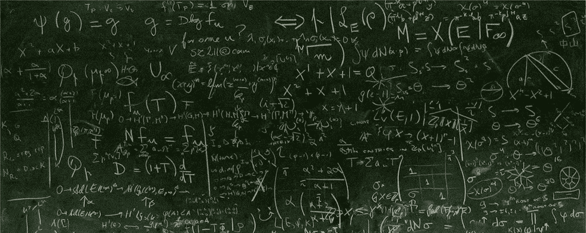
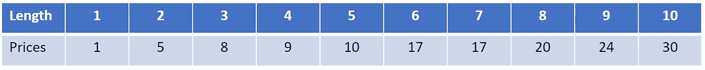
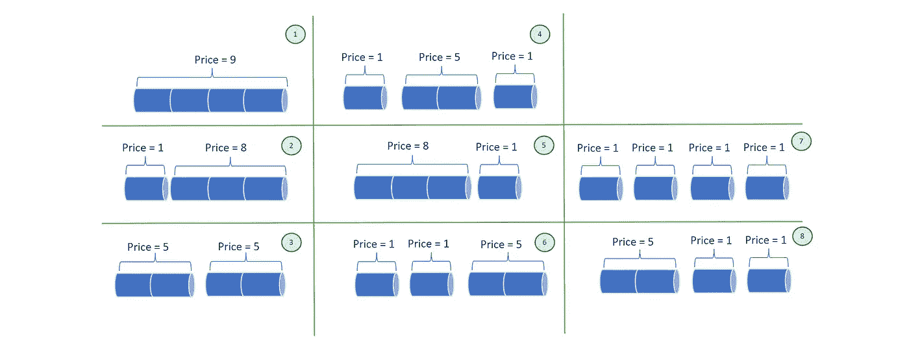
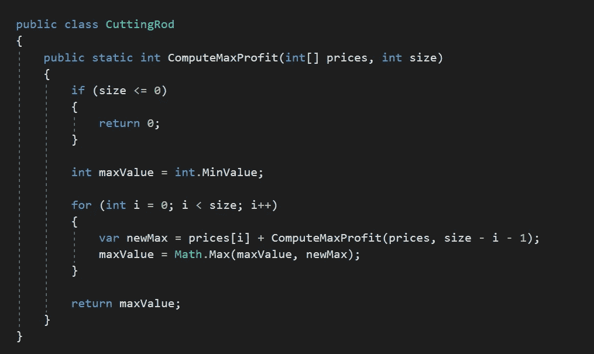
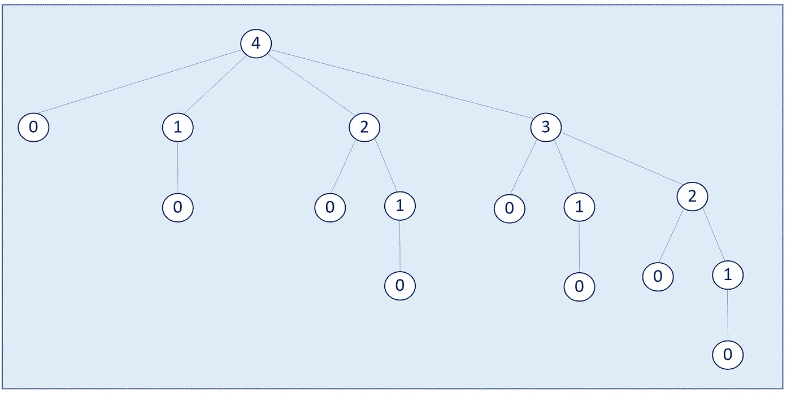
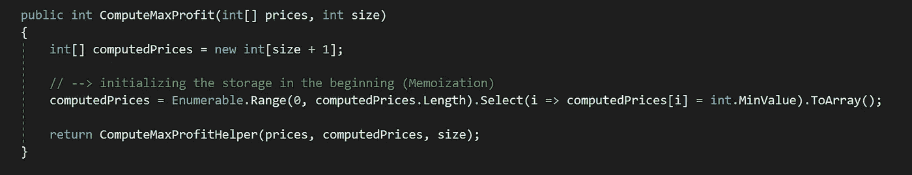
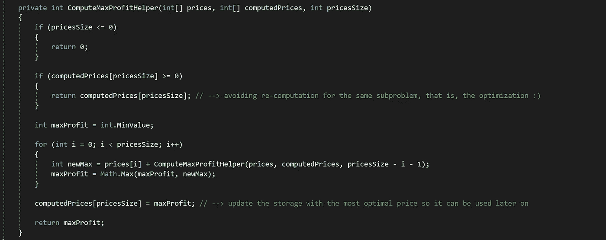
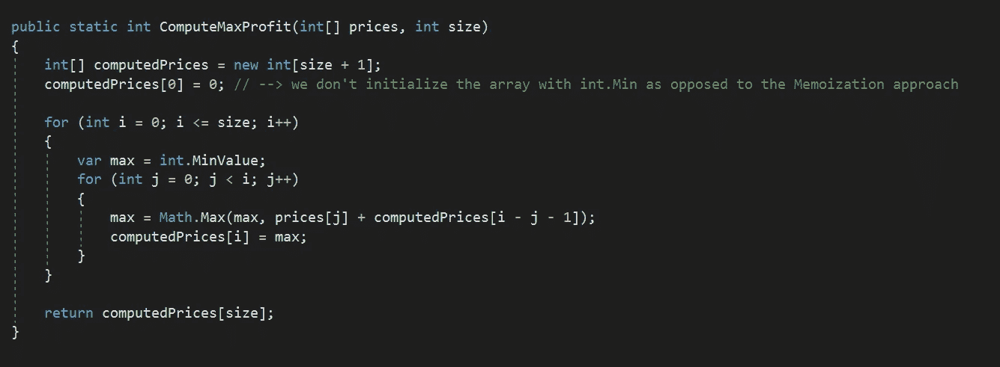

# 在理论和实践中理解动态规划

> 原文：<https://levelup.gitconnected.com/understanding-dynamic-programming-in-theory-and-practice-7835610ca485>

动态编程是一种具有挑战性的算法范式，需要适当和一致的实践才能适应。在本文中，我将首先解释动态编程(DP)的原理，然后尝试通过一个例子来应用它，我们最初将使用递归来解决它。然后对此应用动态编程——我相信这将给我们机会更好地理解动态编程的好处。

请注意，这是假设您已经对递归方法有了基本的了解，因为本文并不关注这一点。此外，我们的解决方案是用我最喜欢的编程语言 C#编写的。因此，没有任何进一步的到期让我们开始吧！

# **我们的路线图**

如果您在这篇文章中一直关注我，我将介绍以下内容:

1.  *什么是动态编程？*
2.  *有哪些识别 DP 问题的技巧？*
3.  *将识别技术付诸实践——棒料切割问题*
4.  *制定棒料切割问题的解决方案*
5.  编码时间(简单递归、记忆和列表)

我自己也很喜欢，希望你也会喜欢。

# 什么是动态编程？

简而言之，动态编程将一个复杂的问题简化为更小的子问题，然后将每个子问题的解决方案组合起来，形成原问题的最终解决方案。

***那么分治和动态编程的区别在哪里呢？👀***

这两者之间有一个微小但重要的区别:在动态编程中，子问题相互重叠，而在分治范例中，我们处理不相交的子问题。

此外，在动态规划方法中，我们通过存储先前计算的值来节省时间和提高效率，以便下一次不会再次计算相同的子问题，而是从存储中检索其值。有两种方法:记忆(自顶向下)和列表(自底向上)。在本文中，我们将对这两个问题进行解释。

# 识别 DP 问题的技术有哪些？

能够识别一个给定的问题是否可以有一个动态编程解决方案是非常重要的，否则，我们将无法实践这种方法的优势。这里我们首先提到两个主要的技术，然后通过后面的例子把它们付诸实践。

1.  ***重叠子问题:*** 简单来说，重叠子问题必须满足这两个条件:
    A)一个问题可以被分解成子问题
    B)每个子问题的结果(解)可以在后面的阶段使用
    因此，如果给定的问题不满足上述条件，这意味着我们不应该考虑 DP 作为我们的算法途径。因为将结果(解决方案)缓存在以后不需要的地方是没有意义的。
2.  ***最优子结构:*** 本质上就是说，如果一个问题的最优解来源于其子问题的最优解，那么，给定的问题也具有最优子结构特征。大多数经典的动态规划问题都归因于这个原理。

# 将识别技术付诸实践——棒切割问题

在这一部分，我们将考虑一个经典的动态规划问题，称为杆切割。首先，让我们先熟悉一下这个问题。

**杆切割问题解释**

史蒂夫有一根 N 英寸长的钢杆。他还得到一份与每根尺寸小于 n 的杆相关的价格清单。任务是从切割杆和出售杆中获得最大收益。

假设杆的长度为 **10** 并且给出了 **{ 1，5，8，9，10，17，17，20，24，30 }** 的价格表。话虽如此，我们可以用下表来说明杆件和价格之间的关系:

图 1 —杆件及其价格

因此，我们可以理解，对于一根长度为 2 的杆，我们的价格是 5。因此，对于长度为 3 的一块，价格数将是 8。

到目前为止一切顺利。

现在让我们来看一下这个问题的任务——将鱼竿切割成碎片以获得最大收益。假设我们想计算长度为 4 的最大利润。为此，我们首先需要了解四个棋子有多少种组合是可以实现的。那么，让我们来看看如何把它形象化。

图 2-长度为 4 的杆件组合

所以现在更容易找出哪种组合能给史蒂夫带来最大利润。换句话说，*它的碎片加起来的最大值的组合将是我们的最优解*，也就是说，数字 3 建议将棒切成两段，结果是 10

P2 + P2 = 5 + 5 = 10。

听起来不错-到目前为止，我们已经理解(hopefully☺)什么是杆切割问题，这是什么要求。所以，现在是时候看看我们如何应用识别技术来解决这个问题了。

**将 DP 识别技术应用于棒料切割问题**

对-让我们首先关注*最优子结构*。如前所述，我们通过将杆切割成块，然后比较每个组合的值来获得最大利润。也就是说，子问题(每个组合)的最优解会导致原问题的最优解。因此，杆切割问题归结为*最优子结构*原理。

这时，*重叠子问题*原理也应该清楚地注意到了。也就是说，一旦我们的算法形成了新的组合，我们需要针对最大值重复相同的比较。这里重要的一点是，子问题将需要从前面的子问题中计算出的结果，因此，最大值可以根据迄今为止获得的最佳值来计算。换句话说，我们的子问题在这个问题中是相互重叠的。

> 我识别 DP 问题的方法是首先正确理解问题。然后看看这个问题是否可以分解成更小的问题。最后，找出子问题之间是否有任何关系(或依赖性)。如果这些条件适用，那么，我会得出结论，给定的问题是一个 DP 问题。

# 杆切割问题的公式化解决方案

既然我们已经解释了这个问题，也理解了重叠子问题和最优子结构如何应用于杆切割问题，现在是时候提出一个解决方案并在上面烧一些代码了😎

我们的程序需要计算它所考虑的每个子问题的最大利润，因此，在每个时间点，它将在该阶段具有最大值。

也就是说，我们可以用公式表示如下，其中 1 ≤ i ≤ n

这里，BestPrice 函数计算直到第 I 点的最佳值。现在，我们需要重复这个公式为我们的棒的所有部分。即从 0 到杆尺寸- {0，1，2，3，...，n-1 }。

此时，剩下的唯一事情就是打开一些代码编辑器，编写出实际的算法。🤖

***首先——考虑递归方法***

正如在最开始所说的，我们首先考虑递归方法，然后我们将应用 DP 来更好地理解它给我们带来的优化好处。让我们看看它在 C#中的样子。

图 3 —使用递归方法的棒料切割解决方案

这一小段代码以递归的方式为我们解决了问题。这一切都很好，除了我们的程序在这里一遍又一遍地计算相同子问题的结果，这最终会损害算法的时间复杂度。让我们通过可视化算法的递归图来更好地理解这一点。这里为了简单起见，我们只考虑 4 的长度。

图 4 —考虑长度为 4 的杆切割递归树

如图所示，一些节点重复了计算。例如，节点 2 或 1 已经被计算了不止一次，如果问题输入变大，这可能导致严重的算法低效。现在，是时候对这种递归应用 DP 并享受我们算法的改进了。

***其次——使用动态编程优化性能***

动态编程中存储计算值有两种不同的方法，即*记忆*和*列表*。前者用缺省值初始化存储数据结构，然后在算法执行期间用最新值更新它。而后者，制表，不需要我们一开始就初始化存储。为了节省时间，我想参考[这篇文章](https://awjin.me/algos-js/dp/tab-memo.html)进一步阅读制表和记忆。此外，文章末尾给出的参考资料提供了这方面的大量内容。

***带记忆功能的杆切割 DP 解决方案(从上到下)***

下面的代码使用记忆方法公开了解决方案的一部分。这里，我们首先声明一个整数数组，然后用一个整数的最小值填充它的每个索引。下一步是调用一个帮助函数来为我们做递归。它使用存储阵列来避免 DP 承诺的相同子问题的重新计算。

*注意:你可以使用一个简单的 for 循环来代替可枚举的 Range 方法——在这里它们会为我们做同样的工作。*

图 5 —杆切割记忆化的主要功能

现在，让我们看看算法的另一个主要部分，即我们的递归函数，它演示了存储阵列是如何变得方便的。

图 6 —进行记忆的杆切割递归辅助函数

不用说，每个递归函数都需要一个基本用例来决定执行是否必须继续。在我们的帮助函数中，这将是定价表的长度或大小。现在，让我们看看这个杆切割问题的制表(自下而上)方法是什么样子的。

***【棒切 DP 解】同制表(自下而上)***

这种解决方案没有利用任何类型的递归来解决问题。事实上，它使用嵌套循环来实现相同的结果。另一个重要的区别是，与记忆化方法相反，我们的存储阵列在开始时没有使用默认值进行初始化。

图 7 —采用制表技术的钻杆切割动力定位解决方案

循环背后的主要逻辑是朝着整个杆长移动，并计算直到该点的最佳值。例如，如果在某个时间点，程序在第 4 块(i = 4)，那么，它考虑所有以前的值直到 4(从 0 到 3 作为 j 的增量，直到它小于 I)总是计算最新的最高价格。

动态编程是一个具有挑战性的概念，它确实需要大量的实践，以便人们可以首先识别问题的种类，然后识别子问题，找出它们重叠的地方，选择存储技术，最后推动解决方案。

我希望所有读过这篇文章的人都觉得这很有帮助。

如果您认为我遗漏的地方还有改进的空间，或者更重要的是，如果您发现了一些不正确的地方，请随时留下您的评论。虽然我可能不会立即阅读和回复评论，但我肯定我迟早会回到这篇文章上来。☺

编码快乐，感谢阅读！

***我对这篇文章的参考，我也强烈推荐给那些对算法感兴趣的人:***

[算法导论(麻省理工学院出版社)](https://www.amazon.co.uk/gp/product/0262033844?pf_rd_r=S9R8Y42G5XHYC9DHCCPK&pf_rd_p=e632fea2-678f-4848-9a97-bcecda59cb4e)

 [## 编写面试问题

### 掌握编码面试的过程

技术开发](https://skilled.dev)