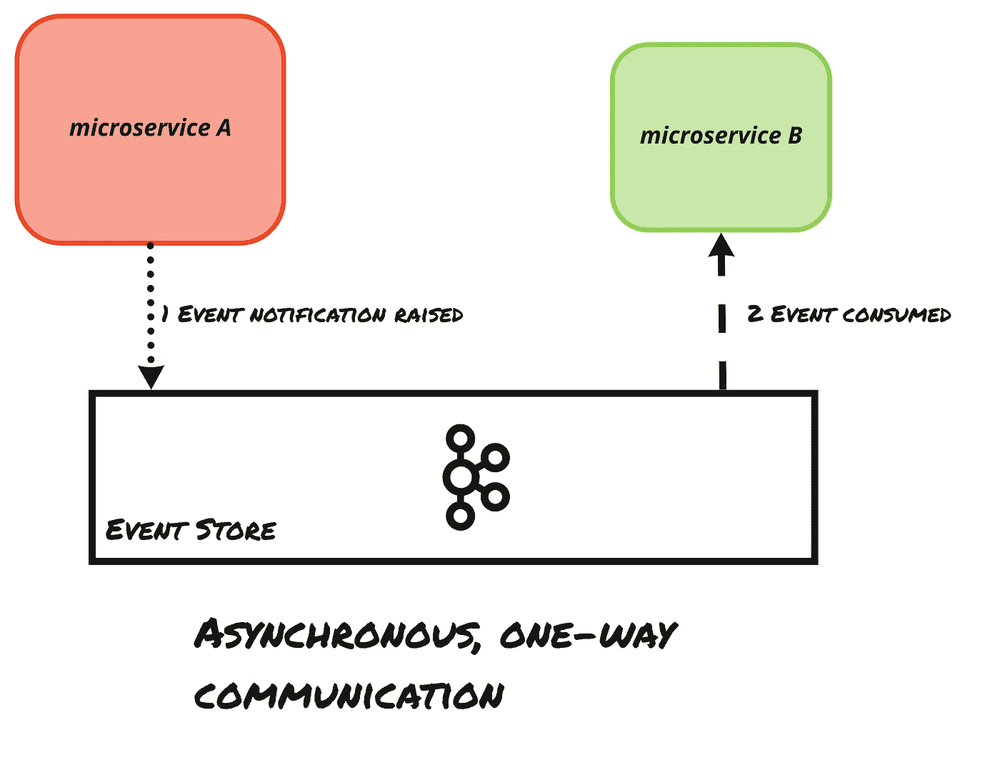
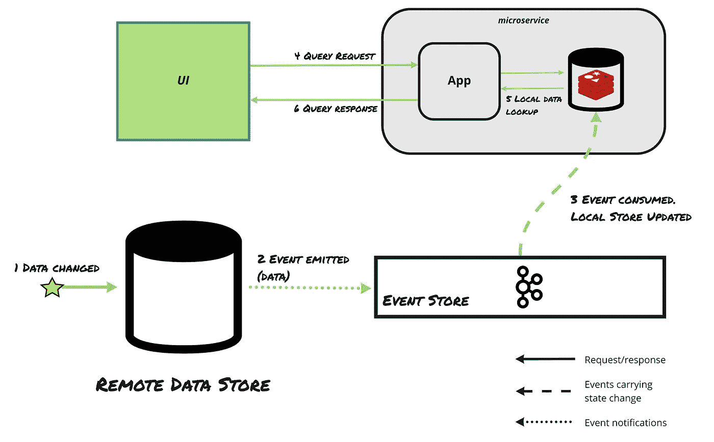
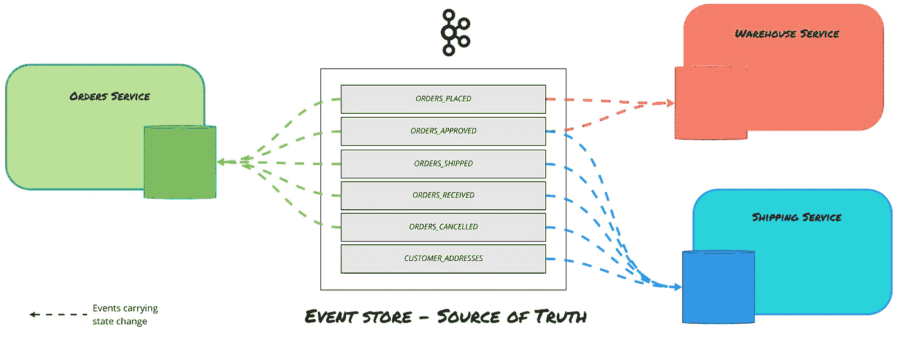
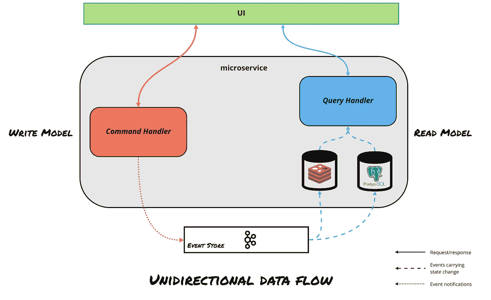

# 理解微服务的事件驱动设计模式

> 原文：<https://levelup.gitconnected.com/understanding-event-driven-design-patterns-for-microservices-659b3c9fb51f>

拍摄者: [cmykpstryk](https://www.facebook.com/cmykpstryk/)

建模和设计事件驱动的系统是具有挑战性的——无论是实践上还是概念上。然而，它们承诺了我们从未见过的可扩展性和性能。事件驱动架构提出了一些最有趣的工程问题，**直接挑战现状**。

> 事件如此简单，很容易被忽略。——Jay kr EPS，Confluent 的首席执行官

在本文中，我将解释现代事件驱动架构的基本原理。我们将更仔细地研究在文学和艺术会议上经常讨论的模式。通过学习这篇文章，您将获得必要的知识和见解，使您能够以事件驱动的方式进行思考。

我们将涉及的主题:

*   *事件驱动原语——事件、命令和查询*
*   *事件通知*
*   *事件携带状态转移*
*   *事件源*
*   *命令查询责任分离*

我们将使用的主要技术是 [Apache Kafka](https://kafka.apache.org/) ，这是一个适合基于事件的应用程序的开源分布式流媒体平台。围绕 Apache Kafka 开发应用程序的开源工具允许实现本文中提到的所有概念。

# 事件驱动原语

通过网络在分布式系统中发生的所有交互可以被分类为*仅仅*三种基本类型:*事件*、*命令*和*查询*。

当谈到事件驱动系统时，这种区别有助于表达发送消息背后的意图。

## 事件

> 每当系统执行一个动作时，包含对该事实的观察的消息被称为事件。

你可以把事件想象成简单的信息，比如日志条目。可观察到的事实。事件**可能会也可能不会引发副作用**。

事件有两个主要功能:

*   它们是系统中某处副作用的**触发器** **。**
*   它们也是任意数据的载体。

就像纯粹的信息一样，事件不一定携带对未来要执行的操作或要返回的响应的任何预期，但它们仍然可以携带数据。我们将在后面看到我们如何利用这种二元性来区分两种非常不同的，但是强大的，事件驱动的模式。

## 命令

> *每当一个消息带有改变系统内部状态的期望时，该消息就是一个命令。*

命令用于向系统发出信号，表明有特定的工作要以权威的方式完成。它们必然会引发副作用。

命令与事件非常相似——事实上，在某些实现中，它们实际上是无法区分的。然而，交流意图的明确区别才是关键。

**混淆命令和事件是一种反模式**，导致调试事件驱动系统的困难！

## 问题

> *每当系统需要检索其内部状态并呈现给调用者时，这样做的请求就称为查询。*

处理一个查询完全不受系统上任何副作用的影响。

查询本质上需要同步响应。查询可以与 HTTP GET 请求或数据库查询相比较——在某些实现中正是如此。

# 事件驱动的设计模式

现在我们理解了事件驱动系统中可能发生的所有类型的交互(实际上，在任何其他分布式系统中也是如此)。

让我们深入了解四种基本设计模式！

值得注意的是:

> 大多数已确定的事件驱动系统至少使用了其中一种——Martin Fowler

…这意味着在实践中，系统可以并且在大多数情况下确实同时使用许多模式。

## 事件通知

这是描述由事件存储促进的以事件为中心的通信的最基本模式。它包含事件的**触发功能。**

> 通过事件存储促进反应式、异步和位置透明的通信。

想象一个微服务架构，其中的服务根本不互相对话。事实上，他们甚至不知道其他服务的存在。

相反，当它们需要完成某件事情，或者想要交流某件事情时，它们会引发异步事件。这些事件只在一个地方结束——一个名为**事件存储的中央实体，**将这些事件存储为流。

任何微服务都可以订阅这些流，并接收这些事件通知。然后，它们相应地对这些通知做出反应，在大多数情况下，生成更多的事件，这些事件被其他微服务拾取，从而创建大量、广泛和漂亮的编排。这是*事件通知*模式的核心。

**优点:**

*   位置透明性通过使消费者和生产者的存在变得过时来增加系统的弹性。这意味着，即使其中一个微服务或设备变暗，系统内的通信也将以**最终一致的方式**得到妥善处理。
*   出色的系统可插拔性使数据集成变得容易。无论谁是事件的生产者，新的微服务都会消费事件——事件存储是真相的最终来源。微服务成为我们可扩展架构的可插拔构建模块。
*   组件的这种封装，尤其是在微服务的世界里，是非常可取的，并且当系统变得更加复杂时变得越来越重要。

**缺点:**

*   事件通知模式的主要缺点来自它的简单性。随着处理流程的时间增长，跨越多个事件通知的流程的复杂性也相应增加。这需要持续的监控，并且使得调试相当困难。
*   在对系统架构进行推理时，将被动攻击事件误认为命令可能会带来混乱。这导致了不打算供外部使用的通知上的耦合，由于不正确的数据耦合而导致组件故障。

## 事件携带状态转移

利用了**事件**的数据功能的模式。只有当我们数据的*真实来源*是事件存储时，才能实现这一点。

> 通过异步使用事件持续复制应用程序状态。

订阅事件存储的微服务将收到其关注的流的更改通知。如果这些流包含状态数据，它也将被提取。

数据存储在部署微服务的本地数据存储中。我们可以组合多个事件流来存储更复杂的数据集合，从而创建更复杂的数据流。

现在，微服务不再从远程数据源检索数据，而是拥有所有需要复制到本地存储中的数据。在收到查询时，这些数据可以立即廉价地检索出来。

**优点:**

*   微服务变得完全自主——当所有服务都包含在其整个生命周期中需要的所有必需数据的副本时，跨服务查询就是多余的。
*   可以离线访问数据，这样就可以在网络不可用时利用复制的数据，并在网络恢复在线后与事件存储同步。

**缺点:**

*   大量复制需要大量内存，但是，正如 Martin Fowler 所说，在当今世界，数据存储已经足够了。
*   跨服务的数据一致性和连贯性可能会带来挑战，迫使开发人员考虑最终的一致性问题，如及时性和冲突。

## 活动采购

事件是任何事件驱动软件系统的核心。对应用程序状态的所有更改都必须由事件启动。因此，事件存储在*真实来源的功能中取代数据库，* **包含关于系统在过去执行的任何有状态动作的信息**。

这允许通过在一个干净的构建中重放持久事件的序列，灵活地将应用程序状态重新构建到任一时间点。

> 通过基于事件的操作实现中央集权，以便按需重建历史系统状态。

该模式**使用事件**的触发和数据功能来调用应用程序状态变化链，并向这些变化提供完整的所需数据，这些数据由系统中所有组件的事件表示。

这个特性对于调试和异常检测来说非常强大，它允许开发人员更精确地调查不良事件和监控异常行为。

可以计算不正确事件的后果，并通过反转它和任何后续事件、修复坏事件并再次重放事件来修复应用程序状态。

**优点:**

*   事件源通过**在可靠的审计日志中保存状态变化的完整审计**，解决了基于微服务的架构中常见的数据一致性问题。
*   此外，该模式通过直接从事件存储中的事件流导出系统状态视图，解决了相互依赖的分布式系统之间的一些经典数据一致性问题，如数据差异和重复——这一概念称为物化视图。
*   因此，这种模式是持久性不可知的，因为数据库只是基于事件存储构建的时态视图，而事件存储是系统的最终来源。

**缺点:**

*   大多数开发人员都不熟悉使用事件源系统，使用事件——尤其是坏事件——可能会非常耗时。
*   与不使用事件源的系统集成也非常困难。
*   最后，随着事件模式随着时间的推移而改变，重建会变得非常困难，并且一些实现会遇到版本控制的问题。

## 命令查询责任分离

CQRS 是事件源的自然发展，通过分别分离命令和查询作为输入并将两个模型与事件存储在内部链接，将系统分为写和读模型。

> 通过使用事件以异步方式分离系统行为，实现单向数据流。

写模型使用来自外部的命令，通过*事件通知*触发一系列评估和执行操作的事件。状态更改以完整的形式保存在事件存储区中。

当请求完成时，最终通知向感兴趣的服务表明系统的状态已经改变。遵循*事件承载的状态转移*模式，服务可以在它们的本地存储中持久化更改，作为对通知的反应。

读取模型负责使用提到的本地存储来处理和响应查询。原则上，该模式采用异步消息传递，可以独立于读取执行写入，而不是传统的请求-响应风格。

**优点:**

*   与传统的请求-响应通信方式相比，整体性能更好。
*   模型可以独立地部署和扩展，以一种最适合特定用例的方式。
*   通过为一种数据类型选择最合理的数据库，或者通过使用多种不同的查询模型，可以进一步优化读取端，这些查询模型将为预期的用途显示更好的性能。

**缺点:**

*   使用该模式时出现的异步处理增加了系统的复杂性，这对一些开发人员和架构师来说是一个挑战。
*   系统组件变成**最终一致**，调试有一定难度。

就是这样！现在你已经准备好开始以一种有点不同的非常现代的方式重新思考你的架构了。让我知道进展如何！

***非常感谢您的阅读！*** *如果您喜欢这类内容，请继续关注我，以便在我发布更多内容时获得通知！*

***查看我之前的文章***[***Monolith to Event-Driven micro services with Apache Kafka***](https://medium.com/@dev.anowak/monolith-to-event-driven-microservices-with-apache-kafka-6e4abe171cbb)***查看这些概念在真实场景中的实际应用！***

# 参考资料——请查看！

*   Ben Stopford，设计事件驱动的系统，奥莱利媒体，2018 年
*   [Allard Buijze，务实事件驱动的微服务，2018](https://youtu. be/vSd_0zGxsIU)
*   [马丁·福勒，事件驱动架构的多种含义，2017](https://youtu.be/STKCRSUsyP0)
*   Martin Fowler，你说的“事件驱动”是什么意思？，2017 年
*   马丁·福勒，事件采购，2005 年
*   [Jay Kreps，事件驱动架构的死亡与重生，2018](https://youtu.be/gsUZ6RYmL1s)
*   [Chris Richardson，用聚合开发微服务，2017](https://youtu.be/7kX3fs0pWwc)
*   [Toby Clemson x Martin Fowler，使用基于事件的系统实现实验，2018 年](https://youtu.be/_RgUxUTuxH4)
*   Maciej Malawski，Stefan Spahr，Dirk Muthig，Andrzej Debski，Bartlomiej Szczepanik，《寻找云应用的可扩展反应式架构:CQRS 和事件采购案例研究》。IEEE 软件，2016