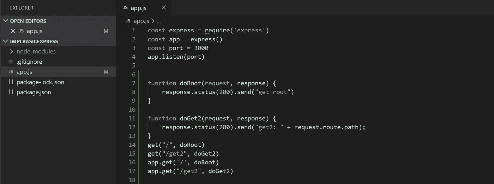

# 通过实施来理解 Express

> 原文：<https://levelup.gitconnected.com/understanding-express-by-implementing-it-6640109527e2>

Web 框架有点神话般的名声。幕后有很多事情会使配置不够直观。但是它们的广泛使用使得理解这种配置成为一种有用的技能，不管你是刚从训练营出来还是已经进入职业生涯多年。所以，为了揭开 Express 的神秘面纱，让我们实现一个简化版本。我们将从一个简单的命令行处理程序开始。希望我们最终能有可以直接插入 Express 的功能。

*关于格式的快速说明。我将引用行号。这些行在存储库中的代码中。我将把片段放在块中，但是那些没有行号。但是希望，它将清楚我将指的是什么线。

让我们寻找一个起点。我在 github 上找到了下面的代码，它概述了一个不错的小 CLI 循环。[https://gist . github . com/init love/2478016 # file-zreadline-example-short-js](https://gist.github.com/initlove/2478016#file-zreadline-example-short-js)提供了一个很好的模板。该代码使用“readline”模块来解析来自命令行的用户输入。有一个小循环一直读到用户取消为止(通过按 Ctrl-C)。这个基本循环展示了一些重要的思想:接受输入、基于输入进行处理，以及等待连续输入循环的循环。这些对于命令行界面(CLI)来说是完美的，正如我们将看到的，对于 web 服务器来说也是完美的。

这是我们前进的方向——我们的框架和 Express 将使用相同的功能:



让我们在基础上再增加一点。如果你想继续，继续克隆 https://github.com/sweeneyb/implBasicExpres 的[并检查提交 721377 c 35 f 4d 7 C9 BF 3139d 60 CBC 53 a 1 AE 85 ABCD 4(git check out 721377 c)。](https://github.com/sweeneyb/implBasicExpress/blob/721377c35f4d7c9bf3139d60cbc53a1ae85abcd4)

```
git clone [https://github.com/sweeneyb/implBasicExpres](https://github.com/sweeneyb/implBasicExpress/blob/721377c35f4d7c9bf3139d60cbc53a1ae85abcd4)s
cd implBasicExpress
git checkout 721377c
```

在提交过程中，我们对循环做了一些修改。我们将寻找命令或动作，而不仅仅是寻找特定的文本。这些命令稍后会告诉我们如何处理接收到的输入。我们将使用几个动词——“GET”和“PUT”。如果您熟悉 HTTP 规范，您会发现这是两个常见的 HTTP 动词。

```
rl.on('line', function(line) {
    var split = line.split(" ")
    switch ( split[0].trim() ) {
        case 'GET':
          console.log( "get ", split[1])
          break;
        case 'PUT':
          console.log( "put", split[1])
          break;
        default:
          console.log("unknown command")
    }
  rl.setPrompt(prefix, prefix.length);
  rl.prompt();
})
```

现在，我们真的不会做太多不同。第 9 行和第 12 行(记住行号指的是代码中的行，而不是上面的代码块)用来显示我们的 switch 语句区分命令。此时运行程序并输入“get foo ”,应该会返回“GET foo”。“put foo”应该返回“PUT foo”和除“GET”或“PUT”之外的任何第一个单词(大小写很重要！)应该会返回“未知命令”。很好，但是没意思。让我们添加一些功能…

# 但是首先！

对代码质量保持警惕是个好主意。一本书的一个片段让我印象深刻，那就是方法只能在“一个层次”上做事情。如果你的代码使用了多个 API，那么你最好把它们分开。当前代码正在处理用户输入循环，以相同的方法解析用户输入，并根据输入做出决策。为了便于阅读(也便于将来的扩展，让我们把它分解开来。这将在以后证明是有用的。如果你坚持下去。这个提交将输入处理移动到它自己的方法中。此时，我们可以有效地忘记输入循环代码。完美…不用想太多。

```
rl.on('line', function(line) {
  doStuff(line)
  rl.setPrompt(prefix, prefix.length);
  rl.prompt();
}).on('close', function() {
  process.exit(0);
});
rl.setPrompt(prefix, prefix.length);
rl.prompt();function doStuff(line) {
    var split = line.split(" ")
    switch ( split[0].trim() ) {
        case 'GET':
          console.log( "get ", split[1])
          break;
        case 'PUT':
          console.log( "put", split[1])
          break;
        default:
          console.log("unknown command")
    }
}
```

让我们继续重构。`git checkout a32634`转移到一个提交，该提交排除了对“get”和“put”命令的处理。这里，我们已经把执行其中一个命令的含义与程序如何知道这个命令被发出的方式分开了。

```
function doStuff(line) {
    var split = line.split(" ")
    switch ( split[0].trim() ) {
        case 'GET':
          doGet(split[1].trim())
          break
        case 'PUT':
          doPut(split[1].trim())
          break
        default:
          console.log("unknown command")
    }
}function doGet(what) {
    console.log("get", what);
}function doPut(what) {
    console.log("put", what)
}
```

这就是“框架”和“实现代码”分离的开始。在更大的团队环境中，我们可以将“doPut”和“doGet”功能的实现交给其他开发人员。我们还可以提供不同的方式来调用“doPut”和“goGet”。例如，我们可以让 web 服务器监听输入并将输入传递给适当的函数(事实上，这正是 Express 所做的)。

这些都很好，但结果仍然是紧密耦合的。输入处理函数代码必须知道在“GET”或“put”输入上调用的函数的名称。如果我们不局限于特定的名字就好了。这正是`git checkout 2afe19ad`所做的。

```
var handlers = {}handlers["GET"] = doGet
handlers["PUT"] = doPutfunction doStuff(line) {
    var split = line.split(" ")
    switch ( split[0].trim() ) {
        case 'GET':
          var hanlder = handlers["GET"]
          hanlder(split[1])
          break
        case 'PUT':
          handlers["PUT"](split[1])
          break
        default:
          console.log("unknown command")
    }
}function doGet(what) {
    console.log("get", what);
}function doPut(what) {
    console.log("put", what)
}
```

第 15 行创建了一个关联数组。命名/实现“doGet”和“doPut”方法的团队将添加第 17 行和第 18 行。但是这提出了一个类似于我们刚刚解决的命名问题。现在，编写框架的团队必须知道框架的内部变量名。这实际上限制了框架改变的能力。相反，如果我们可以通过函数来传达意图，那就好了。这提供了更大的灵活性。继续检查`git checkout 3cdff72`

```
var handlers = {}function get( getFn) {
    handlers["GET"] = getFn
}
function put(putFn) {
    handlers["PUT"] = putFn
}function doStuff(line) {
    var split = line.split(" ")
    switch ( split[0].trim() ) {
        case 'GET':
          var hanlder = handlers["GET"]
          hanlder(split[1])
          break
        case 'PUT':
          handlers["PUT"](split[1])
          break
        default:
          console.log("unknown command")
    }
}// above this comment is "framework" stuff.  It handles common tasks
// below this comment is configuring the framework & specifying what gets done.function doGet(what) {
    console.log("get", what);
}
get(doGet)// this is starting to look a lot like express
put(function doPut(what) {
    console.log("put", what)
})
```

第 19–24 行定义了一些函数，这些函数允许在不暴露内部结构的情况下轻松使用框架。每个函数只接受一个参数:当一个命令作为输入时调用的函数。处理输入的函数放在一个关联数组中，但是实现处理程序的团队没有理由知道这一点。还记得我们之前做的重构吗，一个方法只做一件事？这是另一个地方，代码的结构允许不同的团队处理不同的功能，同时通过 API 交流他们的期望。

第 44–52 行是实际的处理程序实现。44–47 定义并注册一个函数。第 50–52 行内联定义和注册。两种风格都有效；你挑吧。在这两种情况下，都没有关于请求如何到来的假设知识。同样，这给了我们很大的灵活性来决定消息是如何进来的。它们可能来自 CLI(就像在本例中一样)，来自 web 框架(我们将在后面看到)，或者来自测试框架(您肯定应该进行测试——我只是不想在这个特定的例子中弄乱存储库)。

我们当前代码的一个缺点是，它只能支持每种命令类型一个处理程序。到目前为止，这对我们来说是有用的，但是随着我们向与 Express 的特性对等迈进，我们将希望使“GET”和“PUT”更加有用。GET HTTP 动词很简单，因为它获取一个项目。该项通常被称为“路径”通常，行为会根据路径而改变。例如，“获取/简档”和“获取/主页”可以调用非常不同的功能来显示用户简档和主页。所以让我们添加一种基于路径调用不同函数的方法。去吧`git checkout 32005fa.`

```
var handlers = {}
handlers["GET"] = {}
handlers["PUT"] = {}function get(path, getFn) {
    let paths = handlers["GET"]
    paths[path] = getFn
}function put(path, putFn) {
    handlers["PUT"][path] = putFn
}function doStuff(line) {
    var split = line.split(" ")
    switch (split[0].trim()) {
        case 'GET':
            deferRequest("GET", split[1])
            break
        case 'PUT':
            deferRequest("PUT", split[1])
            break
        default:
            console.log("unknown command")
    }
}function deferRequest(method, path) {
    let paths = handlers[method]
    var handler = paths[path]
    if (handler == undefined) {
        console.log("404 - not found")
    } else {
        handler(path)
    }
}
```

我们看到“get”和“put”函数(第 21–28 行)有一个额外的路径参数。handler 函数通过一对关联数组进行链接，因此只有在为命令/http 动词调用特定路径时，才会调用它。注册函数的匹配代码在第 64–65 和 68 行。同样,“PUT”被注册为匿名函数，但这与使用命名函数没有任何不同。

我们还重构了调用处理函数的代码。实际上,“GET”和“PUT”的行为没有区别，所以在第 44 行添加“deferRequest”方法让我们可以清理一些多余的代码。第 54 行和第 55 行将框架中的典型内容与实现代码分开。所以，让我们回顾一下:

我们有一个从命令行接受用户输入的框架。基于它所得到的，它遵从用户定义的函数并传递给它的路径。这些函数只是打印一个标识位的信息和给出的路径。但是它们都打印到控制台。如果我们要在一个 web 框架中使用这些功能，那是行不通的。输出将到达控制台，而不是 web 客户端。我们需要一种封装响应的方式，让框架知道如何发送回响应。我们需要稍微复杂一点的界面。我们来看看`git checkout ca12ffa4`

```
function deferRequest(method, path) {
    let paths = handlers[method]
    var handler = paths[path]
    if (handler == undefined) {
        console.log("404 - not found")
    } else {
        let request = {}
        request.baseUrl = path
        let response = {}
        response.send = function(message) {
            this.message = message
        }
        handler(request, response)
        console.log(response.message, "\n\n")
    }
}
```

“延迟请求”增加了一些功能。它不只是传递一个带有路径的字符串，而是创建一个对象并设置一个“baseUrl”属性。这个属性在 Express 中有一个模拟，它告诉您浏览器请求的路径(在域之后)。它还创建了一个“响应”对象，并向该对象添加了一个“发送”函数。这让实现函数返回一些框架可以返回给 web 客户端的对象。框架有很多方法可以选择，但是在我们这个简单的例子中，我们只是返回一个简单的消息。我们的框架将只是读取消息并在控制台上输出它(毕竟，我们还是一个 CLI)。

我们的处理函数(第 64–70 行和第 75–77 行)会相应地改变:

```
function doRoot(request, response) {
    response.send("get root")
}function doGet2(request, response) {
    response.send("get2 "+ request.baseUrl);
}
get("/", doRoot)
get("/get2", doGet2)// this is starting to look a lot like express
put("/", function doPut(request, response) {
    response.send("put "+ request.baseUrl)
})
```

如果他们需要查看给出了什么路径，他们会检查 request.baseUrl 属性。如果他们需要发送响应，他们通过调用“response.send()”来添加消息。这对于 CLI 来说有点过了，但我们现在有了一个非常健壮的系统，一个团队可以通过它编写框架来处理用户输入，并将行为委托给另一个团队的开发人员。而实现的另一个团队并不关心他们的代码是在 CLI 中调用还是从 express 中调用。为了证明这一点，我们将稍微调整一下，并将其放入一个简单的 Express 应用程序:`git checkout 3dfaa9e`

```
const express = require('express')
const app = express()
const port = 3000
app.listen(port)...
function doRoot(request, response) {
    response.status(200).send("get root")
}function doGet2(request, response) {
    response.status(200).send("get2: " + request.route.path);
}
get("/", doRoot)
get("/get2", doGet2)
app.get('/', doRoot)
app.get("/get2", doGet2)// this is starting to look a lot like express
put("/", function doPut(request, response) {
    response.status(200).send("put "+ request.route.path)
})
app.post("/", function doPut(request, response) {
    response.status(200).send("put "+ request.route.path)
})
```

Modern Express 将返回代码从消息体中分离出来，因此我们对处理函数进行了调整。请记住，我们还需要调整 deferRequest，尽管变化很小:

```
function deferRequest(method, path) {
    let paths = handlers[method]
    var handler = paths[path]
    if (handler == undefined) {
        console.log("404 - not found")
    } else {
        let request = {}
        request.route = {}
        request.route.path = path
        let response = {
            rc: undefined,
            message: undefined,
            status: function(code) {
                console.log("accepting code " +code)
                this.rc = code
                return this
            },
            send: function( message ) {
                this.message = message
            }
        }
        handler(request, response)
        console.log(response.rc, " ", response.message, "\n\n")
    }
}
```

我们的框架和 express 的核心区别在于，Express 路由器已经封装成模块，所以我们需要在那个模块上调用“get”和“put”，即“app.put( <path>、<function>)”。</function></path>

现在，您应该能够从 CLI 调用处理程序函数:

```
$node app.js
> GET /get2
accepting code 200
200   get2: /get2>
```

或者通过 HTTP:

```
$curl -i [http://localhost:3000/get2](http://localhost:3000/get2)
HTTP/1.1 200 OK
X-Powered-By: Express
Content-Type: text/html; charset=utf-8
Content-Length: 11
Connection: keep-aliveget2: /get2
```

现在，很明显，Express 的功能比我们构建的要多得多。每条路径仍然只有一个函数。Express 允许您调用多个函数并传递请求/响应对象。它理解页面显示的渲染引擎。它具有接收请求和路径参数的强大手段，以提供更大的灵活性。但是希望这能让我们明白 Express 仍然只是代码的事实，做出一些权衡的一些原因，以及为什么语法是这样的。我坚信，通过了解一些幕后发生的事情，你可以充分利用一个给定的框架。