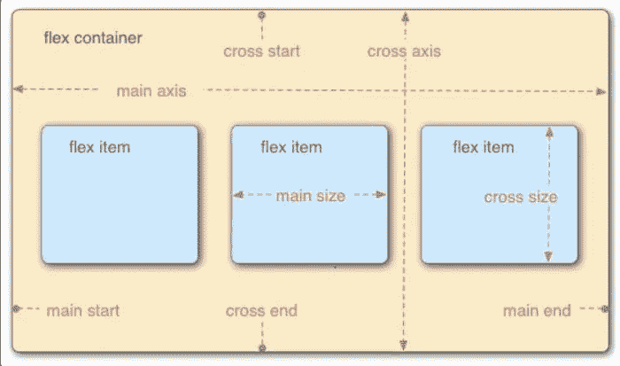
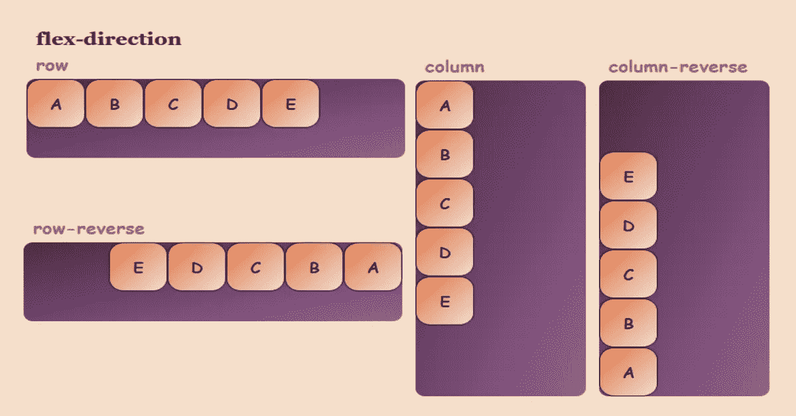
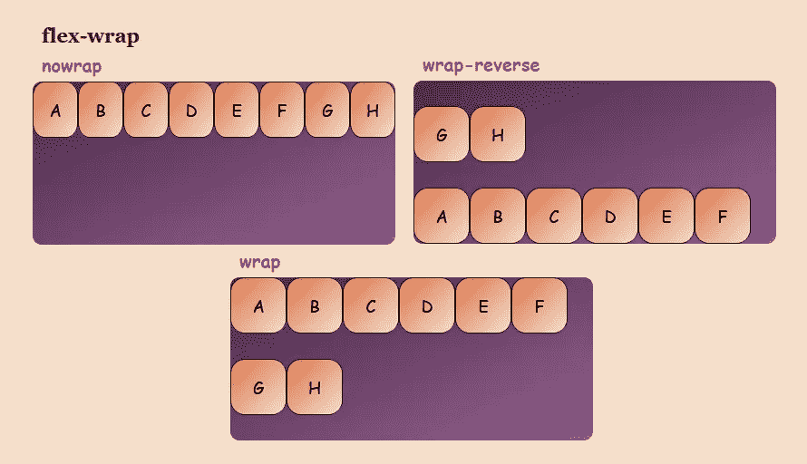
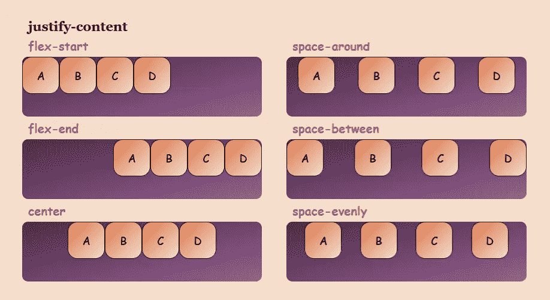
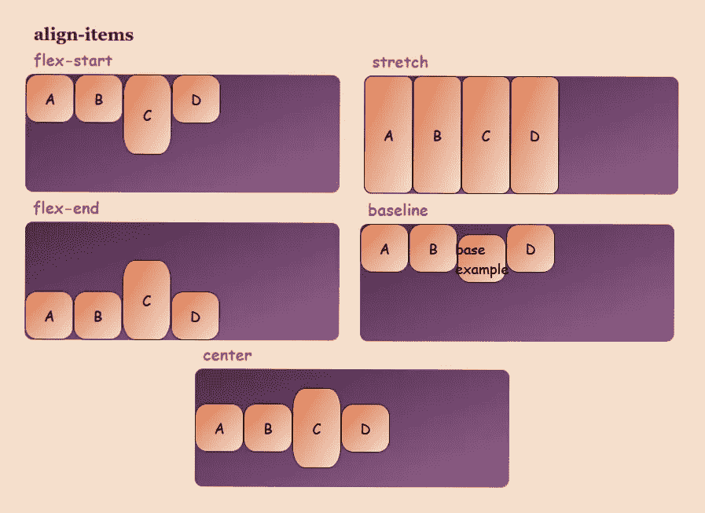
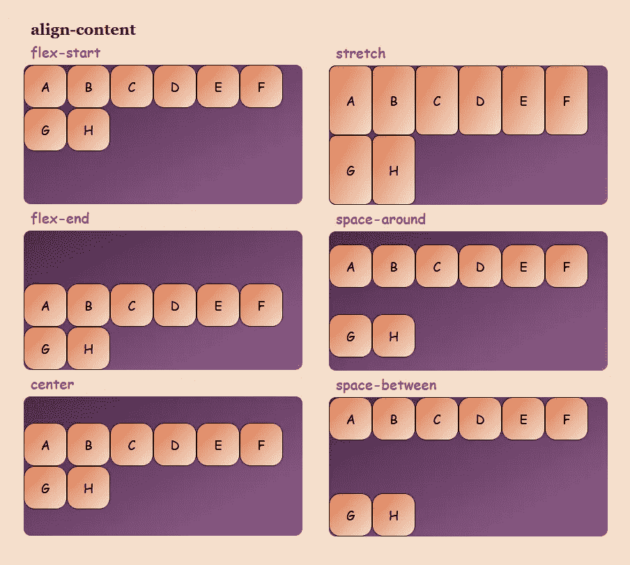
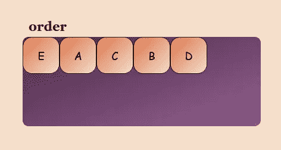
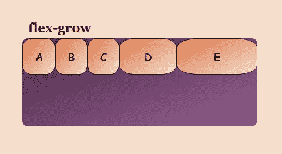
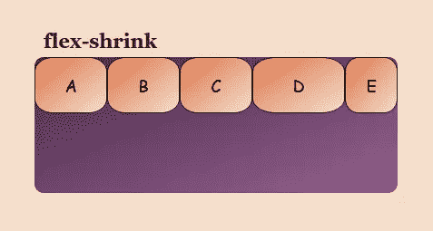
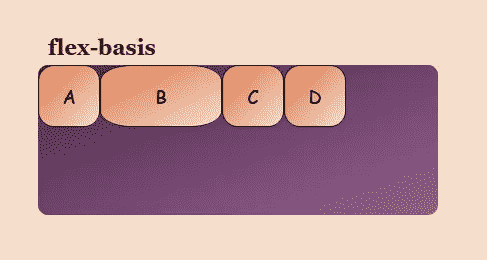

# 了解 Flexbox 使事情变得简单👏

> 原文：<https://levelup.gitconnected.com/understanding-flexbox-to-make-things-easy-adf90891ff25>

> 如果你不愿意学习，没有人能帮助你。如果你决心学习，没有人能阻止你

嘿，大家好，我决定用这句话开始这篇文章，让你们知道一旦你们开始学习，没有什么可以阻止你们，因为你们总是会学到新的东西，并且会成长。(我们每个人有时候都需要一个小小的动力不是吗？😉)

说到这里，让我们进入正题。你们有些人可能听过，有些人可能没听过 CSS 中的术语 flexbox。不要担心，这是一篇为第一次学习它的人和那些已经知道但来到这里阅读这篇文章来提高他们的知识的人写的文章。


李·坎贝尔在 [Unsplash](https://unsplash.com?utm_source=medium&utm_medium=referral) 上的照片

因此，本文将首先向您介绍 CSS 中的 flexbox，然后介绍 flexbox 模型。一旦您对 flexbox 的含义有了清晰的认识，我们将转向 flexbox 属性。

# 希望你准备好开始…💥

按照约定，让我们从介绍开始。

## 什么是 Flexbox？

Flexbox 是按行或列排列项目的一维布局方法。它具有灵活有效的布局，在项目之间分布空间以控制其对齐结构。Flexbox 对于创建小规模的布局很有用，它反应灵敏，移动友好。

**我们为什么要使用 Flexbox？**

我们选择使用 flexbox 是因为你想在一个方向或另一个方向上放置一系列项目。

举例来说，简单的布局设计要么具有挑战性，要么无法用任何工具以灵活的方式实现，但 flexbox 使许多布局任务变得更加容易。

*   将内容块在其父内容块中垂直居中。
*   使容器的所有子容器占据相同的可用宽度/高度，而不管有多少宽度/高度可用。
*   使多栏布局中的所有栏采用相同的高度，即使它们包含不同数量的内容。

**flexbox 的特点？**

当你谈论 flexbox 的功能时，它提供了很大的灵活性，你可以用适当的间距来安排、排序和对齐项目。

当您深入了解更多细节以便更好地理解时，flexbox 布局中有 5 个值得注意的特性，例如

*   **方向**—您可以按任何方向排列网页上的项目，例如从左到右、从右到左、从上到下和从下到上。
*   **顺序**—使用 Flexbox，您可以重新排列网页内容的顺序。
*   **换行**——如果网页内容的空间不一致(在一行中)，您可以将它们换行为多行(水平方向)和垂直方向。
*   **对齐**—使用 Flexbox，您可以将网页内容与其容器对齐。
*   **调整大小**—使用 Flexbox，您可以增加或减少页面上项目的大小，以适应可用空间。

**什么时候使用 flexbox？**

你可以使用 flexbox 来构建一个完整的网页。但是当你看到一个更好的 CSS 方法时，从长远来看，它是一个更简单、编写得更好、可维护的应用程序，当你考虑在以下场景中使用 flexbox 时，它可以完美地创建和适应你的布局

*   **当您要实施小型设计时** —当您要实施只有几行或几列的小型布局设计时，Flexbox 是理想之选
*   **当你需要对齐元素的时候**——Flexbox 非常适合，我们唯一需要做的就是使用 display: flex 创建一个 flex 容器，然后定义我们想要的 flex 方向
*   **当你需要一个内容优先的设计** —如果你不知道你的内容会是什么样子，Flexbox 是创建网页的理想布局系统，所以如果你想让所有东西都适合，Flexbox 是完美的选择。

**flexbox 和 grid 的区别？**

CSS flexbox 和 CSS grid 的基本区别在于 CSS **flexbox 用于对齐**，而 CSS **grid 用于布局**。

## 什么是 Flexbox 模型？



Flexbox 模型

*   当元素作为伸缩项目布局时，它们沿两个轴布局。如**主轴和横轴。**
*   **主轴**是沿柔性项目展开方向运行的轴。
*   **横轴**是垂直于柔性项目排列方向的轴。
*   设置了显示:flex 的父元素称为 **flex 容器**。
*   在柔性容器内以柔性盒子形式布置的项目称为**柔性项目**

*有了这些知识，我希望现在您已经完全了解了 flexbox 的含义，有了这些知识，我们就可以开始了解 flexbox 的特性了。*

# 让我们深入挖掘…💥

## Flex 容器属性

flex 容器属性有以下六种类型

*   弯曲方向
*   柔性包装
*   柔性流
*   调整内容
*   对齐-项目
*   对齐内容

🔴**弯曲方向**

Flex-direction 属性控制 Flex 项目沿主轴放置的方向。更简单地说，这意味着 flex-direction 定义了容器希望在哪个方向上堆叠 flex 项。

有 4 种方法可以用作弯曲方向。

**类型 01:——列**

```
**/* When you want to stack the flex items vertically (from top to bottom)*/**
.flex-container {
  display: flex;
  flex-direction: column;
}
```

**02 型:——柱——反**

```
**/* When you want to stack the flex items vertically (but from bottom to top)*/**
.flex-container {
  display: flex;
  flex-direction: column-reverse;
}
```

**类型 03:——排**

```
**/* When you want to stack the flex items horizontally (from left to right)*/**
.flex-container {
  display: flex;
  flex-direction: row;
}
```

**类型 04:——行——反向**

```
**/* When you want to stack the flex items horizontally (but from right to left)*/**
.flex-container {
  display: flex;
  flex-direction: row-reverse;
}
```



弯曲方向

🔴**柔性包装**

当你的布局有一个固定的宽度或高度时，会出现一个问题，那就是最终，你的 flexbox 子节点会溢出它们的容器，破坏布局。作为这个问题的解决方案，我们使用 flex-wrap 属性来指定 flex 项是否应该换行。

**包裹物品(wrap)**

```
**/*Specifies to wrap the flex items if necessary*/**
.flex-container {
  display: flex;
  flex-wrap: wrap;
}
```

**不包装项目(nowrap)**

```
**/*Specifies that the flex items will not wrap (this is default)*/**
.flex-container {
  display: flex;
  flex-wrap: nowrap;
}
```

**以相反的顺序包装物品(wrap-reverse)**

```
**/*Specifies that the flexible items will wrap if necessary, in reverse order*/**
.flex-container {
  display: flex;
  flex-wrap: wrap-reverse;
}
```



柔性包装

🔴**柔性流**

它是设置伸缩方向和伸缩卷绕属性的简写属性。

```
flex-direction: row;
flex-wrap: wrap;
```

随着👇

```
**flex-flow: row wrap;**
```

🔴**调整内容**

两端对齐-内容控制伸缩项在主轴上的位置。用更简单的术语来说就是用来对齐伸缩项。

**类型 01:-中心**

```
**/*Aligns the flex items at the center of the container*/** .flex-container {
  display: flex;
  justify-content: center;
}
```

**类型 02:——灵活启动**

```
**/*Aligns the flex items at the beginning of the container (this is default)*/** .flex-container {
  display: flex;
  justify-content: flex-start;
}
```

**类型 03:——挠性端**

```
**/*Aligns the flex items at the end of the container*/** .flex-container {
  display: flex;
  justify-content: flex-end;
}
```

**类型 04:——空格环绕**

```
**/*Distributes all the items evenly along the main axis with a bit of space left at either end. which means displays the flex items with space before, between, and after the lines*/** .flex-container {
  display: flex;
  justify-content: space-around;
}
```

**类型 05:——空格——间距**

```
**/*Similar to space-around except the fact that it doesn't leave any space at either end*/** .flex-container {
  display: flex;
  justify-content: space-between;
}
```



调整内容

🔴**对齐项目**

align-items 用于在 flex 容器内垂直对齐项目。

**类型 01:-居中**

```
**/*Aligns the flex items in the middle of the container*/** .flex-container {
  display: flex;
  height: 200px;
  align-items: center;
}
```

**类型 02:——弹性启动**

```
**/*Aligns the flex items at the top of the container*/** .flex-container {
  display: flex;
  height: 200px;
  align-items: flex-start;
}
```

**类型 03:——挠性端**

```
**/*Aligns the flex items at the bottom of the container*/** .flex-container {
  display: flex;
  height: 200px;
  align-items: flex-end;
}
```

**类型 04:——拉伸**

```
**/*Stretches the flex items to fill the container (this is default)*/** .flex-container {
  display: flex;
  height: 200px;
  align-items: stretch;
}
```

**类型 05:-基线**

```
**/*Aligns the flex items such as their baselines aligns*/** .flex-container {
  display: flex;
  height: 200px;
  align-items: baseline;
}
```



对齐-项目

🔴**对齐内容**

align-用于对齐伸缩线的内容。这有点类似于 justify-content，其中 justify-content 对齐主轴上的项目，align-content 对齐容器中的 flex 行。

**类型 01:-中心**

```
**/*Display the flex lines in the middle of the container*/** .flex-container {
  display: flex;
  height: 600px;
  flex-wrap: wrap;
  align-content: center;
}
```

**类型 02:——柔性启动**

```
**/*Displays the flex lines at the start of the container*/** .flex-container {
  display: flex;
  height: 600px;
  flex-wrap: wrap;
  align-content: flex-start;
}
```

**类型 03:——挠性端**

```
**/*Displays the flex lines at the end of the container*/** .flex-container {
  display: flex;
  height: 600px;
  flex-wrap: wrap;
  align-content: flex-end;
}
```

**类型 04:——拉伸**

```
**/*Stretches the flex lines to take up the remaining space (this is default)*/** .flex-container {
  display: flex;
  height: 600px;
  flex-wrap: wrap;
  align-content: stretch;
}
```

**类型 05:——空格环绕**

```
**/*Displays the flex lines with space before, between, and after them*/** .flex-container {
  display: flex;
  height: 600px;
  flex-wrap: wrap;
  align-content: space-around;
}
```

**类型 06:——空格——之间**

```
**/*Displays the flex lines with equal space between them*/** .flex-container {
  display: flex;
  height: 600px;
  flex-wrap: wrap;
  align-content: space-between;
}
```



对齐内容

## 弹性项目属性

主要有以下四种类型的 flex 容器属性

*   命令
*   灵活增长
*   弯曲收缩
*   弹性基础

🟠 **命令**

默认情况下，flex 容器中的所有项目都按源顺序显示。因此，该属性指定了 flex 项目的顺序。

*注意:-订单值必须是数字，默认值为 0*

```
<div class="flex-container">
  <div style="**order: 5**">D</div>
  <div style="**order: 4**">B</div>
  <div style="**order: 2**">A</div>
  <div style="**order: 3**">C</div> 
  <div style="**order: 1**">E</div>
</div>
```



命令

🟠 **flex-grow**

此属性指定一个 flex 项目相对于容器中的其他项目应该如何增长。

*注意:-该值必须是一个数字，默认值为 0*

```
<div class="flex-container">
  <div style="**flex-grow: 1**">A</div>
  <div style="**flex-grow: 1**">B</div>
  <div style="**flex-grow: 1**">C</div>
  <div style="**flex-grow: 1**">D</div>
  <div style="**flex-grow: 8**">E</div>
</div>
```



灵活增长

🟠 **弹性衬衫链**

此属性指定一个 flex 项目相对于容器中的其他项目如何收缩。

*注意:-订单值必须是数字，默认值为 1*

```
<div class="flex-container">
  <div>A</div>
  <div>B</div>
  <div>C</div>
  <div style="**flex-shrink: 0**">D</div>
  <div>E</div>
</div>
```



弯曲收缩

🟠 **弹性基础**

此属性定义弹性项目的初始值/默认值。当我们不希望一个特定的项目在 flex-container 中改变它的宽度时，我们使用它。

*注:- I* t 可以以 px，em，%

```
<div class="flex-container">
  <div>A</div>
   <div style="**flex-basis:200px**">B</div>
  <div>C</div>
  <div>D</div>
</div>
```



弹性基础

学习基础知识很有趣，但更酷的是将它们应用到现实世界的应用中。我希望现在你已经准备好应用它们来构建真正的应用程序了。随着知识的转移，让我用最后一个想法来结束这篇文章。

## 最终想法

因为 flexbox 是一个庞大的主题，包含了很多需要学习的东西。在这里，我主要关注 flexbox 的基础知识，从简介开始，带您了解 flexbox 的属性，这将为您应用它们来构建真正的应用程序提供帮助。

如果你有兴趣学习更多关于 CSS 的知识，请阅读我的文章[在几分钟内学习 CSS 的基础知识](https://medium.com/@nknuranathunga/beginners-guide-to-css-9bc8298985c0)。

> 如果你喜欢这个，请鼓掌，并在评论区留下你的想法和反馈。
> 
> 谢谢你检查这一点，随时检查我的其他文章点击以下链接👇
> 
> [**检查一下**](https://medium.com/@nknuranathunga)