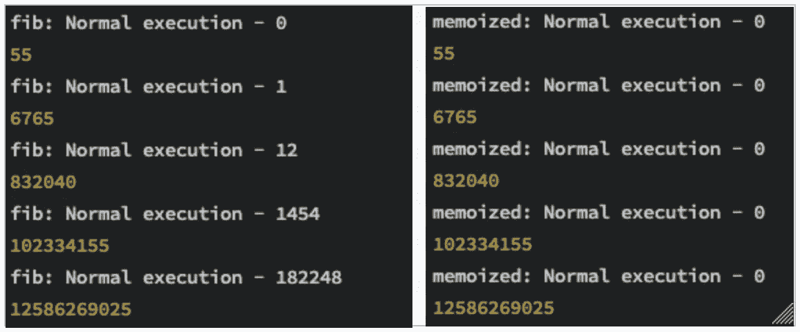
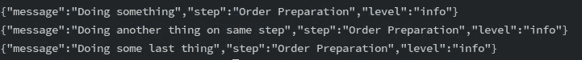

# 理解 Javascript 中的函数式编程—完全指南

> 原文：<https://levelup.gitconnected.com/understanding-functional-programming-in-javascript-a-complete-guide-e85ed13b42c8>


面向对象编程(OOP)被广泛认为是最流行的编程范式。许多开发人员熟悉诸如 Java 和 C++等 OOP 语言中的类和对象实例化等概念。其实不难找到能解释这些概念的开发者。

函数式编程比面向对象编程存在的时间要长得多。最好的例子是 LISP，它的第一个规范写于 1958 年。然而，与 OOP 不同的是，要找到能够理解诸如纯度、Currying 或函数组合等功能概念的开发人员并不容易。

Javascript 不是函数式编程语言，或者至少不是它的主要面向范例。这并不意味着我们不能通过使用 Lodash、下划线、RambdaJS 之类的库或者只使用普通的 Javascript 来以功能性的方式工作。

今年我有机会读了费德里科·克里基的《掌握 Javascript 函数式编程》。这是我个人推荐给任何想要深入理解函数式编程概念及其使用 Javascript 的应用的人的一本书。在这篇文章中，我将解释我从 Kereki 的书中学到的东西。我的意图不是重复书中的所有内容——如果你想这样，那就去读这本书吧！而是提供一个总结和要点。

> **注意**:本文面向中级/高级 Javascript 开发人员。

# 1.充当一级对象

做函数式编程的时候，函数是一级对象。这意味着您可以像使用变量或常量一样使用函数。您可以将函数与其他函数合并，并在此过程中生成新函数。你可以把函数连接起来进行复杂的计算。总的来说，功能就是一切！

在 Javascript 中，可以用几种方式定义函数。我发现总是使用箭头形式很方便——除非您想使用`this`状态。示例:

```
const add = (a, b) => a + b;
```

如果你是一个有经验的 JS 开发者，你很可能遇到过类似于`setTimeout`和`setInterval`使用的回调函数。这些是如何使用函数作为参数的完美例子。另一个例子:

```
var doSomething = function(status) {
// Doing something
};
```

```
var foo = function(data, func) { // Passing function as a parameter
    func(data);
}
```

```
foo("some data", doSomething);
```

# 2.纯函数的重要性

为了以函数的方式工作，使用函数并不是你唯一需要做的事情。你还需要保持你的函数**纯净**。但这意味着什么呢？根据费德里科·克里基的理论，当满足以下条件时，你就有了一个纯函数:

> -给定相同的参数，函数总是计算并返回相同的结果
> 
> -在计算其结果时，函数不会引起任何可观察到的副作用，包括输出到 I/O 设备、对象的突变、函数外程序状态的改变等等。

让我们看一个例子:

```
const getRectangleArea = (sideA, sideB) => sideA * sideB;
```

```
console.log(getRectangleArea(2, 3)); // 6
```

这个函数是纯函数，因为对于给定的参数“2”和“3”，它总是返回结果“6”。这个函数根本不影响它的外部环境。一切都发生在它的内部，它产生了一个新的结果，而没有改变(突变)它的论点。所以我们可以自信地说:**它没有副作用，因此功能是纯的。**

差不多就是这样。当你的功能没有副作用时，它就是纯粹的。如果它没有副作用，那么你的功能是纯粹的。简单对吗？*但是副作用到底是什么？*这里列出了你可能会发现的副作用:

*   使用全局变量(除非它们是常量)。
*   变异作为参数接收的对象。
*   像做任何类型的 I/O、使用、改变文件系统、更新数据库、调用外部 API 等操作。

最后但同样重要的是，使用一个不纯的函数。费德里科说不纯洁的功能是“传染的”。所以如果你的函数使用了会引起副作用的东西，你的函数就会变得不纯。

# 3.处理副作用

纯函数听起来不错，但是，除非您正在开发一个简单的计算器，否则您很可能需要使用异步操作，如访问数据库或调用外部 API。像灭霸一样，副作用是不可避免的。


那么，我们如何在以函数方式工作的同时设法使用不纯的函数呢？首先，您需要接受这样一个事实，即在您的日常工作中不可能实现 100%的纯函数式编程。然而，这也不应该是你的目标。正如费德里科在他的书中所说:

> 但是，不要陷入以 FP 为目标的陷阱！就像所有的软件工具一样，把 FP 仅仅看作是达到目的的一种手段。函数式代码不仅仅是因为函数性才是好的……用 FP 编写糟糕的代码就像用其他技术一样容易！

费德里科给它起了个名字:“类似函数式编程”。一般来说，我们的目标应该是将代码中不纯的部分从纯的部分中分离出来。这里你可以找到一个例子:

实例:[此处](https://repl.it/repls/InternationalCleanWebsphere)

这个节点脚本正在读取一个文本文件，计算其字数，并将结果发送到一个外部 API —嗯，不完全是“实际”的 API，但让我们假设它是真实的—只有一个纯函数(计算字数)，其余的都是不纯的。这样，我们可以将代码中不纯的部分与纯的部分分开。

过去的策略效果很好。然而，函数调用是以**命令式**形式(顺序指令)进行的。一个更实用的替代方法是**将不纯的函数注入到纯函数中。让我们看另一个例子来解释这一点。**

假设我们想要生成一个范围内的随机整数。使用 Mozilla 文档建议的解决方案，您可以做如下事情:

```
function getRandomInt(min, max) {
  return Math.floor(Math.random() * (max - min)) + min;
}
```

这个解决方案的问题是`Math.random`方法的不纯。所以为了将这个方法从`getRandomInt`函数中分离出来，我们可以这样做:

```
function getRandomInt(min, max, **random = Math.random**) {
  return Math.floor(**random**() * (max - min)) + min;
}
```

就是这样。我们已经解耦了我们的`getRandomInt`功能。注意我们是如何使用 ES6 默认参数的，这样我们就不必在每次调用时都传递`Math.random`引用。然而，我知道你在想什么…

> 你告诉我，如果一个纯函数使用了不纯的东西，这个也会变得不纯。

是的，你说得对。只要传递的函数是不纯的，这个函数就不会以纯的方式运行。然而，这在运行测试时给了我们很大的优势。让我们用 Jest 来看看这个例子:

使用 [Jest](https://jestjs.io/) 运行此程序

在上面的例子中，我们覆盖了默认函数，使用我们作为第三个参数传递的函数(一个只返回值的箭头函数)。通过这样做，我们使得随机函数 [**确定性**](https://en.wikipedia.org/wiki/Deterministic_system) ，因此**纯净，**这使得我们更容易做出测试断言。

# 4.使用高阶函数

如果您使用 JS 已经有一段时间了，那么您很可能会偶然发现 map、filter、reduce 等函数。这些是高阶函数的好例子。它们是以其他函数为参数的函数。它们既可以返回一个新函数，也可以基于传递给它的函数返回一个结果。

我将在下一部分描述贴图、过滤器和其他内置的 HOF。但是现在，我们将专注于创建我们自己的 HOF 实现。

## 测量时间

假设您想要记录一个函数完成所花费的时间。您的第一个想法可能是这样做:

```
const calculateRectangleArea = (sideA, sideB) => sideA * sideB;
```

```
(() => {
  const **startTime** = Date.now();
  const rectangleArea = calculateRectangleArea(2, 3);
  **const time = Date.now() - startTime;**
  console.log(`Function calculateRectangleArea took ${**time**} to complete`);
})();
```

这个解决方案很好，但是如果我们想测量其他函数的时间呢？我们需要再重复一遍这段代码吗？*没门！*所以让我们实现一个 HOF，它将任何函数作为参数，并生成一个记录执行时间的新函数。我们打算称它为`addTiming`。

活生生的例子:[这里](https://repl.it/@Andrew4d3/addTiming)

正如你在上面看到的，我们实现了一个有三个参数的 HOF，但是其中只有一个是强制的(第一个)。第二个是用来获取当前时间的函数，第三个是用来记录时间的函数。

该函数将首先获取当前时间，然后调用带有相应参数的目标函数——我们使用 spread 运算符获取——之后，它将执行并记录目标函数完成所需的时间。最后，它将返回相应的结果。还有一些错误处理，以防函数没有按预期结束。

## 记忆功能

记忆(或缓存结果)是 HOF 的另一个有趣的特性，但通常会被忽略。正如我们已经提到的，当使用**纯函数**时，我们可以确定对于任何给定的参数集，它将**总是**返回相同的特定结果。这意味着我们可以将这些结果保存在内存中，以便在以后的调用中使用。这种**记忆**技术在处理花费太多处理时间来完成的昂贵计算时尤其重要。

让我们以下面的斐波那契函数为例:

```
const fib = n => {
  if (n === 0) {
    return 0;
  } else if (n === 1) {
    return 1;
  } else {
    return fib(n - 2) + fib(n - 1);
  }
};
```

这个斐波那契函数使用递归，随着输入的增加，它的执行时间也会增加。我们可以使用我们最近创建的`addTiming`函数来验证:

```
addTiming(fib)(10); *// fib: Normal execution - 0* addTiming(fib)(20); *// fib: Normal execution - 1* addTiming(fib)(30); *// fib: Normal execution - 11* addTiming(fib)(40); *// fib: Normal execution - 1447* addTiming(fib)(50); *// fib: Normal execution - 181611*
```

上面显示的时间可能与你在电脑上看到的不同，但除非你有一台量子计算机——我打赌你没有——否则运行这个输入为 50 的斐波那契函数将需要很长时间才能完成。


等待斐波那契(50)函数完成就像…

那么我们该如何对此进行优化呢？当然是通过记忆。但是我们将使用 [Lodash](https://lodash.com/docs/4.17.15#memoize) 提供的 HOF，而不是实现我们自己的记忆解决方案——并重新发明轮子。

> 注意:如果你从未使用过 Lodash，你可以在这里查看它的文档[。](https://lodash.com/)

下面是完整的解决方案和一个实例:

实例:[此处](https://repl.it/@Andrew4d3/efficientFibonacci)

如你所见，我们使用`let`而不是`const`来定义斐波纳契函数。我们这样做是因为我们需要原始的函数引用被记忆化的调用覆盖。否则无法正常工作。

让我们并排比较两个执行输出。我用 [CodeSandbox.io](http://codesandbox.io) 运行了这些例子:



左:未改变的斐波那契输出。右图:记忆化的斐波那契输出

如您所见，对于每个输入，memoized 函数几乎不需要时间(不到 1 ms)就能完成。而未改变的功能需要 182，248 毫秒(超过 2 分钟)。这确实是一个非常显著的差异。

# 5.通过声明式工作来避免循环

正如我在上一部分提到的，Javascript 已经有了一系列内置的高阶函数(HOF)。这些函数大多用于处理数组或对象集合。

如果您正在阅读这篇文章，那么您可能已经是一名经验丰富的 JS 开发人员了。所以我不会花太多时间来详细解释它们每一个——那会非常无聊。

我将描述的功能有:

*   减少
*   地图
*   为每一个
*   过滤器
*   发现
*   每个和一些

> 注意:如果您已经知道所有这些方法是如何工作的，请跳到第 6 部分。

## 用 Reduce 方法计算结果

假设你有一个数组，你想计算它的平均值。实现这一点的最佳功能方法是使用内置的 HOF `reduce`。例如:

```
const getAverage = myArray =>
  myArray.**reduce**((sum, val, ind, arr) => {
    sum += val;
    return ind === arr.length - 1 ? sum / arr.length : sum;
  }, 0);
```

```
console.log("Average:", getAverage([22, 9, 60, 12, 4, 56])); 
// Average: 27.166666666666668
```

> `***reduce()***`方法对数组的每个元素执行一个 **reducer** 函数(您提供的),产生一个输出值。( [Mozilla 参考](https://developer.mozilla.org/en-US/docs/Web/JavaScript/Reference/Global_Objects/Array/Reduce))

所以在上面的例子中，我们实现了一个接收数字数组的函数。然后，我们继续对这个数组应用 reduce 方法，并传递(reduce)函数，该函数将对所有数组值求和。一旦到达最后一个，我们将使用数组长度返回除法(平均值)。

## 使用 Map 方法创建新数组

假设您有以下包含几个国家的纬度和经度的对象数组。

```
const markers = [
  { name: "UY", lat: -34.9, lon: -56.2 },
  { name: "AR", lat: -34.6, lon: -58.4 },
  { name: "BR", lat: -15.8, lon: -47.9 },
  { name: "BO", lat: -16.5, lon: -68.1 }
];
```

现在假设我们想要创建一个只有纬度值的数组。使用`map`方法很容易做到这一点，如下所示:

```
console.log("Lat values:", markers.**map**(x => x.lat));
// Lat values: [ -34.9, -34.6, -15.8, -16.5 ]
```

> `***map()***`方法**创建一个新的数组**,其中填充了调用数组中每个元素的函数的结果。( [Mozilla 参考](https://developer.mozilla.org/en-US/docs/Web/JavaScript/Reference/Global_Objects/Array/map))

在上面的例子中，提供的函数只返回纬度值。

## 使用 ForEach 方法循环

有时候，我们唯一想做的事情就是遍历一系列的值或对象。在这种情况下，我们可以使用`forEach`。例如，假设我们想要记录所有标记数组数据:

```
const logMarkersData = markers => {
  console.log("Data provided:");
```

```
markers.**forEach**(marker => console.log(`Country: ${marker.name} Latitude: ${marker.lat} Longitude: ${marker.lon}`));
};
```

```
logMarkersData(markers);
/*
Data provided:
Country: UY Latitude: -34.9 Longitude: -56.2
Country: AR Latitude: -34.6 Longitude: -58.4
Country: BR Latitude: -15.8 Longitude: -47.9
Country: BO Latitude: -16.5 Longitude: -68.1
*/
```

> `***forEach()***`方法为每个数组元素执行一次提供的函数。( [Mozilla 参考](https://developer.mozilla.org/en-US/docs/Web/JavaScript/Reference/Global_Objects/Array/forEach))

这个例子很容易理解。`forEach`方法将遍历每个元素并记录访问的数据。

## 用 Filter 方法过滤数组元素

让我们继续使用我们之前使用的标记数组。假设我们要过滤首字母为“B”的国家的数据。`filter`方法可以帮到你:

```
console.log(
  "Data of countries starting with B:",
  markers.**filter**(mark => mark.name.charAt(0) === "B")
);
```

```
/*
Data of countries starting with B: [ { name: 'BR', lat: -15.8, lon: -47.9 }, { name: 'BO', lat: -16.5, lon: -68.1 } ]
*/
```

> `***filter()***`方法**创建一个新的数组**，其中所有通过测试的元素都由提供的函数实现。( [Mozilla 参考](https://developer.mozilla.org/en-US/docs/Web/JavaScript/Reference/Global_Objects/Array/filter))

## 使用 Find 和 FindIndex 方法查找特定元素

现在情况更具体了。我们只需要巴西的数据。所以我们使用`find`方法:

```
console.log("Brazil Data:", markers.**find**(m => m.name === "BR"));
```

```
// Brazil Data: { name: 'BR', lat: -15.8, lon: -47.9 }
```

> `***find()***`方法返回所提供数组中满足所提供测试函数的**第一个元素**的**值**。( [Mozilla 参考](https://developer.mozilla.org/en-US/docs/Web/JavaScript/Reference/Global_Objects/Array/find))

但是如果你只想知道指数呢？我们将使用`findIndex`方法来代替。

```
console.log("Brazil Data Index:", markers.**findIndex**(m => m.name === "BR"));
```

```
// Brazil Data Index: 2
```

> `***findIndex()***`方法返回满足提供的测试函数的数组**中第一个元素的**索引**。否则，它返回-1，表示没有元素通过测试。( [Mozilla 参考](https://developer.mozilla.org/en-US/docs/Web/JavaScript/Reference/Global_Objects/Array/findIndex))**

## 用 Every 和 Some 方法链接逻辑运算


你还记得迷路吗？

我最近遇到了这两种方法。当您需要确定数组中的所有元素是否满足特定逻辑时，它们尤其有用。这相当于按顺序使用 AND/OR 运算符。所以与其做这样的事情:

```
if (arr[0] > 0 && arr[1] > 0 ..... arr[n] > 0) {...}
```

你可以这样做:

```
if (arr.every(item => item > 0)) {...}
```

这同样适用于 OR 运算符，但这次使用的是`some`方法。

让我们通过一个例子来看看这一点。假设我们有一个数字序列(例如:4、8、15、16、23 和 42 ),我们想确定是否至少有一个**甚至**数字。对于这种情况，我们需要使用`some`方法:

```
const lostNumbers = [4, 8, 15, 16, 23, 42];
```

```
console.log(
  "Does it contain even numbers?",
  lostNumbers.**some**(n => n % 2 === 0)
);
```

```
// Does it contain even numbers? true
```

> `***some()***`方法测试数组中是否至少有一个元素通过了由提供的函数实现的测试。它返回一个布尔值。

另一方面，如果我们想确定所有的数组编号是否都是偶数，我们需要像这样使用`every`方法:

```
console.log("Are all even numbers?", lostNumbers.**every**(n => n % 2 === 0));
```

```
// Are all even numbers? false
```

> `***every()***`方法测试数组中的所有元素是否都通过了由提供的函数实现的测试。它返回一个布尔值。

# 6.使用函数组合来组合函数

理想情况下，我们的函数应该很小。他们应该能够只做一件事，并且做好。那么，我们如何将所有这些“小”功能结合起来共同工作呢？实现这一点的一种方法是通过**函数组合**。这听起来像是一个*奇特的数学概念*，不知何故——的确如此。然而，这并没有那么难理解。它包括**使一个函数的结果成为下一个函数的参数**。

函数组合有两种风格:**流水线和组合**。他们非常相似，但是不同。一个从左向右工作，而另一个从相反的方向工作。


简单地说，流水线和合成

## 管道铺设

> 注意:在 Federico Kereki 的书中，他讲述了如何从头开始实现一个“管道”函数。但是这里我们将使用由 **Lodash** 提供的解决方案。

对于 Lodash，我们有两种选择。第一个是通过使用标准 API 中的方法`flow`，第二个是通过使用 FP API 中的方法`pipe`。让我们从两个方面来探讨一个例子。

假设我们需要连接到仍然使用 XML 作为数据格式的遗留 web 服务(SOAP WS 或类似的服务)。这个 WS 正在提供一些书籍信息，如下所示:

图书 WS 响应示例

我们的任务如下。接受上面的回答，然后:

*   按价格(升序)和…
*   以 JSON 格式打印信息(使用`console.log`)

原来(在 JS 中)处理 XML 格式的数据完全是 a** 中的*痛。幸运的是，有几个库可以用来将 XML 转换成方便的 JS 对象。在这个例子中，我们将使用其中一个叫做 [xml-js](https://www.npmjs.com/package/xml-js) 的。*

首先，让我们从“web 服务”中获取数据。不幸的是，我们手头没有。所以让我们假装一下:

```
*// Let's pretend this is a Webservice call* const getingWsData = () =>
   Promise.resolve(fs.readFileSync(`${__dirname}/books.xml`, "utf8"));
```

接下来，让我们从 XML 响应中提取所需的信息。我们将使用一个名为`get`的实用 Lodash 函数，通过提供一个对象路径、`map`方法(我们在上一部分已经描述过)和解析初始 XML 文本的`xml2js`库方法来轻松获取值。

```
const transformToJsObject = xmlData =>
  _(**xmlJs**.**xml2js**(xmlData, { compact: true })) *// Transforming to JS*
    .**get**("Library.Book") *// Getting Books reference*
    .**map**(book => ({ *// Interating books array to generate new one*
      author: book.Author._text,
      title: book.Title._text,
      year: Number(book.Year._text),
      price: Number(book.Price._text)
    }));
```

> 注意:我不包括对 XML 数据的任何验证。所以让我们假设它是格式良好的，年份和价格值都是数字。但是对于生产应用程序，您可能需要仔细检查这一点。

最后，我们按价格金额排序。这里，我们可以使用内置的`sort`方法(参考[这里](https://developer.mozilla.org/es/docs/Web/JavaScript/Referencia/Objetos_globales/Array/sort))。但是它改变了目标数组，使得我们的函数**不纯**。所以我们最好使用洛达什当量`sortBy`如下:

```
const sortByPrice = booksArray => _.**sortBy**(booksArray, "price");
```

我们已经定义了完成指定任务所需的所有功能。但是我们如何将它们联系在一起呢？你的第一个猜测可能是用众所周知的祈使句:

```
let **booksArray** = transformToJsObject(xmlData);
**booksArray** = sortByPrice(booksArray);
const **jsonData** = JSON.stringify(booksArray);
console.log(**jsonData**);
```

它工作得很好，但是需要太多的线路！此外，注意我们需要使用多少中间变量/常数。您可能会有这样的想法，通过在一行中做一些事情来简化所有事情，就像这样:

```
console.log(JSON.stringify(sortByPrice(transformToJsObject(xmlData))));
```

但是现在一切都变成了*不可读的括号地狱*。所以让我们应用流水线技术。首先用标准 Lodash `flow`方法:

```
_.**flow**(
   transformToJsObject,
   sortByPrice,
   JSON.stringify,
   console.log
)(xmlData);
```

现在有了 FP Lodash `pipe`:

```
fp.**pipe**(
   transformToJsObject,
   sortByPrice,
   JSON.stringify,
   console.log
)(xmlData);
```

如你所见，两个高阶函数几乎完全相同。两者都以相同的顺序接收参数，即从左到右，最左边的函数将是最先被调用的函数。下面是完整的示例:

实例:[此处](https://repl.it/@Andrew4d3/PipeliningExample)

## 组成

正如我之前提到的，作曲的工作方式与流水线非常相似。所以让我们看一下同一个例子，但是这次使用了`compose`和`flowRight`。

实例:[此处](https://repl.it/@Andrew4d3/composingExample)

如您所见，`flowRight`和`compose`方法的工作方式与`flow`和`pipe`相似。唯一的区别是参数的顺序现在颠倒了(从右到左)。但是输出结果和之前一模一样。

看到这里，你可能会想:**我该用哪个？**而答案是*你更喜欢的那个！*就我个人而言，我更倾向于使用流水线技术，因为我们通常从左到右阅读，所以对我来说朝那个方向走更自然。但是其他人可能更喜欢使用组合，因为初始参数更接近接收它的函数。只要你明白自己在做什么，无论你使用哪种方法都没问题。

# 7.Currying 的可重用性

在上一部分中，我们看到了如何使用函数组合将函数组合在一起工作。现在让我问你一个关于它的问题:

> 你注意到这些功能的一个特殊特征了吗？

我说的是管道和合成器中使用的函数。你注意到他们了吗？原来他们总是有一个单一的论点。因为前面的函数只能有一个返回值。因此，为了让我们的函数与管道或合成器一起工作，默认情况下，它们需要是**一元**(一个参数)。Currying 是将非一元函数转换成一元形式的简单方法。


只是澄清一下，我说的不是这种咖喱…

让我们通过一个例子来看看这一点。在这里，您可以看到一个将三个数字相加的函数，这并不新鲜:

```
const sum = (a, b, c) => a + b + c;
```

这个函数的**版本应该是这样的:**

```
const sum = (a) => (b) => (c) => a + b + c;
```

现在我们有一个函数返回一个函数，这个函数返回另一个函数。为了将这种简化版称为“sum ”,您可以这样做:

```
sum(1)(2)(3); // *Result is 6*
```

我知道你在想什么… *我们到底从中得到了什么？*答案很简单:**如果函数的初始参数在多次调用中没有变化，你可以创建函数的定制版本**。例如，假设您有一个计算给定百分比的折扣的函数。它看起来像这样:

```
comesconst calculateDiscount = (discount, price) => price - (price * discount) / 100;
```

```
console.log(calculateDiscount(10, 2000)); // 1800
```

现在，让我们设想一种情况，我们需要对不同的产品(不同的价格)应用相同的折扣。这意味着多次重复相同的第一个参数:

```
console.log(calculateDiscount(10, 2000)); // 1800
```

```
console.log(calculateDiscount(10, 500)); // 450
```

```
console.log(calculateDiscount(10, 750)); // 675
```

```
console.log(calculateDiscount(10, 900)); // 810
```

也许多次重复一个参数没什么大不了的，但是想象一下重复参数的数量更多(2、4、5 等)的情况，让我们对这个`calculateDiscount`函数应用 currying。为此，我们将使用 Lodash 的`curry`方法:

实例:[此处](https://repl.it/@Andrew4d3/curryExample)

正如你在上面看到的，我们将 currying 应用于`calculateDiscount`函数，同时，我们将第一个参数(折扣百分比)传递给结果函数。现在我们有了一个新函数，它的唯一目的是计算任何给定价格的 10%折扣。

当然，这不是唯一可以使用 currying 的实际情况。想想您必须为一个事件创建多个侦听器的情况。您可以对负责添加侦听器的函数应用 curry，并在需要时使用该(curry)函数。像这样的，还有很多其他的例子。

# 8.部分应用的可重用性

当我们的常量参数按顺序排列时，curry 是有用的。但有时情况并非如此，我们必须处理固定参数不遵循任何特定顺序的情况。这就是**局部应用**技术派上用场的地方。

让我们检查一个新的例子，看看这是如何工作的。假设您有一个简单的 Winston logger 实例，如下所示:

```
const logger = **winston**.createLogger({
  transports: [new winston.transports.Console()]
});
```

> 注意:Winson 是一个很容易管理 NodeJS 日志的库。如果你想了解更多，可以查看它的 github 回购[这里](https://github.com/winstonjs/winston)。

现在让我们假设我们正在开发一个有多个步骤的系统——就像一个流水线。我们希望记录与特定步骤相对应的消息，可能是因为我们希望为我们的系统提供一些“可跟踪性”。比如:`step: "Order Preparation", message: "Assigning Carrier to order XXX"`。让我们定义一个这样的函数:

```
const logMessage = (level, message, step, loggerFn = **logger**) =>
  loggerFn[level]({ message, step });
```

正如你所看到的，我们正在将 logger 实例注入到`logMessage`函数中。现在，我们可以像这样调用这个函数来开始记录消息:

```
logMessage("info", "Assigning Carrier to order XXX", "Order Preparation")
```

这种方法的问题是，如果我们必须在相同的步骤和相同的(info)级别记录多个消息，我们将需要多次重复相同的两个参数`"info"`和`"Order Preparation"`。因此，让我们应用部分应用(使用 Lodash)来修复这两个参数。

```
const loggerStepInfo = _.partial(logMessage, "info", _, "Order Preparation");
```

Lodash 使用`_`来表示一个“占位符”参数，它(在本例中)是唯一可改变的参数。但是，如果需要的话，我们可以设置多个占位符参数。这是涂抹和部分涂抹的主要区别之一。**结果函数不必是一元的。**

现在让我们用一些示例调用来测试我们的结果函数:

```
loggerStepInfo("Doing something");
loggerStepInfo("Doing another thing on same step");
loggerStepInfo("Doing some last thing");
```

输出应该是这样的:



这里是完整的代码及其实例:

活生生的例子:[这里](https://repl.it/@Andrew4d3/partialExample)

# 结论

使用函数式编程并不是万能的。如果你的代码是用函数式风格编写的，它不会变得更好。所以你可以决定是否使用你在这里或其他地方看到的任何 FP 技巧。

依我拙见，当涉及到设计和实现不需要访问外部资源(文件、数据库、API)的复杂算法或执行复杂计算时，我喜欢用函数式和声明式的方式。因为我可以很容易地对一切进行单元测试和解耦。但是如果我必须集中处理外部资源，我会选择众所周知的命令式。*再说一遍，这只是我！你可能会有不同的想法！*

我认为这里的关键因素，是将你的项目中不纯的部分与纯的部分分开。这样当你觉得方便的时候，你就可以轻松地解耦你的代码并应用 FP 技术。

在这篇文章中，我没有提到其他与 FP 相关的概念，比如递归优化、单子、函子等等。我发现它们很难理解，而且几乎没有实际用例，所以我决定跳过它们。如果你仍然对它们感到好奇，我会建议你(再次)阅读费德里科·凯瑞基的书 [**掌握 JavaScript 函数式编程**](https://www.amazon.com/Mastering-JavaScript-Functional-Programming-depth/dp/1787287440/ref=sr_1_2?crid=2F1F6HDZXSFQM&keywords=federico+kereki&qid=1578446774&sprefix=federico+kere%2Caps%2C302&sr=8-2) **。**

*编码快乐！*