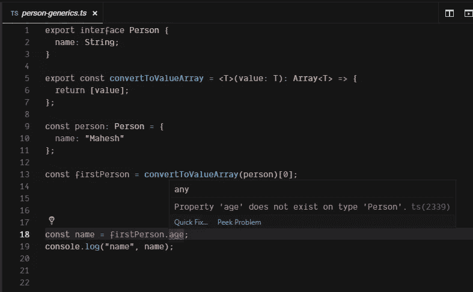

# 理解 TypeScript 中的泛型

> 原文：<https://levelup.gitconnected.com/understanding-generics-in-typescript-5c0828e2cfd5>


TypeScript 是“JS 的超集”，由于类型检查的强大功能，它使构建可维护、可理解和可伸缩的应用程序变得更加容易。

泛型在 TypeScript 中扮演着重要的角色，因为它允许我们编写可重用的代码，接受值和类型作为参数。

# 函数中的泛型

泛型帮助我们提高代码的可重用性。让我们借助下面的例子来理解什么是泛型以及我们为什么需要它们:

请注意，在上面的代码片段中，我们有三个函数做着几乎相同的事情。这是重复的代码，并呼吁使其可重用。

我们可以做的一件事是放入一个类型的`any`,这样 String、Number 和 Person 类型的值可以在同一个函数中用作参数。不幸的是，这带来的问题比解决的问题还多。

使用泛型解决“可重用性问题”——一个例子:

`converToValueArray`函数接收所选类型`<T>`的值，并返回该类型的数组:`Array<T>`。例如，如果值是字符串类型，那么返回类型是`Array<String>`

让我们看看当我们定义泛型类型时，TypeScript 是如何显示错误的。



请注意，在第 18 行，在使用了泛型之后，如果我们想要访问 age，它会显示正确的错误，这是我们想要得到的关于任何类型错误的早期反馈。

# 推断类型

让我们定义一个接受泛型类型的函数。

```
function convertToArray<T>(args: T): Array<T> {
  return [args];
}
```

我们可以用两种方式调用这个函数

```
convertToArray("someString");convertToArray<String>("someString");
```

正如我们所看到的，如果类型没有在`<>`中传递，那么类型将被自动推断出来。类型推断使代码更短，但是在复杂的定义中，我们可能需要显式地传递类型。

# 不止一个泛型类型

就像函数参数一样，我们可以传递不止一种类型，这与函数参数的数量无关。例如

```
function doStuff<T, U>(name: T): T {
  // ...some process
  return name;
}
```

上述函数可以按如下方式调用:

```
doStuff<String, Number>("someString");
```

# 通用类

很多时候，我们需要创建一个泛型类，例如基本抽象类。在这里我们可以在创建类的实例时传递类型。

正如我们所看到的，在第 6 行中，我们创建了一个基本的本地数据库类，我们可以用它为一个特定的表创建一个实例，并对数据库实例执行操作。让我们编写一个 contact 类来扩展这个基类，这样它就可以从 parent 继承一些属性。

*   第 14 行，当我们扩展泛型类时，我们必须传递两种类型，在这个数据库中。在我们的例子中是 ContactTable 和 ContactModel。
*   第 17 行:`ContactLocalDatabase`将从父类中获取函数，并且必须覆盖`getFormattedData`，因为这在父基类中被定义为抽象函数。
*   第 17 行:这是一个具有泛型类型的函数，我们在第一部分已经讨论过了。

让我们创建一个 ContactLocalDataBase 实例来看看类泛型的运行情况。

*   第 1 行:因为我们已经在使用`new`关键字时定义了 ContactLocalDatabase 类的类型，所以不需要将类型传递给基类。
*   第 3、11、13 行:我们可以注意到这些函数来自抽象类。这些行为符合一般的类定义。

# 通用约束

到目前为止，很清楚泛型是一种编写代码的方式，这样我们的代码可以支持多种类型，并且类型可以作为参数传递。

有了这些知识，传递的类型可以是任何预定义类型或复杂的用户定义类型。

有时，如果我们想从泛型类型变量中访问任何函数，它会抛出一个错误。


*   第 6 行:这是一个完全有效的错误，因为数据有一个通用类型，它可以是字符串、数字、浮点或任何其他类型，传递的数据可以有也可以没有长度。

因此，我们可以向任何泛型添加一些约束，ts 将确保只有那些值可以传递给满足约束的函数或类。让我们给通用函数定义添加一些约束。


*   第 4 行:我们扩展了类型`T`,使其具有长度属性
*   第 5 行:错误消失，这表示类型“T”上不存在属性长度
*   第 10 行:当我们用一个数字调用函数时，它抛出一个错误，解释它不满足约束
*   第 12 行和第 13 行:当我们传递有效数据如字符串或数组时，TS 不会抛出错误。

这就是这篇文章的全部内容，我希望你已经了解了泛型的基础知识和它所产生的价值。

如果你不了解泛型的基础，它看起来非常复杂。

我希望你的时间值得阅读这篇文章。