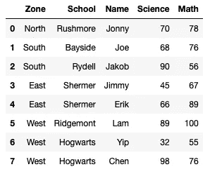
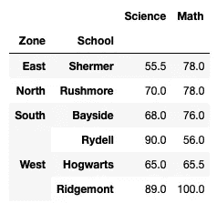
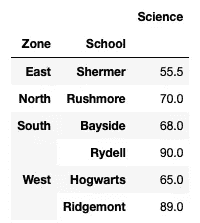
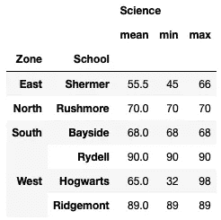
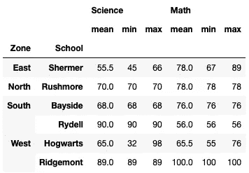
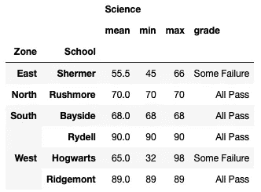

# 理解 Pandas 数据框架中的 Groupby()函数—第 1 部分

> 原文：<https://levelup.gitconnected.com/understanding-groupby-function-in-pandas-dataframe-part-1-23cc762b3174>


卡洛斯·穆扎在 [Unsplash](https://unsplash.com?utm_source=medium&utm_medium=referral) 上的照片

`**groupby()**` 函数是在 Pandas 中处理大型数据帧时最有用的函数之一。groupby 操作通常包括拆分对象、应用函数和组合结果的组合。

然而，如果你是第一次使用`**groupby()**`功能，事情一开始会有点吓人。因此，本文的目的是对这个简单却极其强大的函数做一个简单的介绍。

通常，最好的学习方法是通过例子，很多例子。所以让我们开始吧！

# 加载示例数据帧

让我们用下面的代码片段加载一个数据帧:

```
import pandas as pdscores = {'Zone': ['North','South','South',
                   'East','East','West','West','West'], 
          'School': ['Rushmore','Bayside','Rydell',
                     'Shermer','Shermer','Ridgemont','Hogwarts','Hogwarts'],             
          'Name': ['Jonny','Joe','Jakob', 
                   'Jimmy','Erik','Lam','Yip','Chen'], 
          'Math': [78,76,56,67,89,100,55,76],
          'Science': [70,68,90,45,66,89,32,98]}df = pd.DataFrame(scores, columns = 
                  ['Zone', 'School', 'Name', 
                   'Science', 'Math'])
df
```

数据帧(`**df**`)如下所示:



# 使用字符串(列名)调用 groupby()

让我们按`**Zone**`对数据帧进行分组:

```
gp = df.groupby(**'Zone'**)      # pass in a string to groupby()
for zone, group in gp:
    print(zone)
    print(group)             # group is a dataframe
```

它应该打印出以下输出:

```
East
   Zone   School   Name  Science  Math
3  East  Shermer  Jimmy       45    67
4  East  Shermer   Erik       66    89
North
    Zone    School   Name  Science  Math
0  North  Rushmore  Jonny       70    78
South
    Zone   School   Name  Science  Math
1  South  Bayside    Joe       68    76
2  South   Rydell  Jakob       90    56
West
   Zone     School  Name  Science  Math
5  West  Ridgemont   Lam       89   100
6  West   Hogwarts   Yip       32    55
7  West   Hogwarts  Chen       98    76
```

正如您从输出中看到的，您正在按`**Zone**`对数据帧进行分组。本例中的`**groupby()**`函数返回一个`**DataFrameGroupBy**`对象。要打印出每个区域及其相关的分组，可以使用 *for-in* 循环来遍历`**DataFrameGroupBy**`对象。在这种情况下,`**zone**`变量将采用每个区域的值，而`**group**`变量将包含与每个区域相关的行(包含在一个数据帧中)。要打印出每个学生的`**Name**`以及他/她的`**Science**`和`**Math**`分数，您可以选择**组**数据框中相应的列:

```
gp = df.groupby('Zone')
for zone, group in gp:
    print(zone)
    print(group[**['Name','Science','Math']**])
```

上述修改后的语句输出如下:

```
East
    Name  Science  Math
3  Jimmy       45    67
4   Erik       66    89
North
    Name  Science  Math
0  Jonny       70    78
South
    Name  Science  Math
1    Joe       68    76
2  Jakob       90    56
West
   Name  Science  Math
5   Lam       89   100
6   Yip       32    55
7  Chen       98    76
```

# 用字符串列表(列名)调用`groupby()`

假设您现在想按`**Zone**`和`**School**`分组，那么现在您用一个字符串列表(包含列名)调用`**groupby()**`函数:

```
gp = df.groupby(**['Zone','School']**)        # pass a list to groupby()
for zone_school, group in gp:
    print(zone_school)
    print(group[['Name','Science','Math']])
```

上面的代码片段将打印以下内容:

```
('East', 'Shermer')
    Name  Science  Math
3  Jimmy       45    67
4   Erik       66    89
('North', 'Rushmore')
    Name  Science  Math
0  Jonny       70    78
('South', 'Bayside')
  Name  Science  Math
1  Joe       68    76
('South', 'Rydell')
    Name  Science  Math
2  Jakob       90    56
('West', 'Hogwarts')
   Name  Science  Math
6   Yip       32    55
7  Chen       98    76
('West', 'Ridgemont')
  Name  Science  Math
5  Lam       89   100
```

`**zone_school**`变量现在是一个包含`**Zone**`和`**School**`的元组。

# 用序列(数据帧中的列)调用 groupby()

假设你只对有`**Math**`成绩和`**School**`的学生的`**Name**`感兴趣。您现在可以首先按列过滤数据帧，然后调用`**groupby()**`函数按**区域**对数据帧进行分组:

```
gp = df**[['Name','Math','School']]**.groupby(**df['Zone']**) # pass in a 
                                                      # Series to 
                                                      # groupby() 
                                                      # function
for zone, group in gp:
    print(zone)
    print(group)
```

注意，在这种情况下，您必须将`**groupby()**`函数传递给一个`**Series**`对象，，因为语句`**df[['Name','Math','School']]**`已经将 dataframe 减少到只有`**Name**`、`**Math,**`和`**School**`列。以下语句无效:

```
**# Error**
gp = df[['Name','Math','School']].groupby(**'Zone'**) **# KeyError: 'Zone'**
```

前面的代码片段将返回以下内容:

```
East
    Name  Math   School
3  Jimmy    67  Shermer
4   Erik    89  Shermer
North
    Name  Math    School
0  Jonny    78  Rushmore
South
    Name  Math   School
1    Joe    76  Bayside
2  Jakob    56   Rydell
West
   Name  Math     School
5   Lam   100  Ridgemont
6   Yip    55   Hogwarts
7  Chen    76   Hogwarts
```

# DataFrameGroupBy 和 SeriesGroupBy 对象

观察前面的陈述:

```
gp = df[['Name','Math','School']].groupby(**df['Zone']**)
```

在上面的例子中，`**gp**`是一个`**DataFrameGroupBy**`对象。但是，在下面的语句中:

```
gp = df['Name'].groupby(df['Zone'])
```

`**gp**`是一个`**SeriesGroupBy**`对象，因为`**df[‘Name’]**`的结果是一个`**Series**`

# 提高 groupby()的性能

注意到`**groupby()**`功能自动对组键进行分类。如果数据帧很大，最好关闭排序以提高性能:

```
gp = df[['Name','Math','School']].groupby(df['Zone']**, sort=False**)
for zone, group in gp:
    print(zone)
    print(group)
```

现在不会对组密钥进行排序:

```
North
    Name  Math    School
0  Jonny    78  Rushmore
South
    Name  Math   School
1    Joe    76  Bayside
2  Jakob    56   Rydell
East
    Name  Math   School
3  Jimmy    67  Shermer
4   Erik    89  Shermer
West
   Name  Math     School
5   Lam   100  Ridgemont
6   Yip    55   Hogwarts
7  Chen    76   Hogwarts
```

# 执行聚合函数

dataframe 的一个常见任务是对列执行聚合函数。例如，假设您想找到每个学校的平均分数`**Science**`和`**Math**`。您可以执行以下操作:

```
df.groupby(['Zone','School'])**.mean()**
```

上述语句产生以下结果:



当您在 **DataframeGroupBy** 对象上调用 **mean()** 函数时，它会自动计算所有数值列的平均值(在本例中是**科学**和**数学**)。

如果只想计算**理科**列的均值，可以对 **groupby()** 函数的结果调用 **agg()** 函数，如下所示:

```
df.groupby(['Zone','School'])**.agg({'Science':'mean'})**
```



如果您想计算`**Science**`列的*平均值*、*最小值*和*最大值*值，那么传入一个包含聚合函数的列表:

```
df.groupby(['Zone','School']).agg({'Science':**['mean','min','max']**})
```



当然，您也可以在 **Math** 列上应用聚合函数:

```
df.groupby(['Zone','School']).agg({'Science':['mean','min','max']**,**
                                   **'Math'   :['mean','min','max']**})
```



# 创建自定义聚合函数

除了 Pandas 中可用的聚合函数(如`**mean()**`、`**min()**`和`**max()**`)，您还可以编写自己的自定义聚合函数。假设您想要查看所有学校的`**Science**`分数，并生成一个列来指示该学校的所有学生是否都通过了该科目。你可以定义一个函数，比如说`**grade()**`:

```
def grade(score):
    if (score >= 50).all():
        return 'All Pass'
    else:
        return 'Some Failure'
```

注意，当从`**agg()**`函数调用一个函数时，参数是一个`**Series**`对象。所以在上面的例子中`**score**`是一个`**Series**`对象。在这里，我正在检查`**Series**`对象中的所有值是否都大于或等于 50(使用`**.all()**`函数)。如果是，那么我返回“全部通过”字符串。否则，将返回“某些失败”字符串。

您现在可以像这样调用`**grade**`函数:

```
df.groupby(['Zone','School']).agg({'Science':['mean','min','max',**grade**]})
```

结果会是这样的:



# 摘要

我希望这个对`**groupby()**`函数的快速介绍是有用的，并有助于减轻你对这个极其强大的函数的恐惧。就像我说的，最好的学习方法是自己去尝试。不要害怕犯错误。你尝试得越多，你就越明白！下次见！

[](https://weimenglee.medium.com/membership) [## 加入媒介与我的介绍链接-李伟孟

### 作为一个媒体会员，你的会员费的一部分会给你阅读的作家，你可以完全接触到每一个故事…

weimenglee.medium.com](https://weimenglee.medium.com/membership)