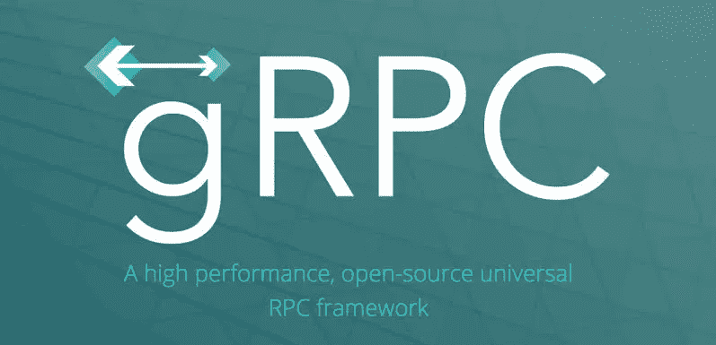
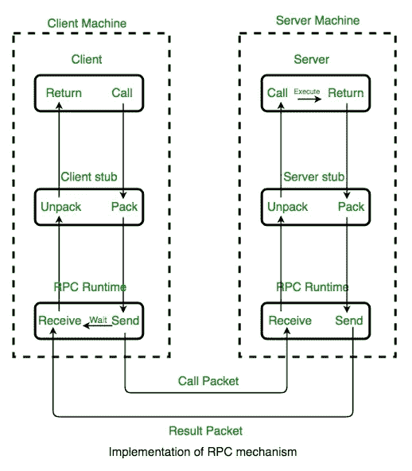
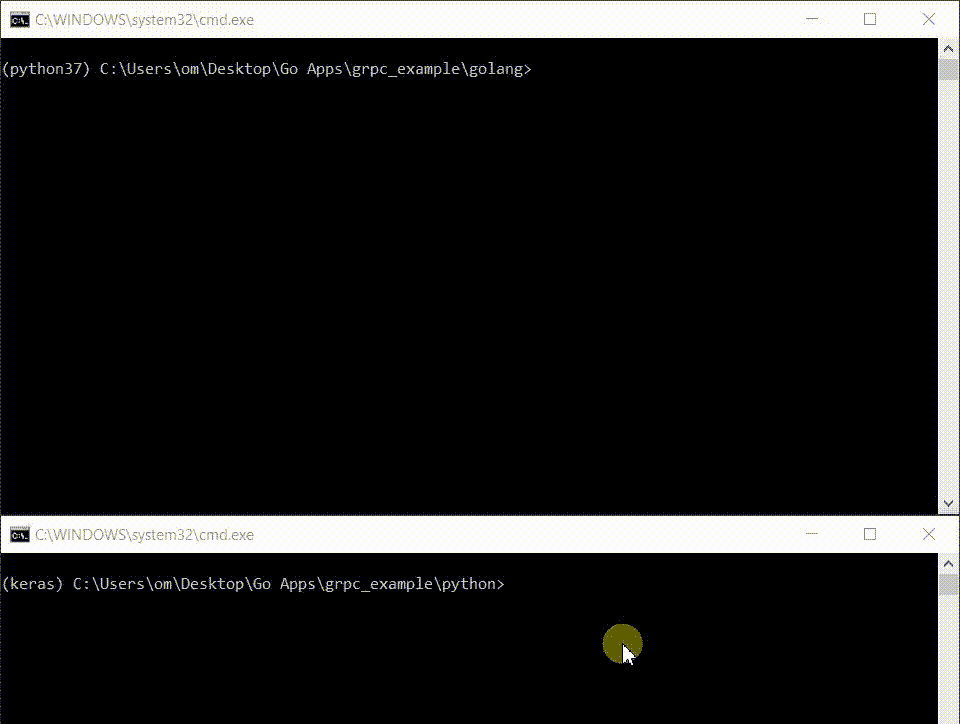

# 理解 gRPC 并在 Go 和 Python 中实现一个实际应用

> 原文：<https://levelup.gitconnected.com/understanding-grpc-a-practical-application-in-go-and-python-f3003c9158ef>



如果你从未听说过 gRPC，并且想知道它是什么，这篇文章就是为你准备的。您将了解到一个强大的新工具，可以用来开发分布式应用程序。

gRPC 是一个复杂的主题，我的目的是提供一个温和的介绍，并提供概念背后的直觉。我们将首先回顾基础知识，然后回顾 gRPC 的概念。最后我们会看到一个 Golang 和 Python 的实际例子。

在深入 gRPC 之前，让我们回顾一下什么是 RPC。如果您已经熟悉它，您可以放心地跳到 gRPC。让我们开始吧。

## RPC 是什么？

如果您关注了分布式系统课程，您就会知道什么是 RPC。但是对于那些没有参加那些讲座的人来说，RPC 代表*‘远程过程调用’。*

RPC 是一个古老的概念。自 70 年代和 80 年代以来，这种技术一直被用于开发分布式系统。RPC 的定义如下:

> 远程过程调用是一种协议，一个程序可以用它向网络上另一台计算机中的程序请求服务[…]

我们来分解一下。它是一个协议，这意味着它可以在不同的环境中以多种方式实现。您将发现 RPC 在 C++中的实现和 Java 中的不同实现。

根据定义，我们理解 RPC 意味着一个系统(客户机)正在从另一个系统(服务器)请求一些服务。但是这个定义并没有真正解释为什么它被称为*远程过程调用。*

在任何编程语言中，你都有函数的概念。在技术术语中，这被称为*程序。简单地说，你在程序中编写的任何函数都是一个*过程*，任何时候你调用这个函数，你都是在做一个*过程调用*。所以另一种看待 RPC 的方式是一个系统在另一个(远程)系统上调用一个*过程*(或函数)。*

每当您调用本地过程或调用函数时，以下事情会按顺序发生:

*   进程的当前状态被推送到堆栈上，以便以后可以恢复。
*   收集传递给函数的参数，流程执行跳转到定义函数的地方。
*   使用传递的参数执行函数，并收集结果。
*   然后我们带着结果回到之前的执行状态。

把一个函数想象成一个黑盒。传递一些输入值，然后得到输出值。你并不关心为得到那个结果所采取的所有步骤。例如:

```
int a = add(10, 14);
```

在 RPC 中，事情是非常相似的。你传递输入值，然后在程序中得到输出值。你给黑盒`10`和`14`，它会在你的结果变量`a`中给你`24`。

RPC 的神奇之处在于，当您调用该函数时，数字的实际加法或函数的执行并不发生在您的机器上。事情是这样的:

*   进程的当前状态被推送到堆栈上，以便以后可以恢复。
*   收集传递的参数值，并构造一个包含函数名和参数值的消息包。
*   这个信息包被发送到一个远程系统。远程系统打开这个消息，查看函数名和参数。然后，远程系统使用传递的值执行该函数。
*   远程系统构建包含函数结果的消息。它被送回我们的系统。
*   我们的系统解包消息并得到结果。程序中先前的执行状态被恢复，我们得到了函数调用的结果。



所有这些东西实际上都是为程序员抽象的。程序员关心的只是调用函数并得到结果。

现在，在整个系统运行之前，有许多细节需要处理。但是现在，如果您能够理解在远程计算机上调用函数并在程序中获得结果的概念，那么我们就可以开始了！

## gRPC 是什么？

RPC 是一种协议。gRPC 是 RPC 协议的一种实现。从前面的小节中，您可以对 RPC 协议进行一些观察:

*   客户端和服务器之间需要就功能和参数定义达成一致。
*   只要定义一致，客户机和服务器系统上的程序不必用同一种语言编写。
*   我们需要某种方式通过网络在两个系统之间传递消息。

让我们看看 gRPC 是如何处理每一点的。

任何 RPC 系统都必须有一致的函数和参数定义。否则，客户端会要求执行`add`函数，如果服务器没有任何名为`add`的函数，整个过程就会中断。

gRPC 通过维护一个通用的配置文件来解决跨系统保持一致性的问题。服务器和客户机是使用这个公共配置(或者说定义文件)创建的，它定义了 RPC 函数、参数和返回值。

下一点是客户机或服务器不需要用同一种语言编写。为了实现这一点，我们需要一种与语言无关的方式来定义配置文件，以便它在任何语言中都被解释为相同的。因此，gRPC 提出了他们自己的定义语言，称为[协议缓冲区](https://developers.google.com/protocol-buffers/)，作为描述功能和参数的接口定义语言(IDL)。

在日常的 web 系统中，每当服务器和客户机想要交互时，它们就使用 JSON 格式的消息。任何语言的客户机和服务器都可以解释这些 JSON 消息。但是 JSON 对于计算机来说解析起来不是很有效，尽管它更容易被人理解。计算机解析二进制比高级消息格式快得多。所以为了解决上面提到的第三点，gRPC 使用了一种新的二进制消息格式，称为 [protobuf](https://developers.google.com/protocol-buffers/) (是的，协议缓冲区和 protobuf 是一回事)。其优势在于 protobuf 是两个系统之间非常有效的通信方式。您可以在提供的链接中了解更多关于 protobufs 的信息，并了解为什么它比 JSON 更好。

好了，理论到此为止！让我们来看一个示例实现。

## Python 和 Go 中的示例

正如我们所见，gRPC 是独立于语言的。您可以让客户机使用一种语言，让服务器使用另一种语言。今天我们将看到 Python 和 Go 如何使用 gRPC 相互交流。

我有一个要求，清理一些文字和提取关键字。这个特殊的任务在 Python 中很容易执行，Python 提供了像`nltk`这样的工具来处理文本。但是我剩下的节目在 Golang。而且我不想在 Golang 执行同样的任务。所以我决定用 Python 制作一个服务，它将接受一些文本并返回关键字。我们将从 Golang 调用这个服务作为 RPC。

在使用 gRPC 之前，我们需要安装一些依赖项。你需要为 [Golang](https://grpc.io/docs/tutorials/basic/go/) 和 [Python](https://pypi.org/project/grpcio-tools/) 安装 [protobuf](https://developers.google.com/protocol-buffers/docs/downloads) 编译器和 gRPC 插件。我假设您的系统上已经安装了 Golang 和 Python。

当使用 gRPC 时，第一步总是编写公共定义文件。让我们为我们所需的服务编写一个定义文件，它将包含一个函数调用，该函数调用将执行我们所需的任务。

这里，我们将数据放在两个消息中— `Request`和`Response`(您可以给它们起任何名字)。我们还定义了一个`KeywordService`，它包含一个`rpc GetKeywords`，它接受一个`Request`输入并返回一个`Response`。因为我们想在`Response`中返回一个`Keywords`的列表，所以我们使用了`repeated string`。您可以详细检查协议缓冲区的语法，但是现在这些已经足够了。

现在下一步是，我们需要从这个定义文件中生成特定于语言的接口。使用 gRPC 提供的工具可以生成 Golang 和 Python 语言的特定接口。

在您将定义文件保存为`nltk_service.proto`的目录下创建两个名为`python`和`golang`的文件夹。

运行这些命令后，您将看到`golang`和`python`文件夹现在包含一些自动生成的代码。您不应该修改生成的代码。我们将在程序中导入生成的代码来构建客户机和服务器。

您可以在两端构建客户端和服务器。但是对于这个例子，我只需要一个提供服务的 Python 服务器和一个使用该服务的 Golang 客户机。所以我们将用 Python 实现服务器，用 Golang 实现客户端。

## **Python 服务器**

我们首先必须将自动生成的代码导入我们的程序。接下来，我们必须实现 RPC 方法`GetKeywords`。生成的代码有一个 Python 类`KeywordsServiceServicer`。我们想用自己的方法扩展这个类，并覆盖`GetKeywords`方法。

当覆盖`GetKeywords`函数时，我们可以访问定义文件中定义的输入参数，即包含`string text`的`Request`。因此，我们可以用它来访问参数值。我们使用一些逻辑处理从客户端收到的`text`，然后返回一个带有`repeated Keyword`的`Response`对象。注意，我们使用的所有这些类(`Request`、`Response`和`KeywordServiceServicer`)都是从自动生成的 python 文件中导入的。

现在我们已经实现了服务器逻辑，我们需要添加一些样板文件来启动实际的服务器:

将上述文件作为`server.py`保存在文件夹`python`中。您可以运行该文件在端口 6000 上启动 gRPC 服务器。

我们的服务器已经准备好了！我们去找客户吧。

## **Golang 客户端:**

首先在我们的`golang`文件夹中创建`nltk_service`文件夹来解决 Golang 导入需求。然后移动那个文件夹里的`nltk_service.pb.go`。

在`golang`文件夹中创建一个文件`client.go`，通过运行`go mod init golang`将其初始化为 go 模块。

然后，我们需要将自动生成的代码导入 Golang 客户端。导入的代码将包含一些我们将用来构建客户端的函数。

你需要提供地址。因为我们在同一个系统上运行两个程序，所以我们使用端口`6000`来获取`127.0.0.1`，这是我们在 Python 服务器中定义的。

我们可以调用服务的`GetKeyword`函数来执行 RPC。在上面的代码中，这是在`MyKeywords`函数内部完成的。它将根据原型定义文件返回一个`Response`的实例。

现在让我们通过向 Golang 客户端添加一个`main`函数来完成代码:

我们正在做的是在一个无限循环中从用户那里获取一些文本。然后我们从联系 Python 服务器并获得结果的`nltk`服务中获取文本中的关键字。然后我们得到最终结果，作为传递给 Golang 程序的关键字列表。

下面是相同的操作:



测试 Python 服务器和 Golang 客户端

就是这样！我们创建了一个 python gRPC 服务器和一个 Golang 客户机。

值得注意的是，当谈到使用 gRPC 时，我仅仅触及了皮毛。在开始使用 gRPC 编写微服务代码之前，您需要了解和包含许多内容。例如，如何处理错误？如何处理多重连接？负载均衡怎么做？如何进行服务发现？如何安全沟通？等等..

但是希望您对 gRPC 是什么以及它是如何工作的有所了解。现在你已经准备好自己做一些研究了。另一件事——即使按照本指南进行操作，您也可能会遇到错误，因为我没有给出完成所有事情的详尽步骤。我建议你通过做一些研究来找出什么东西会坏掉。这将有助于巩固你的理解，并对这个话题有更深入的了解。

本帖使用的所有代码都可以在 [Github](https://github.com/Cartmanishere/grpc-python-golang) 上找到。

感谢您的阅读！