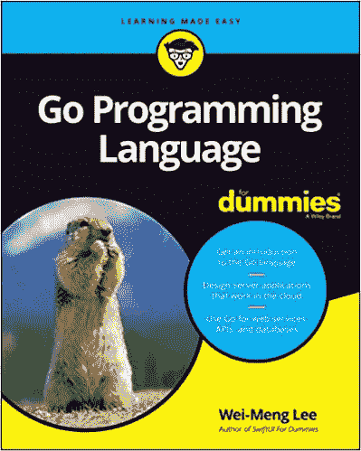

# 理解 Go 中的接口

> 原文：<https://levelup.gitconnected.com/understanding-interfaces-in-go-7dc9b1344b61>

## 了解如何在 Go 中使用接口向类型添加方法


[蒂姆·约翰逊](https://unsplash.com/@mangofantasy?utm_source=medium&utm_medium=referral)在 [Unsplash](https://unsplash.com?utm_source=medium&utm_medium=referral) 上的照片

围棋中一个经常不容易掌握的重要话题是**接口**。一个*接口*定义一个对象的行为，指定它需要实现的方法。接口在 Go 中有几个重要的用途:

*   它使您的代码更加通用
*   它迫使你采用代码封装

在这篇文章中，我将让你很容易理解什么是 Go 中的接口，以及如何在你的程序中使用它。为了使这个主题不那么抽象，我将用几个具体的例子来说明接口。

# 定义接口

在 Go 中，接口是一个名为方法签名集合的*。在下面的例子中，`DigitsCounter`是一个接口，它包含一个名为`CountOddEven`的方法签名:*

```
type DigitsCounter **interface** {
    CountOddEven() (int, int)
}
```

`CountOddEven`方法签名也包含函数的返回类型(它返回一对整数值)，但不包含实现。

# 实现接口

现在让我们创建一个名为`DigitString`的新类型，它的类型是`string`:

```
type DigitsCounter interface {
    CountOddEven() (int, int)
}**type DigitString string**
```

在围棋中，`DigitString`被称为*的命名式*，是*的底层式* `string`。通过将命名类型指定为*接收者*，命名类型可以拥有自己的方法，而这是通过实现接口来实现的。

> 这类似于在面向对象编程范例中从对象调用方法。

例如，您可以通过实现在`DigitCounter`接口中定义的`CountOddEven`函数签名，将`DigitString`指定为`CountOddEven`函数的接收者:

```
**//** DigitString implements the DigitsCounter interfacefunc (ds DigitString) CountOddEven() (int, int) {
    odds, evens := 0, 0
    for _, digit := range ds {
        if digit%2 == 0 {
            evens++
        } else {
            odds++
        }
    }
    return odds, evens
}
```

我们说 *DigitString 类型实现了 DigitsCounter 接口*。现在可以从类型为`DigitString`的变量中调用`CountOddEven`方法:

```
func main() {
 **s := DigitString("123456789")
    fmt.Println(s.CountOddEven()) // 5 4**
}
```

请注意，您可以让`DigitString`成为任何其他函数的接收者，而不一定是在接口中定义的函数。例如，您还可以使`DigitString`类型成为一个名为`PrintContent`(没有在任何接口中定义)的函数的接收者:

```
**func (ds DigitString) PrintContent() {
    fmt.Println(ds)
}**func main() {
    s := DigitString("123456789")
    fmt.Println(s.CountOddEven()) // 5 4
 **s.PrintContent()              // "123456789"**
}
```

# 界面的使用

既然您已经看到了接口的基本概念以及如何通过命名类型实现它，那么让我们考虑另一个例子来看看使用接口的好处。考虑以下程序:

```
package mainimport (
    "fmt"
    "math"
)//---define an interface called Shape---
type Shape interface {
    Area() float64
}//---define two types here-Circle and Square---
type Circle struct {
    radius float64
}type Square struct {
    length float64
}//---Circle implements Shape---
func (c Circle) Area() float64 {
    return math.Pi * math.Pow(c.radius, 2)
}//---Square implements Shape---
func (s Square) Area() float64 {
    return math.Pow(s.length, 2)
}func main() {
    c1 := Circle{radius: 5}
    s1 := Square{length: 6}
    fmt.Println(c1.Area()) // 78.53981633974483
    fmt.Println(s1.Area()) // 36
}
```

在上面，我有以下内容:

*   一个名为`Shape`的接口，带有方法签名`Area`。
*   两个命名类型称为`Circle`和`Square`，底层类型为`struct`。它们每个都有一个成员，分别是`radius`和`length`
*   `Circle`和`Square`命名类型都实现了`Shape`接口，并为`Area`方法提供了定义。这很有用，因为计算圆的面积的公式显然不同于正方形的面积公式。
*   现在可以从类型为`Circle`和`Square`的变量中调用`Area`方法。

此时此刻，没有令人信服的理由使用界面。毕竟，如果我移除了`Shape`接口，上面的程序仍然可以工作，不会有任何问题。

现在，如果你想打印一组`Circle`和`Square`变量的区域呢？使用上面的例子，您必须单独调用`Area`方法:

```
 fmt.Println(c1.Area()) 
    fmt.Println(s1.Area()) 
```

然而，有了接口，你现在可以把所有这些变量放到一个类型为`Shape`的片段中，就像这样:

```
 shapes := []Shape{c1, s1}
```

因为`c1`和`s1`都实现了`Shape`接口，所以现在可以遍历这个切片并调用每个对应类型的`Area`方法。

```
 for _, v := range shapes {
        fmt.Println(v.Area())
    }
```

假设我现在有了一个名为`Triangle`的新命名类型:

```
type Triangle struct {
    base   float64
    height float64
}
```

但是`Triangle`命名类型没有实现`Shape`接口。如果创建一个类型为`Triangle`的变量并尝试将其添加到类型为`Shape`的切片中:

```
 **t1 := Triangle{base: 6, height: 5}**
    shapes := []Shape{c1, s1**, t1**}    // error
```

您将得到错误:“*不能使用 T1(类型三角形)作为切片文字中的类型形状:三角形不实现形状(缺少面积方法)*”。

要解决这个问题，让`Triangle`命名类型实现`Shape`接口:

```
**func (t Triangle) Area() float64 {
    return (t.base * t.height) / 2
}**
```

# 桁条界面

即使您不熟悉 Go 中的接口，您也会不知不觉地使用接口。有没有试过打印出结构体或变量的值？您是否想知道为什么输出看起来是这样的？

假设你有一个名为`Person`的结构:

```
type Person struct {
    FirstName string
    LastName  string
    Age       int
}func main() {
    me := Person{FirstName: "Wei-Meng", LastName: "Lee", Age: 25}
    fmt.Println(me) 
}
```

如果您打印了`me`变量，有没有想过为什么打印 struct 的输出是这样的？

```
{Wei-Meng Lee 25}
```

原来，每种类型都实现了一个名为`Stringer`的特殊接口，该接口在 **fmt** 包中定义。`Stringer`接口包含一个名为`String`的方法签名:

```
type Stringer interface {
    String() string
}
```

当您试图使用 **fmt** 包中的函数(如`Println`)打印出变量值时，它将检查`String`函数的实现，以决定如何打印其内容。所以如果你不喜欢你的变量的打印方式，你可以覆盖默认的`String`方法，就像这样:

```
type Person struct {
    FirstName string
    LastName  string
    Age       int
}**// implements the Stringer interface and overrides the String 
// method
func (p Person) String() string {  
    return fmt.Sprintf("%v %v (%d years old)",
    p.FirstName, p.LastName, p.Age)
}**
```

当您现在试图打印出一个类型为`Person`的变量时，您将看到新的格式化输出:

```
 fmt.Println(me)
    // Wei-Meng Lee (25 years old)
```

# 空界面

在 Go 中，没有方法的接口被称为*空接口*。空接口表示为:

```
interface{}
```

> 由于空接口没有方法，所有类型实际上都实现了空接口。

当您希望在编译时处理未知类型的数据时，空接口非常有用。考虑下面的场景，您想要编写一个名为`Multiple`的函数，它接受两个参数:

*   第一个参数可以是数值或字符串值
*   第二个参数是一个整数
*   如果第一个参数是数值，则将第一个值乘以第二个值；如果第一个参数是字符串，则根据第二个参数中指定的值重复该值
*   `Multiple`函数的返回值取决于第一个参数的类型

基于上述要求，现在您可以利用空接口(以粗体突出显示)编写`Multiple`函数:

```
func Multiple(**i interface{}**, times int) **interface{}** {
    switch v := i.(type) {                 // checks the type of i
    case int:
        return (v * times)                 // v is int
    case float64:
        return (v * float64(times))        // v is float64
    case string:
        return strings.Repeat(v, times)    // v is string
    default:        
        return "I don't know what to do"
    }
}
```

您现在可以使用各种数据类型调用`Multiple`函数:

```
func main() {
    result := Multiple(4, 5)
    fmt.Printf("%T - %v\n", result, result) 
    **// int - 20** result = Multiple("Cool", 5)
    fmt.Printf("%T - %v\n", result, result)
    // **string - CoolCoolCoolCoolCool**
}
```

# 类型断言

还记得我们之前创建的`Triangle`命名类型吗？如果你想知道一个命名的类型是否实现了一个特定的接口，你可以使用*类型断言*。

首先，将变量赋给一个*空接口*:

```
 t1 := Triangle{base: 6, height: 5}
    **var v interface{} = t1**
```

然后，使用*类型断言*来访问接口的底层具体值:

```
 t, ok := **v.(Shape)**
```

类型断言将返回两个值—基础值和指示断言是否成功的结果。您现在可以检查第二个结果，以了解该类型是否实现了`Shape`接口，以及它是否调用了`Area`方法:

```
 if ok {
        fmt.Println(t.Area())
    }
```

以上代码片段可以组合成以下内容:

```
 if t, ok := v.(Shape); ok {
        fmt.Println(t.Area())
    }
```

# 摘要

接口是围棋编程中的一个重要课题。在下一篇文章中，我将向您展示一些更实际的接口用法，特别是在解析 JSON 字符串方面。在那之前，好好学习围棋吧！或者看看我最近写的一本关于围棋编程的书。



[https://www . Amazon . com/Programming-Language-Dummies-Computer-Tech/DP/1119786193/](https://www.amazon.com/Programming-Language-Dummies-Computer-Tech/dp/1119786193/)