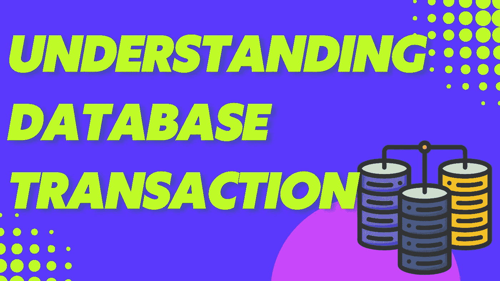
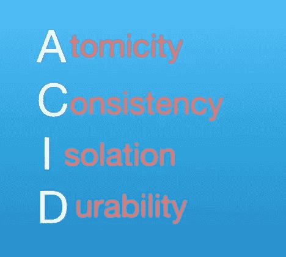
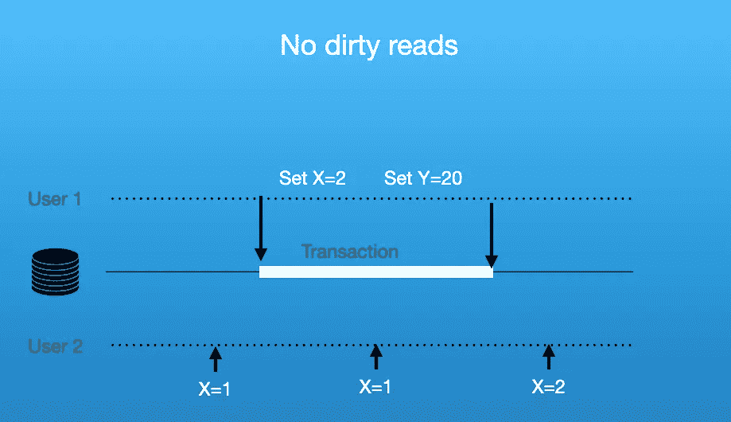
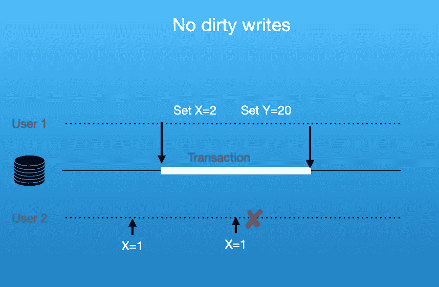

# 了解数据库事务中的隔离级别

> 原文：<https://levelup.gitconnected.com/understanding-isolation-levels-in-a-database-transaction-af78aea3f44>

在本文中，我们将讨论数据库事务中各种类型的隔离级别。首先，我们需要讨论“什么是数据库中的事务？”。数据库中的事务可以定义为 ACID 属性的实现。

**A** —该属性指定数据库上的每个事务本质上都应该是原子的。事务中的一系列命令应该作为单个实体来执行，在出现任何异常的情况下，应该作为单个实体来回滚。不应该有部分执行事务的状态。

**C** —酸中的 C 代表一致性。这意味着事务不应该违反数据库的任何约束。

**I** — I 代表隔离，这意味着特定的事务应该将自己视为数据库中唯一的事务。

**D** — D 代表耐久性。这意味着特定事务所做的更改应该是持久的，并且应该在磁盘上是持久的。

当完成 ACID 属性的调整时，可以考虑数据库中的隔离级别。例如，如果我们想获得高级别的隔离，那么我们应该使用可序列化的隔离级别。数据库中有 4 种主要的隔离级别:

1.  **读取已提交的**
2.  **读取未提交的数据**
3.  **可重复读取**
4.  **可序列化**

让我们试着逐一详细了解这些隔离级别。

# 读取提交的隔离级别

提交读取的隔离级别有两个属性:

1.  **无脏读:**这意味着数据库不会读取任何未提交的值

**2。没有脏写:**这意味着数据库将接受已经有事务在其上运行的特定行上的任何事务。另一个事务必须等到提交行上的前一个事务，并且只有在此之后，任何其他事务才能够对特定行执行写操作。

使用 MySQL 的读提交隔离级别的示例可以在以下位置找到:

**2。可重复读取隔离级别**

当要对其执行事务的值在事务持续时间内发生变化时，将使用此隔离级别。例如，我们有一张个人账户余额表。现在，我们有一个事务在这个表上执行两种类型的任务:

1.  计算交易的数量
2.  找出所有交易的总和

现在，让我们假设一个场景，在执行查询 1 之后，在这个表上插入了任何值。现在，查询 2 的结果将受此影响。在这种情况下，我们更喜欢使用可重新读取的隔离级别，这可以保证参与事务的行数在整个事务中保持其当前值。数据库使用多版本并发控制实现相同的功能。

**3。读取未提交的隔离级别**

当我们甚至需要行的未提交值时，就使用这种类型的隔离级别。任何未提交的更新和插入都应该反映在我们的事务中。这种类型的隔离级别在预订系统中大量使用，如果任何其他事务试图更新座位的可用性，即使该事务没有被提交，我们也应该能够看到这些变化。

**4。可序列化隔离级别**

这是所有隔离级别中最强的，可以保证完全隔离。在这种类型的事务在数据库上运行之前，任何其他事务都不能读写值。这个隔离级别解决了前面讨论的所有 3 个隔离级别中的所有问题，但是由于它只允许在数据库上执行一个查询，因此限制了系统的可伸缩性。