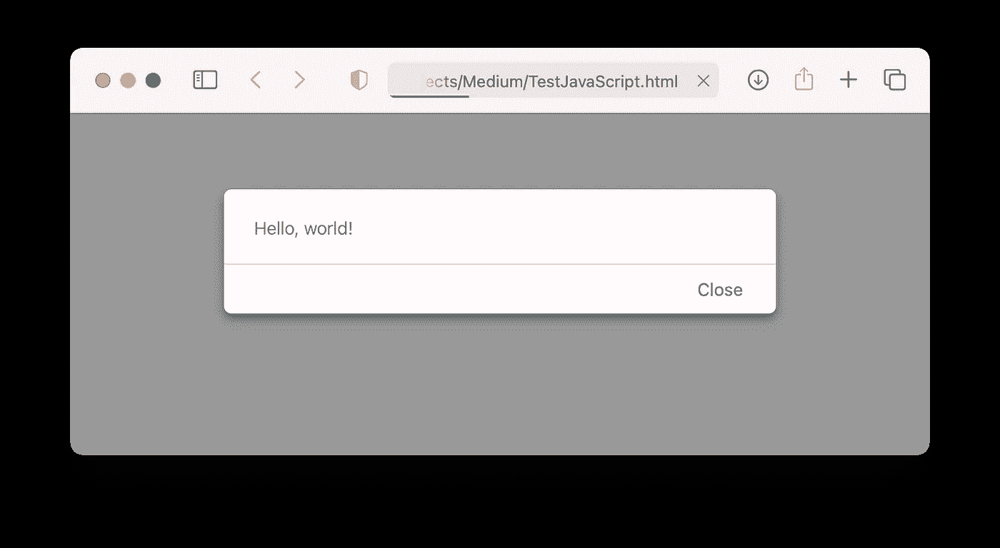
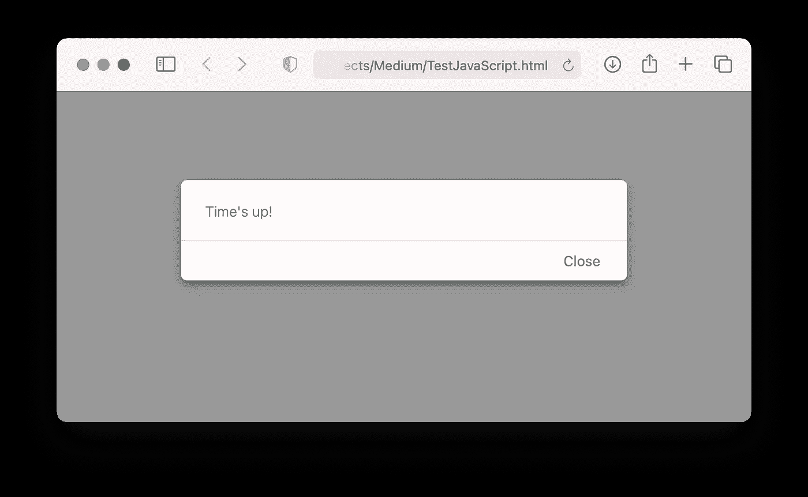

# 理解 JavaScript 匿名函数

> 原文：<https://levelup.gitconnected.com/understanding-javascript-anonymous-function-a77d12db8a0f>

## 了解如何在 JavaScript 应用程序中编写和使用匿名函数


照片由[沙哈达特·拉赫曼](https://unsplash.com/@hishahadat?utm_source=medium&utm_medium=referral)在 [Unsplash](https://unsplash.com?utm_source=medium&utm_medium=referral) 上拍摄

无论您正在编写一个 web3 应用程序来与您的 Etherum 智能合约接口，还是一个基于 NodeJS 的 REST API，您都需要了解 JavaScript——支持 web 的核心编程语言之一。

在本文中，我想谈谈*匿名函数*，这是你在编写 JavaScript 代码时经常会遇到的东西。希望在本文结束时，您能够很好地理解匿名函数是如何工作的，以及如何在您的应用程序中使用它。

# JavaScript 中的函数

让我们开始讨论如何在 JavaScript 中定义函数。下面的代码片段显示了 JavaScript 中定义的函数— `displayAlert()`:

```
<!-- TestJavaScript.html -->
<html>
<script>
    **function displayAlert(message) {
        alert(message)        
    }**// calls the displayAlert() function    displayAlert("Hello, JavaScript!")
</script>
</html>
```

该功能在窗口中显示一个警告。要调用该函数，只需按其名称调用该函数，并向其传递一个参数:

```
 // calls the displayAlert() function    **displayAlert("Hello, JavaScript!")**
```

现在将显示包含该消息的警报:


现在让我们将`displayAlert()`函数重写为一个匿名函数:

```
<html>
<script>
    f = **function(message) {
        alert(message)        
    }**
    f("Hello, JavaScript!")
</script>
</html>
```

这里，函数名被删除，剩下的是一个匿名函数(没有名字的函数):

```
function(message) {
        alert(message)        
    }
```

然后它被赋给一个名为`f`的变量。要调用这个匿名函数，只需将变量`f`视为一个函数:

```
f("Hello, JavaScript!")
```

如果您想在声明匿名函数后直接调用它，可以使用以下语法:

```
 **(**function(message) {
        alert(message)        
    }**)("Hello, world!")**
```

当您加载 HTML 页面时，您应该会看到警告:



# 匿名函数的使用

现在您已经看到了匿名函数的样子，是时候看看匿名函数在您的应用程序中是如何有用的了。

匿名函数的一个很好的用途是将一个函数传递给另一个函数。例如，JavaScript 中的`setTimeout()`函数允许您在指定的时间(以毫秒为单位)过后执行一个函数。在下面的例子中，五秒钟后，传递给`setTimeout()`函数的匿名函数将被执行:

```
<html>
<script>    
    setTimeout(**function() {
        alert("Time's up!")        
    }**, 5000)</script>
</html>
```

5 秒钟后，您将看到一条警告显示:



使用匿名函数的另一个好例子是用于数组的`filter()`函数。假设您有一个整数值数组:

```
 let nums = [4,5,3,7,1,2,8,9]
```

如果您想提取这个数组中的所有偶数，您可以通过向其传递一个匿名函数来调用`filter()`方法:

```
 let evens = nums.filter(**function(val) {
        return val % 2 == 0
    }**)
```

匿名函数的主体指定了您希望结果所处的条件—在这种情况下，您希望数组中的每个值都能被 2 整除。换句话说，您需要数组中的所有偶数。然后，`filter()`函数将结果作为数组返回，您可以打印出来:

```
 alert(evens)  // 4,2,8
```

如果需要数组中的所有奇数，则相应地更改匿名函数中的条件:

```
 let evens = nums.filter(function(val) { **return val % 2 == 1**    })
```

# 实现使用匿名函数的函数

在上一节中，您看到了如何将匿名函数传递给`filter()`方法。你自己写一个接受匿名函数的函数怎么样？

假设你想写自己的过滤函数，比如说`myfilter()`。第一步是创建一个匿名函数，如下所示:

```
 filterFunction = **function(f) {
        result = []
        for (let i = 0; i <= this.length; i++) {
            if (f(this[i])) {
                result.push(this[i])
            }
        }
        return result        
    }**
```

上面的代码片段:

*   创建一个匿名函数，并将其赋给一个名为`filterFunction`的变量
*   创建一个接受单个参数的匿名函数— `f`，这是另一个匿名函数
*   使用`this`关键字绑定到这个匿名函数被分配到的对象。例如，如果这个匿名函数被分配给一个数组，那么`this`将引用这个数组
*   对数组中的每个元素调用`f`匿名函数，如果匿名函数的计算结果为`true`，该元素将被添加到`result`数组中
*   返回函数末尾的`result`数组

要将上述匿名函数附加到数组，请指定要创建的新方法的名称，然后为其分配匿名函数:

```
 let nums = [4,5,3,7,1,2,8,9]
 **nums.myfilter = filterFunction**
```

在上面，`myfilter()`是新增加的方法。您现在可以像这样使用`myfilter()`方法:

```
 let evens = **nums.myfilter(function(val) {
        return val % 2 == 0
    })**
    alert(evens)  // 4,2,8
```

# 箭头功能

在 ES6 中，您可以使用声明匿名函数的简写方式。这种简写被称为*箭头功能*。考虑一下您之前看到的例子:

```
 displayAlert = function(message) {
        alert(message)        
    }
    displayAlert("Hello, JavaScript!")
```

使用箭头功能，您现在可以删除`function`关键字并添加*粗箭头*操作符`=>`:

```
 **displayAlert = (message) =>
        alert(message)** 

    displayAlert("Hello, JavaScript!")
```

请注意，如果您的匿名函数只有一个语句/表达式，也可以删除这对`{}`。如果函数中有多个语句/表达式(甚至是单个语句/表达式)，可以使用`{}`:

```
 displayAlert = (message) => **{**
        alert(message)        
 **}**
```

考虑您之前看到的另一个示例:

```
 let evens = nums.filter(**function(val) {
        return val % 2 == 0
    }**)
    alert(evens)
```

您可以使用箭头函数重写匿名函数:

```
 let evens = nums.filter( **(val) =>
        val % 2 == 0
    )**
    alert(evens)
```

请注意以下几点:

*   如果没有`{}`封闭匿名函数体，就不能使用`return`关键字(表达式的值是隐式返回的)。
*   如果您使用`{}`来包含匿名函数的主体，那么如果您想要返回表达式的值，那么`return`关键字是强制的，如下所示:

```
 let evens = nums.filter( (val) => **{**
        **return** val % 2 == 0
    **}**)
```

对于多语句/表达式匿名函数，关键字`return`对于返回表达式的值是必需的。

```
 let evens = nums.filter( (val) => {
        console.log(val)
        **return** val % 2 == 0
    })
```

# 摘要

这篇短文简要概述了 JavaScript 中的匿名函数。希望它可以作为下次开始用 JavaScript 编码时的快速参考！

[](https://weimenglee.medium.com/membership) [## 加入媒介与我的介绍链接-李伟孟

### 作为一个媒体会员，你的会员费的一部分会给你阅读的作家，你可以完全接触到每一个故事…

weimenglee.medium.com](https://weimenglee.medium.com/membership)