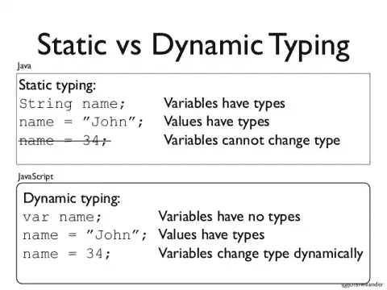

# 理解 JavaScript:动态类型语言中的强制

> 原文：<https://levelup.gitconnected.com/understanding-javascript-coercion-in-a-dynamically-typed-language-8807d6331fa2>


照片由 [Unsplash](https://unsplash.com?utm_source=medium&utm_medium=referral) 上的 [Aziz Acharki](https://unsplash.com/@acharki95?utm_source=medium&utm_medium=referral) 拍摄

## JavaScript 是一种动态类型语言

为了理解*强制*，我们首先需要认识到 JavaScript (JS)是一种动态类型语言。那是什么意思？这意味着 JS 在使用变量之前不需要显式声明变量。这里有一个简单的例子，比较 Java(一种静态类型语言)和 JavaScript。



静态与动态类型示例。图像[来源](https://medium.com/@kellyrschroeder/the-static-around-dynamical-languages-b52a5d083192)

这里我们看到 Java 是一种静态类型语言。当变量“name”被创建时，它是用数据类型*字符串*声明的，并将保持为*字符串*。因此，如果将变量“name”赋给不同的类型(如数字),就会出现错误。该变量被认为是静态的。

另一方面，JS 是一种动态类型语言。注意，在上面的例子中，当变量' name '被创建时，它没有用数据类型声明。这允许动态改变“名称”变量。上面的例子显示“name”被分配给“John”，它是一个*字符串*。后来可以分配给 34，一个*号*。不会出现错误，JS 将继续正常读取代码。

# 强迫

*胁迫*的定义是用武力说服某人做某事的做法。对于 JS 来说，强制是将一个值强制为某种数据类型的概念。换句话说，它是一个值从一种类型到另一种类型的转换。

JavaScript 中有六种基本或简单的数据类型:

```
1\. undefined  // represents a lack of existence, implicitly2\. null       // represents a lack of existence, explicitly3\. boolean    // true or false4\. number     // whole integers, floating integers5\. string     // a sequence of characters wrapped in quotes6\. symbol     // a unique value, introduced with ES6
```

出于这个博客的目的，我们将重点关注布尔、数字和字符串数据类型。

## 显性与隐性

强制有两种方式:显式*和隐式*。当一个值被强制*显式*时，这意味着代码告诉 JS 引擎有目的地将给定值更改为不同的类型。例如:**

```
*String(123)      // => "123"Number("321")    // => 321Boolean(0)       // => false*
```

*这三个例子展示了内置的 JS 函数:String()、Number()和 Boolean()。每个函数都接受不同数据类型的参数，并将该参数返回到由函数名指定的数据类型。因此，String(123)接受数字 123，并将其转换或强制为字符串“123”。请注意，Boolean(0)返回值 false，因为数字 0 在 JS 中被识别为“nothing”或 false 值。这些是明显胁迫的例子。*

*当一个值被强制*隐式*时，意味着代码没有指定该值应该是什么。如果 JS 没有被告知值必须是什么，它会尝试猜测并返回它*认为*你想要的数据类型。例如:*

```
*"" + 123          // => "123" if (1) {...}      // => if (true) {...}*
```

*第一个示例显示了在两种不同类型上使用+运算符的表达式:“”(空字符串)和 123(数字)。JS 引擎没有被明确告知值应该是什么，所以它隐式地强制一个给定的类型。由于数字 123 很容易被转换成字符串“123”，所以它会选择将其转换成字符串。在第二个示例中，JS 将数字 1 强制转换为布尔值 true。因为 JS 认为数字 1 是“某物”，而数字 0 是“无”，所以它会将数字 1 转换为 true。*

## *强制可能很棘手*

*理解强制的概念将有助于您调试代码。您可以理解为什么给定的值作为某种数据类型返回，不管您是否希望它返回。*

*希望这能帮助你理解 JS 中的强制。这篇博客是“理解 Javascript”系列文章的一部分所以，如果你喜欢这个，一定要关注我的博客，让我知道你想要我报道什么，如果我还没有报道的话。*

*快乐编码😄*