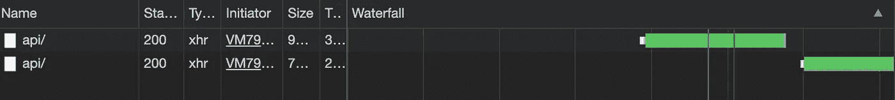

# 理解 JavaScript 承诺

> 原文：<https://levelup.gitconnected.com/understanding-javascript-promises-5040a634c474>

## 一个将带你从新手到忍者的指南。


# 什么是承诺？

Promise 表示异步操作的结果。你可以把它看作是你最终会得到的结果的占位符。

# 为什么要答应？

解决**回调地狱**的问题。

回调地狱是任何在异步代码中使用函数回调变得难以理解的代码。每当我们加载嵌套回调时，代码就变得难以阅读、测试和调试。这也导致了末日金字塔。

这里有一个回调地狱的例子。

# 承诺的三种状态


承诺的三种状态

**待定** →在结果准备好之前，一个承诺处于待定状态。

**满足→** 如果结果是可用的，它就变成满足

**拒绝** →如果出现错误，承诺被拒绝。

如果一个承诺不是悬而未决的，也就是说，它要么被履行，要么被拒绝，我们说它已经**解决**，这意味着它不能改变它的状态。这意味着一个已经确定的承诺将永远保持这种状态。

## 例子

*axios* 类似于 *fetch* API，它返回 HTTP 响应作为承诺。

在第 3 行，我们看到承诺是待定的，因为承诺是异步的，因此需要时间来解决。


# 然后()

承诺有一个 **then** 方法，当承诺完成时执行该方法。它接收一个回调。

当我们打印响应时，我们看到它是一个对象。因为响应的状态代码为 200，这意味着我们的请求是成功的。它具有数据属性，可以访问该属性以提取所需的信息。在这种情况下是用户数据。


# 操纵响应

通常我们想要操纵传入的响应，所以我们使用*承诺链。*

**链接**:一个接一个地组合方法，其中一个方法的结果依赖于另一个方法。

现在我们将链接 then()方法来操作我们的响应。

在上面的示例中，第一个 then 的结果作为参数传递给第二个 then，类似地，第二个 then 的结果传递给第三个 then，依此类推。

在生产代码中，我们并不真正使用变量来通过 axios/fetch 获得响应。因此，从现在开始我们将使用 axios(API_URL)。然后(…)

# catch()

假设我们有一个错误(无效的 url、不存在的端点、服务器连接超时等)。)发出请求，然后我们可以使用 catch()来捕捉这些错误。像 then()一样，它也接收回调。

## 例子

假设我们在 URL 中犯了一个错误

我们只是在上面的例子 API_URL 中添加了“-”。并将其命名为 incorrect_API。

在控制台中，我们得到一个网络错误和自定义错误消息以及一个 get 错误。


# 最后()

finally()方法在我们希望在承诺已经确定的情况下做某事时使用(即承诺要么实现，要么被拒绝)。它还接受回调。

假设我们希望在承诺完成后停止加载网页。

在上面的例子中，我们看到我们甚至可以做更多的事情，甚至在我们最终到达之后。在上面的例子中，我们只是记录了正在加载变量的*的值。*

还有一点需要注意的是，我们的“外部装载…first“先打印。**为什么是**？因为使用承诺的网络请求是异步的，因此是非阻塞的。

promise 之外的语句正在阻塞。深入阅读更多*阻塞/非阻塞*语句。参考我的 setTimeout()文章 [*这里*](/understanding-settimeout-15c7de9e5fd6) 。


## HTTP 拦截器

这一部分与承诺关系不大，但却是一个方便的 axios 功能。当您需要检查或更改从应用程序到服务器的 HTTP 请求时，HTTP 拦截器就派上了用场，反之亦然(例如，日志记录、身份验证等)。)

拦截器在您通过 axios 发出 HTTP 请求之前运行。

# 解决()和拒绝()

我们可以使用 Promise.resolve()做出一个处于履行状态的承诺

## 示例 1:

```
const resolvedPromise = Promise.resolve(‘I am fulfilled’);console.log(resolvedPromise);
```


还有一点需要注意:

```
console.log(Promise.resolve(resolvedPromise) === resolvedPromise); *//=>true*
```

## 示例 2:

我们可以使用 Promise.reject()做出处于拒绝状态的承诺

```
const rejectedPromise = Promise.reject(new Error(‘I am rejected’));console.log(rejectedPromise);
```


还有一点需要注意:

```
console.log(Promise.resolve(rejectedPromise) === rejectedPromise); *//true*
```

在控制台中，您可能会看到一条错误消息，因为错误未被捕获。我们可以放心地忽略它，因为它仅用于演示目的。在生产代码中，我们像前面一样使用 catch()处理错误。

## 示例 3:

```
const resolvedPromise2 = Promise.resolve(new Error(‘I am fulfilled’));console.log(resolvedPromise2);
```


在这里我们看到，即使我们把错误转化为决心，我们的承诺仍然实现。

```
console.log(Promise.resolve(resolvedPromise2) === resolvedPromise2); *//true*
```

# 转换类似承诺的对象

Promise.resolve()也可以转换 promise like 对象。下面的语句将发出 Ajax 请求的 jQuery 转换为承诺。

```
Promise.resolve($.getJSON(API_URL)).then().catch().finally();
```

# 创建自定义承诺

事实上，我们可以使用`Promise`构造函数创建我们赢得的自定义承诺。

构造函数接受带有两个参数的回调:resolve 和 reject。

我们通常在承诺中编写异步操作，根据结果，我们可以解决或拒绝承诺。

下面是一个 1 秒钟后自动完成的例子。

类似地，我们可以通过用 reject()替换 resolve()(第 3 行)来自动拒绝我们的客户承诺。

更好的方法是将承诺包装在函数中，使其可重用。

如果一个错误发生了，或者我们从我们的自定义承诺中抛出了一个错误，那么我们的承诺将像下面这样被拒绝。

我们还可以处理像下面这样的决定和拒绝。

**记住**:每当 resolve 为真时，promise 执行 then()，否则执行 catch()

# 将回访转化为承诺

Node.js 非常依赖回调，我们可以很容易地将它们转换成承诺。但在此之前，让我们创建一个名为 log.txt 的文件，其中包含一些文本。对我来说，它是“我是某种文本”。让我们尝试使用 node 来读取文件。


但是如果我们要读取一个不存在的文件，我们会得到一个错误。

要将我们的回调转换为承诺，我们只需将承诺包装在一个函数中，添加 resolve()和 reject()，然后返回它。


从上面的例子中我们可以看到，我们可以用相同的样板文件将任何回调转换为承诺。因此，node 有一个名为 **promisify** 的便利实用程序，可以让我们轻松地进行转换。


# Promise.all()

让我们回到最初的 API_URL 示例，发出两个 HTTP 请求。


现在，如果我们查看开发人员工具中的“网络”选项卡，我们会发现我们的请求是一个接一个提出的，即交错提出的，因此需要更多时间。



因为我们的请求并不相互依赖，所以我们可以使用 Promise.all()。

Promise.all()在一个数组中接受多个承诺，同时执行它们，并返回一个响应数组作为承诺。


当我们在开发人员工具中查看我们的网络选项卡时，我们会看到两个请求都是并行进行的，因此节省了时间并提高了性能。


# 异步和等待

函数前的 **async** 关键字表示函数总是返回一个承诺。关键字 **await** 让 JavaScript 一直等到承诺完成并返回结果。使用 async 和 await，我们可以编写更简洁的异步代码。

让我们看看下面的例子。


上面的代码抛出了一个错误“ *promise 不可迭代*”。**为什么是**？因为记住 Promise.all()是一个异步操作，即非阻塞的，但是后面的代码是阻塞的。所以我们的阻塞代码首先运行。记住 Promise.all()只在所有的承诺都实现时产生一个响应承诺数组。但是，在我们的例子中，承诺是待定的，因此我们的承诺是不可重复的。

因此，为了解决这个问题，我们使用异步等待。


现在我们得到了我们想要的输出。但是我们仍然有一个问题，我们需要捕捉任何错误，也可能在承诺完成时打印一些东西。

一个解决方案是:

在上面的代码中，我们看到我们复制代码来改变 isLoading 并打印它。更好的解决方案是使用 try-catch 语句并用 finally()处理 isLoading，如下所示。