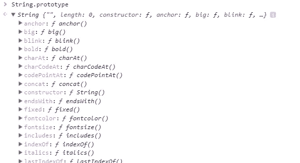
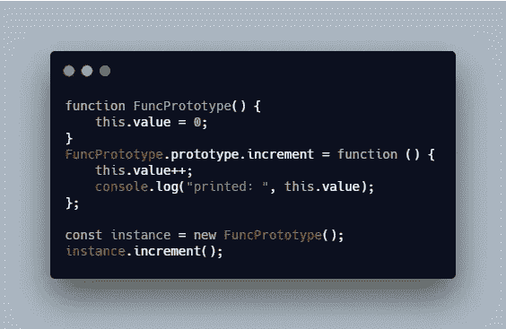
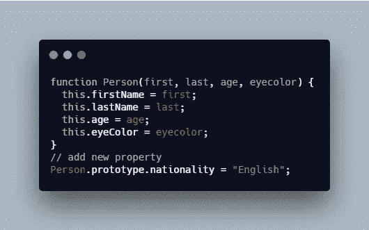
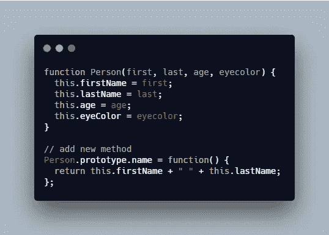
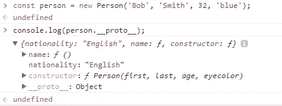
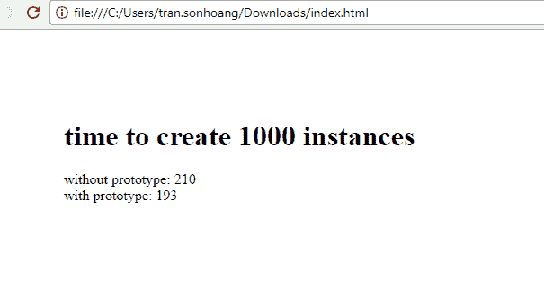

# 初学者理解 JavaScript 原型

> 原文：<https://levelup.gitconnected.com/understanding-javascript-prototypes-for-beginners-c1ccc41c62f1>

## JavaScript 原型的基础知识和解释


[黄川](https://unsplash.com/@transonhoang?utm_source=unsplash&utm_medium=referral&utm_content=creditCopyText)在 [Unsplash](https://unsplash.com/@transonhoang?utm_source=unsplash&utm_medium=referral&utm_content=creditCopyText) 上的照片

这篇文章是关于困扰我很久的 JavaScript 原型的。在本文中，我将按照下面的大纲解释 JavaScript 原型:

1.  什么是 JavaScript 原型
2.  它是如何工作的
3.  __proto__ 和原型
4.  例子
5.  使用原型和没有原型有什么区别
6.  性能问题

更多类似的内容，请查看[https://betterfullstack.com](https://betterfullstack.com/stories/)

# 什么是 JavaScript 原型

与许多其他面向对象的语言不同，JavaScript 使用原型与其他对象共享功能性——这意味着什么？

> 原型是 JavaScript 对象相互继承特性的机制。它们共享根原型对象中定义的数据和方法。

更简单的是，所有 JavaScript 对象都从原型对象继承属性和方法。

# 它是如何工作的

*在我看来，JavaScript 中的一切都是对象*。功能是一个**对象**。字符串、布尔和数字是**对象**(它们是封装在提供`string.length`等功能的对象中的原语)。数组也是一个对象。只有`undefined`不是对象。

耐心地读完这篇文章，然后你会同意我的观点。

为了提供继承，对象可以有一个**原型对象**，它作为一个模板对象来继承方法和属性。

字符串的父亲是 **String.prototype** ，数字的父亲是 **Number.prototype** ，数组的父亲是 **Array.prototype.**



控制台上的 String.prototype

一个对象的原型也可以有一个原型对象，它从原型对象继承方法和属性。我们称之为 [**原型链**](https://developer.mozilla.org/en-US/docs/Web/JavaScript/Inheritance_and_the_prototype_chain) 。这就是为什么有时您会注意到不同的对象在您的项目中对它们可用的其他对象上定义了属性和方法。

例如，我们使用字符串 *"abc@gmail.com"* ，那么您可以使用一些功能，如`toUpperCase` *、* `trim` *、*或`split` ，因为它存在于`String.prototype` *上。*

# __proto__ 和原型

`__proto__`是在查找链中用于解析方法的实际对象。

`prototype`是用`new`创建对象时用来构建`__proto__`的对象。

更具体地说，属性和方法是在对象的构造函数的`prototype`属性上定义的，而不是对象实例本身。

让我们看看这个例子:



一旦你声明了上面的函数，就在内部创建了`FuncPrototype.prototype`。函数`increment`将添加到由使用`new FuncPrototype()`创建的`FuncPrototype`实例共享的`FuncPrototype.prototype`中。

使用`new FuncPrototype()`创建的每个实例都有一个指向`FuncPrototype.prototype`的`__proto__`属性。这是用于遍历以查找特定对象的属性的链。

示例:

```
( new FuncPrototype ).__proto__ === FuncPrototype.prototype; // true
( new FuncPrototype ).prototype === undefined; //true
```

注意:`__proto__`不是访问原型链的标准方法，标准但相似的方法是使用`Object.getPrototypeOf(object_name)`。

# 例子

添加新属性:



添加新属性

添加新方法:



添加新方法

让我们看看控制台:



控制台. log person.prototype

所以从`console.log`你可以看到`name()`和`nationality`。

# 使用原型和没有原型有什么区别

当您不应用**原型时，**每次您创建一个人的新实例(上面的例子)，每个属性和方法都被分配给那个实例。这意味着它们将指向不同的内存引用。

使用原型有助于更快地创建对象，因为不必在每次创建新对象时都重新创建该函数。

# 性能问题

在这一部分中，我将通过应用`prototype`和不使用`prototype`来比较我们创建 1000 个实例时的性能。然后调用他们的函数`increment()`，看看需要多长时间。

让我们先看看这个



创建 1000 个实例时的演示

当我重新加载页面时，你可以看到 90%我们从`funcPrototype`创建 1000 个实例的时间总是低于`funcNoPrototype`。

这是源代码

要测试的源代码

# 摘要

JavaScript prototype 对于在前端项目中用 JavaScript 和实用程序构建库仍然很重要。这是 JavaScript 语言的基础。我们必须清楚地理解原型，才能决定何时使用原型来提高代码的性能。

我希望这篇文章对你有用！可以跟着我上[中](https://medium.com/@transonhoang?source=post_page---------------------------)。我也在[推特](https://twitter.com/transonhoang)上。欢迎在下面的评论中留下任何问题。我很乐意帮忙！

# 资源/参考资料

[1]:对象原型[https://developer . Mozilla . org/en-US/docs/Learn/JavaScript/Objects/Object _ Prototypes](https://developer.mozilla.org/en-US/docs/Learn/JavaScript/Objects/Object_prototypes)

[2]:对象原型[https://www.w3schools.com/js/js_object_prototypes.asp](https://www.w3schools.com/js/js_object_prototypes.asp)

[](https://gitconnected.com/learn/javascript) [## 学习 JavaScript -最佳 JavaScript 教程(2019) | gitconnected

### JavaScript 是世界上最流行的编程语言之一——它随处可见。JavaScript 是一种…

gitconnected.com](https://gitconnected.com/learn/javascript) [](https://betterfullstack.com/stories/) [## 故事-更好的全栈

### 所有的故事故事为我们写指南提交故事到更好的编程博客 1。故事指南避免什么…

betterfullstack.com](https://betterfullstack.com/stories/)