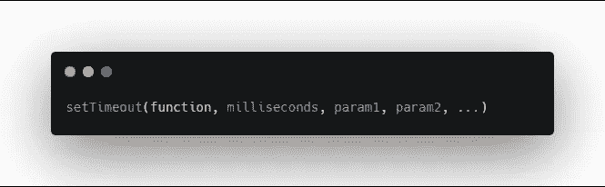
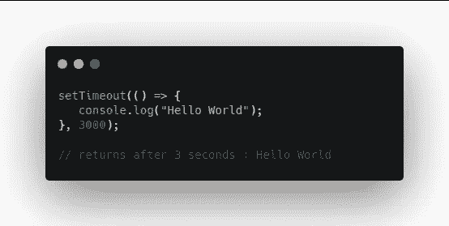
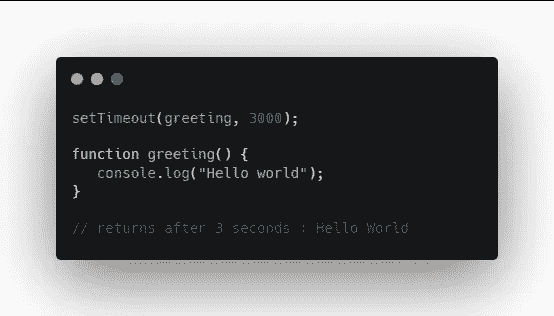
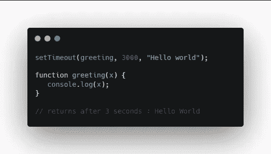
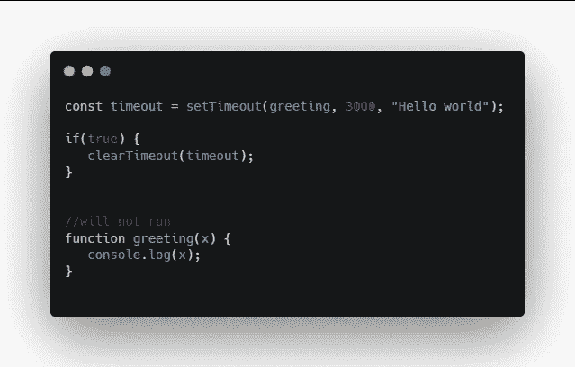
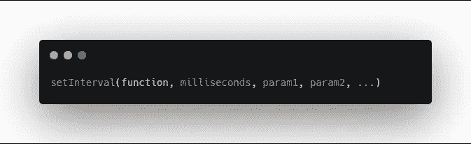
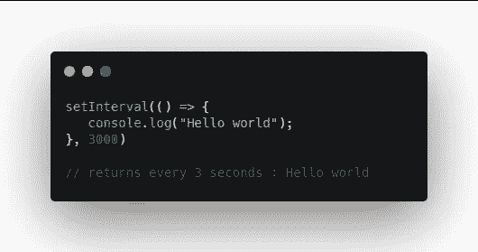
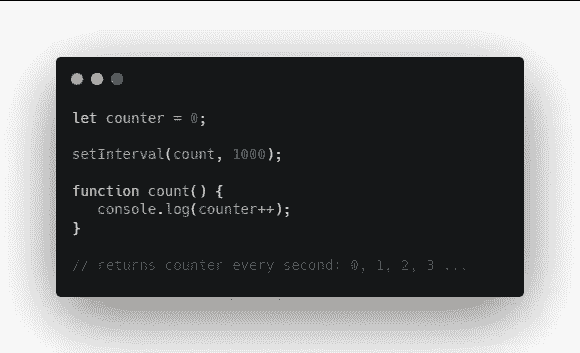
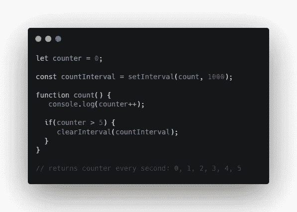

# 了解 JavaScript setTimeout 和 setInterval

> 原文：<https://levelup.gitconnected.com/understanding-javascript-settimeout-and-setinterval-75907b70dc1b>

了解 JavaScript 中`setTimeout`和`setInterval`的区别。

照片由 [Aron 视觉效果](https://unsplash.com/@aronvisuals?utm_source=medium&utm_medium=referral)在 [Unsplash](https://unsplash.com?utm_source=medium&utm_medium=referral) 上拍摄

在 JavaScript 中，`setTimeout`和`setInterval`用于计时代码在特定时间间隔的执行。

# setTimeout()

setTimeout 的基本语法

**setTimeout** 方法在指定的毫秒数后调用一个函数。附加参数也可以传递给该函数。

用箭头函数设置超时

这里我们可以使用一个箭头函数在 3000 毫秒或 3 秒后指向 console . log "**Hello World**"。

使用定义的函数设置超时的另一种方法

或者，我们可以这样写，在 3 秒钟后调用下面定义的函数。

使用参数设置超时

我们也可以像这样给函数传递参数。然后，该函数可以在执行过程中使用这些参数。

clearTimeout 方法

我们也可以选择在调用`setTimeout`之前取消它。在这里，我们要确定某件事是否为真，如果是，我们将清除超时。

请注意，我们必须将超时值赋给一个变量。以便我们在`clearTimeout`中有所参考。现在该功能根本不会运行。

# setInterval()

setInterval 的基本语法

`setInterval`方法非常相似，除了它会持续运行，直到它被清除或者窗口被关闭。它也可以接受传递给函数的附加参数。

带箭头函数的 setInterval

所以在这里我们可以每 3 秒记录一次“Hello world”。更好的用途是计数器。

带计数器的 setInterval

这里我们将计数器变量设置为 0。然后我们设置我们的`setInterval`，它会每秒调用函数 count。然后，Count 将记录计数器，并使其递增 1。

这将无限期地每秒运行一次。所以我们可能想在某个时候停止它。

在某一点停止间隔

首先，我们需要将`setInterval`赋值给一个变量。然后在函数中，我们可以评估计数器，如果它大于 5，我们将清除`countInterval`变量中的 interval。

编码快乐！