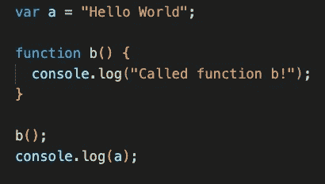
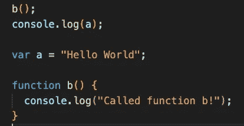
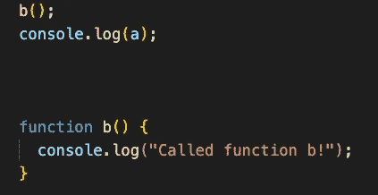
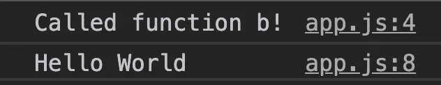
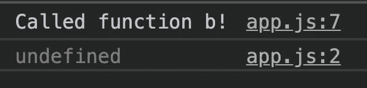
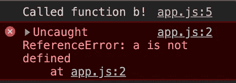

# 理解 Javascript:提升现象

> 原文：<https://levelup.gitconnected.com/understanding-javascript-the-hoisting-phenomenon-cd8b15f6663b>

马克斯·兰格洛特在 [Unsplash](https://unsplash.com?utm_source=medium&utm_medium=referral) 上的照片

学习 JavaScript 既有趣又令人兴奋，尤其是当你想成为一名前端开发人员的时候。很多前端框架都是用 JavaScript 写的，比如 React，Angular，Vue。然而，当开始使用这些框架学习时，它们所建立的基础很容易被忽略。

让初级开发人员感到困惑的一个概念是被称为*提升*的现象。

提升某物的意思是举起或拉起。一个背上背包的学生也可以被看作是一个把背包扛在肩上的学生。在 JavaScript 中，提升是指将声明(即变量和函数)移动到顶部。这是一个默认行为，每当程序被执行时就会发生。但是这对您的代码意味着什么呢？

在我们继续之前，我想声明一个免责声明。这里展示的例子摘自 Anthony Alicea 的 Udemy 课程，名为 *Javascript:理解奇怪的部分*。我觉得 Alicea 的例子很简单，我在这里用它们来说明提升是如何工作的。

## 例子

好吧，我们来做个小练习。对于那些编程新手来说，请继续阅读，因为示例中有详细的解释。对于那些对 Javascript 有基本了解的人，请花点时间回答这个问题:您认为控制台会为每个代码块输出什么？

示例 1、2 和 3(按顺序)

让我们先细分每个例子:

在示例 1 中，我们声明了一个名为“a”的变量，它被赋予了字符串“Hello World”我们还有一个名为“b”的函数，它将控制台记录字符串“Called function b！”无论何时执行。向下移动代码，调用函数 b，然后调用变量 a 的控制台日志。

在示例 2 中，我们通过调用函数 b 开始代码，然后调用变量“a”的控制台日志。向下移动代码，变量“a”被声明并被赋予字符串“Hello World”最后，创建函数 b。例 1 和例 2 中的变量“a”和函数“b”是相同的。

在示例 3 中，代码看起来与示例 2 完全相同，但是缺少变量声明“a”。

## 控制台的输出

让我们看看每个示例的输出:

示例 1、2 和 3 的控制台输出(按顺序)

在示例 1 中，字符串“调用了函数 b！”首先记录到控制台，然后是变量“a 的赋值”Hello World。'

在示例 2 中，字符串“调用了函数 b！”首先记录到控制台，后面跟着一个未定义的语句。

在示例 3 中，字符串“调用了函数 b！”首先被记录到控制台，然后是一个 ReferenceError，表示“未定义”

你做对了吗？在每个例子中，函数 b 都成功地执行了'被调用的函数 b！'首先打印到控制台。然而，变量 a 的值在每个例子中是不同的。这就是所谓的*提升现象。*

# 解释了提升现象

当一个程序被执行时，JavaScript (JS)开始一个叫做执行上下文的东西。这基本上是 JS 根据您编写的代码设置环境的方式。编译器会检查你的代码，寻找 JS 保留的关键字，并根据它如何解释你的代码来设置环境。需要指出的是，当编译器运行你的代码时，它会识别出你创建变量和函数的*。JS 在执行上下文中做了很多事情，让您的代码为成功做好准备。在这个博客中，我们将重点关注的是导致提升现象的部分。它发生在执行上下文的两个阶段:创建阶段和执行阶段。*

## 创造阶段

在创建阶段，函数和变量被分配内存空间。然而，只有函数是完整设置的——函数名、参数和代码逻辑。变量被创建，但没有被赋值。相反，它最初被分配给 JS 中的一个特殊单词，称为*未定义的*。这只是一个变量的占位符，表示“我已经为这个变量分配了空间，但是我还没有把它分配给你声明的任何东西。”在创建阶段之后，变量被赋予你在代码*中声明的内容，在*执行阶段，变量被赋予*中声明的内容。*

## 执行阶段

在执行阶段，JS 将再次检查代码，但这一次是一行一行地检查，也称为同步行为。它的内存空间中有所有的变量和函数(在创建阶段创建的),并准备好用它们做一些事情。因此，当变量在创建阶段声明时，直到执行阶段才会被赋予您为其编写的值。这在示例 2 中可以看到，控制台打印出的不是“Hello World”，而是“undefined”

## 参考错误解释

在示例 3 中，给出了一个 ReferenceError，因为在创建阶段从未创建变量“a”。没有为这个变量分配内存空间，因为它从一开始就没有被声明。这就是初级开发人员感到困惑的地方，因为“未定义”并不像在英语中那样意味着“未定义”。Undefined 是 JS 中的保留字，用作占位符，直到它被赋值替换。

## 包装它

因此，虽然提升意味着提升或拖拉，但在 JavaScript 中，它可以被视为在创建阶段将变量和函数提升到代码的顶部。这是分配给它们的内存空间，等待在执行阶段使用。

希望这有助于你理解起重现象。我将做一系列“理解 Javascript”的概念，所以如果你想阅读更多类似的内容，请关注我的博客。

快乐编码😄