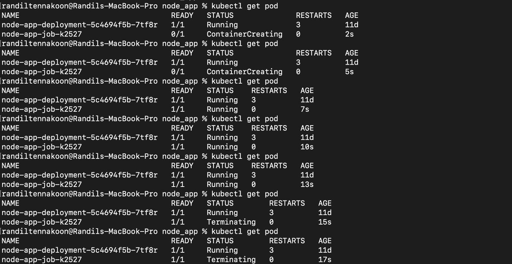

# 了解 Kubernetes 的工作

> 原文：<https://levelup.gitconnected.com/understanding-jobs-in-kubernetes-68ac21b272d8>

## 作业在 K8s 中起着重要的作用，它帮助您在应用程序中执行任务


照片由 [Arif Riyanto](https://unsplash.com/@arifriyanto?utm_source=unsplash&utm_medium=referral&utm_content=creditCopyText) 在 [Unsplash](https://unsplash.com/s/photos/programming-language?utm_source=unsplash&utm_medium=referral&utm_content=creditCopyText) 上拍摄

作业和 Cron 作业是 Kubernetes 工作负载中非常重要的部分。这些工作帮助我们完成我们分配给他们的特定任务。

作业和 Cron 作业之间的主要区别是，作业将执行给定的任务，一旦任务完成，它将停止进程，并且作业仅在我们需要它运行时运行。Cron Job 也做同样的事情，但是我们可以安排一个 Cron Job 按照给定的时间表运行。例如，我们可以安排 Cron 作业每小时运行一次，或者安排它在每天早上 6 点运行。

在本文中，我将讨论作业以及如何在您的应用程序中配置作业。

# 配置作业

正如您已经知道的，我们使用 YAML 文件来配置集群中的 Kubernetes 组件，并对现有组件进行更改。在这里，我们也可以使用 YAML 配置文件在 Kubernetes 中创建一个作业。让我们看一个简单的作业配置文件。

```
apiVersion: batch/v1
kind: Job
metadata:
  name: node-app-job
spec:
  template:
    spec:
      containers:
      - name: node-app-job
        image: alpine   #your docker image
        command: ["echo", "Welcome to my Node app"]
      restartPolicy: Never
```

上面的代码片段代表了一个简单的 Kubernetes 作业配置文件，您可以将 docker 图像添加到作业配置文件中。如上创建作业后，可以使用下面的命令将其应用到集群。

```
$ kubectl apply -f node-app-job.yaml
```

在终端上运行`kubectl get all`命令，您会看到任务已经创建。第一次这样做时，这个过程可能需要一些时间，因为从容器注册表中提取 docker 映像需要一些时间。

运行`kubectl get pod --watch`查看事件，以便您可以观察创建作业时是否有错误。

要查看您的作业日志，请在终端上使用从`kubectl get all`命令获得的 pod 名称运行以下命令。

```
$ kubectl logs <pod-name>
```

当我们在上面的确认文件中配置命令时，您将看到输出为`Welcome to my Node app`。您可以使用`kubectl describe job <job-name>`命令来获得更多关于您的工作的详细信息。

# 更改作业配置文件

与 Kubernetes 中的部署和服务不同，您不能立即更改相同的作业配置文件并重新应用它。在作业配置文件中进行更改后，在将其应用到集群之前，您需要从集群中删除以前的作业。

使用以下命令从群集中删除作业。

```
$ kubectl delete job <job-name>//example> kubectl delete job node-app-job
job.batch "node-app-job" deleted
```

运行`kubectl get all`命令，并确保您已经从集群中成功删除了之前的作业。然后您可以再次运行`kubectl apply`命令并检查日志。

让我们首先更改作业配置文件并研究日志。

```
apiVersion: batch/v1
kind: Job
metadata:
  name: node-app-job
spec:
  template:
    spec:
      containers:
      - name: node-app-job
        image: alpine
        command: ["ls"]
      restartPolicy: Never
```

我更改了配置文件中的命令，这将输出 alpine docker 映像中的目录。此外，您可以根据自己的喜好更改 docker 图像和命令。

# 完成和并行

通常，当我们创建一个作业时，它会创建一个 pod 并执行给定的任务。你已经通过上面的例子体验过了。但是使用`completions`我们可以一个接一个地启动几个吊舱。

```
apiVersion: batch/v1
kind: Job
metadata:
  name: node-app-job
spec:
  completions: 2
  template:
    spec:
      containers:
      - name: node-app-job
        image: alpine
        command: ["echo", "Welcome to my Node app"]
      restartPolicy: Never
```

一旦您添加了`completions`，您将看到为该任务创建了两个 pod。使用`kubectl get pods --watch`命令查看它们。

```
// kubectl get pods --watch outputpod/node-app-deployment-5c4694f5b-7tf8r   1/1     Runningpod/node-app-job-7pdp9                    0/1     Completedpod/node-app-job-9924d                    0/1     ContainerCreating
```

您可以使用`parallelism`同时运行多个 pod。`parallelism`也用在下面的`spec`下。

```
apiVersion: batch/v1
kind: Job
metadata:
  name: node-app-job
spec:
  completions: 2
  parallelism: 2
  template:
    spec:
      containers:
      - name: node-app-job
        image: alpine
        command: ["echo", "Welcome to my Node app"]
      restartPolicy: Never
```

您可以在`completions`下设置该特定任务需要运行的最大 pod 数量，并且您可以在`parallelism`下定义并行运行的 pod 数量。

在上面的代码块中，我们有 2 个 pod，我们需要这两个 pod 并行运行。

```
// kubectl get pods --watch outputpod/node-app-deployment-5c4694f5b-7tf8r   1/1     Runningpod/node-app-job-glcn4                    0/1     ContainerCreatingpod/node-app-job-ngm5p                    0/1     ContainerCreating
```

# back offlimit & activeDeadlineSeconds

`backoffLimit`当我们的作业创建失败时，帮助我们限制 pod 的创建。通常，当一个 pod 没有正确创建时，它将进入错误状态并启动另一个 pod，这个过程将继续，直到您成功创建 pod。

如果您的作业包含不允许您的作业成功创建的内容(例如:命令错误)，它会尝试连续创建 pod。当您运行`kubectl get pods`时，您将看到几个具有`Error`状态的 pod。但是使用`backoffLimit`您可以限制连续创建的 pod 的数量。

```
apiVersion: batch/v1
kind: Job
metadata:
  name: node-app-job
spec:
  backoffLimit: 2
  template:
    spec:
      containers:
      - name: node-app-job
        image: alpine
        command: ["ls", "/data"]
      restartPolicy: Never
```

```
kubectl get podspod/node-app-deployment-5c4694f5b-7tf8r   1/1     Runningpod/node-app-job-8bfgj                    0/1     Errorpod/node-app-job-kk8nh                    0/1     Errorpod/node-app-job-x6fmk                    0/1     Error
```

`activeDeadlineSeconds`帮助我们决定作业应该运行多少秒。为了验证这个选项，我们在我们的作业中设置了`sleep`命令来运行它 40 秒。但是使用 `activeDeadlineSeconds: 15`我们可以在 15 秒后终止任务。

```
apiVersion: batch/v1
kind: Job
metadata:
  name: node-app-job
spec:
  activeDeadlineSeconds: 15
  template:
    spec:
      containers:
      - name: node-app-job
        image: alpine
        command: ["sleep", "40"]
      restartPolicy: Never
```



作者截图

# 结论

***恭喜恭喜！*** 🎉

您已经在 Kubernetes 中介绍了工作的基本原理。

感谢阅读。我希望本文中的信息对您有用。如果您发现任何可疑之处，请在下面留下您的回复，以便我可以回复您。

*快乐编码！*👨🏻‍💻