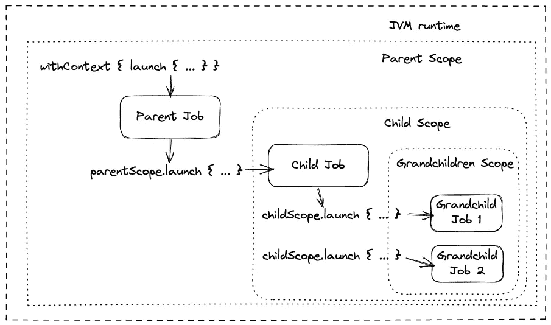

# 了解 Kotlin 协程

> 原文：<https://levelup.gitconnected.com/understanding-kotlin-coroutines-a47d89178a7f>

在本文中，我们将带您了解协程内部是如何工作的，以及 [Kotlin 协程](https://kotlinlang.org/docs/coroutines-overview.html)给我们带来了什么好处。[科特林](https://kotlinlang.org/)协程解决了 JVM 世界中一直存在的一些问题；为我们的多线程应用提供安全、可读和可扩展的解决方案。

让我们先试着理解什么是协程吧！

# 介绍

Kotlin 协程是非常轻量级的线程，能够在等待任何类型的 [IO 操作](https://en.wikipedia.org/wiki/Input/output)时暂停自己，以这种方式释放他们的平台线程，以便它可以为另一个协程做有用的工作。

由于更有效地利用了现有资源，这使得处理更加有效。

如果你读过我们的文章[“理解 Java 虚拟线程:异步编程之死”](https://theboreddev.com/understanding-java-virtual-threads/)，所有这些对你来说都很熟悉。

Java 虚拟线程和 Kotlin 协同程序在某些方面是相似的，尽管 Kotlin 已经提供了一个[结构化并发](https://theboreddev.com/understanding-structured-concurrency/)构造，这是 Java 仍然没有的。然而，有计划很快发布类似的东西(范围)，有一些工作作为 [JEP 428](https://openjdk.org/jeps/428) 的一部分完成，如果你有兴趣可以查看。

由于平台线程和操作系统线程之间的对等性，他们都试图解决 JVM 生态系统中可伸缩性方面的一个主要限制。

你可能会觉得 Java 在某种程度上抄袭了 Kotlin 协程，但是我们既不能证实也不能否认这个假设。Kotlin 协同例程于 2018 年首次发布，而 Java 虚拟线程则是最近才作为预览功能发布的；不过 [Project Loom](https://openjdk.org/projects/loom/) 从 2017 年就开始了。

因此，很难判断是谁首先提出了这个想法，尤其是当我们谈论 JVM 生态系统的时候。我们只知道 Kotlin 比 Java 更早发布了这个特性，你唯一能做的就是做出自己的结论。

之前我们在文章[“Java 的新未来”](https://theboreddev.com/a-new-future-for-java/)中提到过，我们称之为*“Java 的 kotlinization”*我们在 Java 最近的变化中看到一种趋势，倾向于提供 Kotlin 之前已经呈现的特性。这是为了让 Java 对开发者更友好，避免不必要的工作和麻烦。

在这种情况下，我们不能保证到底发生了什么。其中一些术语，如[“结构化并发”](https://en.wikipedia.org/wiki/Structured_concurrency)，最早是在 60 年代听到的，所以这在计算领域并不新鲜。

让我们看看 Kotlin 协程是如何工作的！

# Kotlin 协同程序内部

现在是时候看看 Kotlin 协程是如何工作的，以及它们在不同条件下是如何表现的。Kotlin 协程内部工作的方式是使用一种叫做[延续](https://kotlinlang.org/api/latest/jvm/stdlib/kotlin.coroutines/-continuation/)的东西。*继续*基本上允许我们从暂停的地方恢复一些工作。

它的工作方式是，当我们调用一个 *suspendable* 函数时，它的局部变量在堆栈上被创建。当该函数到达必须等待 IO 操作的点时，它将挂起自己；保存它的上下文、局部变量和它暂停的地方。

然后，底层线程将为不同的协程执行一些其他工作。一旦 IO 操作完成，协程将尝试恢复。如果没有可用的线程，它将等待，直到有线程可用，否则它将立即恢复，并从它之前离开工作的点继续。


我们将向您展示非常简单的示例，以使您容易理解我们的每个示例是如何处理我们的任务的。

对于我们的每个示例，我们将使用一段非常简单的代码来模拟一批任务，它能够在需要时自行挂起。在每个任务中，我们使用`delay`模拟 10ms 的 IO 等待，一旦完成，我们就打印该批任务的任务号以及它运行在什么平台线程和协同程序上。看起来是这样的:

```
package com.theboreddev

import kotlinx.coroutines.delay
class Coroutines {
    suspend fun process(batchName: String) {
        for (i in 1..50) {
            delay(10)
            println("Processed task $i for batch $batchName on thread ${Thread.currentThread().name}")
        }
    }
}
```

如你所见，这很简单。那么让我们来看第一个例子吧！

## 顺序任务

我们使用 Kotlin coroutines 库的事实并不意味着我们的任务总是多线程和并行运行的。我们可以使用 Kotlin 协同程序启动两个任务，它们仍将按顺序运行，例如这个测试:

```
@OptIn(ExperimentalCoroutinesApi::class)
    @Test
    fun `should run sequentially`() = runTest {
        val time = measureTimeMillis {
            val job = GlobalScope.launch {
                coroutines.process("batch a")
                coroutines.process("batch b")
            }
            job.join()
        }
        println("Completed in $time milliseconds")
    }
```

在这个测试中，我们使用`GlobalScope.launch`运行两批任务。这将创建一个新的协程来运行我们的任务，尽管两个批处理都将在相同的平台线程和协程上运行。我们可以看到，如果我们在运行该测试后检查日志:

```
Processed task 1 for batch batch a on thread DefaultDispatcher-worker-1 @coroutine#2
...
Processed task 50 for batch batch a on thread DefaultDispatcher-worker-1 @coroutine#2
Processed task 1 for batch batch b on thread DefaultDispatcher-worker-1 @coroutine#2
...
Processed task 50 for batch batch b on thread DefaultDispatcher-worker-1 @coroutine#2
Completed in 1230 milliseconds
```

为了避免不必要的混乱，我们省略了大部分日志，因为每个任务都运行在同一个平台线程和协程上，这是意料之中的。这是因为我们只定义了一个协程，在其中我们运行两个批处理的每个任务。

你可能想知道，当我运行顺序任务时有什么好处呢？当运行潜在阻塞的顺序代码时，Kotlin 协同程序仍然有很大的好处。

每当一个协程被暂停等待一个 IO 操作时，底层平台线程不必等待它的完成。相反，平台线程被分配给另一个协程，以便在此期间继续发挥作用。让我们通过一个简单的测试来证明这一点:

```
@OptIn(ExperimentalCoroutinesApi::class)
@Test
fun `should reuse platform threads when paused`() = runTest {
        val jobs = mutableListOf<Job>()
        val time = measureTimeMillis {
            withContext(Dispatchers.IO) {
                jobs += launch {
                    coroutines.process("batch a")
                    coroutines.process("batch b")
                    coroutines.process("batch c")
                    coroutines.process("batch d")
                    coroutines.process("batch e")
                }
                async {
                    coroutines.process("batch aa")
                    coroutines.process("batch bb")
                }
                async {
                    coroutines.process("batch ba")
                    coroutines.process("batch ab")
                }
            }
            jobs.joinAll()
        }
        println("Completed in $time milliseconds")
}
```

我们现在按顺序运行多个批处理，除此之外，我们在单独的协同程序中运行两组批处理，以便能够证明当按顺序运行的批处理中的协同程序暂停时，我们可以重用底层线程。

这三组任务应该同时运行，然后，我们将在结果中看到平台线程将如何为这些任务组中的任何一组工作。每当协程因为必须等待 IO 操作而放弃时，底层线程可以在其他地方重用。因此，下次恢复协程时，底层线程可能已经发生了变化。让我们在日志中看看结果。

```
Processed task 1 for batch batch aa on thread DefaultDispatcher-worker-7 @coroutine#3
Processed task 1 for batch batch ba on thread DefaultDispatcher-worker-5 @coroutine#5
Processed task 1 for batch batch a on thread DefaultDispatcher-worker-3 @coroutine#2
Processed task 2 for batch batch aa on thread DefaultDispatcher-worker-3 @coroutine#3
Processed task 2 for batch batch a on thread DefaultDispatcher-worker-5 @coroutine#2
Processed task 2 for batch batch ba on thread DefaultDispatcher-worker-7 @coroutine#5
Processed task 3 for batch batch aa on thread DefaultDispatcher-worker-7 @coroutine#3
Processed task 3 for batch batch a on thread DefaultDispatcher-worker-5 @coroutine#2
Processed task 3 for batch batch ba on thread DefaultDispatcher-worker-3 @coroutine#5
Processed task 4 for batch batch aa on thread DefaultDispatcher-worker-3 @coroutine#3
Processed task 4 for batch batch ba on thread DefaultDispatcher-worker-7 @coroutine#5
Processed task 4 for batch batch a on thread DefaultDispatcher-worker-5 @coroutine#2
Processed task 5 for batch batch aa on thread DefaultDispatcher-worker-5 @coroutine#3
Processed task 5 for batch batch a on thread DefaultDispatcher-worker-6 @coroutine#2
Processed task 5 for batch batch ba on thread DefaultDispatcher-worker-7 @coroutine#5
...
Completed in 3070 milliseconds
```

您会注意到每个批处理总是在同一个协程上运行，但是底层线程变化非常频繁。例如，“*批次 aa* ”总是在协程号 3 上运行。但是，如果您检查池中使用的底层线程，它在前五次执行中使用了多达 3 个不同的平台线程！

现在我们对调度的工作原理有了更多的了解，如果我们想并行运行它们以节省时间，我们应该怎么做呢？让我们看看我们能做什么！

## 并行任务

如果我们想并行运行它们，只需为每个批处理创建一个协程。我们的测试应该是这样的:

```
 @OptIn(ExperimentalCoroutinesApi::class)
    @Test
    fun `should run in parallel`() = runTest {
        val jobs = mutableListOf<Job>()
        val time = measureTimeMillis {
            withContext(Dispatchers.IO) {
                jobs += launch {
                    coroutines.process("batch y")
                }
                jobs += launch {
                    coroutines.process("batch z")
                }
            }
            jobs.joinAll()
        }
        println("Completed in $time milliseconds")
    }
```

我们现在并行启动两个协同程序，如果我们查看日志，我们可以看到它们现在如何使用不同的协同程序并行运行。

```
Processed task 1 for batch batch z on thread DefaultDispatcher-worker-3 @coroutine#3
Processed task 1 for batch batch y on thread DefaultDispatcher-worker-2 @coroutine#2
Processed task 2 for batch batch y on thread DefaultDispatcher-worker-3 @coroutine#2
Processed task 2 for batch batch z on thread DefaultDispatcher-worker-2 @coroutine#3
Processed task 3 for batch batch y on thread DefaultDispatcher-worker-2 @coroutine#2
Processed task 3 for batch batch z on thread DefaultDispatcher-worker-3 @coroutine#3
...
Completed in 630 milliseconds
```

你会注意到我们使用`launch`来创建一个新的协程，但是我们之前已经看到过`async`也可以用于这个目的。那有什么区别呢？

唯一不同的是`*launch*`在完成内部任务后并不返回值，它只是返回一个`[Job](https://kotlinlang.org/api/kotlinx.coroutines/kotlinx-coroutines-core/kotlinx.coroutines/-job/)`对象。然而，`[async](https://kotlinlang.org/api/kotlinx.coroutines/kotlinx-coroutines-core/kotlinx.coroutines/async.html)`返回一个`[Deferred](https://kotlinlang.org/api/kotlinx.coroutines/kotlinx-coroutines-core/kotlinx.coroutines/-deferred/)`对象，它也是一个`Job`，但是它包含一个在内部任务完成后返回的值。你可以看到`Deferred`接口是如何从`Job`延伸出来的:

```
public interface Deferred<out T> : Job
```

我们将修改前面的示例，添加两个并行任务的结果，如下所示:

```
 @OptIn(ExperimentalCoroutinesApi::class)
    @Test
    fun `should run in parallel and get values`() = runTest {
        val jobs = mutableListOf<Deferred<Int>>()
        var result: Int
        val time = measureTimeMillis {
            withContext(Dispatchers.IO) {
                jobs += async {
                    delay(100)
                    Random.nextInt(0, 100)
                }
                jobs += async {
                    delay(100)
                    Random.nextInt(0, 100)
                }
            }
            result = jobs.awaitAll().sum()
        }
        println("Completed in $time milliseconds with result $result")
    }
```

你可以看到我们现在有了一个`Deferred`对象列表。我们可以使用`[awaitAll](https://kotlinlang.org/api/kotlinx.coroutines/kotlinx-coroutines-core/kotlinx.coroutines/await-all.html)`来等待所有这些任务的完成。我们将为每个任务获得一个包含一个`Int`的`List<Int>`，一旦我们有了它，我们就可以使用`[sum](https://kotlinlang.org/api/latest/jvm/stdlib/kotlin.collections/sum.html)`来添加值。

如果我们只有一个任务返回值，而不是使用`awaitAll`，我们就必须使用`await`。这很直观，但是让我们看一个简短的例子:

```
val r = async {
  delay(100)
  Random.nextInt(0, 100) 
}
r.await()
```

话虽如此，如果我们运行上面所示的测试，我们会得到预期的结果:

```
Completed in 112 milliseconds with result 93
```

在使用`launch`的例子中，您还会注意到，我们使用`launch`方法启动了两个不同的协程，而不是`GlobalScope.launch`。这是为什么呢？让我们试着更好地理解*作用域*！

## 协程作用域

每次我们启动 Kotlin 协程时，我们都需要一个上下文来附加我们的协程。当我们使用`GlobalScope`时，我们使用的是全局作用域，它将贯穿整个应用程序的生命周期。这意味着我们的协程可以存在于应用程序的整个生命周期中。

我们被迫总是在一个上下文中运行协程，以便能够有一个更安全的并发代码。通过将协程附加到协程上下文，运行时总是知道在协程失败时该做什么。

在我们有多个嵌套协程的情况下，在一个层次结构中，每个协程都有其父级，但它可能同时也是父级，运行时将知道在失败的情况下应该取消哪些协程。这就是我们所说的[结构化并发！](https://theboreddev.com/understanding-structured-concurrency/)

在下图中，您可以清楚地看到 Kotlin 中的结构化并发是什么样子的，在 kot Lin 中，创建一个新的协程总是需要在当前作用域内创建一个嵌套作用域。



鸣谢:作者

我们的应用程序中不再有线程挂起，不再需要小心翼翼地到处泄露它们！*结构化并发*的巨大好处之一是我们可以在应用程序中定义线程的层次结构。如果我们在任何级别的任何一个孩子失败了，那么我们层次结构中的每个协程都会被取消。

**不推荐使用** `**GlobalScope**` **，**因为它不会取消我们的协程，除非应用程序关闭！请记住，默认情况下，每个启动的协程都从其父进程继承上下文。这意味着在我们在`GlobalScope.launch`中启动多个嵌套协程的情况下，它们都从它那里继承全局范围！

这是非常危险的，因为协程将永远运行，直到应用程序关闭。相反，我们应该使用`[withContext](https://kotlinlang.org/api/kotlinx.coroutines/kotlinx-coroutines-core/kotlinx.coroutines/with-context.html)`方法创建一个上下文。该方法接受一个上下文和一个 *suspend* 函数，如果我们不指定任何上下文，它将使用 Kotlin 中提供的[默认调度器](https://kotlinlang.org/api/kotlinx.coroutines/kotlinx-coroutines-core/kotlinx.coroutines/-dispatchers/-default.html)。

还有一个特定的调度器用于阻塞任务，您可以通过将`[Dispatchers.IO](https://kotlinlang.org/api/kotlinx.coroutines/kotlinx-coroutines-core/kotlinx.coroutines/-dispatchers/-i-o.html)`传递给`withContext`方法来使用它。

如果您的应用程序是 IO 绑定的，大多数情况下您将不得不使用`Dispatchers.IO`，但是，我们建议您阅读关于[现有调度程序](https://kotlinlang.org/docs/coroutine-context-and-dispatchers.html)的信息，以了解哪一个更适合您的情况。

# 结论

在本文中，我们向您深入介绍了 Kotlin 协同例程，以及它们如何帮助我们以安全、高效、简单和可读的方式运行并发代码。我们已经看到了 Kotlin 协程上下文对于我们应用程序的安全性有多重要，以及 Kotlin 协程的资源利用效率有多高。

这都是我们今天送的！我们希望你喜欢我们一起通过 Kotlin 协同程序的旅程，并希望学到一些新东西！期待很快再次见到你！

感谢阅读我们！