# 逐步了解微前端 Webpack 5 配置

> 原文：<https://levelup.gitconnected.com/understanding-micro-frontends-webpack5-configurations-step-by-step-4dd2f7d81dcb>

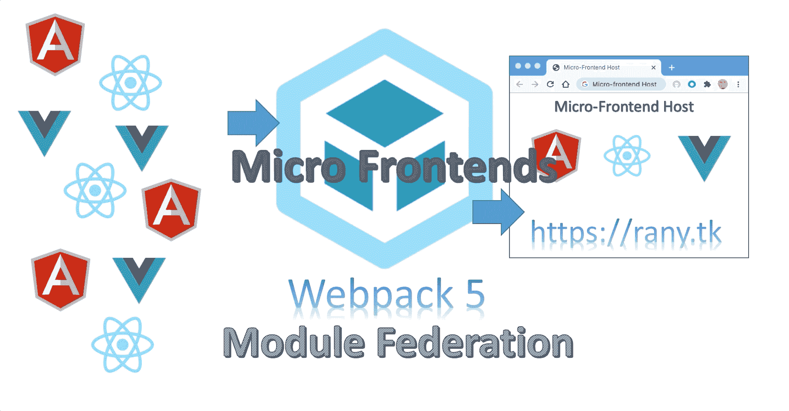

在前两篇文章中，我演示了如何构建微前端并将它们部署到 AWS。过程中，我只是让你复制 webpack.config.js 和 webpack.prod.js 的内容，没有做任何说明。在本文中，我将逐行解释 Webpack 是如何工作的。

以下是之前的两篇文章:

[](https://www.linkedin.com/pulse/micro-frontends-hands-on-example-using-react-webpack-rany/) [## 使用 React、Webpack 5 和模块联合逐步实现微前端

### 在这篇文章中，我将一步一步地创建两个微前端反应组件，并呈现一个按钮组件…

www.linkedin.com](https://www.linkedin.com/pulse/micro-frontends-hands-on-example-using-react-webpack-rany/) [](https://www.linkedin.com/pulse/deploying-micro-frontends-aws-step-using-gitlab-react-rany/) [## 使用 React、Webpack 5 和模块联合逐步将微前端部署到 AWS

### 在我之前的文章(https://levelup.gitconnected。

www.linkedin.com](https://www.linkedin.com/pulse/deploying-micro-frontends-aws-step-using-gitlab-react-rany/) 

本文的完整视频解释，请访问

===============

本文是在[https://www . LinkedIn . com/pulse/micro-frontends-hands-on-example-using-react-web pack-rany 对步骤 5 的解释。](https://www.linkedin.com/pulse/micro-frontends-hands-on-example-using-react-webpack-rany.)如果你想继续下去，你必须完成步骤 1-4。

我在下面的 Youtube 视频中解释了这篇文章

# 步骤 5.1:添加依赖关系

在接下来的 3 个步骤中，您可以跟随下面的短片

添加 webpack 和 webpack-cli

在 visual studio 代码中，右击 mfe1 并打开一个终端

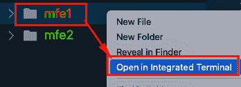

从 mfe1 目录内部运行以下命令

```
yarn add webpack webpack-cli html-webpack-plugin
```

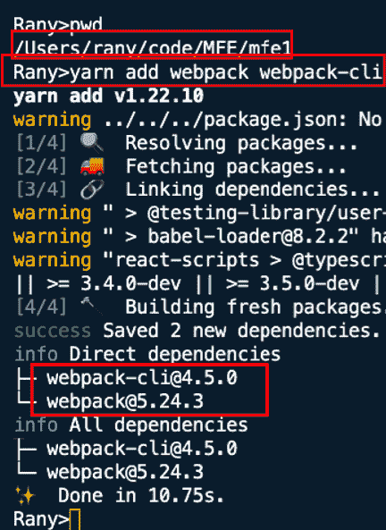

# 步骤 5.2:创建 webpack.config.js

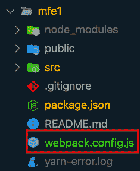

现在，让我们试着构建一下，看看会发生什么。运行以下命令:

```
yarn webpack
```

你会得到很少的错误。让我们合二为一。

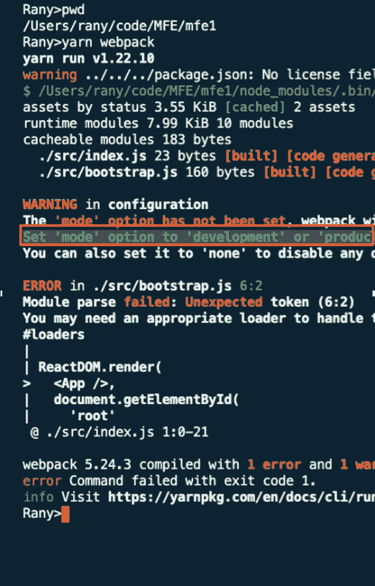

第一个错误是询问模式。Webpack 需要知道使用哪种模式来运行，以便能够相应地捆绑依赖项。让我们使用开发模式。在 webpack.config.js 中添加以下内容

```
module.exports = {
  mode: 'development',
};
```


这将处理第一个错误，并告诉 Webpack 以开发模式构建。现在，再次构建并观察左侧的文件夹。您会注意到一个名为“dist”的目标文件夹将被创建。

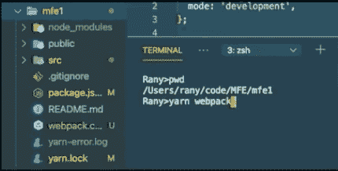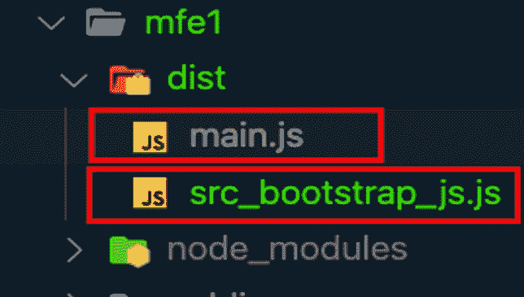

这是将由 Webpack 的构建和捆绑流程生成的文件夹，也是我们将部署到 S3 存储区的文件夹。这里发生的事情是，Webpack 将我们拥有的所有代码 index.js、bootstrap.js、App.js …以及它们的依赖项打包在 main.js 中，如您所见。

现在我们看不到模式错误，但是我们仍然对加载器错误做出反应。这些错误是因为 Webpack 需要加载器来理解 React。如你所知，浏览器只理解 CSS、HTML、ES5 和 JavaScript(目前)。JSX 和 ES6+需要一个编译器。我们用巴别塔来做这个。我将向您展示如何将这些加载器添加到配置中，但首先让我们创建一个本地服务器来查看我们的演示网站(这将是 S3 在最后配置为网站)

# 步骤 5.3 —本地服务器

要在某个端口(这里，我使用 8001)上添加本地服务器，请在 webpack.config.js 中添加以下几行

```
devServer: {
    port: 8001,
    },
```

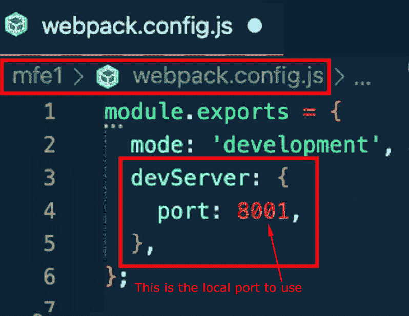

现在，运行以下命令

```
yarn webpack serve
```

这将在端口 8001 上启动一个本地 web 服务器。然而，如果你导航到 [http://localhost:8001，](https://localhost:8001,)你只会找到一个文件列表。这是因为我们还没有配置 index.html。我们将在下一步中这样做。但是，尝试浏览 main.js，您将能够看到其内容如下:

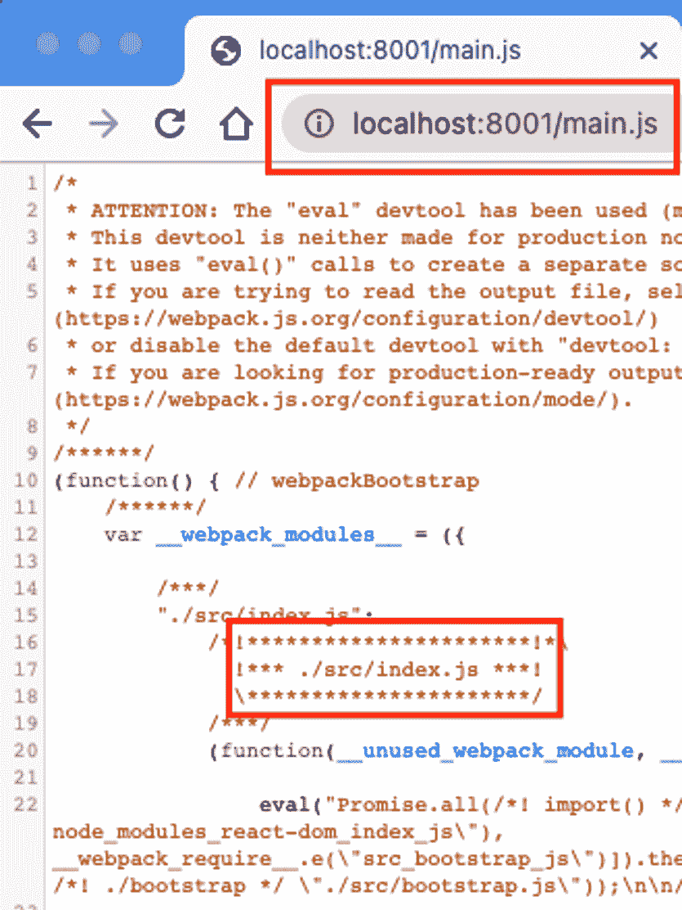

到目前为止，Webpack 按照我们在 Webpack.config.js 中的配置，在端口 8001 上创建了一个本地 web 服务器。但是，它仍然缺少浏览器的一个最小组件:index.html

# 步骤 5.4 — HTML Webpack 插件

我们需要为 webpack 导入 html-webpack-plugin 来生成 index.html，并将捆绑的 js 文件添加到其中。

```
const HtmlWebpackPlugin = require('html-webpack-plugin');
```

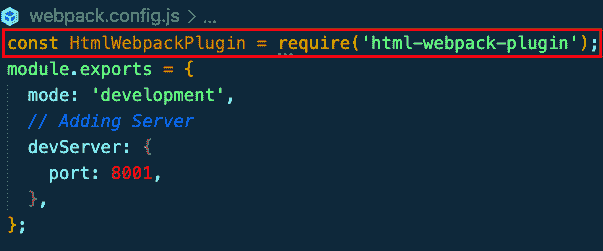

然后，我们将插件作为插件的插件数组添加到 modile.exports 对象，如下所示:

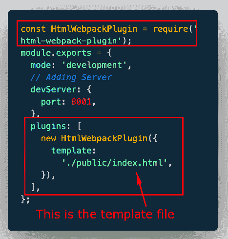

正如您在这里注意到的，我们需要包含一个模板 index.html，Webpack 将使用它来生成一个新的 Index.html 和生成的 main.js

现在，让我们使用 yarn webpack 再次构建，注意在 dist 文件夹下创建的 index.html 文件


让我们使用 yarn serve 再次启动服务器，并浏览到 [HTTP://localhost:8001](http://HTTP://localhost:8001)

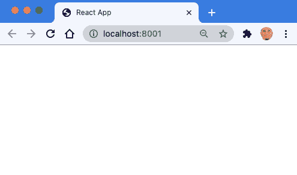

它完全是空的，对吗？不完全是，它只是不编译 React。让我们通过右键单击页面并选择 inspect 来查看源文件

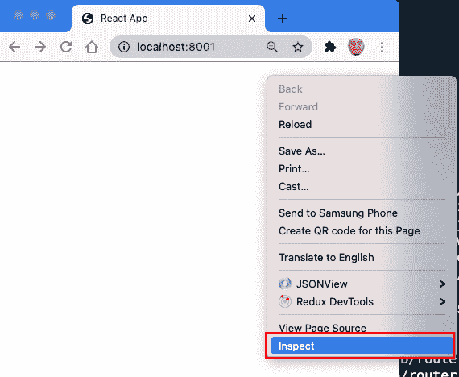

请注意，它是 React 的原始文件，但是添加了 main.js

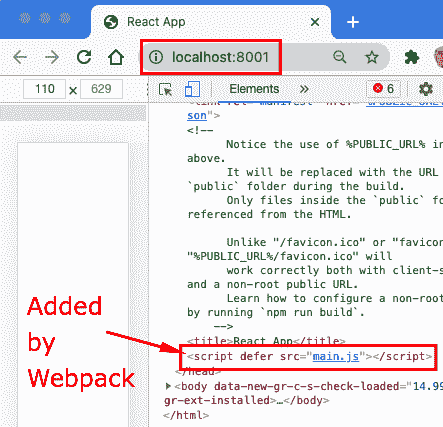

让我们修改 public/index.html 来看一些变化。

1.  删除中的所有内容，仅添加<title>，如下所示:</title>

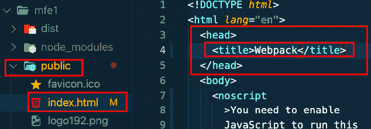

现在，当您浏览和检查时，您会注意到 Webpack 再次自动添加了 main.js

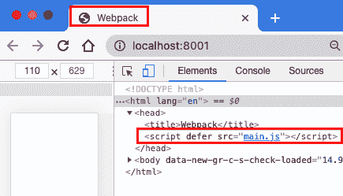

让我们给 index.html 文件添加一些内容

在的开头增加

# 微前端 1

# 如下

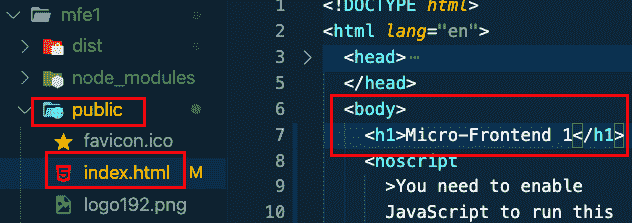

刷新页面时，最终页面将如下所示:

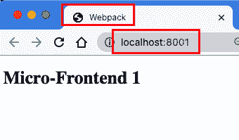

现在，是时候启用 React 了:)

# 5.5 启用 React

要启用 React，您需要 webpack.config.js 中的模块规则

首先，您要求 babel 编译所有带有 js 和 jsx 扩展名的文件

```
test: /\.js?$/,
```

然后添加将翻译成 ES5 的巴别塔加载器

```
// To Use babel Loader
        loader:
          'babel-loader',
        options: {
          presets: [
            '@babel/preset-env' /* to transfer any advansed ES to ES5 */,
            '@babel/preset-react',
          ], // to compile react to ES5
        },
```

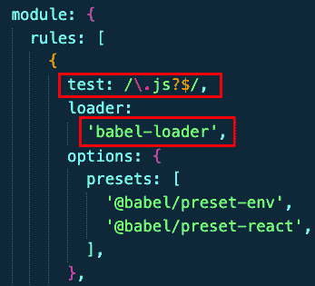

第一个选项 preset-env 转换为 ES5，第二个选项 preset-react 转换为 react

这是最后一个文件

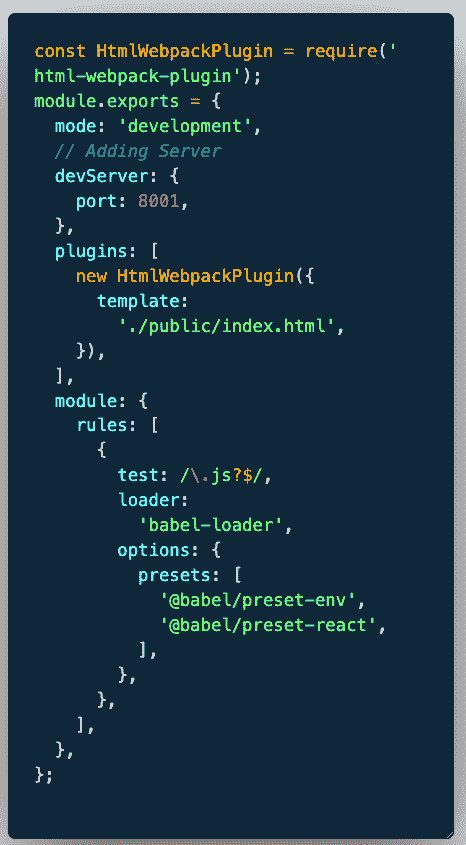

```
const HtmlWebpackPlugin = require('html-webpack-plugin');
module.exports = {
  mode: 'development',
  // Adding Server
  devServer: {
    port: 8001,
  },
  plugins: [
    new HtmlWebpackPlugin({
      template:
        './public/index.html',
    }),
  ],
  module: {
    rules: [
      {
        test: /\.js?$/,
        loader:
          'babel-loader',
        options: {
          presets: [
            '@babel/preset-env',
            '@babel/preset-react',
          ], 
        },
      },
    ],
  },
};
```

您需要重新启动 yarn webpack 服务器并刷新页面

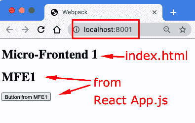

这就是为 React 配置 Webpack 的方式。在下一篇文章中，我将解释模块联合插件

# 5.6 —添加模块联合插件

在 mfe1 webpack.config.js 中，添加 ModuleFederationPlugin，如下所示

1-导入它

```
const ModuleFederationPlugin = require('webpack/lib/container/ModuleFederationPlugin');
```

2-将其添加到插件列表

```
new ModuleFederationPlugin({
```

3-为微前端、远程文件名和暴露的组件添加名称

在 ModuleFedertionPlugin 对象内部，我们将定义微前端的名称。远程/主机/容器微前端将使用该名称来呈现来自 mfe1 的暴露组件。此外，我们定义了 Webpack 将在其中捆绑公开组件的远程 js 文件名(remoteEntry.js)。

```
new ModuleFederationPlugin(
      {
        name: 'MFE1',
        filename:
          'remoteEntry.js',
      }
```


4-公开按钮组件，如下所示:

我们需要在 exposes object 中添加所有想要向其他微前端公开的组件。这将用于在其他微前端中导入组件(参考上一篇文章中的示例[https://level up . git connected . com/Micro-Frontends-step-by-step-using-react-web pack-5-and-module-Federation-e4b 9d 840 EC 71)](/micro-frontends-step-by-step-using-react-webpack-5-and-module-federation-e4b9d840ec71))

钥匙(’。/Button ')将用于导入

值('。/src/Button.js)告诉它从哪里获取组件的代码

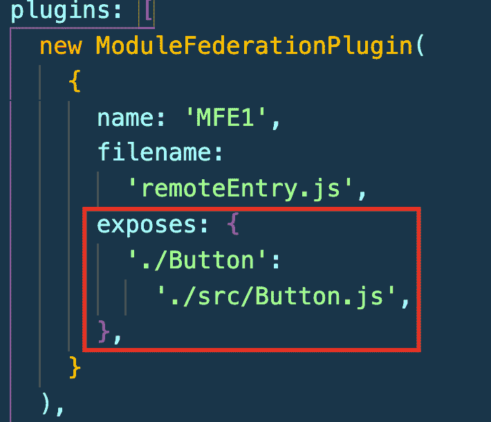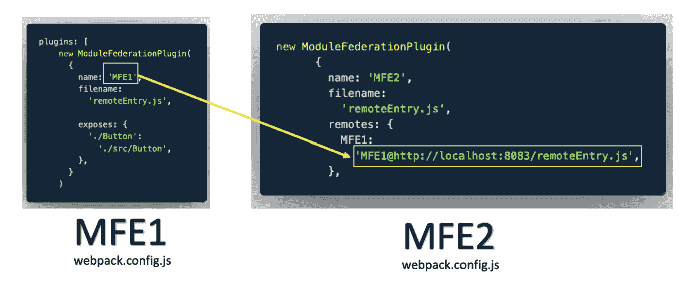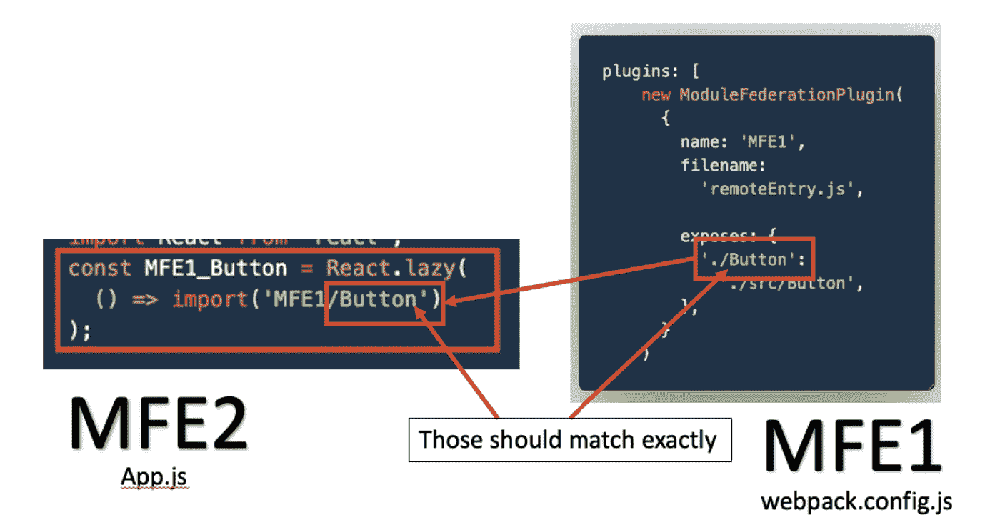

让我们使用 yarn webpack 重新构建项目，并观察 dist 文件夹。您将看到一个名为“remoteEntry.js”的新文件。这是您将需要部署到 S3 网站 bucket 以供微前端使用的内容(参见下面文章中的示例[https://www . LinkedIn . com/pulse/deploying-Micro-Frontends-AWS-step-using-git lab-react-rany](https://www.linkedin.com/pulse/deploying-micro-frontends-aws-step-using-gitlab-react-rany))

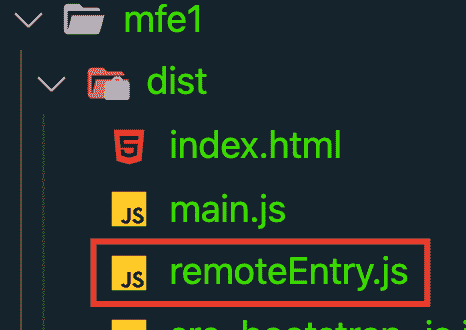

现在运行 webpack 服务器，并让它为容器配置运行

```
yarn webpack serve
```

# 6.1 —配置容器/主机

现在我们需要配置包含 mfe1 公开组件的容器。容器上的 webpack 配置文件将类似于我们为 mfe1 创建的文件，除了模块联合配置和服务器端口。我们将为它取一个不同的名称，而不是公开一个组件，我们将从 mfe1 导入一个远程组件。

1 —让我们将 webpack.config.js 从 mfe1 复制到容器中。

2 —将端口更改为 8000

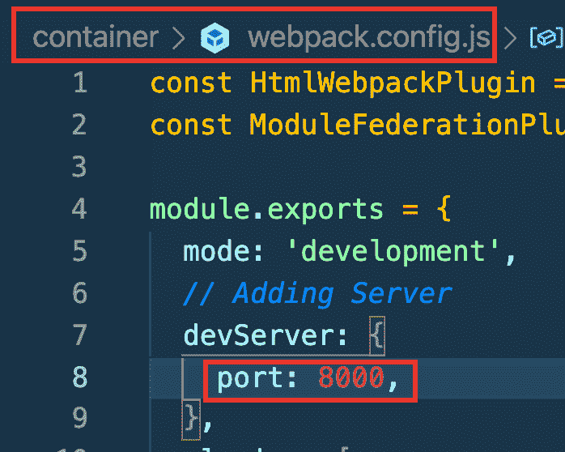

3 —将 module dependence 中的名称更改为 Container(此处不会使用)

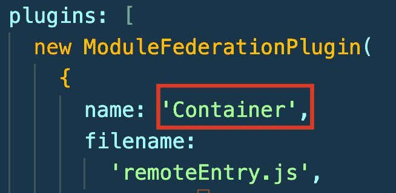

4-删除“exposes”对象并替换为 remotes

在远程中，我们将把我们给定的名称放在 mfe 1 module deference 中

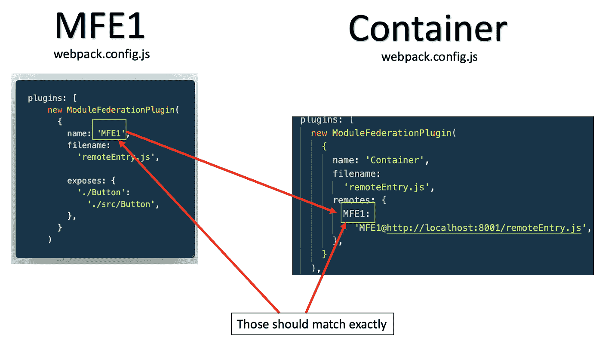

这里我们只是说 MFE1 暴露的组件可以通过[http://localhost:8001/remote entry . js](http://localhost:8001/remoteEntry.js)在容器中远程可用

现在，您可以像我们在[https://www . LinkedIn . com/pulse/micro-frontends-hands-on-example-using-react-web pack-rany](https://www.linkedin.com/pulse/micro-frontends-hands-on-example-using-react-webpack-rany)中所做的那样，在容器中导入这个组件

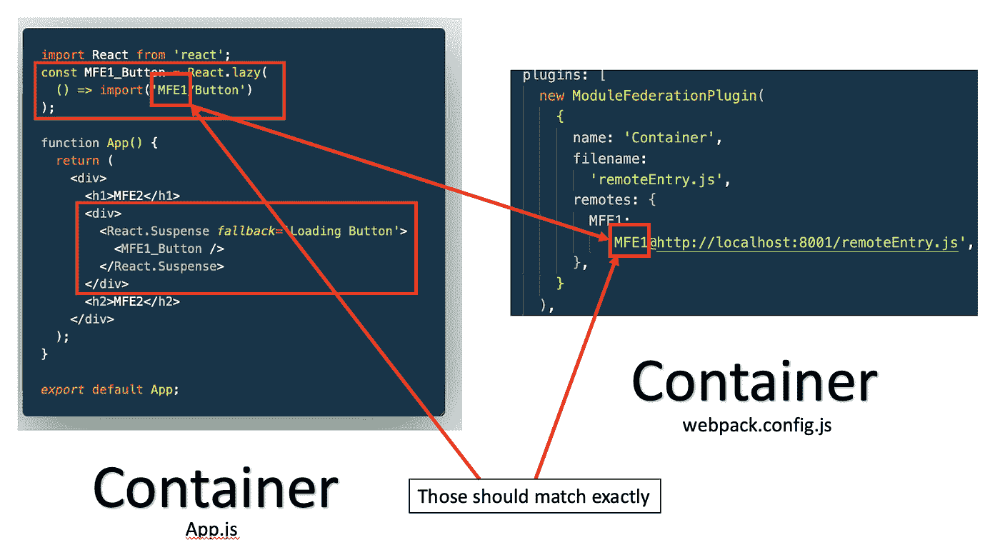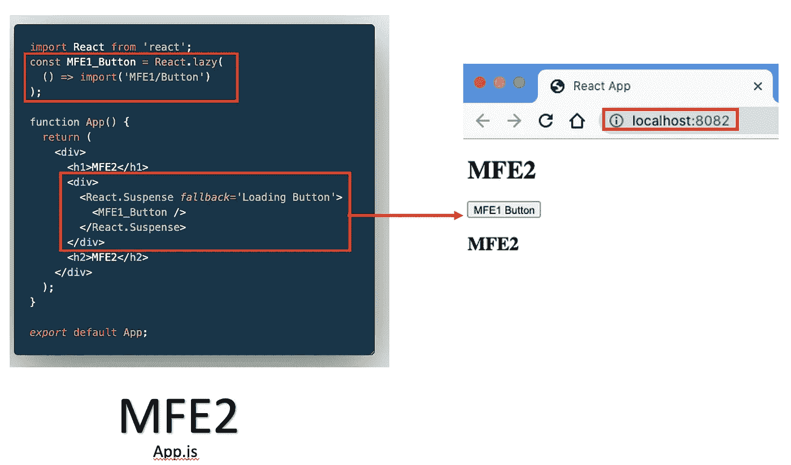

作者:

[](https://www.linkedin.com/in/ranyelhousieny/) [## 兰尼·埃尔豪斯尼，PhDᴬᴮᴰ -软件工程高级经理- Zulily | LinkedIn

### 𝙈𝙞𝙘𝙧𝙤𝙨𝙚𝙧𝙫𝙞𝙘𝙚𝙨解决方案架构师𝘼𝙒𝙎𝙎𝙤𝙡𝙪𝙩𝙞𝙤𝙣𝙨𝘼𝙧𝙘𝙝𝙞𝙩𝙚𝙘𝙩𝘾𝙚𝙧𝙩𝙞𝙛𝙞𝙚𝙙…

www.linkedin.com](https://www.linkedin.com/in/ranyelhousieny/) 

# 参考资料:

[](https://www.linkedin.com/pulse/understanding-micro-frontends-webpack5-configurations-rany/) [## 逐步了解微前端 Webpack5 配置

### 在前两篇文章中，我演示了如何构建微前端并将它们部署到 AWS。在这个过程中，我…

www.linkedin.com](https://www.linkedin.com/pulse/understanding-micro-frontends-webpack5-configurations-rany/) [](https://www.linkedin.com/pulse/understanding-micro-frontends-webpack5-module-step-rany) [## 逐步了解微前端 Webpack5 模块联合配置

### 上一篇文章，https://www.linkedin。

www.linkedin.com](https://www.linkedin.com/pulse/understanding-micro-frontends-webpack5-module-step-rany)