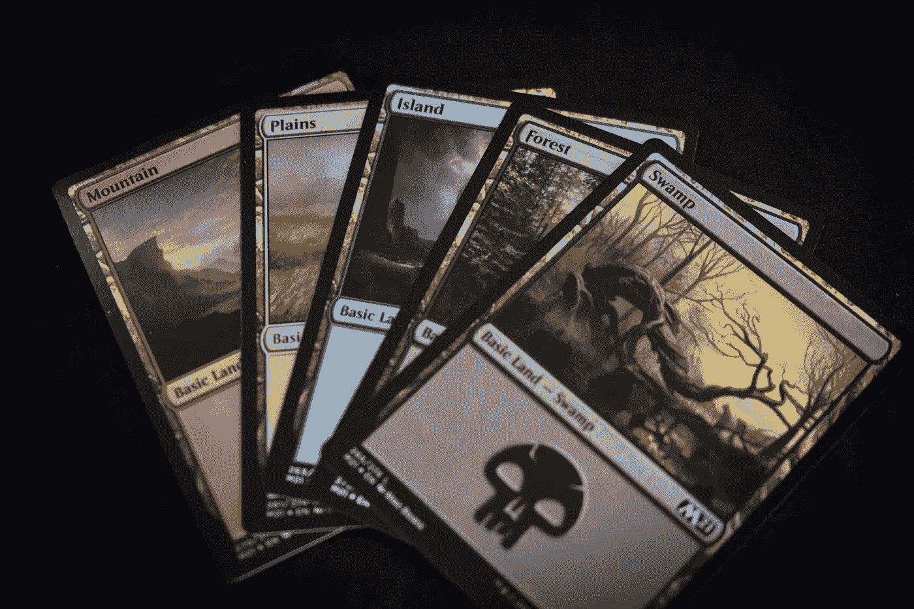

# 理解 NFT 和所有的炒作。

> 原文：<https://levelup.gitconnected.com/understanding-nfts-and-all-the-hype-b2b67d003818>

## 什么是 NFT，它们是如何工作的？为什么人们会在上面花费数百万？

迈克尔·泽兹奇在 [Unsplash](https://unsplash.com/collections/sXfLKL7prNc/nft?utm_source=unsplash&utm_medium=referral&utm_content=creditCopyText) 上的照片

NFT 代表**不可替代代币**。

> **“可替代性**是指一项资产可以与具有相同价值的类似资产进行交换或替代的能力”。

假设你有一张 10 美元的钞票，你可以把它们换成 10 张一美元的钞票，尽管形式不同，你的钱的价值仍然是 10 美元，因此这被称为**可替换的**。

**不可替代令牌**正好相反，意思是它们是独一无二的，不能被其他任何东西替代。所以基本上他们代表了独特物品的所有权。

这里列出了一些你可能遇到过的 NFT 氏症。

毕普以 6900 万美元卖出了一辆 NFT。

Twitter 创始人杰克·多西拍卖了他的推文，出价达到 250 万美元。

[勒布朗詹姆斯高光以 20 万美元售出](https://www.cnbc.com/2021/02/28/230-million-dollars-spent-on-nba-top-shot.html)。

从艺术、音乐、视频，甚至推特，一切都在拍卖中以旧换新。所以所有权用区块链网络 T21 来表示。

首先要理解 NFT 的工作我们需要理解以下几点:

1.  加密货币。
2.  比特币。
3.  以太坊。

# 加密货币:

古代使用的第一套货币基本上是一个账本，记录了谁借出了特定的商品，借了多少，借给了谁，这基本上是建立在信任的基础上的。目前世界上广泛使用的主要货币形式无非是政府借出的现钞和硬币，这也是基于人们对政府的信任。所以在这里，政府拥有对货币的控制权和监管法律的权力。就股票市场而言，证券交易委员会负责监管法律。

照片由来自 [Pexels](https://www.pexels.com/photo/bitcoins-and-u-s-dollar-bills-730547/?utm_content=attributionCopyText&utm_medium=referral&utm_source=pexels) 的[大卫·麦克比](https://www.pexels.com/@davidmcbee?utm_content=attributionCopyText&utm_medium=referral&utm_source=pexels)拍摄

在 2008 年金融危机期间，我们有必要开发一种新的、更安全的货币形式，它不受任何机构或政府的监管。

> **加密货币**是一种数字货币，可以用来在线购买商品和服务。

# 比特币:

**比特币**是中本聪在 2008 年推出的一种加密货币。

**区块链**是使加密货币能够工作的技术。区块链可以描述为相互链接的计算机的集合。在比特币的例子中，我们有一个在线账本，其中包含了曾经发生的所有交易，这个账本分布在一个计算机网络 ***【区块链】*** 中，因此如果一台计算机发生了任何变化，其他计算机也会反映出来。想象一下，在银行的情况下，我们有一个特定账户的交易列表，但在比特币的情况下，我们有一个曾经发生的所有交易的列表。

照片由 [Pixabay](https://www.pexels.com/@pixabay) 从[像素](https://www.pexels.com/)拍摄

区块链中的计算机或区块不断更新和验证，因此如果任何一个区块中有错误，它会在所有区块中显示或更新。当进行交易时，它由区块链的所有计算机验证，只有在区块链的所有计算机成功验证之后，交易才被认为是成功的。

因此，如果它不得不被黑客攻击来改变一笔交易，那么所有其他改变了分类账的计算机都需要在短时间内被黑客攻击。因此，这使得整个系统安全，不受操纵。所以在比特币的情况下，分类账包含了所有已经发生的交易。 ***(谁在什么时间拥有什么)*。**比特币区块链上的一切都是**只写的**因此没有任何东西可以还原或更改，并且**比特币的最大数量**固定为**2100 万** **比特币**因此这使得这种形式的货币不受通货膨胀和伪造的影响。

[行政长官](https://unsplash.com/@executium?utm_source=unsplash&utm_medium=referral&utm_content=creditCopyText)在[广场](https://unsplash.com/s/photos/bitcoin?utm_source=unsplash&utm_medium=referral&utm_content=creditCopyText)拍照

比特币使用 1993 年发现的**工作证明**算法来对抗垃圾邮件，但在 Satoshi 将其用于比特币之前，它并未被使用。因此它被用于在网络中的所有计算机之间达成共识。所以它的工作原理是让所有的积木或电脑**解决一个密码难题**。所以这本质上叫做**比特币挖矿**。因此，比特币矿工解决密码难题，第一个解决难题的人获得挖掘奖励。这种挖掘是**验证比特币交易**所必需的。比特币挖矿消耗了大量电力***(121 TWh)***这大约是世界总电力消耗的百分之一。

# **以太坊:**

Vitalik Buterin 在 2013 年发表了一份关于以太坊的白皮书，解决了比特币的缺点。维塔利克认为，我们可以把计算机程序放在一起，也就是所谓的智能合约 T21，而不是在区块链把总账放在一起。

[行政长官](https://unsplash.com/@executium?utm_source=unsplash&utm_medium=referral&utm_content=creditCopyText)在 [Unsplash](https://unsplash.com/s/photos/ethereum?utm_source=unsplash&utm_medium=referral&utm_content=creditCopyText) 上拍照

智能合约自动执行彼此类似于自动售货机，当你从自动售货机购买一些食物时，你是在自动进行交易，而不必信任人类或实体。所以我们的任何交易都会自动记录在区块链里。

> 因此，在智能合约中，我们记录了谁买了什么，花了多少钱。这就是 NFT 的作品，**当有人买了一幅 NFT 的作品，它会被记录在区块链上，告诉人们谁是它的主人。因此，NFT 代表了独特物品的所有权。**

# 那么 NFT 的实际价值是多少:

NFT 的市值从 2018 年的 4100 万美元攀升至 2021 年的 20 亿美元。

瑞安·昆塔尔在 [Unsplash](https://unsplash.com/@ryanquintal?utm_source=unsplash&utm_medium=referral&utm_content=creditCopyText) 上拍摄的照片

**任何艺术家都可以将他们的艺术转化成 NFT** 。所有对他们的炒作大多是由社交媒体和新闻产生的。这有点像一些原画被高价出售，因为买家看重这些艺术品，同样，NFT 的作品被高价出售，因为它们稀缺且独一无二，因此需求很大。

# 结论:

我们刚刚了解了 NFT 的工作和他们目前的应用。但是在**未来**可能就不一样了。NFT 可以有更好的应用，想象一下把你的出生证明、土地所有权文件或学位证书存储为 NFT 的，因为它们存储在区块链，你永远不用担心丢失或被篡改。

你认为 NFT 的未来会是怎样的？

*本文仅供参考，不应视为财务或法律建议。在做任何财务决定之前，请咨询财务专家。*