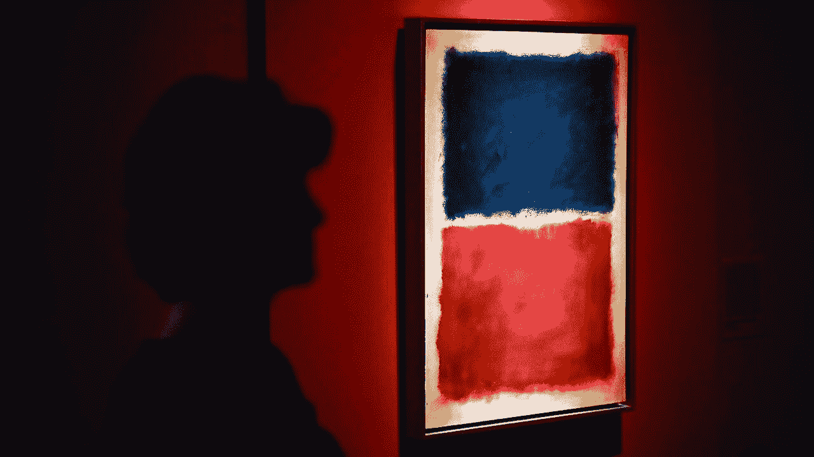
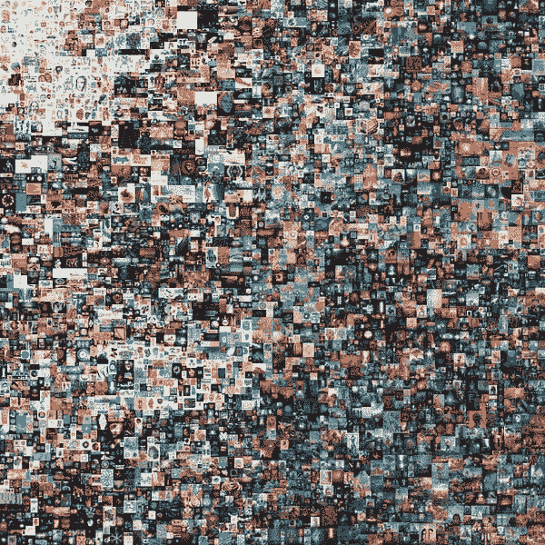

# 了解不可替换令牌(NFT)

> 原文：<https://levelup.gitconnected.com/understanding-non-fungible-tokens-nfts-1c3912f8ac1>

深入了解最近的秘密收藏品或 NFT 热潮，并从事实中分离炒作。

图片来源:[网飞](https://www.netflix.com/title/81406333)

我最近在网飞看了《[让你看:一个关于假艺术的真实故事](https://www.monstersandcritics.com/movies/netflixs-made-you-look-what-is-this-documentary-about/)，它讲述了一个价值数百万美元的假画骗局，欺骗超级富豪购买杰森·布拉克、马克·罗斯科和其他标志性抽象表现主义艺术家的伪造作品。行骗艺术家将他们的伪造艺术品卖给 Knoedler 画廊的 Ann Freedman，然后他(不)故意卖给富人，尽管出处(所有权历史)可疑。这部纪录片提出了弗里德曼参与的犯罪行为的问题，但最让我印象深刻的是，要证明一些东西在现实世界中是真实的是多么困难。除了材料分析以匹配画作/画框的年代之外，鉴定来自于受人尊敬的艺术史学家和鉴定人对每位艺术家风格的分析(即目测)。

鉴于最近围绕 NFT(不可替代代币)的大肆宣传，这部纪录片看起来很及时。就在几天前，数字艺术家[皮普尔以 6900 万美元](https://www.cnbc.com/2021/03/11/most-expensive-nft-ever-sold-auctions-for-over-60-million.html#:~:text=A%20non%2Dfungible%20token%20by,NFT%20ever%20sold%20at%20auction.)的价格出售了他的 NFT 艺术品，此前有消息称[杰克·多西提出出售有史以来第一条作为 NFT](https://www.cnbc.com/2021/03/06/jack-dorsey-is-offering-to-sell-the-first-tweet-as-an-nft.html) 的推文。但是到底什么是 NFT，为什么人们要花费数百万去购买一些数码产品呢？在本文中，我们将定义什么是 NFT，简要回顾一下它的历史，并消除围绕 NFT 的一些误解。

图片来源:[图片来源](http://beeple-crap.com/nft)

# 可替代性

为了理解不可替换的令牌，我们需要首先掌握可替换性的概念。可替代性被定义为"[单个单元本质上是可互换的，并且其每个部分与另一个部分](https://en.wikipedia.org/wiki/Fungibility)无法区分的属性可替代资产的最好例子是法定货币。我的 1 美元钞票与我银行账户中的 1 美元钞票或者你可能拥有的 1 美元钞票价值相同。我可以把我的 1 美元钞票和你的交换，而不改变它使用的基本特征，从而使货币变得可替代。

另一方面，我们有不可替代的资产。在现实世界中，只要看看你拥有的东西就知道了:你最喜欢的艺术家的演唱会上的签名 t 恤，你珍贵记忆的宝丽来相册，或者你买的体育赛事门票。这些项目都不能像货币那样互换。

然而，可替代性概念并不总是二元的。让我们以一场体育比赛的门票为例。有些人可能会认为，如果门票在同一区域，它们是可互换的(例如，另一个人的球场边门票)，但在其他情况下是不可互换的(例如，足球比赛中 50 码线处的座位与球门柱后面的座位)。当我们将可替代性的概念扩展到数字资产时，请记住这些细微差别。

# 不可替代的数字资产

对数字资产的一个常见误解是，由于互联网支持全球访问和简单的共享方式(如复制图像)，数字资产本质上并不稀缺，因此不可替代。只要看看这个网页的网址就能消除这种想法。我们已经习惯了在各种社交网络上以域名和唯一标识的形式出现的数字不可替代资产。另一个很好的例子是游戏中的资产。许多流行的免费游戏，如《堡垒之夜》和《英雄联盟》,出售角色服装或皮肤(不可替代的资产)来增加收入。事实上，在 2018 年，[堡垒之夜积累了 24 亿美元的收入](https://www.theverge.com/2019/1/16/18184302/fortnite-revenue-battle-pass-earnings-2018)，大部分来自销售皮肤和表情。

那么，如果我们已经拥有不可替代的数字资产，是什么让不可替代的*令牌*变得特殊呢？由于位于区块链上，NFT 为基础数字资产提供了一些理想的特征:

*   **标准化:**区块链提供了一种通过代币表示不可替代资产的标准方式，允许开发者创建新的市场，为买家和卖家提供一种通用的方式来交换不同类型的资产(例如游戏物品的数字艺术)
*   **可交易性:**一旦资产被令牌化，它就可以在区块链上进行交易，而不像其他数字资产那样需要在直接域之外进行协调(例如，通过第三方市场销售堡垒之夜商品)
*   **出处:**所有权的历史可以在区块链上查看和证明。这些信息保留在区块链，不能被中央实体销毁。
*   **可编程性:**NFT 可以通过智能合约进行编程，以复杂的机制进行烘焙(例如，CryptoKitties 在智能合约上存储其独特的数字基因组，该基因组驱动其外观及其后代的遗传组成)

# NFT 标准

虽然出现了非基于以太坊的 NFT 标准(例如 EOS、Cosmos)，但绝大多数 NFT 都属于以下以太坊标准:

*   [**ERC-721**](http://erc721.org/) :由 [CryptoKitties](https://www.cryptokitties.co/) 首创的首个 NFT 标准。ERC-721 定义了拥有和交易唯一令牌的接口。令牌保存了其唯一标识符与所有者地址的映射，还实现了一个`transferFrom`接口，以可编程的方式交换 NFT。
*   [**ERC-1155**](https://enjin.io/about/erc-1155) :由[金恩](https://enjin.io/)团队开发，ERC-1155 定义了一个多令牌标准，将类的思想引入到资产中。这使得开发人员能够捕获更复杂的表示，而不仅仅是资产和令牌之间简单的一对一关系。一个经典的例子是游戏中不同类别的物品。ERC-1155 可以代表不同类型的项目(如剑，枪，盾牌，盔甲)，这些项目是半可替换的，类似于我们在物理世界中查看同一部分门票的方式。这有利于大规模交易，而不是必须为每个项目创建一个新的合同。由于 ERC-1155 是 ERC-721 的超集，这里的优点是表示和批量传输的效率。

请注意，除了所有权、资产分类和转让机制之外，这些标准并没有规定太多。这允许开发人员通过元数据丰富每个 NFT 令牌，以体现其令牌的特殊功能。这可能包括资产的特征(例如，隐猫繁殖的速度)或视觉效果(例如，资产看起来像什么)。由于以太坊的存储和性能限制，大多数 NFT 将这些元数据存储在区块链之外，并且只在契约本身中保存对这些元数据的引用。

# NFTs 的历史&我们在哪里

NFTs 的第一次尝试实际上始于比特币网络，使用的是[色币](https://en.bitcoin.it/wiki/Colored_Coins)。来自幼虫实验室的[密码朋克](https://www.larvalabs.com/cryptopunks)在以太坊上紧随其后，创造了 10，000 个可收集的朋克，并启发了 ERC-721 标准的创建。2017 年底，CryptoKitties 正式将 NFTs 纳入了繁殖机制的游戏化，并为繁殖者创造了一个出售稀有猫的市场。围绕 NFT 有一个小的炒作周期，一些加密猫售价高达数百 ETH(例如[创始人猫](https://opensea.io/assets/0x06012c8cf97bead5deae237070f9587f8e7a266d/18)、[龙](https://opensea.io/assets/0x06012c8cf97bead5deae237070f9587f8e7a266d/896775))，它们与加密货币市场的其余部分一起崩溃。

现在，在 2021 年，在可替代代币领域活动加剧的 DeFi 夏季之后，NFT 准备卷土重来，用新资产换取大量资本。尽管如此，我们仍处于 NFT 生态系统发展的早期，需要像 ICO 狂热时期那样进行一些修正。我们已经看到加密艺术、游戏(物品和虚拟土地)以及其他数字资产，如 Tweets 被铸造成 NFT。最近，我遇到了一个有趣的尝试，利用 NFTs 对比特币基地 IPO 进行独家分析。就个人而言，我很有兴趣看到生态系统如何超越市场，进入众筹、知识产权保护以及广告和订阅之外的货币化计划领域。

一些关键人物值得关注:

*   [OpenSea](https://opensea.io/)
*   [散列表](https://www.thehashmasks.com/)
*   [分散土地](https://decentraland.org/)
*   [金恩](https://enjin.io/)
*   [蜡](https://on.wax.io/wax-io/)
*   [幻影](https://phantasma.io/home)

# 最后的话

在 NFT 热潮中，我经常听到批评者认为数字资产毫无价值。为什么会有人花几千美元买一只数码猫？为什么 crypto art 在我可以截图在网上免费分享的情况下价值百万？NFT 一文不值！

对于每一个 NFT 项目突然获得巨大关注这一点，都有一些合理的批评。但是，和 ICO 热潮一样，我相信市场最终会自我修正，增加的关注最终会结出一些有用的项目。最大的误解可能是稀缺性本身推动了价值。也许理解 NFT 背后推动力的关键是*可证明的*稀缺性。

毕竟，非功能性食物和我们已经习惯的东西没有什么不同。人们已经在网上花了数千美元购买稀有物品，就像我们在堡垒之夜和其他游戏中看到的那样。至于艺术，只要看看我们开始这篇文章的纪录片就知道了。是什么让伪造的波拉克和罗斯科与真品相比毫无价值？嵌入在这篇文章中的罗斯科画作的网飞图片的价值如何？推动价值的不仅仅是稀缺。是的，我们可以轻松地在网上复制和粘贴照片，但赋予原创艺术品价值的是其可证明的稀缺性。换句话说，波拉克或罗斯科确实画出了那些名作，这一事实赋予了作品价值。

不要仅仅因为 NFT 热就把非功能性测试作为一个整体。我们会看到一些流氓项目，但可能会有一些实际效用和价值的宝石，可能会开启新的生态系统。

*免责声明:这篇文章不是投资或财务建议。这里表达的所有观点都是我自己的。*