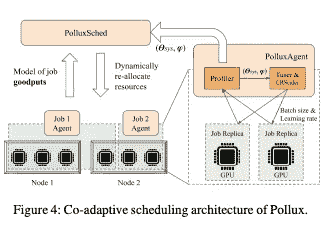

# 理解 Pollux:有效输出优化深度学习的协同自适应集群调度

> 原文：<https://levelup.gitconnected.com/understanding-pollux-co-adaptive-cluster-scheduling-for-goodput-optimized-deep-learning-a900b56bd528>

Pierre Bamin 在 [Unsplash](https://unsplash.com?utm_source=medium&utm_medium=referral) 上拍摄的照片

当谈到优化训练深度学习模型的速度时，一个常见的智慧是增加*吞吐量，即*每秒训练的步数。这可以通过增加培训工人的批量大小或在分布式培训期间使用更多工人(即增加总批量大小)来优化。然而，Carnegie Mellon 大学 Eric Xing 团队的乔等人最近的一项研究认为，单独的*吞吐量*可能不是衡量大型模型训练效率的良好指标，因为模型训练的最终目标是在一定时间内优化训练目标(例如总损失)；仅最大化吞吐量可能最终需要更多的*时期*(即处理所有训练样本的迭代)来收敛到最佳目标。

在他们题为[Pollux:Co-adaptive Cluster Scheduling for good put-Optimized Deep Learning](https://arxiv.org/abs/2008.12260)的论文中，作者定义了一个名为 *goodput* 的新指标，该指标结合了吞吐量和效率，以在实现训练目标方面取得进展。他们还为单个工人和培训集群提出了一个共同适应的调度集群，以优化深度学习的*有效产出*。

具体来说，*有效产出*被定义为*吞吐量*和统计效率的乘积，统计效率被建模为使用总批量 *M* 对基准批量 *M0 的每个训练示例所取得的进展量。*对于基于 SGD 的训练，这个量可以用梯度噪声标度(GNS) [1]来表示，它可以在每次迭代期间进行分析评估。GNS 很大程度上依赖于训练超参数，例如学习率和模型训练中的当前状态。例如，作者发现，在接近收敛时，随机梯度具有比噪声相对更低的信号，因此增加批量大小在以后的训练中可能更有用。学习率在决定训练的总批量时也起着重要的作用。一种简单的启发式方法是随着批量的增加线性缩放学习速率，然而，在实践中经常使用更复杂的缩放规则，例如平方根缩放和逐步缩放。先前[2]也研究了基于资源、GNS 和超参数动态调整批量大小的相互依赖性。

Pollux 论文最重要的贡献之一是，它对分布式训练任务采取了整体观点，既考虑了每个训练任务的特征，又考虑了用于训练的分布式计算基础设施。他们通过在设计中使用两个实体来实现这种调度:首先，一个 PolluxAgent 与每个作业一起运行，并调整其批处理大小和学习速率，以便有效地利用工人；PolluxAgent 还定期向 PolluxSched 报告其作业的有效输出功能。第二，PolluxSched 定期优化集群中所有作业的资源分配，考虑每个作业的当前有效吞吐量函数和集群范围的资源争用。

该论文的另一个卖点是，它在设计中考虑了许多实际因素，并且所提出的算法可以轻松地插入任何工业云基础架构。例如，他们的调度器在考虑通信和反向传播计算之间的重叠时，对多工作者训练环境中的同步开销进行建模；他们模拟了将作业重新分配到不同 GPU 的代价，以及当两个作业被分配到同一个节点时它们竞争网络资源的代价。此外，它们的调度器还支持非适应性作业，在这种情况下，用户可能希望运行具有固定批处理大小的作业。

更多细节请参考原论文。作者还在 https://github.com/petuum/adaptdl/tree/osdi21-artifact[开源了他们的代码。](https://github.com/petuum/adaptdl/tree/osdi21-artifact)

[1] Sam McCandlish，Jared Kaplan，Dario Amodei，OpenAI Dota 战队。大批量训练的经验模型。CoRR，abs/1812.06162，2018。

[2] [林海滨](https://arxiv.org/search/cs?searchtype=author&query=Lin%2C+H)，[杭张](https://arxiv.org/search/cs?searchtype=author&query=Zhang%2C+H)，[马逸飞](https://arxiv.org/search/cs?searchtype=author&query=Ma%2C+Y)，[佟鹤](https://arxiv.org/search/cs?searchtype=author&query=He%2C+T)，[张之](https://arxiv.org/search/cs?searchtype=author&query=Zhang%2C+Z)，[盛闸](https://arxiv.org/search/cs?searchtype=author&query=Zha%2C+S)，[李牧](https://arxiv.org/search/cs?searchtype=author&query=Li%2C+M)，弹性分布式培训动态小批量 SGD:在资源的边缘地带学习，[https://arxiv.org/abs/1904.12043v2](https://arxiv.org/abs/1904.12043v2)