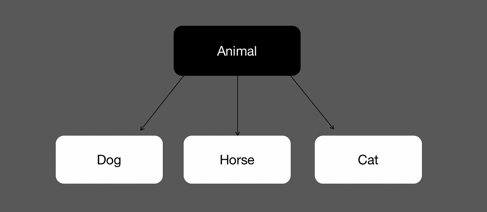
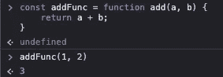
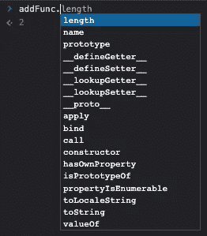
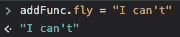
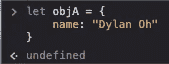
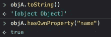
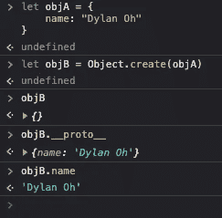

# 理解 JavaScript 中的原型继承

> 原文：<https://levelup.gitconnected.com/understanding-prototypal-inheritance-in-javascript-8e004656d9ca>

[Jexo](https://unsplash.com/@jexo?utm_source=medium&utm_medium=referral) 在 [Unsplash](https://unsplash.com?utm_source=medium&utm_medium=referral) 上的照片

***原型继承*** 是人们开始学习 JavaScript 时最困惑的事情之一。在这篇文章中，我将让你深入了解什么是原型继承，它是如何工作的，以及它与经典继承有何不同。我将试着用一种不太专业的方式来解释，让你们理解这个话题。

我们首先要理解抽象的概念。抽象是封装您不想向外部世界公开的数据。经典继承在 Java 等面向对象编程语言中很常见，主要有两种抽象:对象和类。对象是现实世界实体表示的抽象(具有最低层次的抽象)，而类是一个对象或另一个类的抽象。还是，迷惑？让我们看一个图表:

让我们把狗、马、猫想象成物体，它们是世界上真实实体的代表，因此它们不那么抽象。动物。是继承这些对象的类，并且更加一般化。在这种情况下，动物类比动物对象具有更高的抽象层次。

这里不详细讨论面向对象编程，因为这不是今天的主题，如果你们对以后的文章感兴趣，我会写一些关于它的内容。

原型继承怎么样？它只有一个抽象层次:对象。你总是听到人们说:“在 JavaScript 中，几乎所有的东西都是对象。”嗯，技术上来说是真的。你可能会说，我认为函数不是一个对象，对吗？函数是 JavaScript 中的一个可调用对象。让我给你看一个例子:

一个将两个数相加的函数，看起来有效。是时候通过键入一个点来显示该函数的真实颜色了:

有一些属性和方法与这个“函数”相关联。您还可以为其分配新属性:

JavaScript 中的对象不是从类中创建的(这里我们不是在讨论 ES6 类)，只是为了创建一个新对象(无论如何)或者从另一个对象中创建。这里有一套完整的语法，可以用来创建一个 JavaScript 对象:[如何在 JavaScript 中创建对象](https://www.freecodecamp.org/news/a-complete-guide-to-creating-objects-in-javascript-b0e2450655e8/)。

我刚才说了我可以用 JavaScript 从头开始创建一个新对象吗？让我们来看看:

您创建了一个对象，并赋予它一个名为“name”的属性。但是，您可能还会意识到，您可以访问一些在创建对象时没有给出的属性和方法。

所有这些都由名为 __proto__ 的访问器属性访问，该属性使您可以访问创建您的对象的所有属性和方法。让我们从 objA 对象创建一个新对象:

嘿，我实际上是从 objA 那里得到的名字属性！这是它在纯文本中的工作方式:当你试图访问一个对象的属性时，它将首先检查它自己，不管它是否有这个属性。如果没有找到，它将通过访问器 __proto__(这是您创建的对象，在本例中为 objA)向上一级到达您的原型。如果在 objA 中仍然找不到这个属性怎么办？它将再次上升一级以找到该属性。创建 objA 的原型是 JavaScript 基本对象 Object.prototype，这称为原型链，Object.prototype 是链的末端。如果试图访问 Object.prototype 的原型，将会得到一个空值。

这就是今天的文章，我希望这能让你了解原型继承是如何工作的。请关注我关于编程、开发人员生产力和更多主题的未来文章！