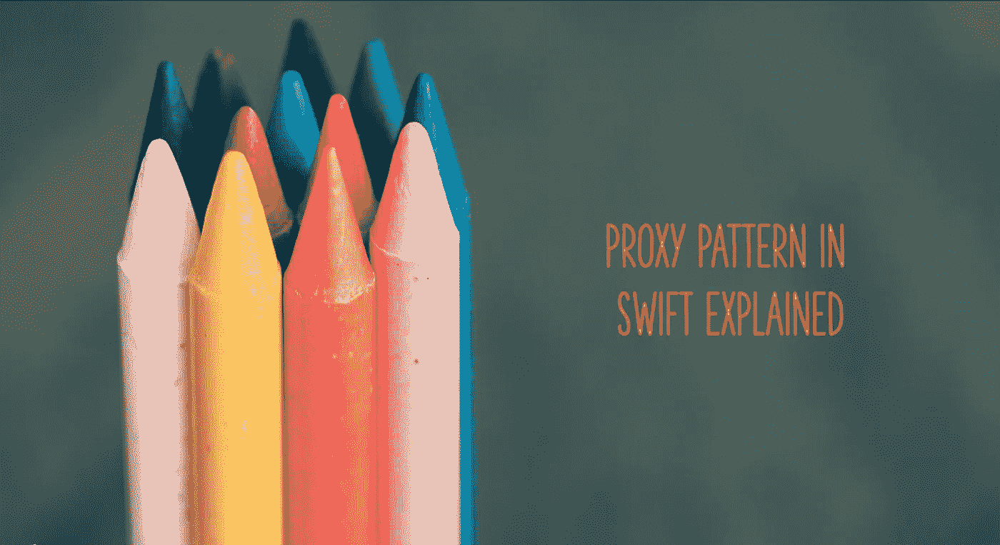
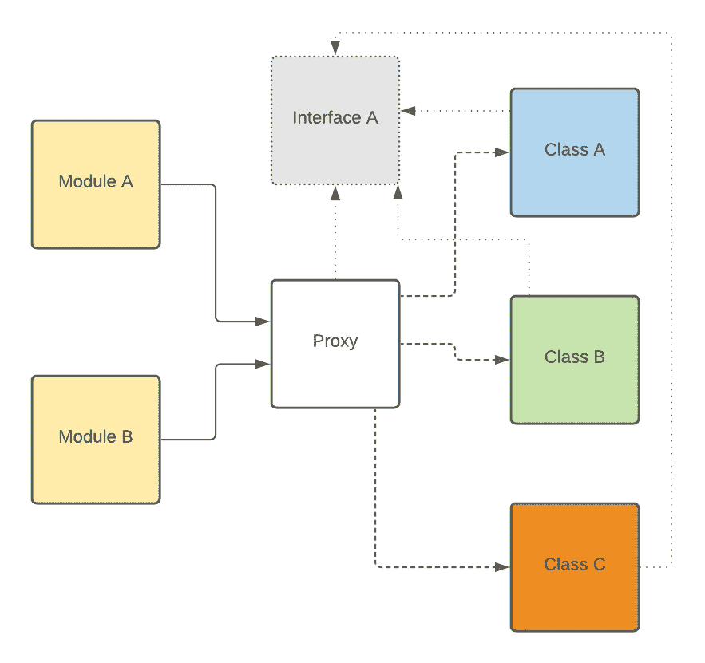
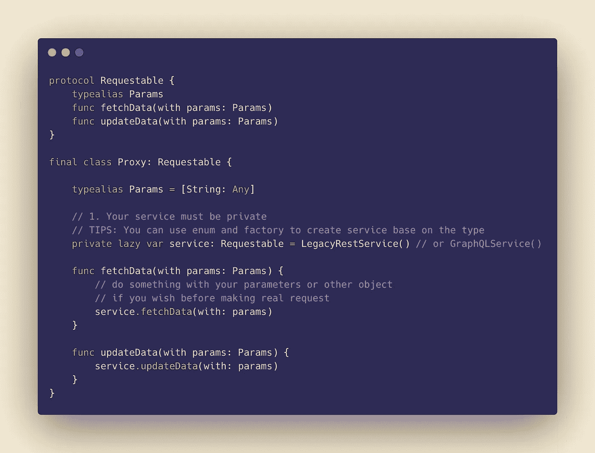
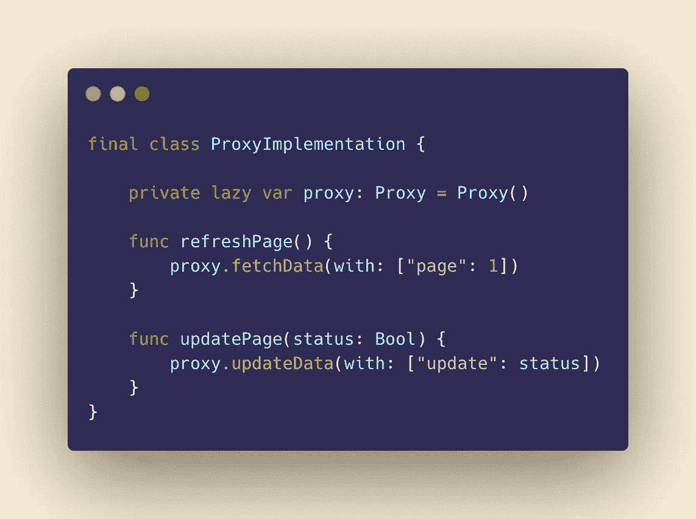

# 在 5 分钟内了解 Swift 中的代理模式

> 原文：<https://levelup.gitconnected.com/understanding-proxy-pattern-in-swift-within-5-minutes-3b9ae19a6c99>

作者声明:Michael Abadi S .

代理模式是少数几个被低估的模式之一，在 iOS 中没有人真正谈论它。**代理**模式是一种结构化设计模式，允许您为另一个对象提供一个替代品或占位符。代理完全控制和访问原始对象，并让代理对象对原始对象做一些神奇的事情，并限制对它的访问，但是，使用代理对象的人不会有任何幕后知识。

代理模式通常在移动开发之外使用，当一些请求想要将请求映射到一个特定的对象，而不暴露关于该对象的底层知识，因此它可以与符合原始对象的任何对象互换。然而，代理模式也可以用于移动开发。

代理模式图

代理的好处是，它可以伪装成一个真实的对象，因为接口类似于真实的客户端对象，但是，我们不会中断原始对象，这意味着我们可以在代理中插入或删除某些内容，而不会损害原始对象。代理具有与操作的原始流程的网关相似的行为。

这里让我们来看一个真实的用例。一个存储库对象想要调用一个 API 的网络请求，但是由于公司已经转移到新系统，他们想要逐渐从旧的 REST API 迁移到 GraphQL 端点。因此，为了使存储库仍然能够与现有的接口一起工作而不中断更改，我们将创建一个代理对象，它具有与原始对象相似的接口

代理类的结构

所以代码很简单，定义你的服务接口。然后，为服务于使用 REST API 的旧系统和使用 GraphQL 的新系统的两个类创建真正的服务实现类。打电话的人是这样的。很简单，实例化你的代理类，然后调用代理方法。

实现类

关于适配器和代理模式之间的区别，存在一些混淆。这个栈溢出[回答](https://stackoverflow.com/questions/37692814/what-is-the-exact-difference-between-adapter-and-proxy-patterns)对此有很好的回答。基本上，代理只是一个代理，它与原始对象有相似的接口，然而与适配器相反。适配器模式的目的是帮助访问者能够使用不能与新实现一起工作的旧系统，因此适配器对象和被适配器对象具有不同的接口。