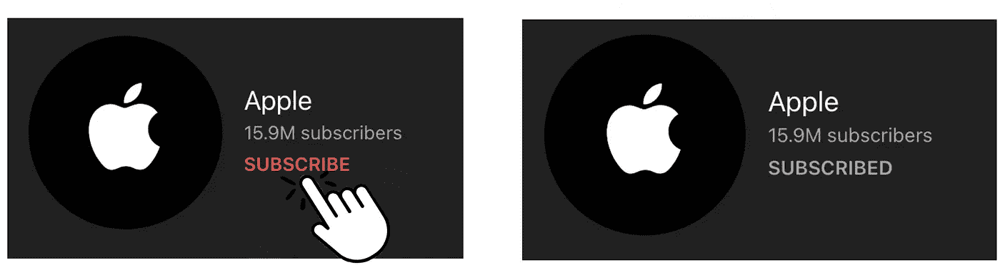
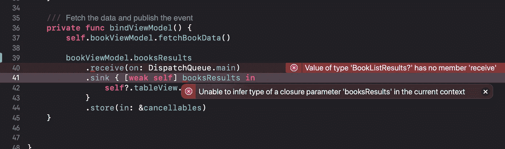

# 了解 iOS 中的 PubSub 和 Combine

> 原文：<https://levelup.gitconnected.com/understanding-pubsub-with-combine-in-ios-136d1849698b>

## 了解 Combine 的出版商和订户，把回电留在尘埃里

阿卜杜勒拉赫曼·索比在 [Unsplash](https://unsplash.com?utm_source=medium&utm_medium=referral) 上拍摄的照片

Combine 是苹果针对像 [RxSwift](https://github.com/ReactiveX/RxSwift) 这样的流行函数式反应式编程库的第一方解决方案。它使用发布者/订阅者(pub/sub)模式。让我们来分析一下这个模式到底是什么。

如果你曾经使用过 YouTube，你很有可能见过发布/订阅模式。比方说，你想了解苹果发布的最新视频。如果你去苹果的 YouTube 频道，你会看到一个“订阅”按钮。点击后，当苹果发布新视频时，你会收到提醒。

用户可以订阅各种 Youtube 频道，了解最新视频

这就是发布/订阅模式的本质。在这个例子中，出版商是苹果公司。希望了解苹果最新内容的用户是订阅者。发布者发布内容后，订阅者会收到通知。然后用户可以用最新的信息做他们想做的事情，比如在他们自己的时间观看最新的视频。订阅各种 YouTube 频道允许异步更新，因此用户下次启动 YouTube 时将立即看到最新内容。

# 为什么使用联合收割机？

有了 Combine，我们不需要为每一次成功和每一个错误场景都有无数的嵌套回调。当在具有大量集成服务的真实应用程序中工作时，回调就成了一场噩梦。一个遗漏的错误场景和整个应用程序的用户体验都会被拖垮。

如果您以前使用 SwiftUI 做过一个项目，那么您有机会见证使用 Combine 的异步编程。当您将 SwiftUI 导入文件时，它实际上已经被导入了。然而，如果你的 iOS 应用程序在 SwiftUI 派对上迟到了，那也不用担心。我们肯定可以结合使用 UIKit。

在这篇文章中，我将展示与纽约时报的图书 API 结合使用的 Combine。

展示如何在视图模型中使用组合

这里我们有一个 ViewModel 类，包含我们的 **publisher** 作品。发布者有两种相关类型，输入和失败。这里，我的输入是 BookListResults，它是一个屏幕外定义的可解码结构，包含来自 API 响应的预期键/值对。失败是当发布者遇到一个[错误](https://developer.apple.com/documentation/swift/error)时。

让我们解释一下 Combine 中包含的内容:

## [出版](https://developer.apple.com/documentation/combine/published)

当我们将 T 类型的变量声明为 Published 属性时，
要定义发布者，您需要@符号
要访问发布者，您需要$符号

让我们来看看这个 ViewController 中的**订阅者**工作中的发布者访问。

订阅方对从发布方收到的更改做出响应。在这个例子中，当从我们的 NYTimes Book API 服务接收到新数据时，我们的用户界面中的 tableView 被重新加载。让我们来分解一下这里显示的新功能:

## [任何可取消的](https://developer.apple.com/documentation/combine/anycancellable)

订阅者有一个 AnyCancellable 对象的实例，以便能够在需要时取消调用发布者。这些实例会在取消初始化发布服务器时自动取消发布服务器。要将订阅存储到 AnyCancellable 实例中，您需要使用&符号。

## [接收< S >(开:S)](https://developer.apple.com/documentation/combine/publisher/receive(on:options:))

该函数接收来自发布者的结果，并在主线程上执行 UI 更新。

## [接收(接收完成:接收值:)](https://developer.apple.com/documentation/combine/just/sink(receivecompletion:receivevalue:))

接收器观察由发布者接收的值，然后使用您指定的闭包处理这些值。

## [存储(输入:输出设置<任何可取消的> )](https://developer.apple.com/documentation/combine/anycancellable/store(in:)-3hyxs)

当接收时，最新的数据存储在已定义的可取消实例中。现在，无论在哪里调用这些数据，都可以使用它们，如果有新的数据从发布者那里传来，存储的数据也可以再次改变。

我承认，Combine 的语法…很粗糙。这似乎不符合 Swift 一贯的“尽可能接近英语阅读”的语法。例如，如果您碰巧遗漏了 publisher 变量中的$符号，Xcode 不会告诉您编译器出错的确切原因。

从发布的变量中删除$符号会导致 Xcode 中出现令人困惑的错误

函数式反应式编程(FRP)可能需要一些时间来适应。我建议在一个示例项目中尝试 Combine，看看如何将它合并到一个更复杂的应用程序中。考虑在当前有许多嵌套闭包的地方使用 Combine。

# 结论

我文章中的例子并不是联合收割机被利用的唯一方式。用户界面中的交互元素可以是发布者。基于用户的输入，后端和 UI 可以相应地更新。对于特别高级的用例，您可以使用 Combine 来处理多个数据流。对于多个流，您可以使用将每个订阅者保存到可取消的集合中。这样的例子不胜枚举。这充分显示了联合收割机的强大功能。

# 资源

*   [关于联合收割机的苹果文档](https://developer.apple.com/documentation/combine)
*   [雷·温德里希—联合收割机:入门](https://www.raywenderlich.com/7864801-combine-getting-started)
*   [SwiftLee —开始使用 Swift 中的 Combine 框架](https://www.avanderlee.com/swift/combine/)

# 分级编码

感谢您成为我们社区的一员！在你离开之前:

*   👏为故事鼓掌，跟着作者走👉
*   📰查看[升级编码出版物](https://levelup.gitconnected.com/?utm_source=pub&utm_medium=post)中的更多内容
*   🔔关注我们:[Twitter](https://twitter.com/gitconnected)|[LinkedIn](https://www.linkedin.com/company/gitconnected)|[时事通讯](https://newsletter.levelup.dev)

🚀👉 [**加入升级人才集体，找到一份神奇的工作**](https://jobs.levelup.dev/talent/welcome?referral=true)