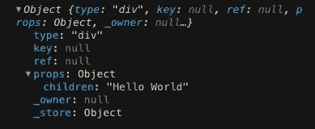
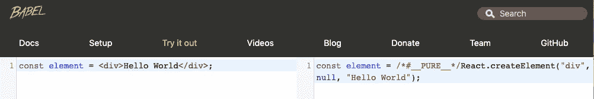
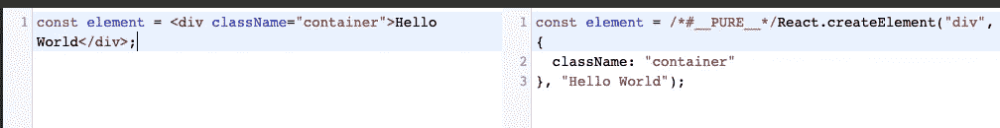
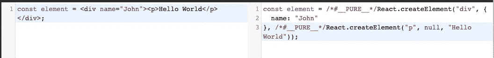

# 了解反应元素和 JSX

> 原文：<https://levelup.gitconnected.com/understanding-react-elements-and-jsx-c3b7af356db4>


由 [Ferenc Almasi](https://unsplash.com/@flowforfrank?utm_source=medium&utm_medium=referral) 在 [Unsplash](https://unsplash.com?utm_source=medium&utm_medium=referral) 上拍摄的照片

*本帖原载于我的* [*个人网站*](https://francodalessio.com/understanding-react-elements-and-jsx) 。

让我们首先编写一段简单的代码来显示一条***【Hello World】***消息，只使用**普通的 Javascript 和浏览器 API**。

首先，让我们在`body`部分创建一个根`div`:

```
<body> <div id="root"></div></body>
```

我们现在将使用 *Hello World* 消息**创建一个新的** `**div**`，并使用 Javascript 将**消息**添加到我们的根目录`div`中。

我们首先需要**得到那个根** `**div**`元素:

```
const rootElement = document.getElementById('root');
```

然后**创建一个新的 div** 并添加文本内容:

```
const element = document.createElement('div');
element.textContent = 'Hello World';
```

最后**将这个新的子元素添加到根元素:**

```
rootElement.appendChild(element);
```

这就是我们显示 *Hello World* 消息所需的全部内容。以下是最终代码:

# 让我们用 React 做同样的事情

React **控制并更新 DOM** ，使用的 API 与我们在前面的例子中使用的相同。但是我们将创建 **React 元素**，而不是创建 DOM 元素。`react-dom`将负责**将它们转换成 DOM 元素**并放入页面。

## 什么是反应元素？

将 React 元素视为对您在屏幕上看到的内容的**描述。** React **读取这些对象并使用它们来构建 DOM** 并保持其最新。

> 不要混淆 React 元素和**组件**。元素是组件“由”什么组成的，在进入组件之前，您必须首先了解它们是什么。

## `createElement` API

对于第一个 React 示例，我们将使用 React 的`**createElement**` **API。**

我们需要在页面上做出反应。我们可以从 [unpkg](https://unpkg.com/) 中得到`**react**`和`**react-dom**`:

```
<script src="https://unpkg.com/react@16.12.0/umd/react.development.js"></script><script src="https://unpkg.com/react-dom@16.12.0/umd/react-dom.development.js"></script>
```

然后，我们不是创建一个`div`元素，而是创建一个**反应元素**。`react.createElement`的 API 是:

```
function createElement(elementType, props, ...children) {}
```

在我们的例子中没有任何道具，所以我们像这样创建我们的元素:

```
const element = React.createElement("div", null, 'Hello World');
```

文本 *Hello World* 是我们元素的子元素。

我们可以通过将这个 **React 元素**记录到控制台来查看它:



我们得到的不是 DOM 元素，而是一个**对象**。记得我们之前说过，React 元素是描述你在屏幕上看到的内容的**对象。**

你可以看到`**children**`实际上在`**props**`物体内部。

这两条线**等价于**并且都是正确的:

```
const element = React.createElement("div", null, 'Hello World');
const element = React.createElement("div", {children: 'Hello World'});
```

> 可以通过**道具**对象内部的`**children**`或者作为函数的**第三个参数**。

好了，我们已经得到了我们的**反应元素**。现在怎么办？

我们将让`**react-dom**`处理所有这些，而不是像第一个例子中使用 DOM 元素那样将这个元素附加到根元素上:

```
ReactDOM.render(element, rootElement);
```

最终结果将与第一个示例相同。这是最后的代码:

# 最后，让我们使用 JSX！🚀

这个`react.createElement`语法有效，但不是最好的。幸运的是，我们有另一个选择，这也是社区用来创建 React 元素的标准方式。

## 什么是 JSX？🤔

JSX 是 Javascript 的**扩展，支持 ***看起来像*创建这些 DOM 元素的 HTML 代码**的语法。**

所以我们可以通过这样做来创建我们的元素:

```
const element = <div>Hello World</div>;
```

很可爱，对吧？

## 为什么是 JSX？

**React 不需要你用 JSX** 。您可以使用`createElement` API，一切都将以同样的方式工作。

然而，JSX 帮了大忙。React 基于的原理是**渲染逻辑与 UI 逻辑**耦合。React 不是通过将标记和逻辑放在不同的文件中来分离它们，而是使用包含两者的**组件**。

使用 JSX 很有帮助，因为它允许你在 Javascript 代码中轻松地使用 UI。

## JSX 太棒了！但是我们仍然有一个问题…

浏览器本身不理解 JSX，所以需要**编译**。这就是 [**巴别塔**](https://babeljs.io/) 的由来。它会将 JSX 语法转换成浏览器能够理解的东西。

你认为那会是什么？

正是:它将使用`**react.createElement**` **API** 。



你可以在[巴别塔的网站](https://babeljs.io/repl)里自己试试这个。

## 添加道具

在最后一个例子中，`createElement`的第二个参数是`null`，因为我们没有**道具**。

我们可以包含一个`className`，看看 Babel 如何将它翻译成`createElement`函数的**第二个参数**:



## 添加孩子

我们还可以添加更多的孩子。现在，唯一的孩子是 *Hello World* text，但是我们可以添加更多:



你可以看到现在`createElement`函数的第三个参数不仅仅是一个`string`。相反，它是第二个类型为 `**p**`的 React 元素**，它的子元素是 *Hello World* 字符串文本。**

# JSX 的力量💪

有了 JSX，你可以做的不仅仅是创建 React 元素。让我们来看看 JSX 的一切。

## 嵌入表达式

使用**花括号**，你可以在 JSX 中嵌入任何 Javascript 表达式。

例如，您可以这样做:

```
const name = 'John';
const element = <div>Hello {name}</div>ReactDOM.render(
  element,
  document.getElementById('root')
);
```

页面上将显示`Hello John`。

但不一定只是静态字符串值，可以嵌入**任何 Javascript 表达式:**

```
const element = <div>2+2 = {2+2}</div>ReactDOM.render(
  element,
  document.getElementById('root')
);
```

在这种情况下，`2+2 = 4`将显示在页面上。

## JSX 是一种表达方式

我们知道 JSX 会被**编译**成为一个`react.createElement`函数，那个函数会返回一个**对象**。

这意味着我们可以**将 JSX 赋值给变量:**

```
const element = <div>Hello World</div>
```

或者，例如，**从函数中返回 JSX:**

```
const getAgeDescription = (age) => {
  if (age < 50) {
    return <h1>You're young</h1>; }
  return <h1>You're old</h1>;}
```

## 指定属性

您可以使用**引号**将**字符串文字指定为属性:**

```
const element = </img>;
```

或者**花括号**嵌入一个 **Javascript 表达式:**

```
const user = { name: 'John', profileImgUrl: 'http://xyz.com/img.jpg' };const element = </img>;
```

JSX 使用**驼峰**作为属性，你必须记住一些变化。由于一些单词被 Javascript 保留，**一些属性在使用 JSX 时会改变它的名字。**

比如在 JSX 不用`class`，用`className`。在一个`label`元素中你不用`for`，你用`htmlFor`。

要阅读更多关于这些异常和所有在 JSX 被接受的属性的信息，你可以查看官方文档。

## 自动结束标签

如果一个元素没有任何子元素，可以用`/>`关闭它:

```
const element = ;
```

# 仅此而已！

理解 JSX 是如何编译的很重要，因为这会让你更有效地使用 JSX。我鼓励你把你的 React 代码带到 Babel 网站，看看它是如何编译的，以及使用`createElement` API 后的样子。

我把这个放在这里。有很多东西我可以继续写(渲染，组件，等等)。)，但我会在单独的文章中这样做。 **JSX 是一个重要的概念**，在将上的 **转移到其他东西之前，你应该**好好理解它。****

感谢你阅读❤️