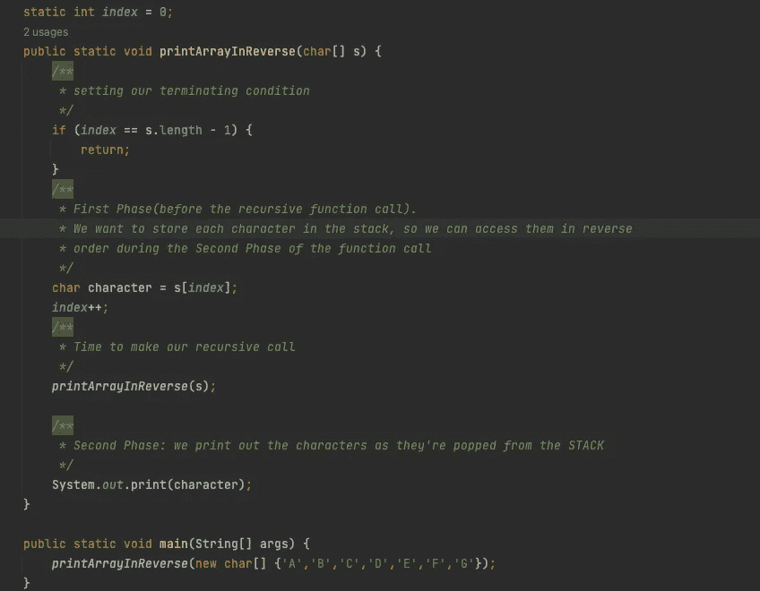
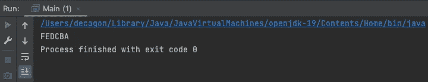
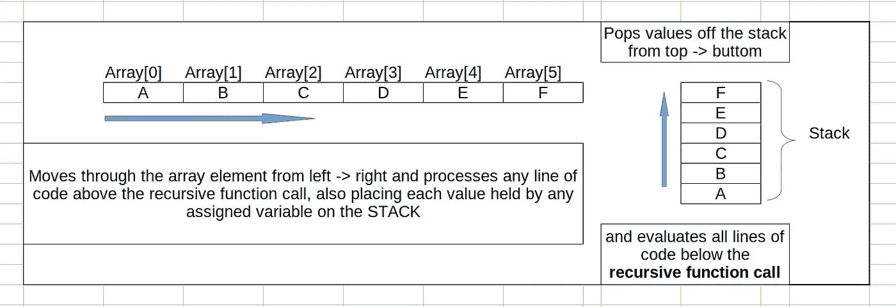
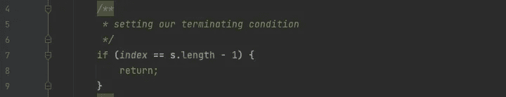
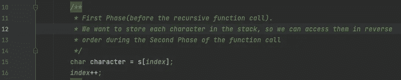
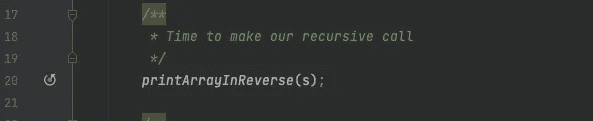

# 迭代理解递归算法(Java)

> 原文：<https://levelup.gitconnected.com/understanding-recursion-algorithms-iteratively-java-1bf79bf33e0f>

递归是一种简单的解决问题的方法，通过将问题分解成子问题的块，直到得到具有预定义解决方案的最小可能单元。一旦到了这个最小的单元，执行方向就反过来了，把最初产生的所有子问题的解联结起来，就得到完整的解。

不要太担心定义，递归算法背后的主要概念会随着你的阅读变得非常清晰。


弗兰克·科恩摄:[https://www.pexels.com/photo/white-lines-2230796/](https://www.pexels.com/photo/white-lines-2230796/)

# 嗯！我刚才说的是迭代理解递归吗…🤔

嗯，这可能看起来违反直觉，我知道。但是术语**迭代**是有意选择的，假设至少你理解如何迭代地解决一些基本的算法问题**(即**with loops——for 循环、while 循环等)。

我们将在迭代知识的基础上揭开递归这个看似困难的概念的神秘面纱，它看起来总是难以理解，甚至至少在一些有经验的程序员中也是如此。

> 了解如何用你最喜欢的编程语言实现复杂问题(如合并排序、二分搜索法、二叉树问题等)的递归算法，会给你超能力，让你的雇主和同事惊叹不已。

现在，让我们言归正传。首先，本文中的例子是用 **Java** 实现的，但是你也可以用你喜欢的语言来实现。所以，卷起袖子，让我们把手弄脏一点。


图片由迪安·马斯顿·皮沙贝提供

**我们将从这个简单的问题开始，打印一个给定的字符串或者一个数组的元素，或者逆序的列表。**

```
***There are many efficient ways of doing this iteratively, (using STACK, DEQUE, or simply looping from the last element, etc.*****>>>****So,** this is **NOT** a comparison between **Recurssion and Iteration**, especially for this trivial problem. There's a hidden concept we will reveal about recursive algorithms with this simple and familiar problem.
```

# **作为一个例子，我们将通过简单地以逆序打印一个字符数组来了解递归函数是如何工作的。**

> 我们在这里的目标不是真正的解决方案。我们选择这个简单的例子是因为几乎任何人都可以迭代地实现它。我们将用这个简单的例子来说明递归算法的惊人之处，一旦你能理解它，你就能把这一知识应用到广泛的问题中。

那么，我们开始吧。

在开始使用递归函数之前，有两件事你必须了解。

1.  **首先，**就像每一个有限循环都必须有一个指定的终止条件，否则，循环将无限期运行，***‘while(I<array . length)do…；*** 所以每个递归函数都有一个你可以称之为**的基本条件**，它必须被指定，否则递归调用将无限期继续。但这甚至不是我们分析中有趣的部分，尽管它非常重要。现在，第二个和神奇的概念…
2.  **每一个**递归实现都发生在**两个阶段**中，这两个阶段被顺序独立地执行。随着本文的深入，您将理解这些阶段。

```
public class PrintStringInReverseOrder { static int i = 0; public static void printInReverse(char[] array) {

       if (i == array.length - 1) {
           ***...do something; (Terminating condition)***
       }
       ***... do some stuff (FIRST PHASE- codes b4 the recursive call)*** printInReverse(array); //recursive call

       ***... do some stuff (SECOND PHASE - after the recursive call
                                      (Optional)*** return ...; ***(Optional)*** }
}
```

> 递归方法/函数是一个在自身内部调用自身的函数。从上面的代码片段可以看出，***printin reverse****方法在自己的块范围内调用了自己。*

## 查看 bolden 语句，我们将递归函数的实现分为两个执行阶段。

```
public static void printInReverse(char[] array) {//method definition
                          ...
       ***(FIRST PHASE- codes b4 the recursive call)*** printInReverse(array); //recursive call

       ***(SECOND PHASE - after the recursive call) (Optional)***return ...; ***(Optional)***}
```

****第一阶段*** *(我个人喜欢这样称呼它)在递归调用完成后立即开始，在这个阶段中，位于方法/函数定义和递归调用之间的所有代码/指令都被执行。**

*****第二阶段*** *在第一阶段终止后立即触发(* ***由设定的基本条件*** *)。***

> **这就是我们想要利用的第二个执行阶段。**

***在这里，数据以直观的方式操作和访问，使得复杂的问题非常容易解决。利用这个执行阶段，不同程度的复杂问题可以非常优雅地得到解决。***

***的例子有* ***排序和合并*** *中的一种* ***合并排序*** *递归算法，计算给定数字的斐波那契数列等。***

**你可能听说过全能的**分治**算法。**

**正是在这个**第二阶段**中，在**第一阶段**遍历结束**分割**之后，完成了**征服**。**

**为了进一步理解这个概念，我们将首先尝试理解这些阶段是如何可能的。**

**我们将浅显地看一下**堆栈**，它是每个递归执行被消耗的地方。**

**递归调用在内存**堆栈中执行。****

> **简单来说，堆栈可以被看作是一种存储数据的方式，其中数据以相反的顺序从堆栈中取出。(即。**(LIFO)****)。******

***在递归执行的**第一阶段**期间，存储在变量中的数据、各种函数调用被**推**到**堆栈**，当满足终止条件且执行返回时，递归执行的**第二阶段**开始，存储在堆栈中的数据被**弹出**，其顺序与它们被推入的顺序相反。(**后进先出)*****

## *****使用我们的反向字符数组问题的简单说明。*****

******

***当上面的代码被编译和运行时，我们有这个…***

******

***这是在执行的每个阶段发生的事情。***

******

***花点时间研究一下上图。***

***它为我们的 R ***反转字符数组问题*** 说明了两阶段执行的实现。我们操纵 ***第二阶段*** 执行特征来得到我们想要的解决方案。***

***从上图可以看出，在递归调用的第一阶段，随着第一阶段的进行，我们进行递归调用的那一行上面的代码都被相应地执行。***

***从我们的代码中，我们有终止块，它指定了终止第一阶段的条件，从而返回调用。***

> ***注意:您的终止条件可能不包括 return 语句。它可能只是在最后一次调用时给变量赋值。这完全取决于问题的性质。***

******

***下面是第一阶段执行的代码。随着第一阶段的进行，我们希望**将数组中的每个字符按照数组中第一个字符到最后一个字符的顺序推送到**堆栈**中。*****

******

***在这之后，我们递归地调用我们的方法/过程/函数。***

******

***然后在我们的递归调用下面，发生了**第二阶段执行**，在此期间**将**推入堆栈的值**弹出**，我们放置了我们的 ***打印函数*** ，当每个**字符**以 ***LIFO*** 的顺序从堆栈中弹出时，该函数将捕获它们。***

******

# ***递归函数有很多场景和应用。一旦你理解了递归算法背后的基本原理，你就能动态地提高你解决问题的技能。***

***有对递归算法的优化叫做**动态编程，**用于优化有重叠调用的递归算法的时间复杂度。***

***这篇文章只是基于递归函数如何工作的基本原理。***

******

***自然界中的斐波那契…***