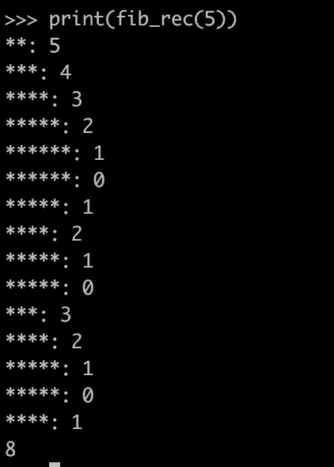
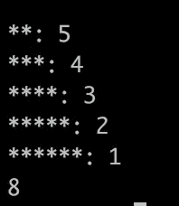
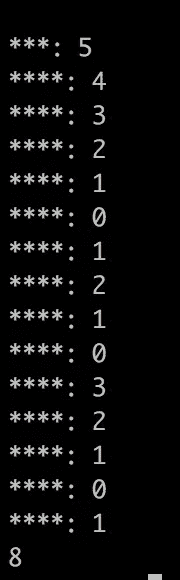

# 用 Python 理解递归和连续

> 原文：<https://levelup.gitconnected.com/understanding-recursion-and-continuation-with-python-c08d384fbf55>


图 1:陈月娇&尼克拉斯·奥尔罗格在 Unsplash 上拍摄的照片

在文章[如何学习所有编程语言](https://coderscat.com/learn-programming-languages)中，我解释了学习编程语言概念是掌握所有编程语言的有效方法。

**递归**、**延续**和**延续传递式**是函数式编程语言的基本思想。理解它们将有助于了解编程语言是如何工作的；甚至我们在日常编程任务中也不会用到它们。

在这篇文章中，让我们通过一些简短的 Python 程序来学习这些编程语言的概念。

# 递归

> *计算机科学中的递归是一种解决问题的方法，其解决方案依赖于同一问题的较小实例的解决方案。*
> 
> —维基百科

大多数现代编程语言都支持递归，允许函数从自己的代码中调用自己。递归是许多函数式编程语言的默认编程范式，如 Haskell、OCaml。

许多日常编程任务或算法可以更容易地用递归实现。假设您想递归地列出一个目录的所有文件和子目录，那么递归将是实现的自然选择。

让我们来看看这个简单的递归 Python 程序:

```
def fib_rec(n):
    if n < 2:
        return 1
    else:
        return fib_rec(n - 1) + fib_rec(n - 2)print(fib_rec(5))
```

这是一个计算斐波那契数的简单实现。递归的一个关键点是必须有一个退出点，第三行`return 1`是这个程序的退出点。

但是递归的缺点是什么呢？

让我们为这个程序添加更多的调试信息，在函数的开头打印调用深度:

```
import traceback
def fib_rec(n):
    print(len(traceback.extract_stack()) * '*' + ": " + str(n))
    if n < 2:
        return 1
    else:
        return fib_rec(n - 1) + fib_rec(n - 2) print(fib_rec(5))
```

输出将是:



`*`表示当前函数调用的调用深度。从输出中我们可以看到，有两点需要注意:

1.  在整个过程中有重复的计算。fib_rec(3)，fib_rec(2)，fib_rec(1)被多次调用。
2.  随着输入数量的增加，调用栈将快速增长。如果我们要计算 fib_rec(1000)，就会抛出堆栈溢出异常。

我们如何解决递归的这些普遍问题？

# 尾部递归

尾部递归是一种特殊形式的递归，在这种递归中，过程的最后一个动作再次调用自身。在上面的程序中，最后一个动作是`return 1`或`return fib_rec(n-1) + fib_rec(n-2)`，这不是尾部递归。

让我们试着把上面的程序转换成尾部递归:

```
def fib_tail(n, acc1=1, acc2=1):
    print(len(traceback.extract_stack()) * '*' + ": " + str(n))
    if n < 2:
        return acc1
    else:
        return fib_tail(n - 1, acc1 + acc2, acc1)print(fib_tail(5))
```

输出是这样的:



从结果中，我们可以发现我们删除了一些重复的计算，我们解决了上述程序的问题#1。

# 尾部调用优化(TCO)

有一种叫做[尾部调用优化](https://en.wikipedia.org/wiki/Tail_call)的技术可以解决问题#2，它在许多编程语言的编译器中都有实现。但不是用 Python 实现的。Guido 解释了为什么他不想让`tail call optimization` [出现在这篇文章](http://neopythonic.blogspot.com/2009/04/tail-recursion-elimination.html)中。

不管怎样，我们先来了解一下`tail call optimization`是如何工作的。我们知道，在执行过程中，任何对子函数的调用都会创建一个新的堆栈框架。如果我们把函数调用看作一个黑盒，当尾部函数调用发生时，我们可以重用同一个堆栈帧。

为此，带有`TCO`的编译器将尝试通过跳转操作消除最后一个尾部调用，并修复堆栈溢出问题。假设 Python 有一个`goto`操作，我们可以用`goto`替换`fib_tail`的最后一个调用，并更新相关参数。

```
# NOTE!!! This is pseudo-codedef fib_tail(n, acc1=1, acc2=1):
    START:
    if n < 2:
        return acc1
    else:
        #return fib_tail(n - 1, acc1 + acc2, acc1)
        n = n - 1
        tmp = acc1
        acc1 = acc1 + acc2
        acc2 = tmp
        goto START
```

从结果来看，编译器实际上可以将递归函数转换成迭代版本。所有的迭代函数都可以转化为递归，因为迭代只是递归的一个特例(尾递归)。

这就是为什么即使我们以递归方式编写代码，许多 FP 也不会表现很差的原因。编译器做他们的工作！

# 连续传球风格

更有甚者，函数式编程语言采用了[延续传递风格](https://en.wikipedia.org/wiki/Continuation-passing_style) (CPS)，其中控制以延续的形式显式传递。

延续是程序控制状态的抽象表示。

听起来晦涩难懂？

假设 continuation 是一种数据结构，它表示在进程执行的给定点上的计算进程，我们可以保存一个执行状态并在以后继续计算进程。

似乎 Python 中的`lambda function`可以用于此，因为我们可以将 lambda 函数作为参数传递，并在以后调用它们。

让我们定义最简单的延拓，这个延拓将返回带有任何参数的原始值:

```
end_cont = lambda value: value
```

然后我们试着把上面的 fib_tail 函数转换成一个 CPS。我们添加了一个额外的参数叫做`cont`:

```
def fib_cps(n, cont):
    print(len(traceback.extract_stack()) * '*' + ": " + str(n))
    if n < 2:
        return cont(1)
    else:
        return lambda: fib_cps(
                         n - 1,
                         lambda value:
                           lambda: fib_cps(
                                     n - 2,
                                     lambda value2:
                                       lambda: cont(value + value2)))
print(fib_cps(5, end_cont))
```

输出是:

```
<function <lambda> at 0x101d52758>
```

Emm，结果我们只得到一个 lambda 函数。记住我们可以继续执行一个延续，所以我们继续运行这个 lambda 函数，返回值仍然是一个延续…

```
v = fib_cps(5, end_cont)
print(v)print(v)
v = v()
print(v)v = v()
print(v)v = v()
print(v)....**: 5
<function <lambda> at 0x10d493758>
***: 4
<function <lambda> at 0x10d493848>
***: 3
<function <lambda> at 0x10d4938c0>
***: 2
<function <lambda> at 0x10d493938>
***: 1
```

让我们包装一个函数来反复调用`v`，直到我们得到一个真实的值:

```
def trampoline(f, *args):
    v = f(*args)
    while callable(v):
        v = v()
    return v
```

然后运行它:

```
print(trampoline(fib_cps, 5, end_cont))
```



呜！在执行过程中，堆栈深度始终保持不变。一些函数式编程语言的编译器会自动进行 CPS 转换。

# 向上总结

我们刚刚对尾部递归、尾部调用优化和延续有了一点真实的体验。延续对于在编程语言中实现其他控制机制很有用，比如异常、生成器和协同程序。很好地理解这些概念有助于我们更深入地理解编程语言。

我希望你喜欢它。