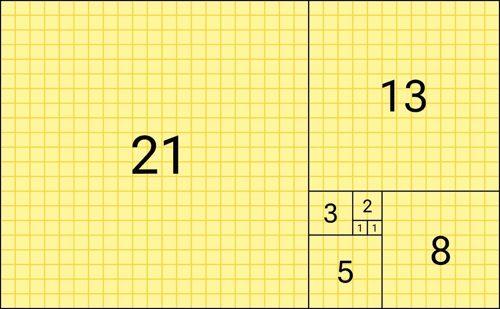
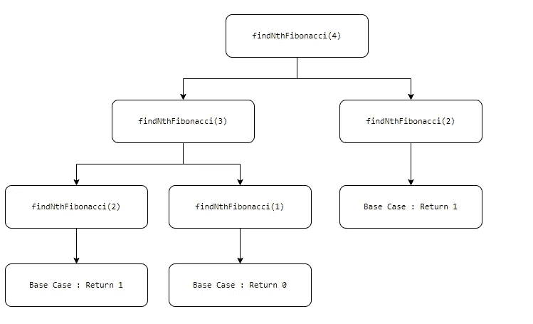

# 通过最终放弃递归来理解递归

> 原文：<https://levelup.gitconnected.com/understanding-recursion-by-dropping-it-eventually-be442c8141f2>

GIPHY 工作室原创 GIF(Giphy.com)

> 递归，初级开发者的噩梦！

对人类来说很难，对计算机来说也同样很费力。

当你写一个递归函数时，计算机必须维护一个**调用栈**，它跟踪所有递归调用的**执行上下文**。

这使得递归成为一项内存密集型任务。

如果多次调用递归函数，计算机可能会不堪重负，并抛出堆栈溢出错误！

这是一种让计算机惊慌失措的方式，它大喊自己再也无法跟踪执行上下文了。

事情正在流出调用栈！

早安动画 GIF 由金伯格里(Giphy.com)制作

为了更好地理解这一点，让我们先用递归来解决一个问题，然后再用普通的迭代。

# 问题陈述

求第 n 个斐波那契数

# 什么是斐波那契数？

在数学中，斐波那契数列形成了一个数列，其中每个数字都是前面数字的总和。



图片来自维基百科

# 递归求解

给定一个数字`n`，我们需要写一个函数返回第`n`个斐波那契数。

递归为这个问题提供了一个简单而优雅的解决方案。

为了继续递归解决方案，我们需要考虑:

*   **基础案例**
*   **递归步骤**到达基本情况

在 Python 中，具有基本情况的函数可以写成如下形式。

```
def findNthFibonacci(n):
    #Base Case 1
    if n < = 0: 
        raise ValueError("n should be more than 0") #Base Case 2
    elif n == 1:
        return 0 #Base Case 3
    elif n == 2:
        return 1
```

如果`n ≤ 2`，功能`findNthFibonacci`将立即返回

接下来，我们需要一个**递归步骤**来得到一个基本案例。

```
def findNthFibonacci(n):
    #Base Case 1
    if n < = 0: 
        raise ValueError("n should be more than 0") #Base Case 2
    elif n == 1:
        return 0 #Base Case 3
    elif n == 2:
        return 1 #Recursive Step
    else:
        return findNthFibonacci(n-1) + findNthFibonacci(n-2)
```

很优雅，不是吗？

哦，我的上帝哇 GIF(Giphy.com)

不幸的是，当我们深入挖掘时，我们发现这个算法运行在:

*   O (2^n) 的时间复杂度，因为递归步骤在每一步调用函数本身两次
*   O (n) 的空间复杂度，因为递归步骤将执行上下文存储在一个调用堆栈中，该堆栈将与`n`成比例增长



具有递归解的事件序列(图片由作者提供)

如何优化解决方案？

# 最佳化

我们看到，当我们用上面的解决方案解决这个问题时，我们正在多次重复这些步骤。

如果我们将计算的结果存储在一个数据结构中，我们可以在恒定时间内访问其中的值，会发生什么？

当然可以！

## 方法一:记忆

记忆化是将计算结果存储在临时内存(缓存)中，并在下次需要时检索它，而不是再次计算它的过程。

为此，我们将创建一个名为`memo`的字典/哈希映射，它将默认存储第一个和第二个斐波那契数。

如果我们在这个字典中找到第`n`个斐波那契数的值，我们将返回它(在常数时间内)。

否则，我们将计算结果并在返回之前将其添加到这个字典中。

```
def findNthFibonacci(n, memo:{1:0, 2:1}): if n in memo:
        return memo[n] else:
        memo[n] = findNthFibonacci(n-1, memo) + findNthFibonacci(n-2, memo)
        return memo[n]
```

该算法运行于:

*   **O (n)** 的时间复杂度，因为递归步骤计算每个斐波纳契数一次，然后将其存储在字典中`memo`
*   O (n) 的空间复杂度，因为递归步骤将每个斐波纳契数存储在字典`memo`中，该字典将与`n`成比例增长。此外，递归步骤将执行上下文存储在一个调用堆栈中，该堆栈将与`n`成比例增长。

## 方法 2:迭代

为了使我们的解决方案最有效，我们将返回到我们简单的老迭代。

让我们写一个问题的迭代解。

```
def findNthFibonacci(n):
    firstFib, secondFib = 0, 1 for _ in range(n-1):
        firstFib, secondFib = secondFib, (firstFib + secondFib)

    return firstFib
```

该解决方案将第一个和第二个斐波那契数存储在函数内部的两个局部变量`firstFib`和`secondFib`中。

我们将循环`n-1`次，并不断改变`firstFib`和`secondFib`的值，直到我们到达存储在`firstFib`中的第`n`个斐波那契数。

希望这能让你更容易理解递归！

*感谢阅读！*

[](https://bamania-ashish.medium.com/membership) [## 通过我的推荐链接加入 Medium-Ashish Bama nia 博士

### 阅读 Ashish Bamania 博士(以及 Medium 上成千上万的其他作家)的每一个故事。您的会员费直接…

bamania-ashish.medium.com](https://bamania-ashish.medium.com/membership) 

狗谢谢你 GIF 由穆德曼(Giphy.com)

如果你觉得这篇文章有用，你可以在这里看看我的其他文章:

[](/node-js-how-to-optimise-server-performance-35c85421db18) [## Node.js:如何优化服务器性能？

### 优化节点/快速服务器指南。

levelup.gitconnected.com](/node-js-how-to-optimise-server-performance-35c85421db18) [](/array-methods-that-every-javascript-developer-must-know-6e85fe2580ec) [## 每个 Javascript 开发人员都必须知道的数组方法

levelup.gitconnected.com](/array-methods-that-every-javascript-developer-must-know-6e85fe2580ec) [](/build-a-full-stack-web-application-for-real-time-skin-cancer-detection-5bda4f43681f) [## 学习构建一个完整的实时皮肤癌检测的网络应用程序…

### 学习使用 React.js、Tensorflow.js、Keras、Express、Firebase & Heroku 构建全栈 web 应用程序

levelup.gitconnected.com](/build-a-full-stack-web-application-for-real-time-skin-cancer-detection-5bda4f43681f) [](/a-simple-looking-tricky-dsa-problem-217512363a99) [## 一个看起来简单但棘手的 DSA 问题！

### 返回一个排序的平方数组并不像看起来那么简单！

levelup.gitconnected.com](/a-simple-looking-tricky-dsa-problem-217512363a99)