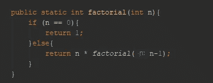
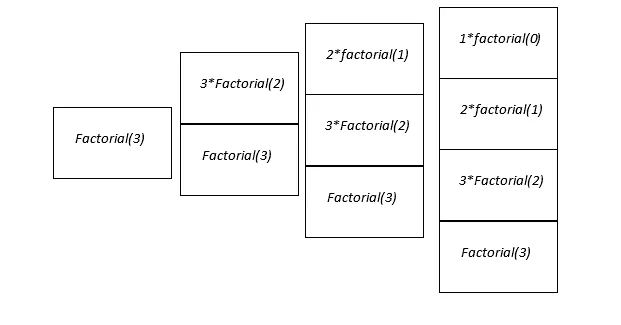
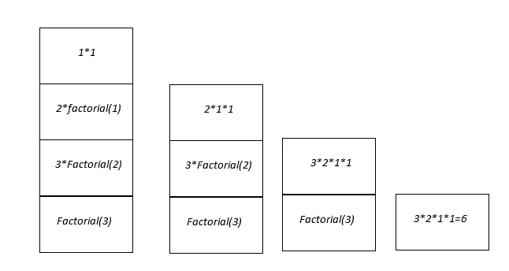

# 理解递归函数

> 原文：<https://levelup.gitconnected.com/understanding-recursive-functions-a8b70fb1281d>

递归是一个编程概念，涉及到一个函数或方法不断调用自己，直到它达到某种停止条件。它可以被看作是迭代的补充操作。通常，我们可以将它们相互替换，用迭代代替递归，用递归代替迭代。然而，在某些情况下，与迭代相比，递归会产生更清晰的解决方案。

首先，让我们讨论递归可以很好地解决迭代问题的情况。递归通常用于一次迭代的结果依赖于一次或多次迭代的结果的情况。例如，考虑计算阶乘的公式。阶乘定义为`n! = n*(n-1)*(n-2)*…*1`。当我们计算阶乘时，我们通常知道 n，我们需要确定 n-1，n-2，…，1 才能找到解。使用递归，计算这个的过程很简单。

递归阶乘函数

根据 n 的当前值，这段代码有两个逻辑分支。如果 n 的值为 0，则返回 1。否则，我们使用 n-1 作为参数再次调用该函数，并将结果乘以 n。假设我们对 n = 3 调用这个函数。当你调用一个函数时，你的计算机会存储调用的内容，这样它就可以带着调用的结果返回到那个位置。调用的这种存储是使用堆栈来完成的，这就是为什么我们通常在递归之前学习堆栈。发生的情况是，在每次递归调用时，另一个值被添加到堆栈中，直到我们到达停止条件，在本例中是当 n = 0 时。一旦我们达到这一步，1 就被提供给前面的函数调用，然后这个函数调用就可以计算它的值，这样一直持续到我们回到最初的函数调用。

所以在 n = 3 的情况下，第一个函数调用是*阶乘(3)* 。当这开始时，它转到 else 条件并调用 *3 * factorial(2)* 。对 *factorial(2)* 的调用也转到递归调用，得到 *2 * factorial(1)* 。这种情况一直持续到 n = 0。对此有两种看法。一种方法是在每次函数调用时不断构建函数，如下所示。

*阶乘(3)= 3 *阶乘(2)= 3 *(2 *阶乘(1))= 3 *(2 *(1 *阶乘(0)))*

一旦我们到达*阶乘(0)* ，我们返回 1，并且我们最终得到如下结果。

*3*(2*(1*1))) = 3*2*1 = 6*

观察递归的第二种方法是在每次递归调用时查看堆栈，并将顶层调用的值代入其下的值。

阶乘问题调用栈的建立

调用堆栈的结果一旦完成

这两种问题表示都很有价值，方程格式通常用于算法分析，而堆栈图像更准确地表示了计算机内存如何处理递归。无论你选择哪种方式来看待递归，你仍然可以很好地理解结果是如何实现的。

从这个例子中，我们可以了解递归函数是如何构造的。一般来说，对于任何递归函数，我们都需要定义以下场景。

1.停止条件:考虑算法将停止递归调用的每个实例。一旦我们到达问题计算的末尾，这通常会发生。这几乎总是依赖于递归调用时传递给函数的一个参数。通常，当参数为 null、零或其他端点时，就会发生这种情况。

2.递归调用场景:考虑问题中需要进行递归调用的每个实例。有时候只有一个，比如阶乘的例子。然而，我们经常会在一个函数中看到不止一次递归调用。

如果可以定义这两个组件，递归函数的实际实现就很容易了。我们创建一个 if 语句，在停止条件下，我们返回一个值。在递归调用条件下，我们使用参数的一些修改版本进行递归调用。

实际应用是递归调用，可以在数据结构中看到，看树。树很大程度上依赖递归来有效地工作，所以理解递归将允许你实现这些结构。此外，递归在算法设计、分而治之和动态编程等技术中有很多用途。