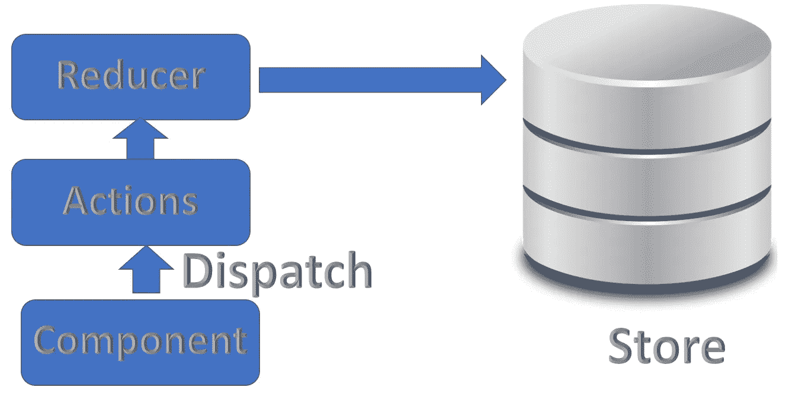
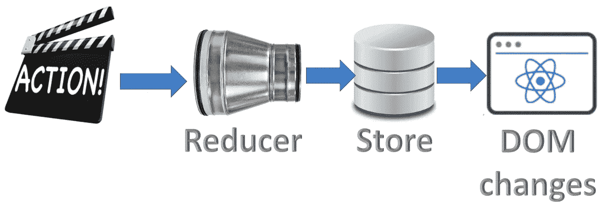
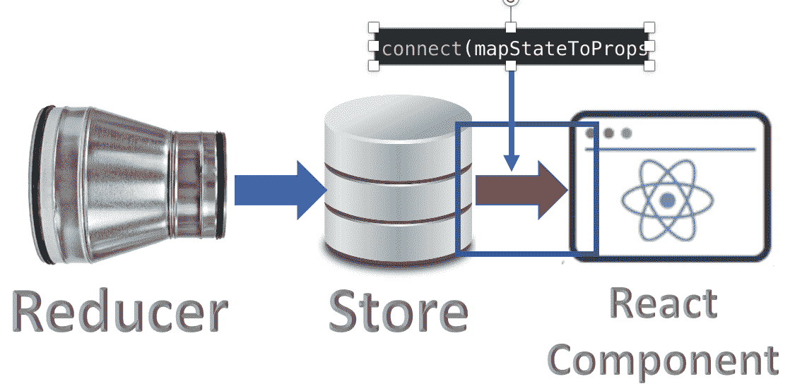
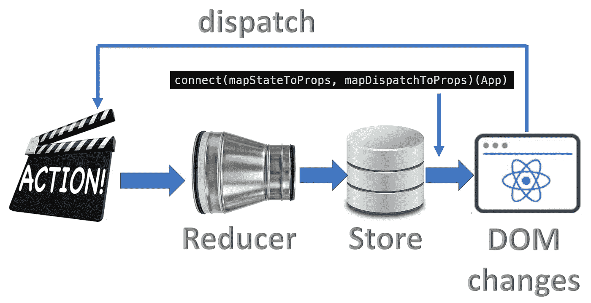

# 理解 Redux 变得容易

> 原文：<https://levelup.gitconnected.com/understanding-redux-bc4a11700c2a>

 [## Redux 是什么？

### 你可能多次听到 Redux 这个词，你想知道 Redux 是什么？在下面的短片中，我将…

medium.com](https://medium.com/swlh/what-is-redux-b16b42b33820) 

在接下来的文章中，我会尽量用例子和少说话来解释 Redux 是如何工作的。

1.  [创建一个 Redux(Hello World)](https://www.linkedin.com/pulse/create-redux-hello-world-rany-elhousieny-phd%E1%B4%AC%E1%B4%AE%E1%B4%B0/):[https://www . LinkedIn . com/pulse/creating-mock-rest-server-testing-using-JSON-server-rany/](https://www.linkedin.com/pulse/create-redux-hello-world-rany-elhousieny-phd%E1%B4%AC%E1%B4%AE%E1%B4%B0/)

在完成前面的练习后，你将能够在没有反应的情况下理解 Redux 的主要概念。现在，我们将看到如何添加 Redux 进行反应。

从上图可以看出，Redux 使用的是脸书的 Flux 模式([https://medium . com/@ madasamy/Flux-vs-MVC-design-pattern-de 134 dfaa 12b](https://medium.com/@madasamy/flux-vs-mvc-design-pattern-de134dfaa12b))

2.[逐步创建 React-Redux Hello World](https://www.linkedin.com/pulse/create-react-redux-hello-world-step-rany-elhousieny-phd%25E1%25B4%25AC%25E1%25B4%25AE%25E1%25B4%25B0/):1-阅读状态:[https://lnkd.in/gKJMy5K](https://lnkd.in/gKJMy5K)

现在，您处于带有红色箭头的以下步骤:

让我们在下面的文章中调度和动作来改变状态值:

3.[https://lnkd.in/g9espai𝘾𝙧𝙚𝙖𝙩𝙚𝙍𝙚𝙖𝙘𝙩-𝙍𝙚𝙙𝙪𝙭(𝙃𝙚𝙡𝙡𝙤𝙒𝙤𝙧𝙡𝙙)𝙨𝙩𝙚𝙥𝙗𝙮𝙨𝙩𝙚𝙥](https://lnkd.in/g9espai):2—𝘾𝙝𝙖𝙣𝙜𝙞𝙣𝙜𝙩𝙝𝙚𝙎𝙩𝙖𝙩𝙚:

