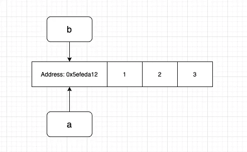
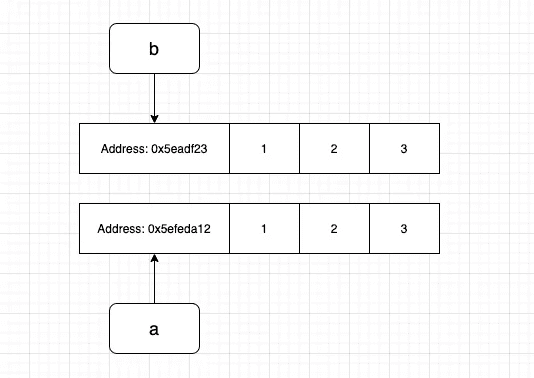
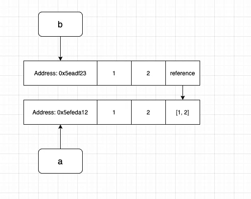

# 理解 Python 中的引用和复制

> 原文：<https://levelup.gitconnected.com/understanding-reference-and-copy-in-python-c681341a0cd8>

## 引用、复制和深层复制

# 引用

考虑以下情况

```
a = [1, 2, 3]
b = a
b[2] = 11

print("list a:", a)
print("list b:", b)
```

我们创建了一个新的变量`b`并将列表`a`的值赋给它，修改了列表`b`中的值后，列表`a`和`b`的结果会是什么呢？

考虑第二种情况:

```
a = [1, 2, 3]

def func(input_list):
    input_list[2] = 11
    return input_list

b = func(a)
print("list a:", a)
print("list b:", b)
```

在这个例子中，list `a`作为输入传递给我们的函数，我们在函数内部修改了输入，那么`a`会发生什么呢？

在上面的两个例子中，你可能已经猜到了，`a`的结果会被无意地修改。

```
list a: [1, 2, 11]
```

这是因为在上面的两个场景中，我们创建的新变量实际上绑定到了同一个内存地址`a`，这意味着尽管看起来我们创建了一个新变量`b`，但它并没有占用实际的内存空间，并且这个新变量是对 list `a`的引用。

一个说明性的图表如下:



第一个例子中的变量`b`和第二个例子中的`input_list`都指向变量`a`的同一个地址，所以改变元素将直接修改特定内存地址中的值，这也导致了`a`的改变。

您可以通过打印变量的内存地址来验证这一点:

```
a = [1, 2, 3]
b = a
print("address of a:", id(a))
print("addrss of b", id(b))#############################
address of a: 4385545984
addrss of b 4385545984
```

那么如何解决这个问题呢？

# 浅拷贝

一种方法是使用 python 中的复制模块。

```
import copya = [1, 2, 3]
b = copy.copy(a)
b[2] = 11

print("list a:", a)
print("list b:", b)
print("address of a:", id(a))
print("addrss of b", id(b))
```

这将得到结果。

```
list a: [1, 2, 3]
list b: [1, 2, 11]
address of a: 4472440000
addrss of b 4479677056
```

复制功能对原始对象进行浅层复制，将原始变量`a`与新变量`b`分开。这条线

```
b = copy.copy(a)
```

基本上是说请给我 12 字节(考虑一个`int`占用 4 字节)的内存，并将 a 的值复制到新分配的内存地址。



但是浅拷贝也有问题，请看下面的例子，

```
import copya = [1, 2, [1, 2]]
b = copy.copy(a)
b[2][0] = 11

print("list a:", a)
print("list b:", b)
```

`a`的结果会是什么？

```
list a: [1, 2, [11, 2]]
list b: [1, 2, [11, 2]]
```

在这个场景中，修改`b`再次改变了`a`中的元素，发生了什么？

浅层复制的问题是它不复制嵌套对象，在这种情况下，嵌套在原始列表中的是`[1, 2]`。



就像名字 shallow copy 一样，它只是复制表面而不是深入钻研递归，这里的第三个元素`b`引用回原列表而不是制作副本。您可以通过打印元素的内存地址来验证。

```
print("address of a[2]:", id(a[2]))
print("address of b[2]:", id(b[2]))################################
address of a[2]: 4340761792
address of b[2]: 4340761792
```

如何解决这个问题？

# 深层拷贝

深度复制会递归地复制一个对象。将副本替换为深层副本，您将得到:

```
import copya = [1, 2, [1, 2]]
b = copy.deepcopy(a)
b[2][0] = 11

print("list a:", a)
print("list b:", b)

print("address of a[2]:", id(a[2]))
print("address of b[2]:", id(b[2]))
```

结果是:

```
list a: [1, 2, [1, 2]]
list b: [1, 2, [11, 2]]address of a[2]: 4507899200
address of b[2]: 4515136448
```

这里对`b`所做的改变不会影响原始变量，并且`a`和`b`的地址会完全不同。