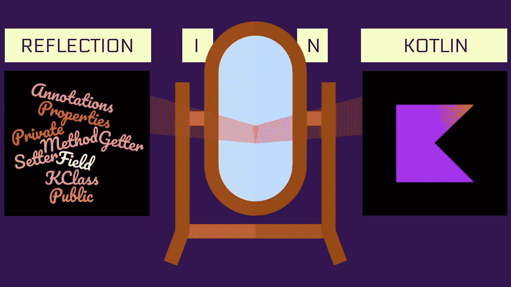

# 使用 Kotlin 理解反射

> 原文：<https://levelup.gitconnected.com/understanding-reflection-using-kotlin-a5874bf63010>

## 几乎所有的框架或库都利用了反射的力量。了解这一点会让你成为更好的开发人员。

你有没有想过依赖于基于 JVM 的语言(如 Kotlin 或 Java)的库或框架是如何工作的？对我来说，这是某种黑魔法，除非我遇到了反射的想法。在像 Retrofit 或 Kotlin-serialization 这样的库中，你定义了一堆类或接口，并用一些预定义的关键字对它们进行注释，它就能在运行时完美地工作。安卓也是如此。您扩展了一些类，如 Main-Activity 或 ViewModel，最终结果是一个正常运行的应用程序。

然而，这些库如何知道你定义了什么，或者你在哪里定义的，这真的不是很明显。这些语言必须内置某种机制，允许在运行时使用静态定义的类和接口。这正是建立反射的目的。

在本文中，我将尝试通过一些琐碎的代码示例来揭开反射的神秘面纱。我知道你不应该总是钻研图书馆的细节。对于开发人员来说，能够理解抽象是至关重要的。尽管如此，对这些框架如何在幕后工作有一个高层次的了解，当然会增加您的开发工具箱。

谁知道你可能会建立一个尖端的框架，解决现在存在的许多问题，在未来几年左右。

**免责声明:** *请记住，大多数框架或库不会总是对所有事情都使用反射。因为与其他原始编程相比，反射是一个较慢的过程，所以框架会实现中间编译器。*

## 什么是反思？

简而言之，反射使您能够在运行时引用静态定义的类、函数或接口。发帖说可以自省一下。你可以，

1.  访问类的属性或函数，而不考虑访问修饰符
2.  找出这个类中是否有任何成员用一些特殊的注释进行了注释
3.  根据需要操作类/接口

这是一种巨大的力量。正如我提到的，你甚至可以操纵一个类的私有属性。所以，是的，在使用反射时你必须小心谨慎，因为它破坏了封装。

***权力大责任大***

# 属国

在 Kotlin 项目中使用反射之前，您必须向您的`build.gradle`文件添加以下依赖项。

## 行动中的反思

我们将从定义一个虚拟类开始，这个虚拟类将让您体验反射。

现在，我们可以从类名或该类的对象实例化该类本身。

如代码片段所示，有两种方法来获取该类的引用。我们可以使用`className::class`或`objectReference::class`。

要获得 Java 等价类，你可以使用`className/objectReference::class.java`语法。

虽然这些几乎相同，但是这些不同的语法产生的类型之间还是有细微的差别。

为什么该语言的设计者决定使用两种不同的类型，即`KClass<T>`和`KClass<out T>`或者`Class<T>`和`Class<out T>`，这超出了本文的范围。

如果你熟悉 Kotlin 在泛型中表达类型差异的方式，你可能已经明白拥有`<out T>`的接口实际上是用声明站点差异实现的。如果你不知道类型变异实际上是什么，你可以稍后查看这个关于科特林类型变异的启发性图解指南。然而，您现在不必太担心类型变化。你不需要学习它来理解反射。

## 访问成员函数

是时候对类引用做些什么了。让我们从简单的开始—打印该类的所有成员函数的名称。

属性返回一个给定类的所有成员函数的列表。如果你想知道在哪里做这些方法，那我们还没有明确地声明，即`equals` `hashCode`和`toString`，从这里就可以得到解释。这三个方法是在 Kotlin 的`Any`类中声明的，默认情况下，所有其他类都是从这个类继承的，除非另有说明。

## 调用成员函数

这就是我们如何使用`KClass<out Dummy>`变量调用成员函数。

这里唯一要注意的是，每当我们想要使用`KFunction<*>`类型的引用调用函数时，我们需要传递一个对象，该对象是使用`call`函数时相应类的实例化。原因很简单，类只是一个蓝图，它不能独立运行。因此，需要一个对象。

## 调用私有函数

到目前为止，我们只使用过该类的公共函数。然而，正如我所提到的，私有函数和属性也可以被访问，这里就是一个例子。

要访问私有函数，还有一个额外的步骤。我们需要显式地将那个`KFunction<*>`变量的`isAccessible`属性设置为`true`。如果做不到这一点，运行时将不可避免地迎来一个`IllegalAccessException`。

## 访问属性(私有)

下面是如何访问该类的属性。

正如您所看到的，这个过程与前面的演示非常相似。就像私有函数一样，有必要显式地使私有属性可访问。在这种情况下，属性的类型，即`KProperty1<out Dummy, *>`，有点麻烦。虽然，如果你不能马上掌握它，你不必太担心。`KProperty`型有几个针对不同属性设计的变体。你可以在 `[KProperty](https://kotlinlang.org/api/latest/jvm/stdlib/kotlin.reflect/-k-property/)`的 [Kotlin API 参考中了解更多。](https://kotlinlang.org/api/latest/jvm/stdlib/kotlin.reflect/-k-property/)

## 操作属性值

为了操作属性值，我们需要将属性转换成`KMutableProperty`类型。

在所示的代码片段中，我们在 getter 实际访问它之前修改了属性值。因此输出是不同的。

# 简短的总结

1.  反射使我们能够在运行时自省或操作类或接口的行为。
2.  使用反射，我们甚至可以访问用`private`访问修饰符标记的属性和函数。
3.  反射在一个库或框架中被大量使用。
4.  可以发现任何类或其成员是否被标记了一些预定义的注释，以便库或框架可以相应地动作。
5.  反思不是一个很快的过程。所以重框架或者库很少实现中间编译器。
6.  反思给了我们巨大的力量。因此，在使用时必须非常小心。

# 总结

我们今天就到此为止。希望你已经对反射有了基本的了解。当我们的代码使用一个框架或库时，你也有一个大概的概念。

不过，我们不会就此结束我们的探索。在下一篇文章中，我们将构建一个简单的注释处理器。我们会定义自己的注释。最终结果将是一个伪字符串解析器，它将编码/解码 JSON 数据。注解和反思是齐头并进的。所以，我劝你继续关注下一集。

非常感谢你能坚持到现在。我真的希望你能就你的想法说几句话，✏️.

你可以给我买杯咖啡来支持我的工作。☕

 [## 尼兰詹🌱🌱正在写编程相关的文章

### 嘿👋我写编程相关的文章。我还是个学生。你可以请我喝杯咖啡，让我开心一天。

www.buymeacoffee.com](https://www.buymeacoffee.com/nilTheDev)