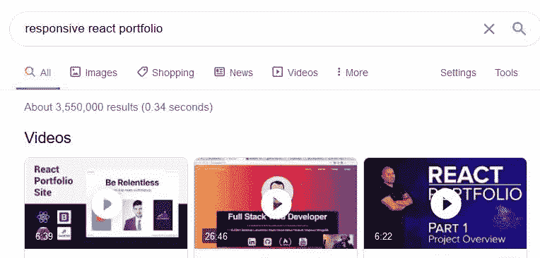
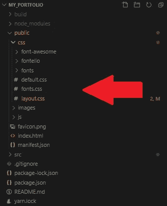
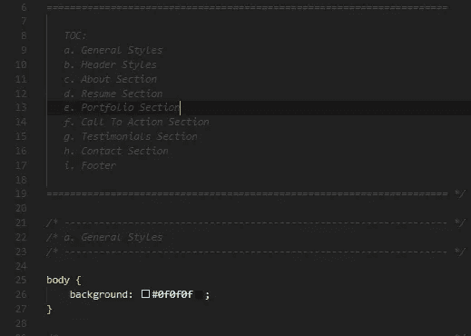
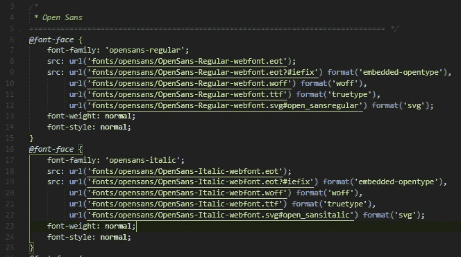
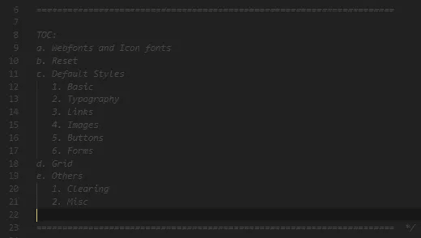
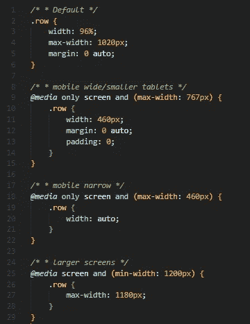
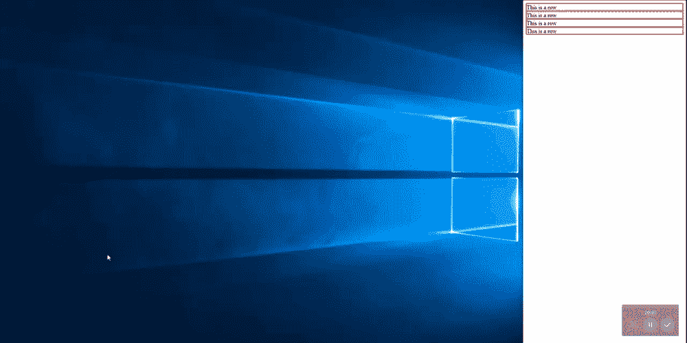

# 理解可重用的 CSS 样式表

> 原文：<https://levelup.gitconnected.com/understanding-reusable-css-style-sheets-f433be77b8c9>

在建立我的投资组合时，我认为单页 React 应用程序是我的最佳选择。此外，我想要一个反应灵敏的网站，在你的桌面显示器和手机屏幕上都很好看。令我不足为奇的是，网上已经有一大堆教程和模板，正是我想要构建的东西。

陈述的证明

我拿了一个，带着它跑了。我重新构建了网站，更新了组件以不再呈现硬编码的简历信息，为我的组件制作了一个数据文件以有条件地呈现，最终结果看起来相当不错。链接到我的投资组合[这里](https://idlescv.github.io/my_portfolio/)。

然而，在重组过程中，我注意到这个项目的样式表的组织。没有为每个组件或页面导入单独的样式表，只有 3 个 CSS 文件。

Ceevee v1.0 布局样式表(URL:styleshout.com)

# **layout.css**

对我来说，这是经典的 css 文件。它的选择器包含正文、#标题、#关于、#简历、#联系人等。它分为几个部分&在文件的顶部，包括一个改进文件组织的索引。

【http://www.fontsquirrel.com】由字体松鼠生成

# *字体. css*

*该样式表管理项目中存在的自定义字体。它为浏览器提供了字体格式，因此可以使用正确的资源。*

*更多关于@font-face [的信息，请点击](https://developer.mozilla.org/en-US/docs/Web/CSS/@font-face)。*

**

*Ceevee v1.0 布局样式表(URL:styleshout.com)*

# *default.css*

*我觉得这是三个里面最有趣的 css 文件，绝对是被重用的一个。首先，它为每个标记类型重置所有样式，然后为所有标记类型创建一个默认样式。(左图 c 部分。)*

*接下来，它通过网格部分创建 web 响应。这一部分分为 5 节。*

*默认，最大 767 像素，最大 460 像素，最小 1200 像素，*

*对于每个屏幕宽度，以下是自定义调整的列表。(关于这一点需要注意的是，这个样式表的创建者使用了诸如“文本-右”、“文本-左”、“列”、“窄”等类名。允许更好重用的通用描述性术语。在某种程度上，类似于函数名，但用于样式表。)我要分享的一个例子是 row 类。我在一个新的*index.html*文件&中创建了一个 *div* 元素和一个 *row* 类，这个文件只附加了处理“row”类的 CSS。*

****

*虽然这看起来没什么大不了的，但有了更多的选择器，这就允许跨多种设备类型的响应，并且通过这种特定的代码组织方法，可以创建自定义样式表，作为开发人员，可以跨多个项目使用，类似于材料 UI 或语义。*

*我认为这是一个很棒的概念，所以在我的下一个项目中，我将开始构建我自己版本的 default.css 页面。*