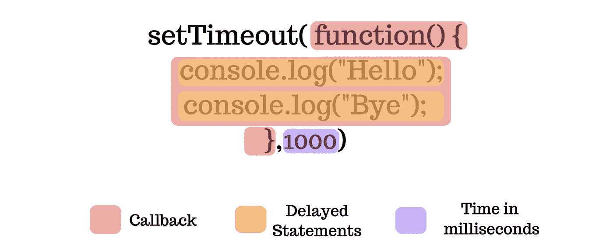
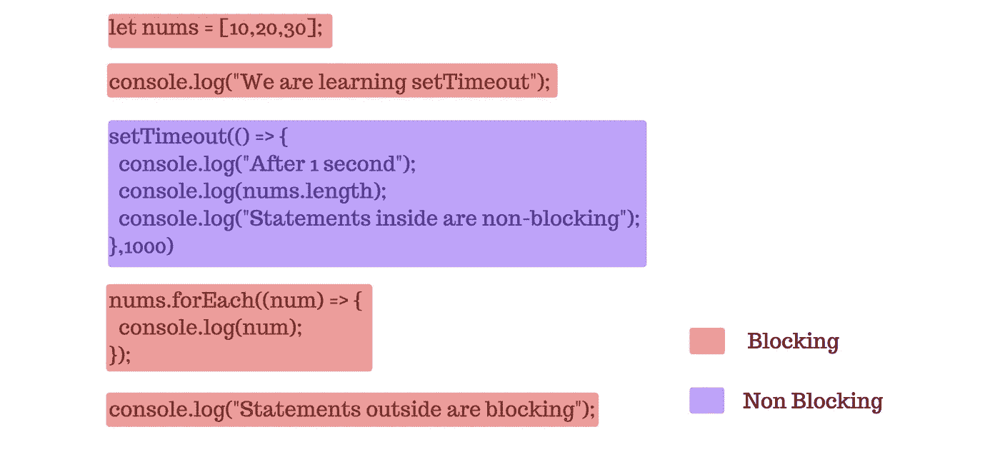
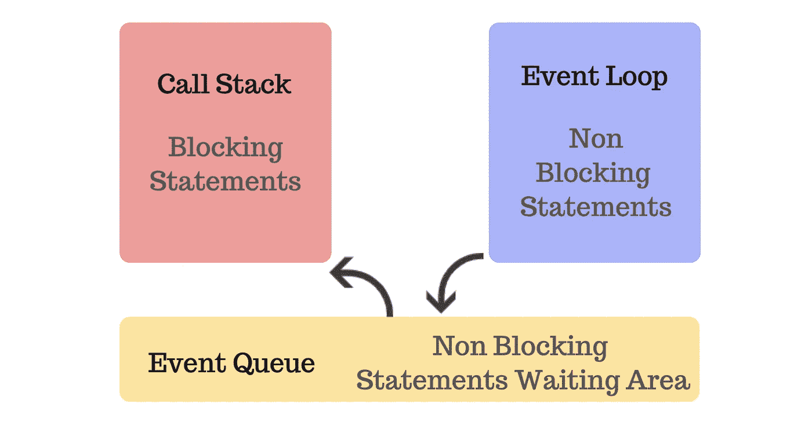
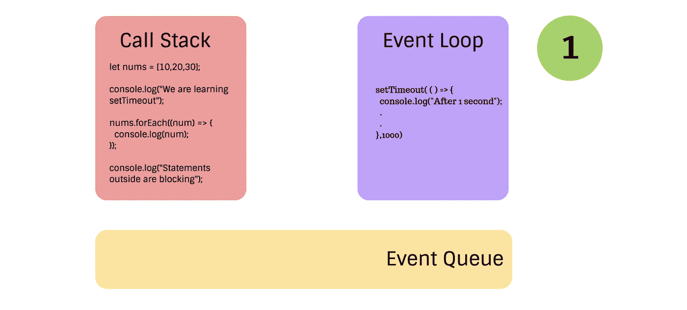
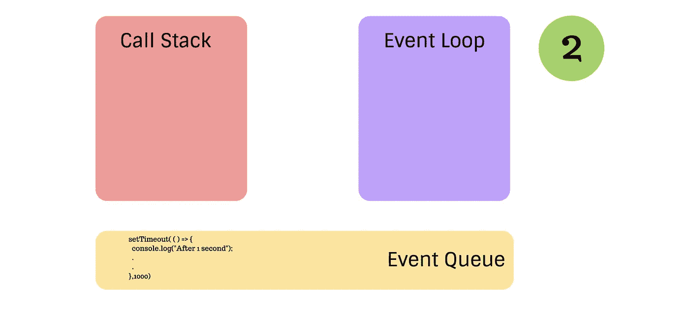
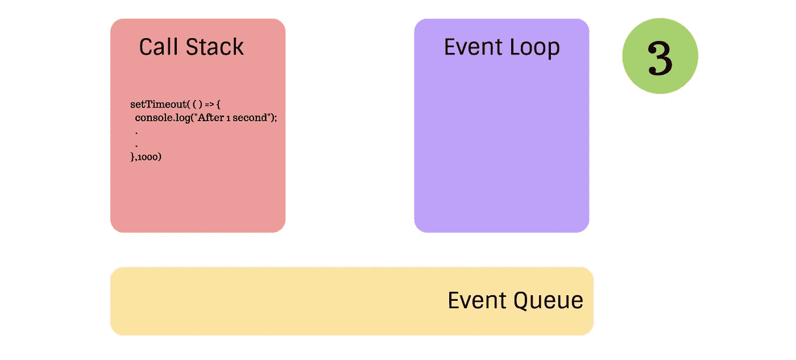
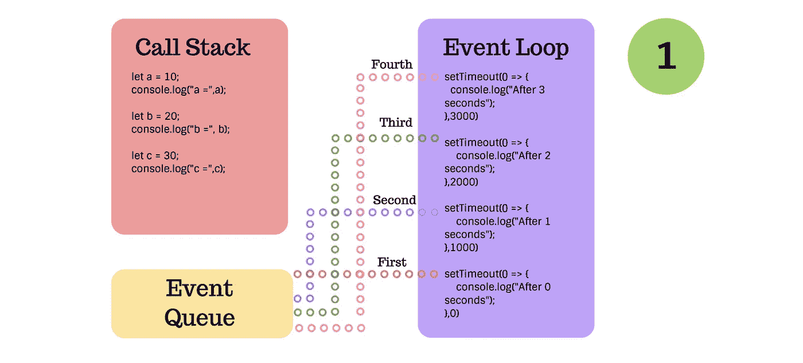
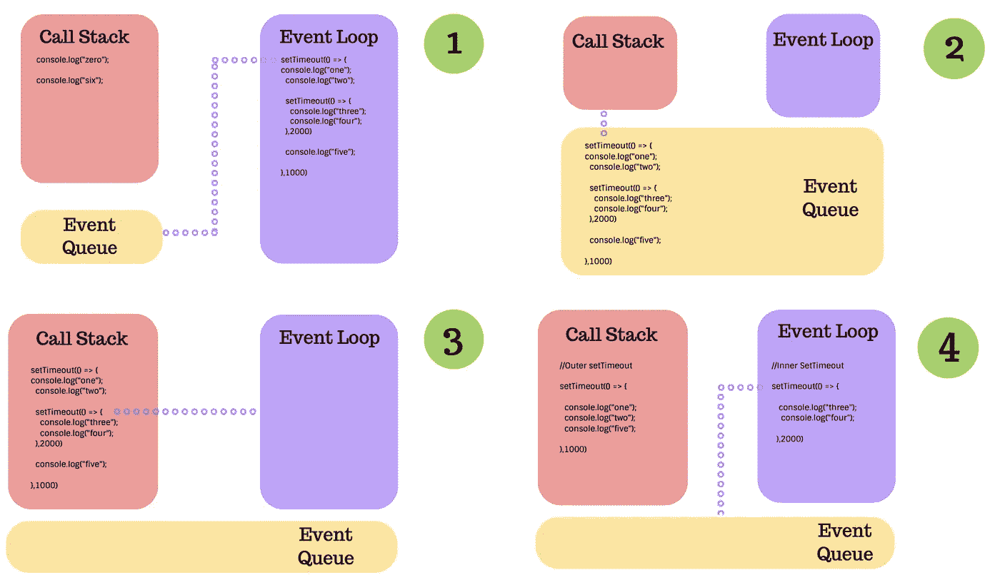

# 了解 setTimeout()

> 原文：<https://levelup.gitconnected.com/understanding-settimeout-15c7de9e5fd6>

## 如果您不了解 setTimeout()的工作原理，它可能会产生意想不到的结果。让我们了解一下，成为 setTimeout()忍者。


## setTimeout()

它是 JavaScript 中延迟代码执行的函数。

## setTimeout()的组成部分:



setTimeout()的组成部分

SetTimeout 有 3 个部分:

*   回收
*   要在回调内部执行的语句
*   以毫秒计的时间(延迟时间)

上面的代码在 1 秒(1000ms = 1s)后在终端中打印“Hello”和“Bye”。

似乎很容易吧！但是如果我们不知道 setTimeout()在幕后的行为，我们可能会得到一些意想不到的行为。

## **例 1** :单次 setTimeout()

```
**Output**:Sum = 3
1 2
```

**解释**:在上面的例子中 setTimeout()有 1 秒的延迟。因此，我们首先得到总和，1 秒钟后得到变量“a”和“b”的值。

## 示例 2:阻塞与非阻塞

```
**Output**:We are learning setTimeout
10
20
30
Statements outside are blocking
After 1 second
3
Statements inside are non-blocking
```

**解释** : setTimeout()是**非阻塞**，这意味着它将在它之外的语句执行后运行，一秒钟后执行。不属于 setTimeout()的所有其他语句都被**阻塞**，这意味着在当前语句结束之前不会执行任何其他语句。下图显示了阻塞和非阻塞语句。



阻塞语句与非阻塞语句

为了真正理解阻塞和非阻塞语句是如何工作的，我们需要了解调用堆栈、事件循环和事件队列。

## **调用堆栈**

处理所有阻塞语句和来自事件队列的语句。

## **事件循环**

处理所有延迟的语句，如 setTimeout()、setInterval()、事件、网络调用、承诺和所有其他异步操作。当 setTimeout 的计时器达到 0 时，语句从事件循环中出来，进入事件队列。

## **事件队列**

等待来自事件循环的语句的区域，当所有阻塞代码被调用栈执行时，这些语句被发送到调用栈执行。



调用堆栈、事件循环和事件队列

那么，让我们看看例 2 是如何执行的。

**步骤 1** :我们把阻塞语句和非阻塞语句分开。

**注意**:调用栈一次执行一条语句。为了简单起见，所有阻塞语句都被一次放入调用堆栈。



```
**Output**: <empty>
```

**第二步**:当 setTimeout()等待时，调用栈中的所有阻塞语句都被顺序执行。当 setTimeout()已经等待了 1 秒钟时，它移动到事件队列。



```
**Output**:We are learning setTimeout
10
20
30
Statements outside are blocking
```

**Step3** :只有当调用栈中的所有阻塞代码都执行完并且调用栈为空时，语句才从事件队列中出来，进入调用栈。然后执行 setTimeout()中的语句，因此我们得到了输出。



```
**Output**:We are learning setTimeout
10
20
30
Statements outside are blocking
After 1 second
3
Statements inside are non-blocking
```

现在我们对 setTimeout()的工作原理有了一些了解。让我们再看一些例子。

## 示例 3:多重 setTimeout()

```
**Output**:a = 10
b = 20
c = 30
After 0 seconds
After 1 seconds
After 2 seconds
After 3 seconds
```

**解释**:上面的例子很简单。请记住，所有阻塞语句都是先执行的，而所有超时都在事件循环中等待。然后，当因为 0s 具有最低的计时器，所以首先执行，然后 1s setTimeout()执行，然后 2s setTimeout()执行，最后 3s setTimeout()执行时，每个都逐一进入事件队列。

它看起来像这样:



当第一个、第二个、第三个和第四个超时值从事件循环中出来进入调用堆栈时，它们将按顺序执行。

## 示例 4:嵌套的 setTimeout()

```
**Output:**zero
six
one
two
five
three
four
```

**解释**:在上面的例子中，阻塞代码首先被执行，所以我们在开始时得到“0”和“6”作为我们的输出，外部 setTimeout 在事件循环中等待 1 秒，然后它进入事件队列，然后出来执行，现在“1”和“2”被打印出来。但是我们看到“五”也是印刷的。*为什么？*因为 JS 编译器一读取内部 setTimeout()(非阻塞语句)，就将其发送到事件循环，在那里等待 2 秒。当内部的 setTimeout()在等待时，外部的 setTimeout()执行它自己内部的所有阻塞语句。于是，就印出了“五”。然后，当内部 setTimeout()等待时，它会进入事件队列并执行，这就是我们如何获得“3”和“4”作为输出的。

下图显示了上述代码的工作原理:



## **例 5**:0 和 1ms 的怪异行为。

```
**Output:** one
zero
```

**解释**:我们的输出应该是“0”和“1”，因为 0 毫秒小于 1 毫秒。但取而代之的是“一”和“零”。原因是因为 1 毫秒是如此短的一段时间，基本上相当于 0 毫秒，因此它立即从事件循环进入事件队列，并通过调用堆栈首先执行。

## **例 6** :超时溢出

```
**Output:**TimeoutOverflowWarning: 2147483648 does not fit into a 32-bit signed integer.
Timeout duration was set to 1.
one
zero
```

**说明**:任何大于 2 ⁰的时间值都不适合 32 位有符号整数。因此，编译器抛出 TimeoutOverflowWarning，并自动将时间值设置为 1。而且从前面的例子来看既然 1ms 基本等同于 0ms。它首先执行，然后 0ms setTimeout()执行。

## 示例 7:设置超时和循环

```
**Output:**3
3
3
```

**解释**:for 循环是一个阻塞语句，所以而 setTimeout()是非阻塞的。该循环创建 3 个 setTimeouts，这些 setTimeouts 转到事件循环，然后转到事件队列。当所有 setTimeouts 都在事件队列中等待时，调用堆栈中的值“I”已经更改为 3。并且 setTimeouts 打印“I”的当前值。

上述问题的一个解决方案是使用 let 而不是 var，这会创建一个块范围。

```
**Output:**0
1
2
```

另一个解决方案是在 setTimeout 之外创建一个函数作用域，由此 setTimeout 可以访问“I”的正确值。

```
**Output:**0
1
2
```

# 分级编码

感谢您成为我们社区的一员！ [**订阅我们的 YouTube 频道**](https://www.youtube.com/channel/UC3v9kBR_ab4UHXXdknz8Fbg?sub_confirmation=1) 或者加入 [**Skilled.dev 编码面试课程**](https://skilled.dev/) 。

[](https://skilled.dev) [## 编写面试问题

### 掌握编码面试的过程

技术开发](https://skilled.dev)