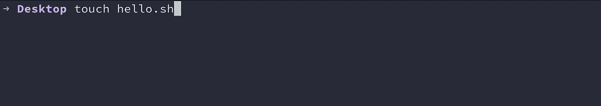

# 了解 Shell 脚本

> 原文：<https://levelup.gitconnected.com/understanding-shell-scripting-back-to-crux-rudiments-617531a74e8>

## 回到症结基础

照片由 [Javardh](https://unsplash.com/@_javardh_001?utm_source=unsplash&utm_medium=referral&utm_content=creditCopyText) 在 [Unsplash](https://unsplash.com/s/photos/shell-scritping?utm_source=unsplash&utm_medium=referral&utm_content=creditCopyText) 上拍摄

在本教程中，我们将学习 shell 和 shell 脚本的基础知识，理解文件权限，并编写我们的第一个`Hello World program.`

# 让我们开始吧，⚡️

## 壳牌是什么？

Unix shell 程序解释用户命令，这些命令由用户直接输入，或者可以从一个称为 shell 脚本或 shell 程序的文件中读取。Shell 脚本是被解释的，而不是编译的。

当您编写一个 shell 脚本时，它由您的操作系统来解释，您不需要在 other 中编译您的 shell 脚本来执行它。

## 什么是 Shell 脚本？

Shell 脚本是一系列 Unix 命令，可以在任何文件、终端中编写并执行。Shell 脚本主要用于避免重复工作。

要了解您的操作系统支持的 shell 类型，请打开您的终端并键入`cat /etc/shells`,然后您可以看到您的操作系统支持的不同类型的 shell。

比如我的 MAC OS 支持`bash, csh, dash, ksh, sh, tcsh, zsh.`

*   要知道`bash`的位置，你只需要在你的终端输入`which bash`。

# 让我们创建我们的第一个`hello world` bash 脚本

*   导航到要创建文件的目录或文件夹。我将在`Desktop directory`中创建我的

*   使用`touch commmand`创建一个新的 shell 脚本文件

> **。sh** 扩展不是执行 shell 脚本所必需的，如果你把它命名为 hello，它也完全可以工作，但是当你想用任何编辑器打开 shell 脚本时，拥有这个扩展是很有用的，因为你的编辑器能够理解这是一个 shell 脚本文件。使用扩展并不是必须的，但却是一个很好的实践。

*   每当您使用`touch`命令创建一个文件，并在您的终端中输入`la -al`时，您将看到您的`hello.sh`文件具有

1.  为你读书写字。
2.  给小组读一读，写一写。
3.  用户的只读权限。

*   通过键入`code.`打开 shell 脚本，这里我使用的是 Visual Studio 代码。您也可以使用任何其他编辑器。

在编写 bash 脚本时，标准的做法是使用`#!` (shebang ),然后从步骤 2 开始编写 bash 的位置，这有助于解释器知道这是一个 bash shell 脚本。
您现在可以开始编写您的 shell 命令了。

*   第一行是位置，第二行是回显`Hello World`

*   通过键入`./(name of your shell script)`执行命令，我这里是`./hello.sh`

*   它说权限被拒绝，因为我们没有执行这个文件的权限，所以我们需要更改权限并再次执行它。
*   使用`chmod`类型改变权限，在`chmod +x (name of the file)`矿将`chmod +x hello.sh`
*   更改权限后，如果已经更改，使用`ls -al`确认。

*   现在你有了`read and write by the user and then execute permissions by the group and read and execute permissions by other users.`
*   再次执行`./hello.sh`您将看到您想要使用脚本打印的命令`Hello World`的输出。

喜欢阅读吗？在下面留下一些**掌声，这样其他人就可以找到这篇文章🙂**

**如果你对这个话题有任何想法，请留下评论**

****感谢阅读❤️****

*   ****你也可以在**[**Twitter**](https://twitter.com/thecraftman_)**上联系我或者在 G**[**ithub**](https://github.com/thecraftman)**上找我。****

# **分级编码**

**感谢您成为我们社区的一员！[订阅我们的 YouTube 频道](https://www.youtube.com/channel/UC3v9kBR_ab4UHXXdknz8Fbg?sub_confirmation=1)或者加入 [**Skilled.dev 编码面试课程**](https://skilled.dev/) 。**

** [## 编写面试问题+获得开发工作

### 掌握编码面试的过程

技术开发](https://skilled.dev)**