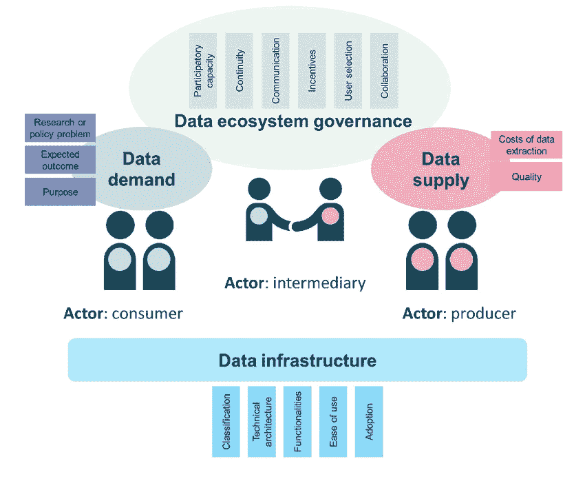
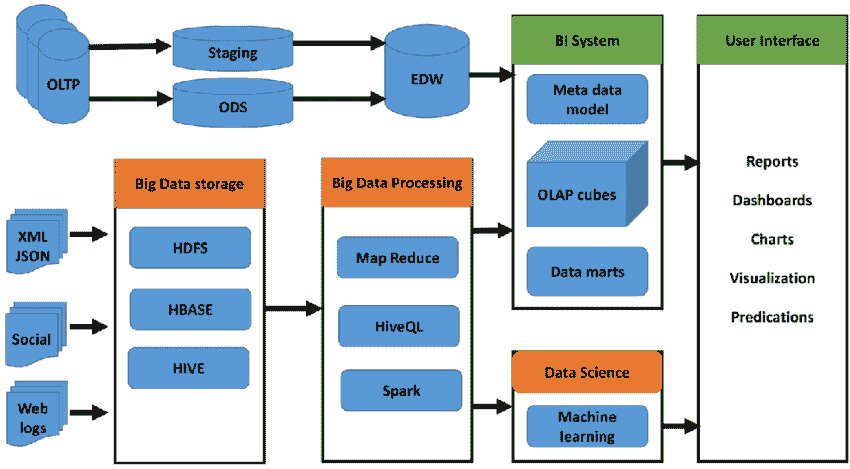

# 了解数据生态系统

> 原文：<https://levelup.gitconnected.com/understanding-the-data-ecosystem-e87b29d00e87>

[照片](https://unsplash.com/photos/DDvJ-epjsnw)由[杰里米·贝赞格](https://unsplash.com/@jeremybezanger?utm_source=unsplash&utm_medium=referral&utm_content=creditCopyText)在 Unsplash 上拍摄

# 介绍

企业、他们的客户和其他利益相关者每天都会产生大量的数据。组织使用图形、图表和数据库来维护这些业务数据及其结构。所有这些对组织都至关重要，因为他们使用这些数据来预测公司的增长和其他用户的参与。数据生态系统不是提供许多服务，而是将它们组合起来提供单一服务。

要做到这一点，企业可以采用数据生态系统概念，这使他们能够混合从各种来源获得的数据，并通过应用处理后的数据来创造价值。这些数据通过提供卓越的运营和服务，帮助组织更好地了解他们的消费者、偏好和兴趣。组织应该利用这些数据制定更好的营销建议，然后进行预测。

**将数据生态系统概念化**

[**来源**](https://www.researchgate.net/figure/An-integrated-framework-to-characterize-data-ecosystems_fig1_329155645)

数据生态系统不仅从各种来源收集数据，还对收集的数据进行分析。在对结果进行分析之后，可以根据收集数据的组织的业务需求对数据进行过滤。作为更好地了解用户和目标受众的努力的一部分，过滤是一个动态的过程，包括不断了解和响应公司不断变化的需求。

组织的数据生态系统包括各种各样的工具，如分析和基础架构，这些工具是为响应特定的组织要求而开发的。数据生态系统收集客户使用产品的日志，并留下数据轨迹，组织可以在以后进行分析，以更好地了解他们的性能和客户的需求。因此，产品团队能够更好地理解客户的偏好。

一个产品分析平台被认为是最佳的数据生态系统，在该平台上，许多团队结合多个来源，向机器学习算法提供输入，以实现自动化改进，并跟踪用户群来计算性能指标。

想要建立成功的数据生态系统的组织必须确定正确的利益相关者:确定哪个[云数据仓库](https://www.firebolt.io/blog/cloud-data-warehouse)最适合实施他们的策略。公司必须确定他们所能提供的价值，然后从那些能够帮助他们以最有效的方式实现战略目标的合作伙伴中选择最好的合作伙伴。组织和利益相关者更有可能被独特的价值主张和客户体验所吸引。

数据生态系统需要身份和访问管理，以便能够验证终端用户的身份。所有这些都是集中式系统，但也有需要分散式方法的情况。此时，组织可以采用联合身份管理，如区块链分类帐技术。

# 不同的数据生态系统架构

数据生态系统在不断变化，与第三方的协调总是需要额外的资源，如潜在合作伙伴的架构，才能取得成功。有五种不同的数据生态系统架构，每种架构都有自己的一套特征，如数据聚合、提供的服务类型和参与方法。

一旦创建了一个架构，就有必要确保生态系统的参与者拥有访问和处理数据的适当授权。让我们一次一个来讨论它们。

[**来源**](https://www.researchgate.net/figure/Overview-of-architecture-of-data-warehouse-Hadoop-ecosystem-components_fig3_346482337)

# 用于商业目的的数据生态系统

这种风格的架构被用于平台被用于商业目的的情况。诸如亚马逊、微软和其他组织已经开发了平台。亚马逊和微软提供大量工具和服务作为其基础设施的一部分，如[亚马逊红移](https://aws.amazon.com/redshift/)，人工智能等等。它们提供服务或技术平台，企业可以在此基础上根据自己的需求构建生态系统业务。

组织可以使用 Amazon 的服务来建立云数据仓库，在其中集成各种服务，如分析分类帐、集群和其他类似的工具和技术。这将有助于他们管理日常运营，包括从消费者和客户那里收集数据，并根据他们的要求加以利用。

# 数据分析基础设施

如果不首先确保对数据的访问，就不可能在这种类型的体系结构中确保用户满意。数据的严重程度，无论是否关键，都是由数据架构的设计方式决定的。将有可能通过数据聚合生成重要的输入，以便公司和工具本身可以使用这些输入。数据工具从各种来源收集信息，包括保险平台、消费者公司和信用机构等。

这些信息对银行和信用卡公司是有益的，因为它们通常依赖这些来源来获得其客户的信用评分和其他重要信息，从而为他们提供正确的服务。

# 实现卓越运营和效率的基础设施

当组织希望将来自多个来源的数据垂直集成到其现有业务中，并为组织提供更广泛的运营效率时，可以使用这种架构。这有助于提供透明度和可管理性，允许组织集成来自不同来源的数据。这有助于最终用户拥有大量选项，并能够确定哪个选项最适合他们。

# 跨部门平台

顾名思义，当一家公司希望通过利用一个单一平台来实现所有运营，从而为其客户或业务提供端到端服务时，这种架构非常有效。组织负责连接许多合作伙伴的工作，以及他们的活动和数据。平台测试、汽车转售和具有共享忠诚度计划的合作伙伴网络只是这种架构保护伞下企业的几个例子。

# 市场平台

当组织可以充当用户和利益相关者之间的网关时，这种架构是有效的。就拿亚马逊来说吧，它是最终用户和组织之间的中介。和亚马逊一样，阿里巴巴也在基于同样的原则开发一种模式。因此，最终用户可以通过访问他们自己的网站来购买他们的产品。他们的网站上提供商品，顾客可以用信用卡购买和支付。

# 结论

一般来说，数据生态系统是有益的，并有可能从组织中产生可观的产出。然而，只有当组织意识到在数据检索和处理阶段可能出现的障碍时，这才是可以实现的。因此，为了防止所有这些问题，企业必须开发自己的数据架构。然而，考虑到数据生态系统架构的要求不像传统数据架构那样繁重，这并不是太大的障碍。