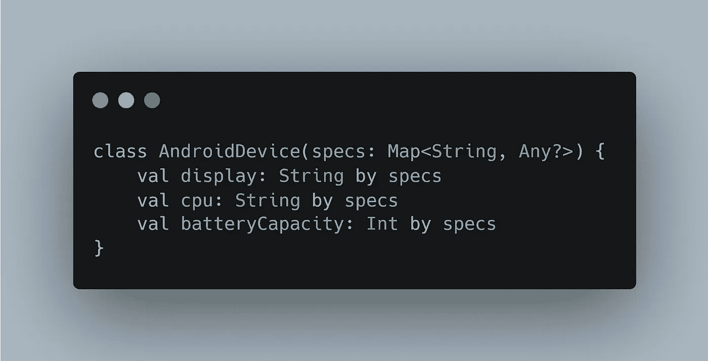

# 使用 Android 上的 Kotlin 了解委托模式

> 原文：<https://levelup.gitconnected.com/understanding-the-delegation-pattern-with-kotlin-on-android-8d7698524939>

## 这是一个如何帮助你编写更简洁的代码的例子

照片由[MABA 清真寺](https://unsplash.com/@masjidmaba?utm_source=medium&utm_medium=referral)在 [Unsplash](https://unsplash.com?utm_source=medium&utm_medium=referral) 拍摄

Kotlin 中高度集成的模式之一是委托模式。它帮助开发人员轻松地重用代码，并保持语言的可读性优雅而简单。

如果你写 Kotlin 代码已经有一段时间了，你可能见过`by lazy`表达式。

> 惰性委托提供了一个 setter 和一个 getter，但是在这种情况下，它只计算一次变量。之后，该值只在读取时传递，因为计算出的值保存在内存中。

在一天结束的时候，这个委托所做的是使用关键字`by`将提供 getter 和 setter 的责任交给另一个类。

# 实现自定义委托

我最喜欢的自定义代理用例是使用 LiveData。这个想法是，不需要使用*值*变量来读取或写入内容，就可以访问`LiveData`对象中的内容存储。

通常，我们会有这样的东西。

使用 LiveData 的传统方式

这里，`MutableLiveData`是隐藏的，因此只能从`ViewModel`访问，而`LiveData`对象是暴露的。每次我们需要修改它的内容时，我们需要使用带下划线的变量(在我看来很难看)，然后读取或覆盖 *value* 属性。

我们将使用委托来避免这种情况。首先，我们需要一个类来承担我们之前讨论过的责任，这是一个我们将要委托给 getter 和 setter 的类。

在这个类中，我们需要覆盖操作符`getValue`和`setValue`，这样它们就可以写入或读取包含在`LiveData`对象中的值。

LiveData 代表

现在使用我们之前创建的类，我们可以用它来委托`LiveData`对象的 getter 和 setter，并以一种更简洁的方式访问它，如下例所示。

使用 LiveData 委托

这可能看起来是一个小变化，但是一旦你已经编写了数千次这样的代码，你就会开始欣赏它。

> 如果你对这个话题感兴趣的话，我还有一篇关于科特林具体化和 `*inline*` *关键词的文章。*

 [## 理解科特林具体化和类型擦除

### 这是一个关于它如何提高可读性以及如何在幕后工作的例子

levelup.gitconnected.com](/understand-kotlin-reified-and-type-erasure-8b3ee30932d0) 

# 额外小费

如果您使用`map`对象，您可以使用委托以更具语义的方式用它们填充一个类，而不是使用定制的解决方案，例如循环。

为此，您需要像这样定义类。

用地图填充对象

> 注意，映射的值属于`*Any?*`类型，因此可以插入任何需要的类型，包括它们的可空对应物。

然后，当您填充类时，键必须与类属性的名称具有相同的值，就像这样。

创建用地图填充的实例

如果你想阅读更多这样的内容，并支持我，不要忘记检查我的个人资料，或给媒体一个机会，成为会员，以获得我和其他作家的无限故事。这只是 5 美元一个月，如果你使用这个链接，我会得到一小笔佣金。

 [## 通过我的推荐链接加入 Medium—Miguel

### 阅读米格尔的每一个故事(以及媒体上成千上万的其他作家)。你的会员费直接支持米盖尔…

medium.com](https://medium.com/@molidev8/membership) 

# 分级编码

感谢您成为我们社区的一员！在你离开之前:

*   👏为故事鼓掌，跟着作者走👉
*   📰查看[升级编码出版物](https://levelup.gitconnected.com/?utm_source=pub&utm_medium=post)中的更多内容
*   🔔关注我们:[Twitter](https://twitter.com/gitconnected)|[LinkedIn](https://www.linkedin.com/company/gitconnected)|[时事通讯](https://newsletter.levelup.dev)

🚀👉 [**加入升级人才集体，找到一份神奇的工作**](https://jobs.levelup.dev/talent/welcome?referral=true)