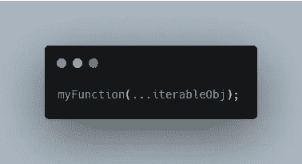

# 了解 JavaScript Spread 运算符

> 原文：<https://levelup.gitconnected.com/understanding-the-javascript-spread-operator-c3bb0580efff>

## 三点(…)运算符

照片由[莎伦·麦卡琴](https://unsplash.com/@sharonmccutcheon?utm_source=medium&utm_medium=referral)在 [Unsplash](https://unsplash.com?utm_source=medium&utm_medium=referral) 拍摄

由三个点`…`表示的 spread 操作符允许您将一个 iterable(比如一个数组、一个字符串、甚至一个对象)展开或扩展成它的单个元素。

扩展运算符可用于:

1.  **函数调用**
2.  **数组文字**
3.  **对象文字**

# 1.函数调用中的扩展运算符

函数调用中的扩展运算符

下面是在函数调用中使用它的基本语法。我们有了文字对象，只需要在开头加上三个点。

在下一个例子中，我们将一些数字相加。为了将数字传递给函数，我们使用了 spread 运算符。

和函数中的扩散算子

该函数只接受前三个元素。因此，如果我们的数组超过三个，函数将忽略第三个之后的所有内容。

# 2.数组文字中的扩展运算符

数组文字中的扩展运算符

下面是对数组文字或字符串使用 spread 运算符的基本语法。

用扩展运算符组合数组

在这个例子中，我们可以很容易地组合和组织数组。要在不使用 spread 的情况下实现这一点，我们必须使用像`push`、`splice`、`concat`等方法。

从字符串中展开字符

我们也可以将一个字符串的字符展开成一个数组。

不使用扩展运算符复制数组

使用 spread 运算符的最佳情况之一是复制一个数组。当您使用 React 这样的框架时，这非常方便。我们可以通过使新变量等于原始变量来复制数组。

但这并不是真正的复制品。数组是引用类型。所以这两者实际上都与相同的数据相关联。因此，现在如果我们通过将某些内容放入拷贝来更新拷贝，我们会看到不仅拷贝更新了，原始内容也更新了。

不使用扩展运算符复制数组

因此，要制作这个数组的正确副本，我们可以使用 spread 操作符。现在，当我们更新副本时，原始副本保持不变。

请注意，spread 只对数组进行浅层复制，这意味着它只深入一级。如果使用多维数组，理解这一点很重要。

# 3.对象文字中的扩展运算符

对象文字中的扩展运算符

下面是对对象文字使用 spread 的基本语法。

使用扩展运算符克隆对象

在这个例子中，我们克隆了这个对象，其工作方式与数组文字相同。

# 奖金:休息运营商

Rest 运算符

最后，我想向您展示 rest 操作符。下面是基本语法。但是等等…

这不是一个传播算子吗？

没错。只是为了迷惑你，他们看起来一模一样。

使用它们的上下文定义了它是 spread 操作符还是 rest 操作符。再次重申，spread 操作符将一个 iterable 展开或扩展成它的单个元素。

在这个例子中，我们用它作为这个函数的一个参数。所以 rest 运算符反其道而行之。它将所有元素收集或浓缩到一个数组实例中。