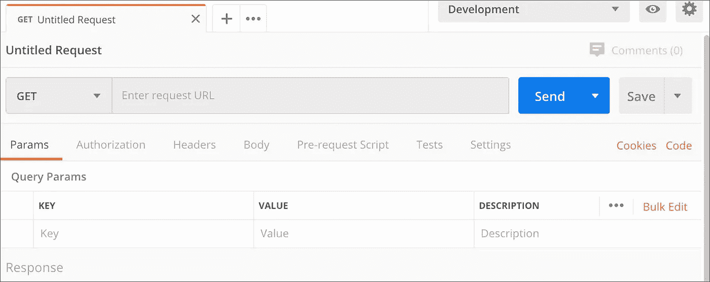
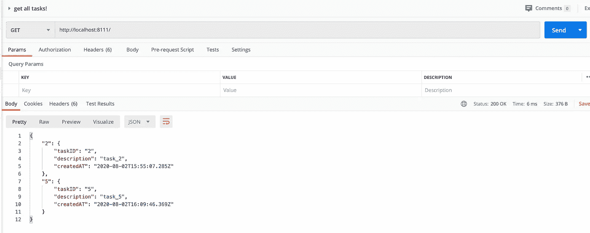

# 理解 RESTful API 的具体细节

> 原文：<https://levelup.gitconnected.com/understanding-the-nuts-and-bolts-of-a-restful-api-implementing-it-using-express-and-typescript-adf5200fd2a0>

## 使用 Express 和 Typescript 构建 RESTful API。


[unsplash.com](http://unsplash.com)

在本文中，我将首先介绍与 API 相关的关键概念。我们将彻底讨论什么是 API 和网络基础。然后我们将继续使用 Typescript 和 Express 构建我们自己的 RESTful API。这是一个对初学者友好的帖子，即使你不知道 Typescript，我想你也会喜欢学习基础知识。


[src](http://medium.com)

## 简介:

**客户端:**访问服务器提供的功能，例如网络浏览器

**服务器:**为被称为客户端的其他软件或硬件提供功能。

**资源:**客户端可以访问的网络上的任何内容。服务器是这些资源的宿主。使用资源的 URL 或 IP 来搜索资源。客户端希望如何访问这些资源/与这些资源交互取决于客户端提供的文本字符串，也称为 **HTTP 请求**。这个文本字符串包含客户端请求的资源的规范。有几个 **HTTP 请求方法**定义了一个 HTTP 请求。最常见的 HTTP 请求方法:

1.  **获取**从服务器检索资源的请求不变。发送阅读这篇文章的请求。
2.  **POST** 请求服务器存储新信息。发布新媒体文章是 POST 请求的一个例子。
3.  **PUT** 请求用于更新现有资源。发布后编辑这篇中型文章就是一个 PUT 请求的例子。
4.  **删除**请求用于从服务器上删除一个资源。示例-当我在发布后删除这篇文章时。

**HTTP 响应**是服务器发送给客户端的对 HTTP 请求的响应。有几个 HTTP 响应**状态代码**表示一个特定的 HTTP 请求是否成功发出，完整的列表可以在[这里](https://developer.mozilla.org/en-US/docs/Web/HTTP/Status)找到。不成功请求的一个例子是当提出无效请求时弹出的 **404** 页面。


简而言之，web 是在客户机和服务器之间流动的请求和响应的循环。[这里](https://medium.com/better-programming/the-anatomy-of-an-http-request-728a469ecba9)是一篇很棒的文章，如果读者想深入挖掘 **HTTP** 。

**API(应用程序编程接口):**简单来说就是软件委托，允许两个应用程序相互交互。人们经常把 API 和数据库、服务器混为一谈，但实际上，两者都不是。*API 是一种代码(一组规则)，是服务器的一部分，它管理向服务器发出的请求的访问点，这些请求反过来可以访问数据库。接收所有请求并发送响应的是 API。*例如，如果您在浏览器(客户端)中输入 medium.com 来阅读一些文章，您实际上是在与媒体的 API 进行交互，该 API 接收您的请求并将响应发送到您的浏览器，浏览器进而解释响应并显示文章。

**什么是 API 端点？**简单来说，一个资源的 URL。每个端点都是 API 可以访问服务器托管的资源的位置。这些端点定义了 API 可以访问资源的位置，并在确保与 API 交互的软件正常运行方面起着关键作用。


[src](http://medium.com)

**什么是 API 调用？—****通过公开路径向服务器上的端点发出请求的过程。例如，当阅读本文时，您实际上是在向媒体服务器上的一个端点发出请求，这是本文的 URL—*XYZ*。**

****什么是 API 测试？**向服务器发送 HTTP 请求的组合，并检查客户端是否获得正确的响应。**

****Web 服务:**两台机器通过**网络相互通信的一种方式。**AWS EC2 实例是在云中提供安全、可调整计算能力的 web 服务的一个很好的例子。这里基本上有一台远程计算机位于世界的某个地方，它监听来自你的计算机的请求。作为对请求的响应，web 服务器或远程计算机返回所请求的资源。注意，这个请求和响应发生在一个**网络**上。因此，web 服务本质上是一种在互联网/网络上可用的资源。**

*****那么，Web 服务和 API 有什么区别呢？Web 服务和 API 这两个术语经常被互换使用，因为它们的定义相似，但两者是有区别的。*****

1.  **Web 服务使用网络/互联网来促进两台远程计算机之间的连接，而 API 不需要基于 web，也可以脱机。**
2.  **API 定义了一个软件程序与另一个软件程序交互的规则。当这种交互涉及数据传输(所请求的资源)时，它就是 web 服务。**

**Web 服务是 API 的一个子集。所有的 Web 服务都是 API，但不是所有的 API 都是 Web 服务。**

****

**[src](https://testautomationresources.com/api-testing/differences-web-services-api/)**

**实现 web 服务的主要方式之一是 **REST** 。REST 代表代表性状态转移。REST 是一种架构风格，它提供了一组开发人员在设计应用程序时应该牢记的指导原则和约束。RESTful web 服务是那些遵守 REST 原则的服务。RESTful web 服务使用 HTTP 请求方法在两个应用程序之间传输信息。RESTful 架构中的一切都与资源有关。REST 主要以 JSON 格式构造资源，但是也使用 YAML 和 XML。RESTful 应用程序使用这些 JSON、YAML 等公开关于其资源的信息。表示，并使客户端能够对这些资源采取行动。关于这些原则的详细信息，请参考[维基百科](https://en.wikipedia.org/wiki/Representational_state_transfer)。**

****什么是 REST API？**
使用 REST 规则集设计的 API。REST APIs 是使用 HTTP 方法构建 web APIs 的标准化架构。当一个 REST API 被调用时，服务器将向客户机传输一个被请求资源的表示。对 REST API 的一个重要要求是利用 HTTP 方法通过网络发出请求。**

****REST API 的优势:
-** 无需在您的应用程序中安装额外的软件，因为该 API 可通过互联网获得。
-一种灵活的方法，因为数据和资源是以 JSON 或 XML 格式序列化的。**

****关于软件和框架的一个说明:** [**Postman**](https://www.postman.com/)**:**一个高效的 API 测试工具。它还提供了一个丰富的接口，使其易于使用，不需要编写大量的代码来检查 API 的功能。并且可以在 Mac、Windows、Linux 和 Chrome 应用上运行。**

****

**[postman.com](http://postman.com)**

**[**打字稿**](https://www.typescriptlang.org/) **:** 微软开发的开源编程语言。它是 JavaScript 的类型化超集，编译成普通的 JavaScript。它将静态类型和基于类的面向对象编程添加到 JavaScript 中。并且既可以用来开发客户端&服务器端 JavaScript 应用。**

****

**[src](http://dev.to)**

****Express:** 是一个流行的 web 框架，构建在 node.js 之上，为应用/移动开发提供了一组健壮的特性。它用 JavaScript 编写，托管在 node.js 运行时环境中。有助于快速开发一个具有无数 HTTP 实用程序方法和中间件的健壮 API。**

**现在，让我们使用 Typescript 和 Express 构建一个 RESTful API。我们将构建一个简单的待办事项应用程序，它将使我们能够:**

*   *****创建新的待办任务，*****
*   *****获取一个任务对应的 id，*****
*   *****获取所有任务列表，*****
*   **任务完成后，从列表中删除该任务。**

**这是我们的 package.json 文件，它帮助 npm 识别项目并处理依赖关系。**

**package.json**

## **应用程序**

**typescript 的主要优点之一是类型安全，这意味着编译器可以在开发过程中捕捉到应用程序中的潜在问题，而不是在运行时遇到异常。Typescript 使用称为接口的结构进行类型检查。**

**我们首先定义一个接口 **Task** ，它包括三个属性 **taskID** 、任务的**描述**和任务的创建时间 **createdAT** 。我们在 App.ts 文件中导入这个接口。**

**interface.ts**

**现在，我们转到主 App.ts 文件。我们在这里具体做的是创建一个空字典，并基于我们的端点{Get，Post，Delete}操作这个字典。Post 请求将向该字典添加一个新键。Get 请求将从字典中获取一个特定的键或所有的键。删除请求将从字典中删除特定的键。**

**应用程序**

**我们使用 ***tsc*** 编译器将我们的类型脚本代码转换成普通的 JavaScript。**

```
**- % tsc App.ts
- % node App.js***server started at http://localhost:8111*
```

**一旦服务器启动，我们就可以使用 Postman 来测试我们的 API。让我们看看当我们向服务器发出许多不同的请求时会发生什么。**

## ****使用 POST 请求方法创建新的待办任务。****

****

**发布创建新任务的请求**

## ****使用 Get 请求方法获得一个具有特定 id 的任务。****

****

**获取获取特定任务的请求。**

## **获取所有任务。**

****

**获取获取所有任务的请求。**

## *****任务完成后，从列表中删除任务。*****

****

**删除请求。**

**我真的希望你觉得这篇文章有趣。我们构建了一个简单的 API，并对其进行了测试。如有任何问题/疑问，欢迎在下面发表评论。你也可以通过 [LinkedIn](https://www.linkedin.com/in/akash2016123/) 联系我。**

****一些有用的参考文章:****

1.  **[Web 的请求/响应周期](https://medium.com/@jen_strong/the-request-response-cycle-of-the-web-1b7e206e9047)**
2.  **[API 到底是什么？](https://medium.com/@perrysetgo/what-exactly-is-an-api-69f36968a41f)**
3.  **[我们日常生活中使用的 5 个 API 示例](https://nordicapis.com/5-examples-of-apis-we-use-in-our-everyday-lives/)**
4.  **[什么是休息——给初学者的简单解释](https://medium.com/extend/what-is-rest-a-simple-explanation-for-beginners-part-1-introduction-b4a072f8740f)**

**谢谢大家！！**