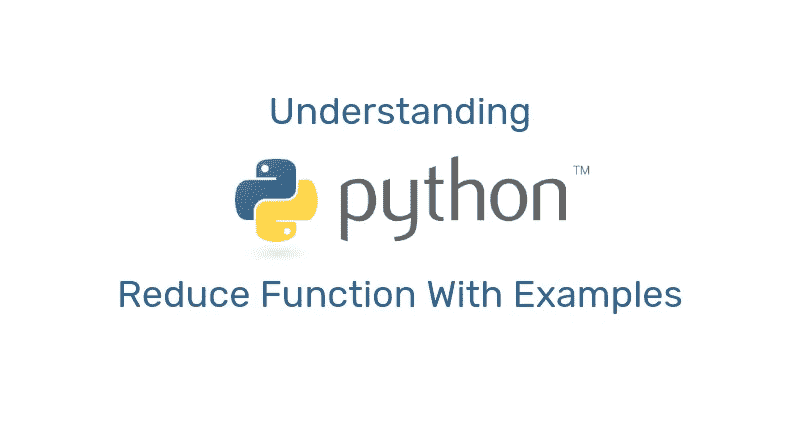

# 通过示例了解 Python Reduce 函数

> 原文：<https://levelup.gitconnected.com/understanding-the-python-reduce-function-with-examples-ddfac8b078d4>



*在*[*https://melvinkoh . me*](https://melvinkoh.me/understanding-the-python-reduce-function-with-examples-ck7mzz8l200na8ss1ogdvw5c5)*免费阅读。*

虽然有大量的 Python 库可用于数据操作，但对于简单的数据转换来说，它们可能是多余的。Python 标准库自带`[functools.reduce()](https://docs.python.org/3/library/functools.html#functools.reduce)`函数，函数式编程中最常用的函数之一，对于简单的数据转换很方便。如果您听说过`reduce()`或函数式编程，但不确定它们到底是什么，以及它们如何帮助您编写更好的 Python 代码，这就是适合您的文章。

在本教程中，您将:

*   理解函数式编程的基本原理
*   了解 Python 的`reduce()`功能是什么
*   了解 Python reduce 函数如何用于基本的数据处理和从数据中获得洞察力
*   被介绍给`accumulate`，它提供与`reduce()`功能相似的功能
*   重述什么是λ函数和 iterable

阅读完本教程后，您应该能够使用 Python `reduce()`从原始数据中获取有用的信息，并执行数据转换。您还应该能够识别出`reduce()`和`accumulate`的区别和用例，并相应地使用它们。

# Python 中的函数式编程是什么？

[函数式编程](https://realpython.com/courses/functional-programming-python/)是一种编程范式，专注于编写声明性代码和没有任何副作用的纯函数。不用深入研究它的哲学和历史，当编写函数式风格的代码时，您编写的函数:

*   不要更改其范围内的任何输入参数或变量
*   不要发出任何网络请求
*   不要在控制台上打印任何东西
*   不要包含任何随机性
*   假设输入参数保持不变，则总是返回相同的值

Python 是一种多范式语言，支持函数式编程。就函数式编程而言，它比`reduce()`多得多。要了解更多关于函数式编程的知识，你可以查看关于 Python 中 map()的文章[和官方文档](https://realpython.com/lessons/map-function-overview/)中的 [HOWTO 指南。](https://docs.python.org/3/howto/functional.html)

# 什么是 Python Reduce？

言归正传，Python 中的`reduce()`到底是什么？您将从一个简单的例子开始，将一系列整数相乘。

```
>>> # Using for loop, the imperative way 
>>> multipliers = [2, 10, 4, 16] 
>>> accumulation = 1>>> for number in multipliers: 
...     accumulation *= number>>> accumulation 
1280
```

从代码片段来看，您只是使用了一个`for`循环将所有的数字相乘，并将结果存储在变量`accumulation`中

接下来，我们来看看`reduce()`的替代方案:

```
>>> # Using reduce(), a functional approach 
>>> from functools import reduce>>> multipliers = [2, 10, 4, 16]>>> accumulation = reduce( 
...     lambda acc, number: acc * number, 
...     multipliers 
... )>>> accumulation 
1280
```

从代码片段来看，你没有使用`for`循环，而是从`functools`导入`reduce()`，使用`reduce()`达到数字相乘的目的，并将结果存储在一个变量`accumulation`中。

这只是给你一个简单的概念，如何利用`reduce()`作为整数乘法的替代解决方案。

> *其实从 Python 3.8 开始，增加了一个新的函数，对可迭代的数进行乘法运算。*

上面的代码片段的目的是向您展示使用`for`循环编写命令式代码的替代方法。您将很快看到如何在更复杂的例子中使用`reduce()`。

# Python Reduce 的函数签名

让我们深入了解一下`reduce()`的函数签名:

```
functools.reduce(function, iterable[, initializer])
```

`reduce()`服用:

*   `**function**` **:** 定义要应用的函数的第一个参数，也称为 reduce 函数的谓词
*   第二个参数带有要传递给`function`的值
*   `**initializer**` **:** 第三个参数，也就是开始的值。

注意方括号`[ ]`中的参数是可选的。

> *iterable 是一个能够一次返回一个元素的对象。可迭代的例子包括所有序列类型，如* `*str*` *、* `*list*` *、* `*tuple*` *、* `*set*` *，以及实现* `*__iter__()*` *方法的任何对象。Iterables 可以与采用序列的* `*for*` *循环和函数一起使用。要了解 iterable，可以阅读* [*这篇真正的 Python 文章*](https://realpython.com/python-for-loop/#iterables) *和* [*这篇词汇表为完整定义*](https://docs.python.org/3.8/glossary.html#term-iterable) *。*

接下来，您将了解 Python `reduce()`函数是如何工作的。它近似于:

```
>>> # Rough implementation of reduce(), taken from Python official documentation: 
>>> # [https://docs.python.org/3/library/functools.html#functools.reduce](https://docs.python.org/3/library/functools.html#functools.reduce)>>> def reduce(function, iterable, initializer=None): 
...     it = iter(iterable) 
...     if initializer is None: 
...         value = next(it) 
...     else: 
...         value = initializer 
...     for element in it: 
...         value = function(value, element) 
...     return value
```

`reduce()`对 iterable 中的所有元素累积应用提供的`function`，然后返回最终结果。换句话说，`reduce()`在遍历输入 iterable 的每一项时，通过改变结果来构建结果。

如果提供了一个`initializer`，在移动到 iterable 的任何元素之前，它将被用作第一个元素。在后面的部分中，你会看到需要初始化器的例子。

然而，您还必须知道谓词`function`被约束为这样的行为:

1.  它有两个位置参数:第一个是累积值，第二个是更新值
2.  它总是返回累加值

这是谓词的常见代码模式:

> *在我们之前的整数列表乘法示例中，您还注意到了* `*lambda*` *操作符。如果您不熟悉这个关键字，它本质上是一个匿名函数，隐式返回其最后一个表达式的值。想了解更多关于 lambda 函数的内容，可以参考* [*本文*](https://realpython.com/python-lambda/) *。*

# 示例中的 Python Reduce

在本节中，您将看到`reduce()`的多个用例。

## 示例 1:计算出现次数

在本例中，您将看到如何利用 Python reduce 函数来计算偶数在列表中出现的次数。

首先，让我们试着用一个`for`循环来实现:

```
>>> values = [22, 4, 12, 43, 19, 71, 20] 
>>> # Using for loop, the imperative way 
>>> count = 0>>> for number in values: 
...     if not number % 2: 
...     count += 1>>> count 
4
```

现在你已经用一个`for`循环计算了偶数的出现次数，你可以用`reduce()`尝试函数式编程方式:

```
>>> from functools import reduce>>> values = [22, 4, 12, 43, 19, 71, 20]>>> count = reduce( 
...     lambda acc, num: acc if num % 2 else acc + 1, 
...     values 
... )>>> count 
25
```

然而，如果你运行上面的代码，你将得到`25`而不是`4`。

现在你明白了初始化器是如何工作的，让我们通过添加一个`initializer`来纠正错误的代码:

```
>>> # Using reduce() with initializer 
>>> from functools import reduce>>> values = [22, 4, 12, 43, 19, 71, 20]>>> count = reduce( 
...     lambda acc, num: acc if num % 2 else acc + 1, 
...     values, 
...     0 # Initializer 
... )>>> count 
4
```

让我们进一步放大谓词:

根据上面的 lambda 函数:

*   如果数字是偶数，递增的*`acc`被传递到下一次迭代*
*   *否则，返回`acc`的当前值*

*不要忘记谓词的第一个参数(本例中为`acc`)的值将始终是上一次迭代返回的值！*

## *示例 2:创建一个新的`dict`结构*

*在这个例子中，当您需要提取对事件邀请的 RSVP 响应时，您将得到一个场景。您将获得以下被邀请者列表:*

```
*list_of_invitees = [ 
    {"email": "alex@example.com", "name": "Alex", "status": attending"}, 
    {"email": "brian@example.com", "name": "Brian", "status": "declined"}, 
    {"email": "carol@example.com", "name": "Carol", "status": pending"}, 
    {"email": "derek@example.com", "name": "Derek", "status": "attending"}, 
    {"email": "ellen@example.com", "name": "Ellen", "status": "attending"} 
]*
```

*假设您希望通过创建这样一个字典来可视化邀请的 RSVP 状态:*

```
*{ 
    "alex@example.com": "attending", 
    "brian@example.com": "declined", 
    "carol@example.com": "pending", 
    "derek@example.com": "attending", 
    "ellen@example.com": "attending" 
}*
```

*上面的代码片段将是数据转换的结果。它从字典列表(每个字典包含被邀请人的电子邮件、姓名和 RSVP 状态)转换为 RSVP 状态的字典，可以使用被邀请人的电子邮件访问该字典。*

*要实现这一点，您可以利用 Python reduce 函数。首先，定义谓词函数。*

```
*>>> def transform_data(acc, invitee): 
...     acc[invitee["email"]] = invitee["status"] 
...     return acc*
```

> **如您所见，谓词不需要是 lambda 函数。可以是普通的函数、方法，也可以是任何* [*Python 可调用的*](https://docs.python.org/3/reference/datamodel.html#emulating-callable-objects) *。**

```
*>>> results = reduce( 
...     transform_data, 
...     list_of_invitees, 
...     {} # Initializer 
... )>>> results 
{'alex@example.com': 'attending', 'brian@example.com': 'declined', 'carol@example.com': 'pending', 'derek@example.com': 'attending', 'ellen@example.com': 'attending'}*
```

*从上面可以看出，您使用`reduce()`通过字典来可视化邀请的 RSVP 状态，其中键是被邀请者的电子邮件，值是他们相应的响应。*

*恭喜你！您刚刚用`reduce()`函数创建了一个新的字典结构。您的字典的关键字是被邀请者的电子邮件，每个关键字的值是相应的 RSVP 状态。*

*你怀疑是否要使用一个初始化式，以及如果要使用的话，要传递什么作为初始化式，这是很正常的。你可以引导的思维过程是:*

1.  *问问自己:“预期结果的数据结构和你的 iterable 的元素匹配吗”？->如果没有，使用初始化式，否则，您可能不需要它*
2.  *如果需要初始化器，数据结构或数据类型通常应该与预期结果相同*

*当然，这个思考过程并不是万无一失的，因为没有两种情况是相同的。*

## *示例 3:从事件参与者列表中获得洞察力*

*在第三个例子中，您将得到一个与会者列表(注意，这个例子与例子 2 无关)，您的任务是告诉:*

1.  *陪同客人数和总客人数*
2.  *有多少素食者和非素食者参加了*

```
*>>> # Your given list of attendees 
>>> list_of_attendees = [ 
... {"name": "Zeke", "vegan": True, "brought_guests": True, 
... "guests": [{"name": "Amanda", "vegan": False}, 
... {"name": "Wayne", "vegan": True}]}, 
... {"name": "Xavier", "vegan": True, "brought_guests": False}, 
... {"name": "Yohanna", "vegan": False, 
... "brought_guests": True, 
... "guests": [{"name": "Lily", "vegan": True}, 
... {"name": "Stefano", "vegan": True}]}, 
... {"name": "Kael", "vegan": False, "brought_guests": False}, 
... {"name": "Landon", "vegan": True, "brought_guests": False}, 
... ]*
```

## *任务 1:计算带客人的与会者人数*

*预期的输出应该是一个字典:*

*在进入下一个解决方案之前，请随意打开您的 Python 解释器，挠一挠您的大脑。*

## *任务 1 的示例解决方案*

```
*>>> def derive_guest_count(acc, attendee): 
...     acc["total_guests"] += 1 
... 
...     if attendee["brought_guests"]: 
...         acc["guest_who_brought_guests"] += 1 
...     acc["total_guests"] += len(attendee["guests"]) 
... 
...     return acc>>> results = reduce( 
...     derive_guest_count, 
...     list_of_attendees, 
...     {   # Initializer 
...         "guest_who_brought_guests": 0, 
...         "total_guests": 0 
...     } 
... )*
```

*让我们深入到谓词(`derive_guest_count()`)。*

*   *在第 1 行，您增加了`total_guests`的计数。*
*   *随后，您使用`if`语句检查与会者是否带来了客人。如果是这样，你增加`guest_who_brought_guests`的计数，并将`len(attendee["guests"])`的客人总数加到`total_guests`的计数中。*

*在定义了谓词之后，您向`reduce()`函数提供您的谓词、参与者列表(`list_of_attendees`)和一个带有键的字典的初始化器:*

*   *`guest_who_brought_guests`:记录陪同客人的数量*
*   *`total_guests`:记录参加活动的客人总数*

## *任务 2:计算素食者和非素食者的数量*

*在第二个任务中，同样的与会者名单，你被要求得出素食者和非素食者的人数。预期的输出应该是:*

*再次强调，在继续前进之前，试着想出一个解决方案。*

## *任务 2 的示例解决方案*

```
*>>> def derive_vegan_info(acc, attendee): 
...     if attendee["vegan"]: 
...         acc["vegan"] += 1 
...     else: 
...         acc["non_vegan"] += 1 
... 
...     if attendee.get("brought_guests"): 
...         for guest_brought in attendee["guests"]: 
...             # Check guests recursively 
...             acc = derive_vegan_info(acc, guest_brought) 
... 
...     return acc>>> results = reduce( 
...     derive_vegan_info, 
...     list_of_attendees, 
...     {"vegan": 0,"non_vegan": 0} 
... )>>> results 
{"vegan": 6, "non_vegan": 3}*
```

*让我们来看看谓词(`derive_vegan_info`):*

*   *如果`attendee["vegan"]`的值为`True`，首先增加`vegan`的计数。否则，增加`non_vegan`的值*
*   *接下来，你检查`attendee`是否带了客人。如果是这样，您将遍历出席的额外来宾的列表。对于每个额外参加的客人，您通过调用`derive_vegan_info`并传递累积值(`acc`和额外客人的信息(guest _ bring)递归地获得素食信息。*

*到目前为止，我希望你明白 Python reduce 函数是如何工作的。请记住，要习惯它需要几次练习。*

# *Python Reduce 函数的近亲:`accumulate()`*

*在 Python 中，reduce 函数有时与它的近亲`[itertools.accumulate()](https://docs.python.org/3/library/itertools.html#itertools.accumulate)`对象相关联。使用`reduce()`，你得到的只是所有迭代在内部运行后的最终结果。如果需要每次迭代的中间结果会怎么样？这里是`accumulate()`大放异彩的地方。*

*记得在本教程的最开始，你看到乘法使用`reduce()`。让我们用`accumulate()`来可视化中间结果:*

```
*>>> from itertools import accumulate 
>>> numbers = [2, 10, 4, 16]>>> accumulation = accumulate( 
...     numbers, # Iterable 
...     lambda acc, number: acc * number # Predicate 
... )>>> list(accumulation) 
[2, 20, 80, 1280]*
```

*眼尖的读者会注意到`accumulate()`的函数签名略有不同。第一个参数是可迭代的，谓词现在是第二个位置参数。*

*我们来看看`itertools.accumulate()`的函数签名:*

```
*itertools.accumulate(iterable[,func, *, initial=None])*
```

*注意方括号`[ ]`中的参数是可选的，第二个位置参数`func`的默认参数是`operator.add`。`operator`模块导出一组对应于 Python 内部操作符的函数。例如，`operator.add(x, y)`等价于表达式`x + y`。*

*也就是说，如果没有第二个参数`func`，默认情况下`accumulate`会对 iterable 中的所有元素求和。*

> **注意从 Python 3.8 开始增加了可选的关键字参数* `*initial*` *。如果您使用的是以前的版本，函数签名将是* `*itertools.accumulate(iterable[, func])*` *。**

```
*>>> import operator 
>>> from itertools import accumulate>>> numbers = [2, 10, 4, 16]>>> accumulation = accumulate( 
...     numbers, # Iterable 
...     operator.mul # This line has changed 
... )>>> list(accumulation) 
[2, 20, 80, 1280]*
```

*`reduce()`和`accumulate()`的另一个区别是后者返回一个可迭代的`itertools.accumulate`对象。要遍历结果，将返回对象放入一个`for`循环或任何采用 iterable 的函数中。使用`itertools.accumulate()`，您可以获得累加过程中获得的所有值，而使用`functools.reduce()`，您只能获得最后一个值。*

# *Python Reduce 的反模式*

*使用 Python reduce 函数的反模式很大程度上源于函数式编程的原则。使用 Python reduce 时:*

1.  *除了累加值之外，不应该改变任何参数*
2.  *你不应该在你的谓词函数中产生任何副作用*

*下面是一个坏谓词的演示，使用了您在示例 3 中看到的参与者列表:*

```
*def derive_guest_count (acc, attendee): 
    """
    A bad predicate    
    """# Anti-pattern 1: Mutating the input argument
    attendee["processed"] = True 

    # Anti-pattern 2: Creating side-effect, printing to console
    print(f"Processing {attendee['name']}")# The lines below remain unchanged
    acc["total_guests"] += 1if attendee["brought_guests"]: 
        acc["guest_who_brought_guests"] += 1 
        acc["total_guests"] += len(attendee["guests"]) 

    return acc*
```

*在上面的代码中，谓词试图通过将键`processed`的值更改为`True`来改变输入参数`attendee`。*

*它还试图使用`print()`函数将一条语句打印到控制台。*

*这两个都是常见的错误，甚至对于一些有经验的 python 爱好者也是如此。*

# *结论*

*在本教程中:*

*   *您已经学习了 Python 中的`reduce()`是如何工作的，以及如何使用它来获得洞察力和数据转换，以及一些反模式*
*   *向您介绍了一个类似的函数，`accumulate()`来收集中间结果，并理解了它与`reduce()`的不同之处*
*   *向您介绍了`operator`模块，它包含许多与 Python 操作符相对应的方便函数*

**原发布于*[*https://melvinkoh . me*](https://melvinkoh.me/understanding-the-python-reduce-function-with-examples-ck7mzz8l200na8ss1ogdvw5c5)*。**