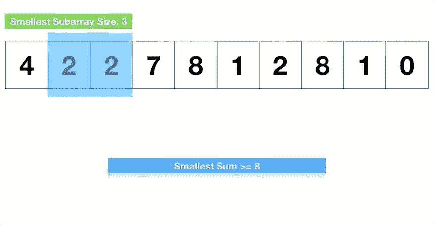

# 理解算法中的滑动窗口技术

> 原文：<https://levelup.gitconnected.com/understanding-the-sliding-window-technique-in-algorithms-c6c3bf8226da>


[R 莫](https://unsplash.com/@mooo3721?utm_source=medium&utm_medium=referral)在 [Unsplash](https://unsplash.com?utm_source=medium&utm_medium=referral) 上拍照

除了在我之前的帖子中展示的[双指针技术](/using-two-pointer-technique-to-optimize-algorithm-solutions-49271becb34d)，我一直在探索另一个流行的算法心智模型:滑动窗口**。**

**如果你从未听说过滑动窗口技术，我强烈推荐你在深入下面的例子之前看一下这个视频教程。即使你没有 36 分钟的空闲时间，也一定要观看前 8 分钟，其中包含多个执行良好的动画。**

# **什么是滑动窗口技术？**

**顾名思义，这种技术包括从给定的数组或字符串中提取数据子集，扩展或收缩该子集以满足某些条件，因此产生了**滑动**效应。**

****

***via* [*简单工程师视频*](https://www.youtube.com/watch?v=MK-NZ4hN7rs)**

# **我们什么时候能使用它？**

**一般来说，当您需要跟踪一个**连续的**元素序列时，滑动窗口技术是有用的，比如对子数组中的值求和。**

**这里有一个经典的例子(由柯尔特·斯蒂尔的 Udemy 课程提供):**

> ***给定一个正整数数组和一个正整数，
> 写一个函数，返回一个连续子数组的* ***最小长度*** *，
> ，其中和大于等于传入的整数。如果没有，返回 0。***

**以下是一些测试案例:**

```
minSubArrayLen([2, 3, 1, 2, 4, 3], 7) // 2 -> [4, 3] is the smallest subarray
minSubArrayLen([3, 1, 7, 8, 62, 18, 9], 52) // 1 -> [62] is the smallest subarray
minSubArrayLen([1, 4, 16, 22, 5], 95) // 0
```

**为了实现这个挑战的滑动窗口技术，我们需要首先确定窗口的范围。在这种情况下，我们从左边“打开”窗口。**

**然后，我们需要将值的总和存储在封闭的子数组/窗口中，并将其与目标整数进行比较。**

**如果总和满足条件(大于或等于整数)，我们记录当前窗口范围的长度并不断缩小窗口，因为我们需要找到最小的**长度。****

**如果总和不满足条件，那么我们继续扩展窗口的右边面板(因为我们从左边开始迭代)。**

**如果总和没有达到目标，我们就跳出循环，返回 0。**

**综合起来看:**

```
function minSubArrayLen(arr, target) {
  let minLength = Infinity
  let sum = 0
  let left = 0
  let right = 0 while (left < arr.length) { if (sum >= target) {
      // store the current minimal length
      minLength = Math.min(minLength, (right - left))
      // shrink the window: 
      // (1) subtract the value at left idx
      // (2) move the left panel one index further to the right
      sum -= arr[left]
      left++
    } else if (sum < target && right < arr.length) {
      // expand the window:
      // (1) sum up the current value
      // (2) move the right panel one index further to the right
      sum += arr[right]
      right++
    } else {
      break
    } } return minLength === Infinity ? 0 : minLength
}
```

**通过使用滑动窗口技术，我们能够以 O(n)时间复杂度解决上述问题，消除了重复迭代的需要。向发明这个强大工具的人/团队致敬！**