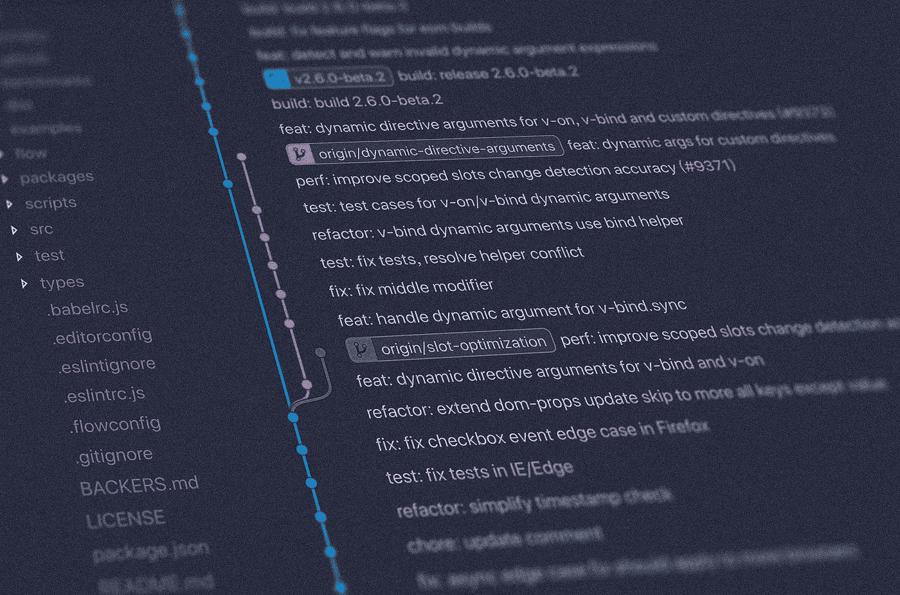
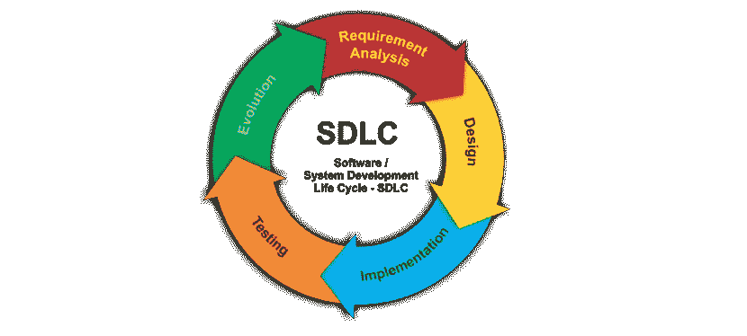

# 理解软件开发生命周期及其模型

> 原文：<https://levelup.gitconnected.com/understanding-the-software-development-lifecycle-and-its-models-47a37f298cf7>

## 什么是 SDLC，为什么它很重要？

照片由[扬西](https://unsplash.com/@yancymin)在 [Unsplash](https://unsplash.com/photos/842ofHC6MaI) 拍摄

T 软件开发生命周期，简称 SDLC，是一种在尽可能短的时间内生产高成本效益、高质量软件的方法。更具体地说，它由给定软件应用程序的*生命周期*中的一系列阶段组成。这个时间线形成了一个循环，从开发的开始一直延续到应用程序发布之后。

SDLC 包括 6 个开发阶段:

*   **分析**:在这个阶段，开发人员收集客户或业务的所有需求和期望，并对它们进行分析。项目的目标和可行性都在考虑之中。
*   **计划**:这是一个计划需求将如何执行，以什么顺序执行，以及为此将使用什么资源(比如什么语言、编程工具、数据库系统等)的阶段。
*   **设计**:这个阶段包括绘制应用程序的架构。它包括绘制线框、组件层次结构、领域模型或原型。
*   **开发**:也称为*实现阶段*，这是通过编码、网页设计、数据库创建和管理来实际构建软件的阶段。这个阶段包括算法开发、代码编写、编译和调试。
*   **测试**:一旦有了软件的工作版本，就需要对它的性能、错误和意外行为进行测试。这也被称为*维护*阶段。尽管测试阶段也包括调试，但它使用特定的工具和技术来捕捉开发阶段可能遗漏的错误。有各种类型的方法用于软件测试，例如单元测试、集成测试、功能测试和性能测试。
*   **部署**:最后一个阶段是应用的发布或*部署*。这部分的另一个名称也是*进化*阶段*阶段*。

这些都是水模型的相同阶段。将分析和计划阶段结合起来是很常见的，如下所示。

软件开发生命周期

随着越来越多的需求和特性的增加，大多数应用程序都会经历多次迭代或版本。每个版本，比如 alpha 或 beta 版本，都代表了一个更完善的应用程序，具有更少的错误和意外行为。实际上，软件在其生命周期中经历了需求收集、计划、设计、开发、测试和部署的几个*周期*。

## 软件开发模型

除了软件开发的阶段之外，还有几种用于构建软件的方法。每种软件开发模型或方法(SDM)都提供了一种独特的应用程序开发方法，这种方法有其优点和缺点。

五个最受欢迎的 SDM 是:

*   [瀑布模型](https://medium.com/@joseph.pyram/understanding-the-software-development-lifecycle-and-its-models-47a37f298cf7)
*   敏捷模型
*   迭代模型
*   v 形模型
*   螺旋模型

我们打算在一篇单独的文章中介绍每种方法，以便更好地解释每种方法的细节、优点和缺点。

## 外卖食品

软件开发生命周期和方法是软件工程师工具箱中非常重要的资源，因为它们有助于构建更好的、更健壮的和成本有效的应用程序。鉴于它们在短期和长期的有用性，强烈建议初级工程师熟悉这些概念。

感谢您的阅读！编码快乐！:)