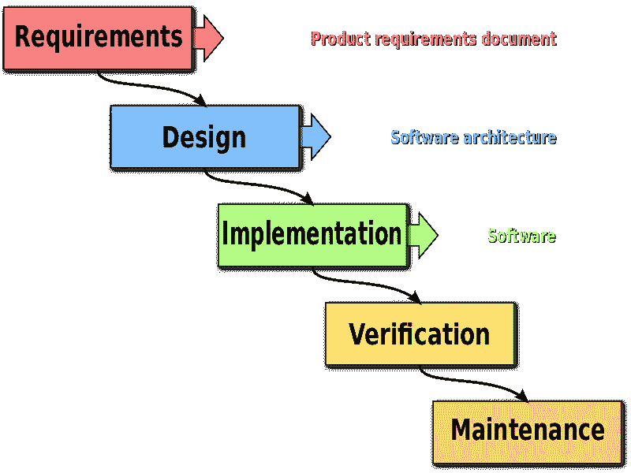

# 理解瀑布模型

> 原文：<https://levelup.gitconnected.com/understanding-the-waterfall-model-cea5013acbc4>

## 以及它的利弊

[迈克·刘易斯](https://unsplash.com/@mikeanywhere) (HeadSmart 媒体)在 [Unsplash](https://unsplash.com/photos/waAAaeC9hns) 上的照片

瀑布模型，也称为 ***线性顺序生命周期模型*** ，是第一个引入软件工程的应用开发方法。它由几个连续的阶段组成，因此后续阶段依赖于前一个阶段。

瀑布模型的阶段有 5 个:

*   **需求**:这是一个计划需求将如何执行，以什么顺序执行，以及为此将使用什么资源(比如什么语言、编程工具、数据库系统等)的阶段。在这个阶段，开发人员收集客户或企业的所有需求和期望，并对它们进行分析。还考虑了项目的目标及其可行性。
*   **设计**:这个阶段包括绘制应用程序的架构。它包括绘制线框、组件层次结构、领域模型或原型。
*   **实现**:也称为*开发阶段*，这是通过编码、网页设计、数据库创建和管理来实际构建软件的阶段。这个阶段包括算法开发、代码编写、编译和调试。
*   **验证**:这也称为测试阶段。一旦有了软件的工作版本，就需要对它的性能、错误和意外行为进行测试。这也被称为*维护*阶段。尽管测试阶段也包括调试，但它使用特定的工具和技术来捕捉开发阶段可能遗漏的错误。有各种类型的方法用于软件测试，例如单元测试、集成测试、功能测试和性能测试。
*   **维护**:最后阶段是应用的发布或者*部署*。该部分的另一个名称也是*部署*阶段*阶段*。一旦应用程序正式发布，它会经历几个维护周期，因此得名。

维基共享

## 赞成的意见

因为每个阶段都是按顺序进行的，这使得项目很容易控制和划分。每个阶段都可以分配给专门的团队或部门。瀑布模型的优势包括:

*   易于理解和实施。
*   非常适合短期软件项目。
*   清晰的逻辑顺序阶段。
*   由于严格的阶段顺序，易于控制或管理
*   过程和结果易于记录和跟踪

## 骗局

另一方面，当涉及到修改时，这个模型不是很灵活。例如，如果一个应用程序正处于测试阶段，而设计团队又增加了一些内容，那么这些更改将被搁置，直到测试和维护阶段结束，新的周期开始。其他缺点包括:

*   在一个周期完成之前，没有工作软件被生产出来。
*   不太适合构建面向对象的软件应用程序。
*   对于经历多次修改的长期项目来说，这是一个糟糕的模型。
*   最终发布结果不确定的风险模型。
*   它不允许在早期发现技术问题。
*   在周期的任何给定阶段都难以衡量进展。

## 外卖食品

瀑布模型是行业中最早使用的软件开发模型。它有它的优点和缺点。多年来，随着越来越多的公司采用敏捷和 SCRUM 方法，它已经不再流行。可以说，它最适合用于预计维护周期较短的小型项目。