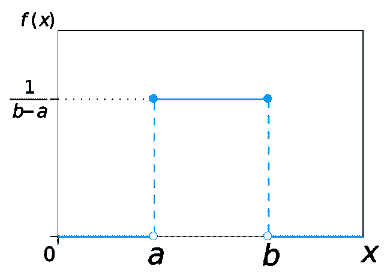
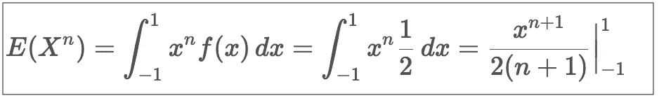

# 了解均匀分布(并破解数据科学面试)

> 原文：<https://levelup.gitconnected.com/understanding-uniform-distribution-and-cracking-the-data-science-interview-a8404166330d>

我们将继续我们的破解数据科学访谈系列。到目前为止，我们已经算出了 [*几个*](https://medium.com/swlh/linear-regression-and-maximum-likelihood-1dcb9435c71e) [*的例子*](https://medium.com/swlh/maximum-likelihood-and-data-science-interviews-c31b1d5b4e4a) *关于极大似然估计量(MLE)。在这篇短文中，我们将解决几个关于均匀分布的问题。均匀分布是许多面试官的另一个最爱，解决任何涉及均匀分布的问题真的会让你脱颖而出🙂*

# 首先也是最重要的，定义…

> *边界 A 和 b *上的均匀分布*具有以下概率密度函数:*

均匀分布的概率密度函数

这是来自维基百科的 pdf 的曲线:

回想一下，均匀分布的*累积分布函数由下式给出*

**

*均匀分布的累积分布函数*

*我们将在这篇文章中大量使用 CDF(而不是 PDF )!确保你理解上面的公式。*

*最后，我们主要处理区间[0，1]上的均匀分布。我们也将忽略区间[0，1]之外的范围。对于这个简单的区间，PDF 和 CDF 的公式简化为以下形式:*

**

*区间[0，1]上的均匀分布*

## *问题 1 (Spotify):*

*假设你从一个均匀分布 U(a，b)中抽取 n 个样本。a 和 b 的最大似然估计是多少？*

# *解决方案:*

*我们将定义*指标*函数，当变量 x 在均匀分布范围内时，取值为 1，否则取值为 0。*

**

*和*

**

*那么，在[a，b]上均匀分布的 PDF 也可以写成*

**

*均匀分布的替代 PDF 公式*

*这是因为指示函数的乘积在范围[a，b]之外为零。*

*有了这个修改后的 PDF 定义，我们就可以计算 n 个样本的似然函数了。回想一下，对于独立样本，似然函数只是单个 pdf 的乘积。因此，对于 n 个数据点{x₁、x₂、…、xᵢ、…}，似然函数由下式给出:*

**

*n 个样本点的参数 a、b 的似然函数*

*a 和 b 的最大似然估计试图最大化这个似然函数。这个函数的最大值是多少？仔细看看似然函数的形式——它只取两个值！。1(当所有指示函数都为 1 时)，或 0(当至少一个指示函数为零时)。因此，在以下情况下，似然函数最大*

**

*a 和 b 的最大似然估计*

*换句话说，*

> **对于区间[a，b]上均匀分布的 n 个独立样本，a 的 MLE 是样本值的最小值，b 的 MLE 是样本值的最大值。**

# *问题 2 (Lyft):*

*假设你从 0 到 1 之间的均匀分布中选择一个圆的半径。得到的圆的面积的概率密度是多少？*

# *解决方案:*

*设 X 是代表圆半径的随机变量。x 是[0，1]上的均匀随机变量。设 Y 是代表圆的面积的随机变量。根据定义，Y = πX，由于 X 的值域是[0，1]，所以 Y 的值域一定是[0，π]。*

*先说 y 的*累积分布函数(CDF)* 根据定义和上面的公式*

**

*Y = πX 的 CDF*

*最后，根据定义，Y 的 PDF 就是它的 CDF 的导数*

**

*Y = = πX 的 PDF*

*很容易验证 PDF 是否定义良好——PDF 在[0，π]范围内的积分为 1。*

**

# *问题 3(网飞):*

*假设我们有 X ~ Uniform(-1，1)，Y = X，那么 X 和 Y 的协方差是多少？*

# *解决方案:*

*我们要写一个(显然)不相关的表达式。让我们试着找出正整数 n 的 Xⁿ的期望值。根据定义，*

**

*x～u 的 Xⁿ的期望值(-1，1)*

*当 n 为奇数时，E(Xⁿ)为零，因为涉及-1 和+1 的两项相互抵消。当 n 是偶数时，E(Xⁿ)就是 1/(n+1)。*

*现在我们准备计算 X 和 y 的协方差。根据定义，*

**

*X 和 Y (=X)之间的协方差，其中 X ~ U(-1，1)*

*因此，*

> **对于区间[-1，1]，均匀随机变量与其平方不相关。**

**原载于 2020 年 10 月 12 日*[*https://cppcodingzen.com*](https://cppcodingzen.com/?p=1791)*。**